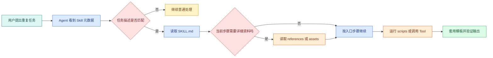

# Skill 的本质：触发、目录结构与渐进式披露

如果一个团队每次做页面审计都要重新解释检查顺序、命令、报告字段和“不允许修改线上页面”，最容易发生的是：有人漏步骤，有人把工具分数当成排名，有人直接改了不该改的配置。

Skill 解决的是“方法容易丢”的问题。它不是模型本身，也不是一个远程 API，而是一份能被 Agent 发现和按需读取的任务包。这篇先讲内部结构和读取逻辑，下一篇再从空目录写出一个能运行的 Skill。

## 为什么不是每个任务都新建一个 Agent

模型可以推理、写代码和调用工具，但它不会因为换了一个聊天窗口就自动拥有团队的页面审计方法、发布检查习惯或报告口径。每次都新建一个“SEO Agent”或“发布 Agent”会带来重复 Prompt、行为漂移和维护分叉。

Skill 的目标是把已经验证过的专业流程封装起来，让同一个通用 Agent 在需要时加载它。这里的“专业”不是写一句“请认真检查”，而是把输入、操作顺序、确定性脚本、判断边界和输出格式写成别人可以复查的资产。

这也解释了 Skill 与 MCP 的分工：MCP 解决工具怎样被不同 Host 连接，Skill 解决工作怎样被稳定地完成。一个 Skill 可以调用多个 MCP，但没有 MCP 时也可以只使用本地脚本和文档。

## Skill 在 Agent 运行中处于哪一层



图里的“看到元数据”只表示产品获得了 Skill 的名称和描述等入口信息。不同 Agent 产品如何扫描目录、何时把描述放入上下文、如何处理同名 Skill，属于产品实现；公开文档没有证明的内部细节不能当成通用规律。

渐进式披露的工程价值可以用上下文预算说明：不相关任务只需要看到短描述；匹配后读取主说明；进入 SEO 状态码检查时再读对应参考；需要稳定字段时读取模板。这样长文档不会每次都干扰模型，也方便开发者单独更新某一部分。

## Skill 适合什么任务

一个任务适合 Skill，通常有这些特征：

- 会重复出现；
- 有稳定的输入、步骤和输出；
- 一部分判断可以由脚本或命令验证；
- 有明确的禁止事项和边界；
- 需要按需加载的详细知识。

页面 SEO 审计、发布前检查、代码迁移、文档生成和测试排障都适合。一次性写一段广告文案不一定值得建 Skill；如果 Skill 只是把一句 Prompt 换成一个文件，也没有获得可维护性。

## SKILL.md 要写什么

`SKILL.md` 是入口，不是百科全书。它至少要回答六个问题：

1. 什么时候触发？
2. 用户需要提供什么输入？
3. 任务按什么顺序执行？
4. 哪些工具、脚本或参考资料在何时使用？
5. 哪些动作明确不做？
6. 输出需要包含哪些字段，如何验证？

一个入口的结构可以是：

```markdown
---
name: page-audit
description: 当用户要求检查页面状态、标题、Canonical 或 robots 时使用；只做只读检查。
---

# 页面审计

## 输入

- 一个用户明确提供并允许检查的 URL。
- 页面类型和目标市场（缺失时记录为数据缺口）。

## 执行顺序

1. 读取 `references/checks.md`，选择当前页面类型的检查项。
2. 运行 `scripts/check-page.sh`，保留真实状态与最终 URL。
3. 把事实、假设、缺口和下一步填入 `templates/report.md`。

## 边界

- 不修改线上页面、广告账户或站点配置。
- 不把脚本规则分数当作排名结果。
- 不把 Cookie、Token 或完整敏感正文写入报告。
```

Agent 启动或扫描能力目录时，可以先使用 Frontmatter 的 `name` 和 `description` 建立短索引；用户提出页面检查时，描述匹配才读取正文。正文的输入段确认 URL 和目标，执行顺序依次加载规则、脚本和模板，边界段阻止写操作和敏感数据落盘。缺少 URL 时停在输入检查，脚本失败时保留非零状态，成功时才进入报告。这里没有把所有状态码、结构化数据字段和性能命令塞进入口，因为它们属于按任务读取的细节。

## 目录中每一类文件的职责

```text
page-audit/
├── SKILL.md                    # 触发、顺序、边界、输出
├── references/
│   ├── html-fields.md          # title、canonical、robots 细则
│   └── diagnostics.md          # 状态码和渲染排障树
├── scripts/
│   ├── check-page.sh           # 确定性 GET 与字段提取
│   └── summarize-links.ts      # 内链统计
├── templates/
│   └── report.md               # 固定报告字段
└── assets/
    └── example-response.txt    # 只在需要展示时加载的样例
```

`references` 是给 Agent 解释和判断用的资料；`scripts` 是应该重复得到相同结果的程序；`templates` 让输出可复查；`assets` 放图片、样例或其他输入。不要把脚本的结果直接写死在 Skill 文本里，结果应该来自当前运行。

## 渐进式披露不是“把文件藏起来”

它有明确的读取顺序，但不是安全边界。即使参考文件放在目录深处，仍不能放入凭证、内部地址或不应公开的数据；Skill 文件本身也可能被读取和审计。

一个合理的读取策略是：

```text
任务匹配前：名称 + 描述
匹配后：SKILL.md 的输入、顺序、边界
进入某个分支：对应 references 文件
需要计算或采集：scripts
需要写报告：templates
```

如果入口文件已经有 2000 行规则，说明拆分失败。反过来，如果入口只有“请完成审计”六个字，Agent 也不知道怎样行动。入口应该足够让读者开始工作，但把每个分支的细节留给对应资源。

## Skill 与 MCP、Tool、Prompt 和项目规则

| 机制 | 解决的问题 | 典型所有者 | 失败时谁负责 |
| --- | --- | --- | --- |
| Skill | 方法、步骤、资料和输出 | 内容/工程维护者 | 任务方法与文档质量 |
| MCP | 跨 Host 的能力连接 | Server/平台维护者 | 协议、认证与传输 |
| Tool | 一次输入输出契约 | Runtime/Server | 参数、超时与结果 |
| Prompt | 给模型的指令和示例 | Agent 开发者 | 模型输出与策略 |
| `AGENTS.md` | 仓库协作规则 | 项目维护者 | 编辑、测试和交付行为 |

同一页面审计 Skill 可以调用浏览器 MCP；MCP Server 暴露 `fetch_page` Tool；Prompt 让模型按事实、假设和缺口写报告；`AGENTS.md` 再约束不能改生产配置。任何一层都不会自动替代另一层。

## 公开 Skill 怎样处理版本

Skill 会改变 Agent 的行为，因此要像代码一样有版本和变更记录。每次变更至少回答：

- 触发描述是否变了；
- 输入和输出契约是否兼容；
- 参考规则是否改变了结论；
- 脚本的退出码和字段是否变了；
- 旧报告还能否复查；
- 失败时是否会误导成成功。

如果脚本从返回非零改成“打印错误但退出 0”，这是行为变化，即使 Markdown 没改也应该升级版本并更新测试。

## 怎样验证渐进式披露真的有效

用四个测试任务观察读取和输出：

1. 完整 URL 的只读审计：应读取入口、对应规则、脚本和模板；
2. 只有“帮我优化 SEO”：信息不足，不能假装已经审计；
3. 用户要求修改页面：应根据边界拒绝写操作或转交另一能力；
4. URL 返回 404 或超时：报告真实失败，不能继续填充不存在的 title。

验证重点不是“模型是否提到 Skill 名称”，而是它是否按顺序使用资源、尊重边界、保留证据，并在脚本失败时停在正确状态。

## 当前环境中公开 Skill 的选择

对于初学者，可以从能观察到输入和输出的能力开始：文章写作、官方产品文档、浏览器控制、Figma 设计上下文、PDF/Word/PPT 处理、图片生成和 GitHub 协作。它们分别覆盖写作方法、资料核实、页面操作、设计取证、文档转换、素材处理和代码协作。

选择前先看 Skill 的触发描述、允许的工具和边界。不要把私有知识库、内部业务平台或不明来源的工具当作公开示例，也不要因为一个 Skill 名称听起来强大就授予它写文件、执行命令或访问网络的权限。

## 设计自己的 Skill 前先填这张卡

```text
重复任务：
输入是什么，缺失时如何处理：
正常结果：
需要确定性脚本的步骤：
需要解释资料的步骤：
输出字段与模板：
明确禁止的动作：
会调用哪些 Tool/MCP：
哪些内容不应进入上下文或日志：
脚本失败时的终态：
怎样做一次完整回归：
```

填不出“正常结果”和“脚本失败时的终态”，不要急着创建目录。Skill 的价值不在文件数量，而在它能让另一个执行者复述同一条方法，并在证据不足时停下来。

下一篇会按这张卡从空目录创建一个页面审计 Skill，逐个写入口、参考资料、脚本和模板，再用四种输入检查它是否真的可用。
