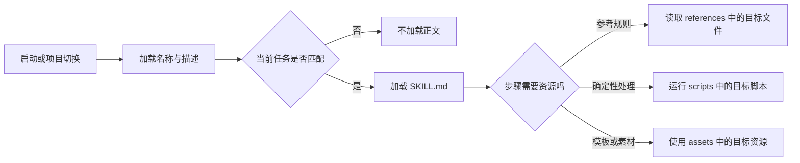

# Skill 怎样按需加载任务知识

同一个 Agent 可以审查代码、处理 PDF，也可以按团队规则发布服务。模型和工具都没有变化，任务步骤、判断标准和需要查阅的资料却完全不同。把所有说明都塞进常驻系统提示，内容会越来越长；只在用户提问后临时写几句，又容易遗漏关键步骤。

**Agent Skill** 把一类任务的说明、脚本、参考资料和模板放进独立目录。运行时先让模型看到简短目录，匹配任务后才加载完整说明，具体参考文件继续按需读取。[Agent Skills 规范](https://agentskills.io/specification)把这种组织方式定义为可移植文件格式，核心入口是 `SKILL.md`。

::: info Skill 处理的是任务知识

Skill 可以告诉 Agent 如何审查一项技术事实、何时运行测试、遇到证据不足时怎样停止。它不会自动增加模型能力，也不会因为写了“只读”就获得安全权限。

工具决定 Agent **能做什么**，MCP 解决外部能力**怎样连接**，Skill 说明一类任务**应该怎样做**。真正的权限、执行和结果校验仍由 Harness 与应用负责。

:::

## 常驻提示为什么不适合保存所有工作方法

系统提示适合放每次请求都必须遵守的规则，比如身份边界、权限原则和输出底线。一项只在 PDF 合并时使用的参数说明，如果每次代码审查也加载，就会占用上下文，还会和其他任务的步骤竞争注意力。

把说明分散在 Wiki 也没有解决加载问题。模型需要知道文档在哪里、什么时候读、读到哪一层；用户每次手动粘贴则容易带入旧版本。Skill 给这些资料增加一个可发现的入口，并用相对路径把说明与资源绑定在同一版本中。

另一个问题是重复配置。团队已经确定代码审查必须先看差异、再看相关测试，最后按严重度给证据。如果每个请求都重新生成流程，模型可能这次先改代码，下次只做概括。Skill 保存的是稳定任务合同，具体项目内容仍从当前仓库读取。

Skill 也不能解决所有上下文问题。几百个 Skill 的名称和描述仍会占用目录预算；描述互相重叠时，模型会误触发；激活后的 `SKILL.md` 过长，仍然会挤占当前问题。因此按需加载需要目录设计、触发测试和资源拆分共同配合。

## Skill、Prompt、工具与 MCP 的区别

这四类对象经常出现在同一个 Agent 中，职责却不同。

| 对象 | 保存的主要内容 | 谁读取或执行 | 典型变化原因 |
| --- | --- | --- | --- |
| Prompt | 本次调用的指令和上下文 | 模型 | 当前问题或对话变化 |
| Skill | 可复用任务流程与配套资源 | Harness 加载，模型遵循 | 工作方法、规范或环境变化 |
| Tool | 可调用动作的名称、参数和执行器 | 模型提议，程序执行 | 外部能力或业务接口变化 |
| MCP | 能力发现、消息与连接生命周期 | Client 与 Server | 协议、Server 或传输变化 |

一个“按证据审查技术文章”的 Skill 可以要求先读取允许的源码，再运行对应测试，最后逐条标记无来源结论。它可以调用文件读取和终端 Tool，也可以通过 MCP 查远程文档。Skill 负责步骤与停止条件，Tool 和 MCP 负责取得材料、执行命令。

单个 Prompt 也能写同样步骤，区别在复用和发现。Prompt 通常随这次请求出现，Skill 有名称、描述、版本和目录，可以跨会话加载。只有一句固定模板且没有配套资源时，单独 Prompt 可能更简单，没有必要为每句话创建 Skill。

框架里的角色预设也与 Skill 相邻。角色预设通常固定系统指令、模型参数与工具白名单，回答“这个 Agent 以什么能力和权限工作”；Skill 更偏向一类任务的过程。两者可以组合，但 Skill 不能通过声明角色把权限扩大，最终能力取两层策略的交集。

## 渐进式披露分成哪三层

[Skill Client 实现指南](https://agentskills.io/client-implementation/adding-skills-support)把加载过程分成三层。每层都只向下一层提供定位信息，不提前把全部内容送进上下文。



**目录层**在会话开始时加载每个 Skill 的 `name` 和 `description`。模型由此知道有哪些能力以及何时使用，不读取完整正文。目录还可以包含定位信息，让模型或专用激活工具找到 `SKILL.md`。

**说明层**在 Skill 被显式选择或与任务匹配后加载完整 `SKILL.md`。正文描述输入、步骤、输出、失败和停止条件。规范建议正文保持可控长度，细节太多时拆到引用文件，而不是让入口继续膨胀。

**资源层**只在步骤确实需要时读取脚本、参考资料或资产。比如普通 API 事实只看短清单，涉及生产结论时再读取证据规则；没有处理表格时，不加载表格解析参考。资源可以很多，单次任务只支付所需部分的上下文成本。

渐进加载不等于模型随意跳过说明。任务命中后，Harness 应保证入口完整进入上下文；`SKILL.md` 明确指向某份必要参考时，再读取目标文件。只读一半说明或凭文件名猜规则，会得到比不使用 Skill 更隐蔽的错误。

## 一个合规 Skill 的目录结构

最小 Skill 是一个目录和其中的 `SKILL.md`。规范还推荐 `scripts/`、`references/` 与 `assets/`，但这些目录都不是必需项。

```text
source-grounded-review/
├── SKILL.md
└── references/
    └── evidence-rules.md
```

`SKILL.md` 开头是 YAML Frontmatter，后面是 Markdown 说明。规范要求 `name` 和 `description`。名称只使用小写字母、数字与连字符，不能以连字符开头或结尾，也不能出现连续连字符；名称还要与父目录一致。

`description` 同时说明“做什么”和“何时使用”。`Helps with reviews` 太宽，代码审查、文案审查、发布审查都会误触发；“核对技术草稿中的版本、API、行为和验证结论是否有源码或测试证据”更容易与任务匹配，也明确了不处理普通语法润色。

可选的 `compatibility` 说明环境前提，比如需要 Git、Python 或网络。`license` 记录分发许可。`metadata` 保存作者与版本等字符串字段。`allowed-tools` 仍属于实验字段，不同 Client 的支持可能不同，不能把它当作跨平台强制安全边界。

Frontmatter 之外的正文没有固定章节格式，但应能回答：输入从哪里来，执行顺序是什么，哪些事实不能推断，失败时停在哪里，交付结果长什么样。真正有顺序的操作用编号，判断与边界用自然段，不要用十几个同构小标题把流程切碎。

## 入口说明怎样写得短而完整

入口的任务是控制过程，不是复制整个知识库。技术事实如果会频繁更新，放进独立参考文件或要求读取权威源码；把版本号和大段 API 说明硬编码在 `SKILL.md`，过几个月就会变成过期指令。

开头先定义所需输入。审查 Skill 需要草稿、允许使用的来源和测试输出；缺少来源时应停下报告，而不是自行搜索一个相似项目。修改型 Skill 还要说明哪些文件在范围内，工作区已有差异怎样保护。

步骤写动作与判定条件。比如“提取版本、API、行为与测试结论，逐条匹配来源；没有证据的结论分为待补来源、仅可解释或删除”。这比“深入分析并确保准确”更可执行。每一步都能观察输入与输出，才适合交给 Agent。

停止条件要写在错误发生的位置。没有权限、来源不足、目标不明确或动作会扩大范围时立即停，不把拒绝留到全文处理完之后。有副作用的 Skill 在执行前要求用户确认和幂等凭据，不能只在结尾提醒“注意安全”。

交付合同描述结果结构和证据。审查结果至少包含原结论、证据位置和最小修正；安装流程至少包含地址、命令、验证输出和错误路径。不要要求模型宣称“已验证”，除非步骤里真的运行了对应命令并保存环境。

入口还应告诉模型怎样使用资源。使用相对路径从 Skill 根目录定位，不依赖调用时工作目录；明确哪种情况读取哪个文件，避免“有需要时参考 references”这种无条件判断。引用链保持浅，入口指向目标文件，目标文件不要再把读者带过多层目录。

## 配套资源怎样分层

`references/` 保存需要阅读的详细规则、协议摘要和领域说明。每个文件围绕一个问题，文件名能看出用途。任务只涉及测试结论时读取证据规则，不必加载所有写作规范。引用中的版本敏感事实要标明来源与适用时间。

`scripts/` 保存适合确定性执行的代码，比如解析文件、校验 Frontmatter、生成报告或检查重复项。脚本比让模型临时拼命令更可复现，但要有明确参数、帮助信息、退出码和错误信息。依赖项写在 Skill 的兼容说明或脚本旁，不假设系统已经安装。

`assets/` 保存模板、样式、图片或需要复制到产物的静态资源。资产不是自动进入模型上下文的参考资料。模型需要修改模板时读取目标文件，需要把图片交付给用户时才访问对应资源。二进制资产还要限制类型与大小。

脚本输出也不天然可信。它可能读取旧缓存、访问错误环境或解析不完整。Skill 应说明输入范围和验证方式，运行时保存命令、退出码与必要摘要。生产数据库、远程发送和删除动作不因为位于 `scripts/` 就免除审批。

一个 Skill 可以没有脚本。任务主要是判断与写作时，强行加入自动化只会增加维护成本。相反，格式验证、重复扫描和固定转换已经有稳定算法时，应放进脚本，让模型集中处理不能确定性判断的部分。

## 创建并验证一个最小 Skill

本文仓库中的示例会审查技术结论是否有来源。入口文件如下：

<<< ../../examples/ai-agent/skill-example/source-grounded-review/SKILL.md

只有当结论涉及测试、生产行为或版本 API 时，入口才要求读取 `references/evidence-rules.md`。普通措辞检查不加载它，这就是第三层披露。参考文件把“单元测试证明什么”“源码不能证明线上版本”等边界写成短规则，入口保持简洁。

新建自己的 Skill 时，先打开 [Agent Skills 快速开始](https://agentskills.io/skill-creation/quickstart)确认目录、`SKILL.md` 和客户端前置条件，再按当前 Client 的官方说明确认安装目录。官方快速开始页面把“创建 Skill”和“在 VS Code 中试用”放在同一条路径上，截图用于定位入口，实际优先级仍以 Client 文档为准。

<figure class="doc-shot">
  
  <figcaption>Agent Skills 官方 Quickstart。先确认客户端前置条件和默认 Skill 目录，再运行下面的验证命令。</figcaption>
</figure>

开放规范定义 Skill 内部格式，不强制每个产品使用同一用户目录。常见实现会扫描项目级和用户级目录，项目级同名 Skill 通常覆盖用户级 Skill，实际优先级仍以 Client 文档为准。

目录建好后，使用官方参考实现验证：

```bash
uvx --from skills-ref==0.1.1 agentskills validate \
  examples/ai-agent/skill-example/source-grounded-review
```

本文示例已执行这条命令，返回 `Valid skill`。这里锁定 `skills-ref` 0.1.1，是为了让验证结果可以复现；将来升级参考实现时，先查看规则差异，再修改 Skill。验证通过只证明目录和 Frontmatter 符合格式，不证明触发准确、步骤有效或脚本安全。

如果已经安装 Python 包，也可以直接运行 `agentskills validate <skill-directory>`。命令不存在时，先检查安装包实际提供的可执行文件；当前参考包的命令名是 `agentskills`，不是旧示例中可能出现的 `skills-ref`。

## Skill 怎样被发现和激活

本地 Agent 在启动或工作目录变化时扫描已配置的 Skill 根目录，只把包含精确文件名 `SKILL.md` 的子目录视为 Skill。扫描要跳过 `.git`、依赖目录和构建产物，并设置深度和目录数量上限，防止在大型仓库里无限遍历。

发现阶段解析 YAML，保存名称、描述、位置和诊断。缺少描述时无法可靠触发，应跳过并报告；名称与目录不一致等兼容问题，可以按 Client 策略警告或拒绝。解析器应使用 YAML 库，不用正则拆 Frontmatter。

目录以结构化列表放入系统上下文或专用激活工具描述。任务与描述匹配时，模型读取 `SKILL.md`，或调用 `activate_skill(name)` 得到正文。专用工具的 `name` 参数应限制为当前目录中的枚举，防止模型编造不存在的 Skill。

用户显式指定 Skill 时，Harness 直接查目录并加载，不需要模型再判断是否匹配。名称不存在、已禁用或当前项目不可信时返回稳定错误。模型自动触发则依赖描述和任务语义，不应靠一串手写关键词决定全部行为。

激活后要标记内容来源和 Skill 根目录。这样相对路径可以正确解析，Context 压缩时也能识别哪段是任务规则。若会话跨过多次压缩，Harness 需要保留 Skill 的关键约束或允许重新加载；只保留一段模型摘要可能丢掉停止条件。

## 一次技术审查怎样按层加载

用户提供一篇 API 教程，要求确认“当前 SDK 安装后会返回某字段”。会话开始时模型只看到 `source-grounded-review` 的名称与描述，因为任务涉及 API 和验证结论，它选择激活该 Skill。

入口要求收集草稿、允许的来源和测试输出。用户只给了草稿和官方文档，没有本地运行记录，因此“实测通过”不能保留。流程继续提取版本、API、行为和验证结论，逐条建立证据映射。

当审查走到“官方文档是否等于生产行为”时，入口指向证据规则，模型才读取那一个参考文件。规则说明官方文档支持公共 API 语义，不证明本地适配器或生产环境。最终修正为“官方文档定义了该字段；本文尚未运行在线验证”，没有编造成功输出。

若仓库提供可执行示例，Skill 可以要求运行目标测试。命令成功后保存命令、解释器版本、依赖锁和退出码，结论限定为“当前本地示例通过”。网络、认证与生产数据仍需要集成验证。任务完成时输出结论、证据和最小修正，不把完整来源复制进报告。

失败轨迹是来源目录不可读。流程在收集输入阶段停止，报告缺少哪份材料，不继续凭经验补写。停止是符合合同的结果，不是 Agent 没有完成任务。Harness 也不应自动扩大文件权限来换取一份看似完整的审查。

## 描述怎样避免误触发和漏触发

描述太宽会让 Skill 抢走不相关任务，描述只列内部术语又会漏掉自然表达。优化要使用一组正例和反例，不凭单次对话调整关键词。

正例覆盖不同说法，比如“核对这篇教程有没有杜撰”“检查 API 版本和测试结果是否有来源”“把无法证明的生产结论删掉”。反例包括普通中文润色、代码功能修复和不需要证据的创意写作。让 Agent 只看到目录，记录它选择的 Skill，再统计误触发与漏触发。

描述同时写能力与触发条件通常更稳定。“审查技术结论”说明做什么，“当草稿包含版本、API、行为或验证结论且需要来源时使用”说明什么时候用。不要把所有可能词汇塞进描述，长目录本身会消耗上下文，也容易让多个 Skill 变得相似。

两个 Skill 边界重叠时，先拆清职责。一个负责事实证据，一个负责语言润色；需要两者时按先事实、后语言的顺序激活。无法拆开时，合并成一个 Skill 往往比依赖模型在两个近义描述中选择更可靠。

项目级 Skill 覆盖用户级同名 Skill 时要给出可见诊断，记录最终来源。刚克隆的项目可能不可信，Client 应在用户确认工作区之前禁止加载其中的 Skill，避免仓库借 `SKILL.md` 注入命令。

## 脚本、工具和权限怎样约束

Skill 文本可以建议执行动作，真正的权限由 Harness 决定。`allowed-tools` 即使被 Client 支持，也只能缩小预批准范围，不能绕过系统策略、用户审批和沙箱。高风险命令仍要走对应权限流程。

脚本执行前解析绝对路径，确认它位于当前 Skill 根目录或明确允许的位置。参数来自用户或模型时按列表传递，不拼成未经转义的 Shell 字符串。脚本需要网络、数据库或凭证时，在兼容说明中写明，并在运行前确认当前环境允许。

项目 Skill 的脚本和普通仓库代码一样不可信。第一次运行前显示命令与影响范围，写操作要求用户批准；只读也要限制递归路径、响应大小和敏感文件。签名或来源校验可以提高供应链可信度，但不能替代运行时权限。

脚本产生的文件要记录位置和清理责任。临时截图、缓存和评测探针放系统临时目录，任务结束后删除；正式产物写到用户指定位置。清理路径必须精确，不能用宽泛递归命令删除整个工作区。

Skill 中引用的 MCP Server 同样遵循双重授权：Skill 可以说明使用哪个工具，Host 决定是否展示和执行，Server 再检查业务权限。Tool Result 回到上下文后仍是不可信数据，不会覆盖 Skill 的停止条件。

## 版本、更新与冲突怎样管理

Skill 与配套资源作为一个版本发布。入口修改步骤但参考文件仍是旧规则，会形成内部冲突；脚本参数改变时，`SKILL.md` 的调用示例和测试一起更新。`metadata.version` 可以帮助诊断，但真正的发布仍要由文件版本或包版本固定。

更新前保留一组触发样本和端到端任务。比较新旧版本是否选择相同 Skill、读取相同必要资源、执行相同安全边界，并检查输出质量。只做格式验证无法发现描述变宽、步骤倒序和停止条件丢失。

会话已经激活 Skill 后，磁盘文件可能更新。简单实现可以把激活时内容视为当前会话快照，新会话使用新版本；需要长任务恢复时保存 Skill 版本与所用资源哈希。恢复时版本不一致就明确迁移或重新开始，不把两版指令拼在一起。

同名冲突采用确定性优先级。项目级覆盖用户级是常见规则，组织级和内置级的顺序由产品定义。无论哪种顺序，都在调试信息中显示被选中的路径和被遮蔽项，用户才能解释为什么同一个名字在不同项目行为不同。

删除 Skill 后，目录不再展示它；已运行任务的审计可以保留名称、版本和结果摘要，但不继续把已删除正文注入新对话。包含敏感资料的资源还要按保留策略清理缓存与副本。

## 怎样测试 Skill 真的改善了任务

格式测试先验证目录、Frontmatter、相对链接和脚本可执行性。它能发现名称不合法、描述缺失和引用文件不存在，不能评价任务结果。

触发测试只加载 Skill 目录，给出正例、反例和容易混淆的相邻任务，记录选择、拒绝与多 Skill 顺序。新增 Skill 时还要回归旧目录，因为新描述可能抢占其他任务。

过程测试使用固定输入和 Fake Tool，断言 Agent 先读取必要来源、证据不足时停止、未命中场景不加载大参考、危险动作进入审批。这里检查调用顺序和参数，不只看最后文字是否顺眼。

结果测试由领域标准评分。技术审查关注有来源结论比例、错误引用、事实漂移和必要内容保留；文件处理关注输出可打开、页数、格式与视觉渲染；发布 Skill 关注健康检查、回滚点和临时数据清理。每类 Skill 有自己的验收，不能共用一个“回答质量”分数。

故障测试删除参考文件、让脚本非零退出、制造超时、拒绝权限和中途取消。预期是错误停在发生层，已经产生的可恢复产物被记录，后续步骤不伪装成功。脚本执行后进程退出的用例还要检查临时资源是否清理。

上线后记录 Skill 名称、版本、激活方式、读取资源和稳定错误类型，不记录完整用户正文与密钥。误触发率、任务完成率、人工回退和资源用量分别观察；一个总成功率无法说明描述、流程还是外部工具出了问题。

## Multi-Agent 场景下 Skill 放在哪里

多 Agent 编排中，Skill 可以帮助 Router 判断任务需要哪类工作方法，也可以作为 SubAgent 的任务合同。编排器只把所需 Skill 和必要输入交给目标 Agent，不把主会话全部历史复制过去。

Skill 不应单方面决定跨 Agent 权限。它可以声明所需能力，调度器根据当前用户、角色与环境取允许集合；接收 Agent 缺少能力时明确拒绝或重新路由。把“requires admin”写进正文不会自动获得管理员工具。

单人连续完成的任务，不要为了存在多个 Skill 就拆成多个 Agent。事实审查与语言润色可以在同一工作区按顺序执行，只要上下文仍可控。研究分支相互独立、需要并行收集时，才让多个 Agent 各自加载相关 Skill，最终由合成节点检查来源覆盖。

Handoff 至少包含任务目标、输入位置、允许来源、输出合同、Deadline 和已激活 Skill 版本。接收方不依赖发起方的隐含记忆。执行结果带回证据和未完成项，不能只返回“已处理”。

多个 Agent 同时使用带脚本的 Skill 时，还要隔离工作目录、临时文件与凭证。并行读取通常容易，写入同一文件、共享浏览器会话或外部配额需要租约与冲突处理。Skill 说明协作方法，Runtime 保存真实并发状态。

## Skill 的适用边界

适合做 Skill 的任务通常会重复出现，有稳定步骤或判断标准，需要配套参考、脚本或模板，并且可以写出明确停止条件。一次性的短提示、单个固定函数和必须由程序强制的安全规则不适合只放在 Skill 里。

Skill 也不是长期记忆。它保存团队主动维护的任务知识，不会自动从每次对话吸收经验。要更新规则，需要来源、评审、版本与回归；让模型把一次失败随手写回 Skill，可能把偶然现象固化成错误规范。

Skill 更不是权限系统。文本可以提醒最小权限，真正限制仍在工具 Schema、Harness、沙箱、认证和业务 ACL。攻击者能够修改 Skill 文件时，相当于能修改 Agent 的任务规则，因此来源信任、工作区确认和版本审计都不能省略。

判断一个 Skill 是否设计完成，可以看一次任务轨迹：目录描述能否正确触发，入口能否让初学者知道输入与步骤，资源是否只在需要时加载，脚本是否有权限和错误边界，证据不足时是否停止，最终结果是否能被测试。满足这些条件，Skill 才是在节省上下文的同时复用工作方法，而不是把一个更长的 Prompt 换了目录保存。
