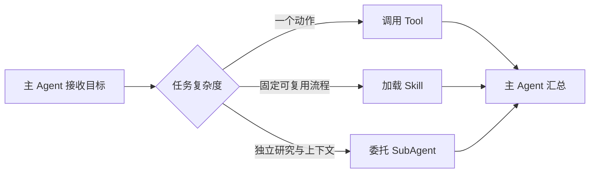

# Skill、SubAgent 与能力封装

一个 Agent 同时负责搜索、写代码、分析报表和发布，系统提示会越来越长，工具权限也越来越宽。拆分能力可以降低单次上下文与权限范围，但拆得过细又会产生大量交接成本。

本篇区分 Tool、Skill 和 SubAgent，并给出选择方法。不同产品对“Skill”的具体定义不同，这里讨论通用工程职责，不假设所有框架拥有同一 API。

## 三种能力单元有什么区别

| 单元 | 核心作用 | 典型输入输出 |
| --- | --- | --- |
| Tool | 执行一个明确动作 | 结构化参数 -> 结构化结果 |
| Skill | 封装可复用流程、规则和材料 | 任务上下文 -> 一套步骤或产物 |
| SubAgent | 让独立角色完成一段推理与工具循环 | 委托目标 -> 专家结果 |

Tool 像函数，Skill 像操作手册加资源，SubAgent 像有独立上下文和工具的协作者。

## 第一步：先用 Tool 解决明确动作

搜索文档、读取状态和计算金额都有清楚参数与结果，优先做 Tool。它容易测试、授权和观测，不需要额外 Agent 对话。

若一个所谓 SubAgent 只调用一次函数就返回，通常是多余抽象。

## 第二步：Skill 封装稳定方法

代码审查、SEO 诊断和发布验收往往有固定顺序、参考资料和脚本。Skill 可以按需加载这些说明，避免把所有领域知识长期塞进系统提示。

好的 Skill 写明触发条件、输入、步骤、权限、停止条件与验证。它不靠“非常专业地完成任务”这种空泛描述。

## 第三步：SubAgent 承担独立上下文

任务可以并行、需要不同工具，或中间材料很大时，SubAgent 才有明显价值。例如让检索专家和代码分析专家分别收集证据，主 Agent 保留最终决策。

委托契约包括目标、可用工具、数据范围、输出格式、预算和失败方式。SubAgent 结果仍是不可信候选，主 Agent 或程序要验证引用与权限。

## 正常拆分和失败拆分

正常系统用只读工具查状态，用发布 Skill 执行固定验收，并把独立安全审查委托给受限 SubAgent。每个单元都有测试和最小权限。

失败系统为每个小步骤创建一个角色，Agent 之间不断转述同一上下文；同时所有角色共享全部工具，权限和成本反而更难控制。

## 怎样验收一个能力单元

检查它是否有明确触发、是否只获得所需权限、相同输入能否得到可判断结果、失败能否回到调用方、输出是否有证据。再用 Eval 比较拆分前后的质量、延迟和成本。

下一篇进入上下文工程：这些能力说明、历史和证据怎样装进有限窗口。

## 参考资料

- [OpenAI Agents SDK：Orchestration](https://developers.openai.com/api/docs/guides/agents/orchestration)
- [MCP：Tools](https://modelcontextprotocol.io/specification/2025-06-18/server/tools)
- [Microsoft AutoGen：AgentChat](https://microsoft.github.io/autogen/stable/user-guide/agentchat-user-guide/index.html)
