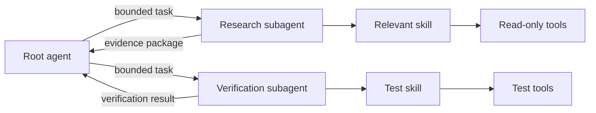
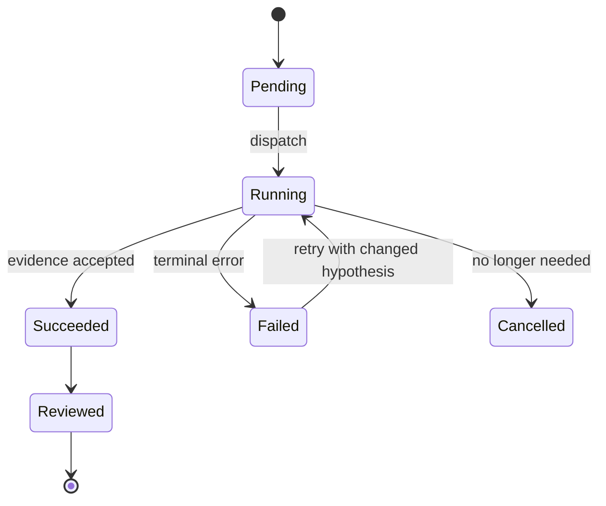

# Skill、SubAgent 与能力封装

工具解决一次结构化操作，Skill 解决一类任务如何被稳定完成，SubAgent 解决何时把有独立上下文和验收标准的工作交给另一个执行单元。三者组合后，Agent 才能从“会调用 API”升级为“能遵循工程流程交付结果”。

边界错误通常表现为两种极端：把几十步流程塞进一个巨型工具，导致不可观察、不可中断；或者为每个小动作创建 SubAgent，导致上下文复制、调度开销和结果整合超过实际工作。

## 三种能力单元的职责

| 单元 | 输入输出 | 状态范围 | 适合处理 |
| --- | --- | --- | --- |
| Tool | 结构化参数与结果 | 单次调用 | 查询、写入、转换、执行命令 |
| Skill | 触发条件、步骤、资源、验收 | 一类任务 | 固定方法论、领域流程、可复用交付标准 |
| SubAgent | 独立任务、上下文和结果 | 一个委派生命周期 | 可并行、边界清晰、能独立验收的子问题 |

Skill 可以调用多个工具，也可以指导主 Agent 读取资料或运行脚本。SubAgent 可以加载 Skill，但不能因此获得调用者没有的权限。授权应随任务显式下发，并保持最小范围。



## Skill 不是一篇提示词文档

高质量 Skill 是一份可执行契约，至少包含：

1. 精确触发条件和不应触发的反例；
2. 开始前必须确认的环境与权限；
3. 按顺序执行的步骤以及每一步产物；
4. 需要渐进加载的参考、脚本和模板；
5. 失败时如何诊断、重试或安全退出；
6. 最终验收命令与不可省略的证据；
7. 安全边界，例如不得部署、不得读取凭证、不得使用真实数据。

主说明应该短到足以被可靠遵循，详细知识放在按需读取的参考文件。所谓渐进式披露，不是只读说明的一半，而是先完整读取主契约，再根据当前分支读取必要材料。把所有资料一次性塞进上下文会稀释真正的约束。

```yaml
name: verify-service-change
description: 验证服务端变更的测试、契约、迁移与运行态行为
triggers:
  - 修改 API、数据访问或后台任务后
inputs:
  - changed_files
  - risk_level
outputs:
  - checks_run
  - failures
  - residual_risks
```

上面的 YAML 只是概念模型。具体运行时采用什么格式并不重要，重要的是触发、输入、输出和验收是机器与人都能检查的。

## 何时值得委派给 SubAgent

同时满足以下条件时，委派通常有收益：

- 子任务拥有明确输入和完成定义；
- 子任务可以独立推进，不需要频繁共享中间状态；
- 结果可以压缩成证据包，而不是完整对话；
- 并行执行能缩短关键路径；
- 权限范围可以独立限制。

例如“审计 40 个 Markdown 的失效链接并返回文件与行号”适合委派；“一边修改共享配置一边决定最终架构”不适合，因为多个执行者会争用同一决策和文件。

可以用一个简单估算避免过度拆分：

```ts
type DelegationEstimate = {
  independentWorkMs: number
  contextPackagingMs: number
  mergeAndReviewMs: number
  parallelismGainMs: number
}

function shouldDelegate(value: DelegationEstimate): boolean {
  const overhead = value.contextPackagingMs + value.mergeAndReviewMs
  return value.independentWorkMs > overhead
    && value.parallelismGainMs > overhead
}
```

这不是精确调度算法，而是提醒：委派也有固定成本。小任务本地完成往往更快；跨模块审计、独立研究和长时间测试更适合并行。

## 任务包必须决策完整

SubAgent 收到的任务应包含目标、范围、禁止项、已知上下文、期望输出和验证方式。只说“看看这里有什么问题”会得到不可比较的结果。

```ts
type DelegatedTask = {
  objective: string
  allowedPaths: readonly string[]
  readOnly: boolean
  constraints: readonly string[]
  expectedEvidence: readonly ('file-line' | 'command-output' | 'test-result')[]
  completion: string
}
```

写任务还需要所有权边界：哪个 Agent 可以编辑哪些文件，是否允许新建文件，何时停止修改并请求协调。共享工作区内，两个 Agent 同时改同一文件可能不会产生传统 Git 冲突，却会静默覆盖或组合成不一致结果。

## 权限不能沿调用链自动放大

Root Agent 拥有某权限，不代表每个 SubAgent 都应该继承。研究任务只需要读取和搜索；测试任务可能需要启动本地进程，但不需要部署；生产操作即使被委派，也应保留人工批准和目标白名单。

权限计算可以视为调用者授权、Skill 声明和任务需求的交集：

```ts
function delegatedPermissions(
  caller: ReadonlySet<string>,
  skill: ReadonlySet<string>,
  task: ReadonlySet<string>
): Set<string> {
  return new Set(
    [...task].filter((permission) => caller.has(permission) && skill.has(permission))
  )
}
```

SubAgent 返回的内容也不天然可信。主 Agent 必须检查证据是否支持结论、测试范围是否匹配声明，以及是否遗漏用户最新指令。多个结果冲突时，应回到原始文件或运行态事实裁决。

## 结果协议：传证据，不传一段自信文字

一个可合并的结果至少包含：状态、发现、证据、变更、未决风险和建议下一步。

```ts
type AgentResult = {
  status: 'complete' | 'partial' | 'failed'
  findings: Array<{
    severity: 'critical' | 'high' | 'medium' | 'low'
    claim: string
    evidence: string[]
  }>
  changedFiles: string[]
  checks: Array<{ command: string; exitCode: number; summary: string }>
  residualRisks: string[]
}
```

结构化结果便于去重：两个 Agent 指向同一文件同一根因时合并；结论冲突时比较证据；测试失败时可直接定位命令。不要让 SubAgent 把大量原文、日志或隐藏推理全部塞回主上下文。

## 并行执行与 fan-in

并行不是把任务全部发出去后等待。主 Agent需要维护任务状态、依赖和截止时间：



fan-in 阶段应执行：结果去重、冲突裁决、覆盖检查、安全复核和统一验证。任何一个 SubAgent 说“完成”都不能替代根任务验收。若用户在执行中改变要求，还要取消已失去价值的任务，并用最新意图复核所有待合并结果。

## 失败与重试策略

失败后原样重试通常只会重复消耗。任务记录应区分：工具临时不可用、上下文不足、假设错误、权限不足、结果不符合协议。只有临时错误适合相同任务重试；假设错误必须携带已排除方案和新的验证路径；权限不足则回到主 Agent 决定是否请求授权。

Skill 也要提供体面退出条件。无法满足验收时返回已完成部分、失败证据、已排除原因和下一步，而不是用“可能完成”掩盖缺口。

## 验证：对能力本身做 Eval

Skill 和 SubAgent 编排也需要评测，不能只看单次演示：

| 维度 | 测试问题 | 失败信号 |
| --- | --- | --- |
| 触发精度 | 应触发和不应触发的样本是否区分 | 到处误触发或从不触发 |
| 步骤遵循 | 强制顺序和禁止项是否执行 | 跳过读取、验证或清理 |
| 权限约束 | 子任务能否越过授权范围 | 读写无关资源 |
| 结果可合并 | 是否返回结构化证据 | 只有主观总结 |
| 故障恢复 | 工具失败后是否切换合理路径 | 无限原样重试 |
| 成本收益 | 并行收益是否大于编排开销 | 小任务过度委派 |

测试集要包含措辞变化、相似但不适用的任务、缺失依赖、用户中途改意图和子结果相互冲突。记录 Skill 版本与 Agent 配置，才能比较迭代前后效果。

## 常见误区

- 把 Skill 当作一篇背景知识文档，没有明确输入、输出和验收。
- 让 SubAgent 自行猜测修改范围，造成共享文件互相覆盖。
- 默认继承调用者全部权限，扩大误操作和数据暴露范围。
- 只关注并发数，不计算上下文打包和结果合并成本。
- 把委派结果直接当结论，不回到原始证据复核。
- 为了“多 Agent”而拆分，实际任务没有独立边界。

## 参考资料

- [MCP Architecture](https://modelcontextprotocol.io/docs/learn/architecture)：Host、Client、Server 以及 Tools、Resources、Prompts 的协议职责。
- [LangGraph Subgraphs](https://docs.langchain.com/oss/python/langgraph/use-subgraphs)：子图的状态映射、持久化与复用边界。
- [LangGraph Graph API](https://docs.langchain.com/oss/python/langgraph/graph-api)：`Send`、Reducer 与动态图分支的现行接口。
- [OpenTelemetry Trace 规范](https://opentelemetry.io/docs/specs/otel/trace/)：跨执行单元关联父子 Span 与证据的标准模型。
- [OWASP Agentic AI Threats and Mitigations](https://genai.owasp.org/resource/agentic-ai-threats-and-mitigations/)：委派、工具、身份与记忆造成的权限放大风险。
