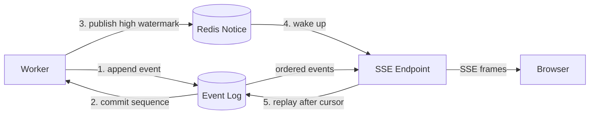
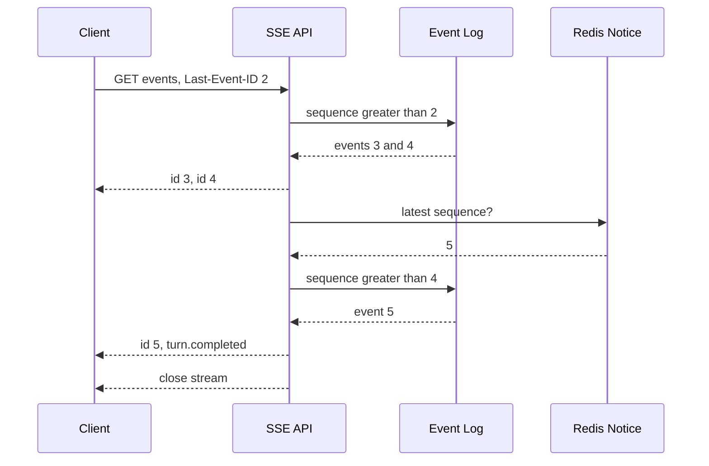
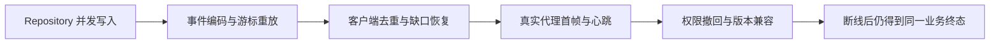

# SSE 事件的序号、重放与轮询降级

一个研究型问答运行了两分钟。浏览器先收到 `turn.created` 和两段回答，随后 Wi-Fi 切换，SSE 连接断开。Worker 没有停，引用和最终答案继续写入数据库。页面恢复网络后，如果重新创建 Turn，会多跑一次模型；如果只重新连接却没有游标，页面可能重复拼接前两段内容。

连接断开只影响结果交付，不应改变 Turn 的执行。解决这件事需要一份持久事件日志：每个事件有 Turn 内递增序号，客户端记住最后确认的序号，重连后只读取更大的事件。SSE 是日志的传输方式，不是日志本身。

::: info 一条可靠的交付链

1. Worker 先把领域事件写入数据库。
2. 提交成功后发布“最新序号”通知。
3. SSE 根据客户端游标从数据库重放。
4. Redis 不可用时定期查数据库。
5. 终态已形成后关闭连接，客户端仍可读取状态接口。

:::

## SSE 解决服务器向浏览器的单向增量交付

Server-Sent Events（SSE）是一条基于 HTTP 的服务器到客户端单向事件流。响应类型是 `text/event-stream`，服务端持续写入由空行分隔的文本帧。浏览器原生 `EventSource` 会在连接意外结束后重连，并根据最近收到的 `id` 发送 `Last-Event-ID`。

SSE 很适合 Agent 进度、回答增量、引用就绪和终态通知，因为这些数据主要从服务器流向浏览器。用户取消、反馈和新问题仍走普通 HTTP 请求。客户端不需要维护一套双向消息协议。

WebSocket 支持双向帧、二进制和更自由的子协议，适合高频协作或双方持续推送。它没有自动提供持久事件日志和业务重放，仍要自行设计序号、游标和恢复。长轮询每次请求等待一段时间，兼容性强，但连接与查询开销更高。选择传输协议不会替代事件一致性设计。

模型 SDK 的 Streaming 也不是 SSE。SDK 产生 Token 或文本片段，Runtime 决定哪些内容可以成为用户事件。验证失败时可能发送 `answer.replaced`，工具进度可能只记录阶段而不暴露内部参数。不能把供应商原始流直接转发给浏览器后再补权限与审计。

## 持久事件日志是事实，实时通知只是提示

每个 Turn 保存 `next_event_sequence`，事件表保存 `turn_id`、`sequence`、`event_type`、`payload` 和 `created_at`。写事件时，数据库在同一事务中递增计数并插入事件。事务回滚后，事件对客户端不可见；成功提交后，任何 API 副本都能按序号查询。

Redis 通知只携带 Turn 的最新序号，用于告诉 SSE 循环“数据库里有新内容”。通知可以重复、乱序或丢失，接收方只比较高水位，不把通知 Payload 当用户事件。Redis 故障时，事件仍在数据库，连接切换到低频轮询，实时性下降但内容不丢。



只用进程内队列广播，会在 API 重启、负载均衡切换或浏览器断线时丢掉历史。只用 Redis Pub/Sub 也有同样问题：订阅者离线期间的消息不会自动保留。Redis Stream 可以承担持久日志，但仍要解决数据库终态与事件的事务关系。已有权威数据库时，事件表加轻量通知更容易对账。

发布顺序必须是数据库提交在前、通知在后。先通知再提交，SSE 被唤醒后查不到事件，若后续没有新通知就会一直漏到下一次轮询。提交成功但通知失败没有数据损失，定期数据库检查会补上，只是晚几秒到达。

多副本 API 不能把事件序号存在本机内存。副本 A 写入 10，副本 B 维护的内存高水位仍是 8，连接落到 B 后必须通过数据库查到 9、10。Redis 通知让所有副本都能被唤醒，但不负责决定哪个副本发送，也不保证同一通知只被消费一次。

发布通知最好包含 Turn ID 和最新 Sequence，而不是只发一个“有更新”字符串。副本收到旧通知时比较高水位，收到新通知时把 Cursor 之后的区间一次取回。一个通知唤醒多个连接是允许的，每个连接独立使用自己的 Cursor；不能用全局消费组把事件从一个浏览器连接手里拿走。

事务提交与通知之间仍有一个不可避免的窗口。通知发布失败时，Outbox 可以在同一数据库事务里记录待发消息，由独立发布器重试；如果暂时不引入 Outbox，周期回查就是最低保障。无论采用哪条路，通知发布失败都不能回滚已经提交的业务事件，更不能让 Worker 重新执行模型来“补消息”。

跨区域部署时，数据库读副本可能晚于主库。SSE 重放读到旧高水位后暂时没有事件，客户端应继续等待或回源主库，而不是把 Sequence Gap 当成数据删除。事件 API 需要明确读一致性要求，引用和终态对用户可见前也要避免读到旧版本。

## Turn 内序号必须原子分配

序号描述同一 Turn 的事件顺序，不需要在全站全局递增。两个并发分支可能同时完成，若先查询最大序号再加一，它们都会算出相同值。数据库应通过行级更新、Sequence 分配或事务锁原子取得区间，再插入唯一约束为 `(turn_id, sequence)` 的记录。

单事件写入可以执行“`next_event_sequence = next_event_sequence + 1` 并返回旧值”。批量事件一次预留连续区间，按输入顺序写入。例如并行检索的三个结果统一形成一个批次，预留 8、9、10；哪个网络请求先返回不直接决定用户事件顺序，Runtime 的归并规则决定批次顺序。

序号允许因事务回滚出现空洞吗，要在协议里明确。最简单的设计是计数递增与插入位于同一事务，回滚一起撤销，提交事件保持连续。即使存储方案允许空洞，客户端也只能把“数据库查询确认不存在”当合法空洞，不能看见 8 后直接猜 7 永远不会来。

终态事件还要保证唯一。Completed、Failed、Cancelled 和 Expired 互斥，并发的取消与完成可能同时尝试写入。事务锁住 Turn 的终态边界，已经存在终态事件时返回其序号，不再新增第二个。客户端收到一个终态后可以结束流，不必判断两个终态谁获胜。

事件序号不等于 Turn Revision。Revision 保护领域状态的乐观更新，Sequence 安排交付事件。一次状态修订可能产生多个事件，也可能只更新内部 Checkpoint 而不对外发送。把两者共用一个字段，会让内部状态变化制造无法解释的客户端缺口。

## 一个 SSE 帧由 id、event 和 data 组成

事件帧使用 UTF-8 文本，每个字段占一行，空行表示帧结束：

```text
id: 7
event: answer.delta
data: {"content":"第二段回答"}

```

`id` 是十进制 Sequence，浏览器用它更新重连游标。`event` 是稳定类型，客户端通过 `addEventListener("answer.delta", ...)` 分发。`data` 是 JSON Payload，不把错误类型塞进自然语言。多行文本先进入 JSON 字符串，不能直接拆成多个 `data` 行后让客户端猜编码。

注释行以冒号开始，例如 `: heartbeat`。它不会触发业务事件，可以让代理和浏览器知道连接仍有字节流动。Heartbeat 没有 Sequence，也不写入事件表；把心跳持久化会快速膨胀日志，还会让业务游标充满无意义事件。

服务端对 `Last-Event-ID` 做严格整数解析，小于零归一到零或直接拒绝，非数字返回 400。游标大于当前最大序号时不能永久等待，可以返回 409、回退到状态接口，或先返回一个 `stream.reset` 协议事件。静默接受错误游标会让用户看不到任何内容。

官方格式与浏览器行为可以查阅 MDN 的 [Using server-sent events](https://developer.mozilla.org/en-US/docs/Web/API/Server-sent_events/Using_server-sent_events)。原生 `EventSource` 不方便设置任意 Authorization Header，Cookie 会话、短期签名 URL 或基于 `fetch()` 的流式客户端要按站点认证模型选择。不要把长期 Token 放进可记录、可分享的 URL 查询参数。

## 连接建立后先重放，再等待新通知

SSE Endpoint 先确认当前用户拥有 Turn，并再次检查知识库访问权限。认证发生在每次连接，不能因用户曾创建 Turn 就永久开放事件。验证完成后释放请求 Session，流循环每次查询创建短生命周期数据库会话，避免一条长连接占住事务和连接池。

游标初始值来自 `Last-Event-ID`。连接第一次进入循环时，无条件查询 `sequence > cursor` 的事件并按升序发送；不能先订阅 Redis 再等下一条通知，否则连接建立前已经提交的事件不会到达。

重放结束后读取 Turn 状态。若已经终态，并且终态事件已在本批重放，发送完就关闭；终态已写但本次没有事件，Endpoint 也可以结束，让客户端通过状态接口取得最终快照。持续等待一个不会再来的通知会造成“任务完成但页面一直转圈”。

连接保持期间，Redis 最新序号大于 Cursor 时立即回查数据库。即使 Redis 正常，也要周期性查询数据库，覆盖提交后通知失败和高水位读取故障。Redis 一旦抛错，循环标记通知不可用，改用固定上限的数据库轮询，不反复在每个 Tick 尝试重连并刷满日志。



从重放切到实时等待时存在竞态：数据库查询返回到订阅建立之间可能写入新事件。高水位检查和周期回查会捕获它。另一种做法是先订阅通知，再读取数据库，再消费订阅，但实现更复杂，仍需处理订阅丢失。只要数据库查询是最终兜底，短暂竞态只影响延迟。

## Event Payload 要面向客户端投影设计

事件类型代表已经发生的领域事实或可展示进度，不是后端函数名。常见类型包括 `turn.created`、`stage.started`、`answer.delta`、`references.ready`、`answer.replaced` 和四种终态。字段随事件类型定义 Schema，并带 `schema_version` 或保持向后兼容。

`answer.delta` 要说明是追加片段还是完整快照。追加模式传输量小，客户端按 Sequence 拼接；验证阶段替换答案时发送 `answer.replaced`，不能继续用 Delta 假装追加。引用事件使用稳定 Node 或 Evidence ID 和允许展示的标题，内部对象路径、ACL 快照与 Prompt 不进入 Payload。

客户端投影保存 `lastAppliedSequence`。收到等于或小于它的事件，说明重放或网络重复，直接忽略；收到恰好加一的事件才应用；收到更大序号时暂停更新，从持久接口请求缺失区间。不能为了“看起来实时”跳过缺口，否则后面的 Replace、Reference 或 Cancel 可能建立在缺失状态上。

页面刷新后，可以把最后游标与 Turn ID 存在会话范围，或从服务端重新构建完整投影。长期只保存浏览器拼接出的文本不够，服务端终态快照才是最终答案。事件日志用于解释过程和增量恢复，快照用于快速读取当前状态。

客户端处理函数需要幂等。Sequence 过滤发生在修改 UI 之前，终态事件重复到达不会重复弹提示、发送埋点或创建通知。多标签页同时连接同一 Turn 时，各自维护游标，不用争夺全局浏览器状态。

## 事件保留与终态快照决定旧游标怎么办

事件日志不能无限保留。长任务产生的 Delta、检索进度和调试事件会让表持续增长，查询老游标也越来越慢。保留策略按 Turn 终态、用户可见期限和审计要求划分，不能只按数据库总行数删除最旧记录。删除前确认客户端是否仍可能重连，以及是否已经有完整快照可替代历史。

终态快照保存当前答案、引用、状态和最后 Sequence。事件压缩后，旧客户端携带的游标可能早于保留起点。服务端先返回一个明确的 Reset 结果，再发送快照并把客户端游标推进到快照对应的 Sequence。Reset 不是让客户端默默从零重放，也不是凭空补齐已经删除的 Delta。

一种轻量做法是每个 Turn 终态后保留最近几条事件，把完整答案放在 Turn 记录或对象存储，定期把更早的 Delta 标记为 compacted。另一种做法是周期性写 Snapshot Event，客户端在缺口时从最近 Snapshot 重建。两种方案都要记录快照版本与事件边界，验证快照重建出的答案和终态答案一致。

删除事件时保留审计所需的类型、Sequence、时间和引用关系，Payload 按用户删除、敏感信息清理和保留期执行。SSE API 返回 Reset 或终态快照时，仍要按当前用户权限过滤引用，不能因为快照曾经对原用户可见就长期公开。

事件表还应有按 `turn_id, sequence` 的索引，重放查询限制批次大小。单次返回几千个 Delta 会堵住连接、占用内存并让浏览器一次性刷新大量 DOM。超过批次时先发送已读取的事件，下一轮用新 Cursor 继续，终态检测不能因分页而提前关闭。

## 轮询降级也要沿同一个游标协议

轮询接口不要重新设计一套状态字段。`GET /turns/{id}/events?after=7` 返回 `events`、`next_sequence`、`terminal` 和必要的 `snapshot`，语义与 SSE 的 `Last-Event-ID: 7` 相同。客户端无论从 SSE 还是轮询收到事件，都经过同一个投影函数和 Sequence 去重。

轮询请求每次重新认证并检查 Turn 归属。响应 200 但事件为空不代表任务失败，`terminal=false` 时按服务器建议等待；`terminal=true` 时停止。服务端可以返回 `Retry-After` 或一个有上限的建议间隔，不能让每个页面固定每 100 毫秒打数据库。

SSE 与轮询切换时保留同一个 Cursor。SSE 最后应用到 12，降级请求从 `after=12` 开始；轮询期间若收到 14，再恢复 SSE 时携带 14。切换前后允许一次重复帧，由投影去重；不能把两个通道的结果按到达时间直接拼接。

轮询是交付降级，不是执行降级。Worker、Lease、模型调用与事件写入照常运行，浏览器只改变读取方式。若事件存储不可用，轮询返回明确的服务错误，客户端保留上一次快照并等待，不能根据空响应把 Turn 标成 Failed。

## 断线重连不创建新 Turn

浏览器在收到 Sequence 2 后断线，Worker 随后提交 3、4、5。重连请求仍访问原 `event_url`，携带 `Last-Event-ID: 2`。服务端返回 3、4、5，最后一个是 `turn.completed`，然后关闭连接。模型、检索与工具都没有重新执行。

断线期间用户点击取消，取消请求按 Turn ID 写入领域状态，不依赖原 SSE 连接。新连接可能依次收到 `turn.cancel_requested` 和 `turn.cancelled`，也可能只重放最终 Cancelled，取决于协议是否对外保留请求事件。客户端以持久事件和状态为准，不因本地按钮已经点击就预设成功。

原生 EventSource 会自动重连，但应用仍需限制无限等待。连续网络失败达到前端阈值后，页面切换到轮询：先 GET Turn 状态，再按游标获取事件或完整快照。轮询成功后可以尝试恢复 SSE，不能同时让两个通道重复应用同一事件；Sequence 去重是最后防线。

轮询间隔采用带上限的退避，页面进入后台时可以放慢。Turn 到达终态后停止轮询。HTTP 401 或 403 要求重新认证，不继续重试；404 可能是无权限统一隐藏或数据已按保留策略删除；429 和 503 按 `Retry-After` 等待。

SSE HTTP 200 只说明流建立。连接在任何业务事件前被代理关闭时，客户端不能显示任务失败，先读取状态；状态仍 Running 就重连，状态终态则展示快照。把网络状态和业务状态混为一谈，会让一次 Wi-Fi 切换变成错误的 Failed。

## 代理缓冲、心跳和连接容量

流式响应必须避免中间层把多帧攒成一个大块。响应头使用 `Cache-Control: no-cache, no-transform`，并在 Nginx 场景设置 `X-Accel-Buffering: no` 或对应位置的 `proxy_buffering off`。代理、CDN 和负载均衡器的 Idle Timeout 要长于心跳间隔。

Nginx 代理示例：

```nginx
location /api/v1/agent/turns/ {
    proxy_pass http://agent_api;
    proxy_http_version 1.1;
    proxy_buffering off;
    proxy_cache off;
    proxy_read_timeout 75s;
}
```

若服务每 15 秒发一次心跳，代理读取超时必须留出余量。示例数字只说明相对关系，生产值要结合代理链路和移动网络验证。心跳太频繁会增加每条连接的网络和调度开销，太慢则可能被中间层判为空闲。

HTTP/1.1 浏览器对同一 Origin 的并发连接数有限，多标签页和多个 Turn 可能互相占用。HTTP/2 可以复用连接，但代理配置仍要实测。页面不再展示 Turn 时关闭 EventSource，终态到达后服务器主动结束，避免僵尸连接。

服务容量按活动连接、数据库回查频率、每秒事件数和 Payload 大小估算，不只看 API QPS。Redis 故障进入数据库轮询时，所有连接可能同时查询，间隔加随机抖动并设置最低值，防止故障把数据库压满。必要时按用户限制同时订阅的 Turn 数。

## 用最小实现验证序号与重放

下面的示例用内存对象模拟事件表、高水位通知和客户端投影。它没有数据库事务、HTTP 和跨进程并发，只验证序号、终态唯一、游标与缺口处理。

<<< ../../examples/ai-agent/sse_replay.py

`append()` 原子取得下一个 Sequence，`append_batch()` 预留连续区间，`replay()` 只返回大于 Cursor 的事件。Terminal 已存在时，重复写入返回原事件，不产生第二个终态。Notification 丢失不影响 `replay()`，它只让客户端晚到下一次数据库检查。

运行测试：

```bash
PYTHONDONTWRITEBYTECODE=1 PYTHONPATH=examples/ai-agent \
  python3 -m unittest examples/ai-agent/tests/test_sse_replay.py
```

## 沿一次断线推演状态和页面变化

Turn 42 创建后写入 Sequence 1，Payload 只有安全的状态摘要。规划完成写入 2，第一段答案写入 3。浏览器应用到 3 后断线，本地 Cursor 保持 3，页面仍显示已有内容并提示连接恢复中。

Worker 不感知页面连接，它继续写 Sequence 4 的第二段答案、5 的引用和 6 的 Completed。每次数据库提交后尝试发布高水位。Sequence 5 的 Redis 通知丢失，没有改变事件表。

浏览器重连时发送 Cursor 3，SSE 先查数据库，一次取回 4、5、6。客户端按序应用，引用不会因通知丢失而缺少，Completed 关闭恢复提示。若 Sequence 4 的网络帧在客户端应用后连接又断开、浏览器没来得及持久化 Cursor，下一次可能再次收到 4；投影发现 `sequence <= lastAppliedSequence` 后忽略。

| Sequence | 事件 | 页面动作 | 可否重复应用 |
| --- | --- | --- | --- |
| 1 | `turn.created` | 建立任务视图 | 忽略重复 |
| 2 | `stage.started` | 更新阶段 | 按阶段 ID 覆盖 |
| 3、4 | `answer.delta` | 追加文本 | 先按序号去重 |
| 5 | `references.ready` | 显示引用 | 按 Evidence ID 去重 |
| 6 | `turn.completed` | 用终态快照收束 | 只处理一次 |

如果重连只返回 5、6，客户端检测到 4 缺失，停止拼接并重新请求 `after=3`。如果数据库也没有 4，却最大序号已是 6，服务端记录 Sequence Gap，返回完整快照或错误，不能让客户端自行补一个空事件。

## 失败证据按责任层展开

页面没有实时更新时，先确认 Turn 是否仍在推进，再判断问题位于写入、通知、流或浏览器：

| 责任层 | 证据 | 常见现象 |
| --- | --- | --- |
| Runtime | Turn 状态、最后 Progress | Worker 是否仍在执行 |
| Event Log | 最大 Sequence、终态事件 | 事件是否已经持久化 |
| Notice | 最新高水位、Redis 错误 | 唤醒是否丢失 |
| SSE API | Cursor、重放数量、Heartbeat | 流是否查到并发送 |
| Proxy | 缓冲、读取超时、连接关闭 | 帧是否被攒住或截断 |
| Browser | Last Event ID、应用游标、错误类型 | UI 是否去重或卡在缺口 |

事件表已有 12、SSE Cursor 停在 8、Redis 报错，但数据库回查仍在运行，说明降级延迟而非数据丢失。API 日志显示发送到 12，浏览器只看到 8，则检查代理缓冲和网络。浏览器收到 9 到 12 却页面没变化，问题在客户端投影或 Schema 兼容。

Turn 已 Completed 但没有终态事件，问题发生在终态事务或事件写入；终态事件存在但流不关闭，检查终态识别与重放退出条件。Turn 仍 Running 且长期没有新事件，不归 SSE 负责，回到 Watchdog、Lease 和 Worker Trace。

指标按原因拆分连接结束：Terminal Close、Client Disconnect、Auth Failure、Proxy Reset、Server Error。重连率、重放事件数、Cursor Lag、数据库回查次数、Redis 降级连接数和缺口次数都比一个“流成功率”更能定位问题。Turn ID 不放进指标标签，详细排查通过 Trace 查询。

## 测试覆盖协议、竞态和真实代理



测试从存储顺序一路走到浏览器投影。只验证其中一层，无法证明断线后不会丢事件、重复文本或泄露另一位用户的 Turn。

单元测试验证编码顺序是 `id`、`event`、`data` 和空行，中文 JSON 不被错误转义；无效 `Last-Event-ID` 返回 400；Heartbeat 不改变 Cursor。Repository 测试并发追加事件，断言 `(turn_id, sequence)` 唯一、批量区间连续且四种终态最多一个。

重连测试先读取 1、2 后主动关闭，再以 `Last-Event-ID: 2` 建立连接，只能收到 3 以后事件。重复通知和旧高水位不产生重复帧，通知丢失后定期数据库查询仍能发送。Redis 抛错时流继续，终态到达后退出。

客户端测试把同一 Delta 发送两次，文本只能追加一次；制造 3 后直接到 5，投影必须请求缺失事件而不是继续；收到 Replace 后旧 Delta 被完整快照替换；Completed 重复到达不重复上报完成埋点。

浏览器与代理测试需要真实启动站点。通过 Nginx 或目标网关连接，记录首帧到达时间和心跳间隔，确认没有缓冲到终态才一次返回。测试 375px 和桌面布局时同时观察长文本、代码块和引用增量是否造成滚动跳跃，但视觉问题不能反过来改变事件顺序。

权限测试让另一个用户请求同一 Turn，状态、事件和是否存在都不能泄露。用户权限在执行期间撤销后，新 SSE 连接拒绝访问；已建立连接是否立即终止取决于权限刷新策略，高敏感场景要周期复核或在撤销时主动断开。

发布回归覆盖旧客户端读取新 Payload。新增可选字段可以向后兼容，删除字段或改变 Delta 语义需要版本化事件。事件保留期到期后，过旧 Cursor 返回完整终态快照或明确 Reset，不能从一个已经删除的历史点假装连续重放。

事件版本要覆盖客户端处理方式，而不只是 JSON 字段列表。旧客户端遇到未知事件类型时保留 Cursor 还是暂停，必须提前约定；对不影响答案的进度事件可以安全跳过，对会改变投影的 Replace、Reset 和终态事件则应返回兼容错误并要求读取快照。服务端不要把同一个 `event_type` 的 `data` 从追加片段突然改成完整答案，客户端无法仅凭 JSON 形状可靠判断。

多端客户端的发布顺序也要纳入回归。先发布能识别新事件的客户端，再让 Worker 产生新类型，最后再删除旧事件字段。回滚时新事件仍可能停留在日志里，旧客户端必须能通过快照完成显示，不能因为代码回滚就让历史 Turn 无法查看。

假设客户端游标为 18，而保留策略只留下从 25 开始的事件，服务端返回 `reset_required`，快照带有 `snapshot_sequence: 24`。客户端先清空旧投影，应用快照，再从 24 请求事件 25 以后；若快照读取失败，页面保留旧内容并显示无法恢复，不把空白答案当成完成。

快照和后续事件必须使用同一次权限判断。用户范围变化后，即使旧快照曾经包含某条引用，重置响应也应过滤或拒绝该引用，不能把历史游标当成访问凭证。

权限拒绝本身不写入用户可见事件，服务端只返回稳定错误并记录审计。

SSE 的可靠性不来自连接永不断开，而来自连接可以随时断开，Turn 仍继续，事件仍可按游标找回。下一篇进入更长的持久执行：Temporal 怎样把等待、重试、Signal 和历史重放纳入工作流，而不是只依赖 Worker 与事件表组合。

## 可重放性来自游标与快照的组合
事件序号必须单调且持久化，客户端断线后用 `Last-Event-ID` 请求缺失片段。保留窗口不足时返回快照序号和 `reset_required`，客户端先重建投影再继续读取。

权限变化后重新鉴权快照与事件。事件类型演进保留兼容字段，客户端无法识别关键 Replace 或终态事件时回退终态查询。
