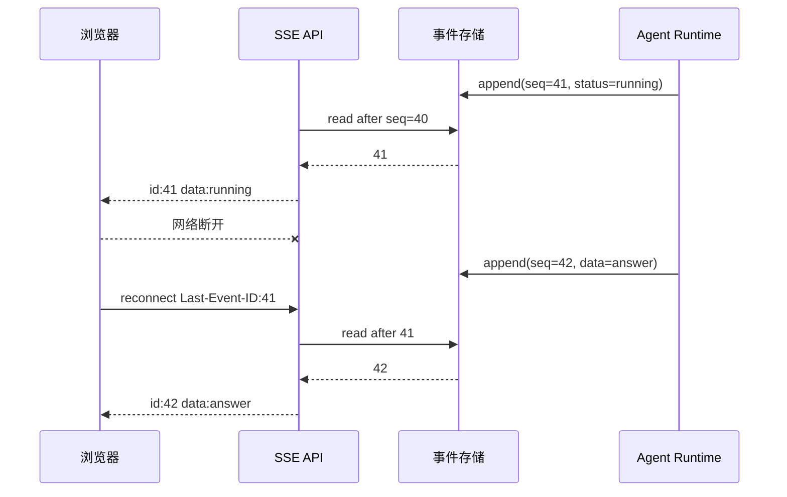

# SSE 事件、序号、断线重放与轮询降级

## SSE 在 Agent Runtime 中的位置

SSE（Server-Sent Events）是一种服务端通过单向 HTTP 长连接持续向浏览器发送文本事件的协议。它位于 Agent Runtime 的事件存储与前端页面之间，适合传输检索进度、引用和最终答案；它不保存业务状态，也不保证断线期间的事件自动补发。

网络切换、代理超时或手机休眠都会让连接断开。只在内存里 `yield` 事件，重连后客户端无法知道自己漏了哪一段。

可靠的流式接口要把“事件已经产生”和“事件已经送达”分开：服务端持久化带序号的事件，客户端带 `Last-Event-ID` 重连，服务端补发缺口；如果长连接被代理阻断，再用同一个**事件序号**轮询。

## 事件通道的状态关系



事件序号属于一个 Turn，必须单调递增并在持久化时分配。客户端收到事件后才推进本地游标；连接断开不会推进游标。重连时服务端读取 `seq > Last-Event-ID` 的事件，客户端按序去重。**终态**事件之后，服务端返回 `204` 或关闭连接，不能继续发送“处理中”。

## 事件流与最终状态查询的职责区别

一个 Agent Turn 的状态会连续变化：accepted、retrieving、evidence_ready、generating、completed。只保存当前 JSON，客户端断线后只能看到最终状态，无法知道是否已经展示过引用，也无法判断进度条是否倒退。事件提供可重放的历史，当前状态则是事件折叠后的快照，两者职责不同。

事件 payload 应包含 `turn_id`、`seq`、`type`、`created_at` 和最小业务数据。不要把整个提示词、私有正文或凭证放进 SSE；事件存储和浏览器日志都可能被更广泛地读取。

## SSE 协议字段和重放窗口

一条 SSE 事件由空行分隔，常用字段是 `id`、`event`、`data` 和 `retry`。`id` 被浏览器保存并在自动重连时放进 `Last-Event-ID` 请求头；它不是数据库主键的别名，而是当前 Turn 内客户端游标。`data` 可以是 JSON 字符串，但服务端必须对换行、编码和敏感字段做处理。

服务端必须定义重放窗口。例如只保留最近 30 分钟的事件，客户端带来的序号如果早于窗口最小值，就不能从缺口开始补发。此时有两个诚实选择：返回可识别的 `replay_unavailable`，让客户端读取当前快照后从新序号开始；或者延长事件保留。直接发送窗口内第一条会让 UI 看起来连续，却把中间状态悄悄丢掉。

事件序号要在持久化事务中分配，而不是用应用进程内的列表长度。两个 Runtime 同时追加时，数据库可以用 `(turn_id, seq)` 唯一约束和行锁保证顺序；若一次事务失败，序号是否允许出现空洞要在协议中说明。最简单的客户端策略是发现缺号就请求快照，不把“事件连续”误认为“每个数字都没有跳过”。

## 事件追加与缺口重放

下面把“事件追加与缺口重放”落成最小实现。代码关注“事件存储为每个 Turn 原子分配递增序号，重连按 **Last-Event-ID** 只读取缺失区间”；输入从函数参数或上文定义的状态对象进入，关键分支负责校验或修改状态，返回值再交给后续调用。

```python
# 事件存储为每个 Turn 原子分配递增序号，重连按 Last-Event-ID 只读取缺失区间。
from __future__ import annotations

from dataclasses import dataclass
# Event 保存可排序、可重放的事件状态，让断线恢复仍能重建相同执行轨迹。

@dataclass(frozen=True)
class Event:
    turn_id: str
    seq: int
    event_type: str
    payload: str

# EventLog 保存可排序、可重放的事件状态，让断线恢复仍能重建相同执行轨迹。
class EventLog:
    def __init__(self) -> None:
        self._events: dict[str, list[Event]] = {}

    def append(self, turn_id: str, event_type: str, payload: str) -> Event:
        events = self._events.setdefault(turn_id, [])
        event = Event(turn_id, len(events) + 1, event_type, payload)
        events.append(event)
        return event

    def after(self, turn_id: str, last_seq: int) -> list[Event]:
        return [event for event in self._events.get(turn_id, []) if event.seq > last_seq]

def merge_for_client(received: set[int], events: list[Event]) -> list[Event]:
    """按序过滤已展示与批内重复事件，调用方再检查缺号。"""
    unseen_by_seq = {
        event.seq: event
        # 按产生顺序消费事件并分配序号，断线重放才能恢复相同的客户端状态。
        for event in events
        if event.seq not in received
    }
    return [unseen_by_seq[seq] for seq in sorted(unseen_by_seq)]

if __name__ == "__main__":
    log = EventLog()
    log.append("turn-1", "status", "retrieving")
    log.append("turn-1", "evidence", "e-1")
    log.append("turn-1", "completed", "answer")
    replay = log.after("turn-1", last_seq=1)
    print(merge_for_client({1}, replay))
```

`EventLog.append` 用列表长度生成序号；真实数据库应使用事务或数据库序列，避免并发追加得到同一个序号。`after` 返回重连游标之后的事件；`merge_for_client` 先按序号建立字典，同时去掉客户端已展示事件与同一批重复事件，再按序返回。示例从 1 重连，因此会收到 2 和 3，不会重复展示 1。

服务端 SSE 层可以把 `Event` 格式化为 `id: 2\nevent: evidence\ndata: ...\n\n`。发送失败不删除事件，重连会再次读取。若事件保留期过短，`Last-Event-ID` 早于最小可用序号，服务端应返回“无法重放”的明确错误，让客户端退回轮询当前快照，而不是假装没有缺口。

## 用 pytest 锁住序号、重放和去重

把第一段实现下面直接执行这段实现。测试输入模拟追加三条事件、从序号 1 重连和客户端重复收到事件；输出检查序号单调、缺口补发与批内去重。

```python
# 测试制造断线与重复连接，断言事件序号单调、缺口完整且客户端可以按 ID 去重。
from event_log import EventLog, merge_for_client

# 这个用例模拟事件追加或断线重连，客户端只能合并缺失且未见过的序号。
def test_sequence_is_monotonic_inside_one_turn() -> None:
    log = EventLog()
    first = log.append("turn-1", "status", "retrieving")
    second = log.append("turn-1", "completed", "answer")
    assert (first.seq, second.seq) == (1, 2)

# 这个用例模拟事件追加或断线重连，客户端只能合并缺失且未见过的序号。
def test_reconnect_reads_only_the_missing_suffix() -> None:
    log = EventLog()
    log.append("turn-1", "status", "retrieving")
    log.append("turn-1", "evidence", "e-1")
    log.append("turn-1", "completed", "answer")
    assert [event.seq for event in log.after("turn-1", 1)] == [2, 3]

# 这个用例重复提交或恢复同一运行，确认 Checkpoint、幂等键或事件序号阻止重复副作用。
def test_client_merge_deduplicates_replayed_events() -> None:
    log = EventLog()
    first = log.append("turn-1", "status", "retrieving")
    second = log.append("turn-1", "completed", "answer")
    result = merge_for_client({first.seq}, [second, first, second])
    assert [event.seq for event in result] == [2]
```

执行 `python -m pytest -q`，预期三条通过。第一条验证 Turn 内序号单调，第二条验证 `Last-Event-ID` 只补缺口，第三条证明网络重放的重复帧不会重复修改 UI。数据库集成测试还要并发追加事件，验证 `(turn_id, seq)` 唯一约束、重放窗口过期和终态后禁止新业务事件。

## FastAPI 中如何把事件日志接到 SSE

下面是一个接近真实服务的流式适配器，依赖 FastAPI 和 Uvicorn；`EventLog` 沿用上一个代码块，业务 Runtime 通过 `append` 写事件。输入是 URL 中的 `turn_id` 与可选的 `Last-Event-ID`，输出是 `text/event-stream`。示例为了便于阅读省略了数据库查询和鉴权，但保留了重放、心跳和终态判断的位置。

```python
from __future__ import annotations

import asyncio
import json
from collections.abc import AsyncIterator

from fastapi import FastAPI, Header, HTTPException
from fastapi.responses import StreamingResponse

app = FastAPI()
event_log = EventLog()
TERMINAL_EVENTS = {"completed", "failed", "cancelled"}

def format_sse(event: Event) -> str:
    """把内部事件编码成浏览器能够解析的 SSE 帧。"""
    # 把影响结果的边界字段组成规范化载荷，缓存键不能遗漏权限或版本。
    payload = json.dumps({"turn_id": event.turn_id, "value": event.payload})
    return f"id: {event.seq}\nevent: {event.event_type}\ndata: {payload}\n\n"

async def stream_turn(turn_id: str, last_seq: int) -> AsyncIterator[str]:
    cursor = last_seq
    while True:
        pending = event_log.after(turn_id, cursor)
        for event in pending:
            yield format_sse(event)
            cursor = event.seq
            # 先检查当前状态是否允许继续推进，避免终态被重复任务或迟到结果覆盖。
            if event.event_type in TERMINAL_EVENTS:
                return
        # 注释心跳不推进业务序号，只是防止代理误判连接空闲。
        yield ": heartbeat\n\n"
        await asyncio.sleep(1)

@app.get("/turns/{turn_id}/events")
async def events(
    turn_id: str,
    last_event_id: str | None = Header(default=None, alias="Last-Event-ID"),
) -> StreamingResponse:
    # 从这里进入可能失败的外部边界，下面只转换已经明确分类的异常。
    try:
        last_seq = int(last_event_id or "0")
    # 输入未通过结构或业务校验，返回稳定错误后不会执行真正的外部操作。
    except ValueError as exc:
        raise HTTPException(status_code=400, detail="invalid_event_id") from exc
    return StreamingResponse(
        stream_turn(turn_id, last_seq),
        media_type="text/event-stream",
        headers={"Cache-Control": "no-cache", "X-Accel-Buffering": "no"},
    )
```

`format_sse` 只把事件中的最小数据序列化，`id` 使用 Turn 内序号。`stream_turn` 先补发游标之后的事件，再用注释心跳保持连接；心跳没有 `id`，所以不会让客户端误以为收到了业务状态。遇到终态就关闭生成器，浏览器不会继续看到“处理中”。路由把无效游标变成 400，而不是从零开始猜测。

真实实现还要在进入 `stream_turn` 前检查用户是否能读取该 Turn，并检测游标是否已超出事件保留窗口。`X-Accel-Buffering: no` 只对 Nginx 这类代理提供提示，代理仍需配置读超时；它解决不了事件存储缺失或客户端处理过慢的问题。

## 轮询降级如何保持一致

轮询接口返回当前快照和 `last_seq`。客户端保存自己已处理的序号，每次收到更大的序号就刷新状态；如果序号倒退，说明读取到了旧缓存，应等待下一次，不能回滚界面。SSE 与轮询必须读取同一个事件存储或同一份状态快照，不能各自维护一套终态。

生产排障看三组数据：事件存储是否连续、代理是否缓冲 SSE、客户端最后确认的序号。Nginx 等代理需要关闭响应缓冲并设置合理的读超时，同时发送心跳注释保持连接活跃；即便连接层正确，也要保留重放能力。

轮询接口可以返回这样的快照：`{status, answer, last_seq, replay_available}`。客户端第一次发现 SSE 断开时，先请求快照；若 `replay_available` 为真并且本地序号仍在窗口内，可以继续重连补事件；若为假，就用快照刷新界面并把游标设置为 `last_seq`。这会丢失中间进度，但不会显示过期状态或重复终态。

慢客户端要有背压策略。SSE 本身没有让服务端无限缓存的义务，生成器写入阻塞时，Runtime 仍可把事件持久化后释放连接。可以限制单连接待发送事件数量，超过上限就关闭并让客户端走快照；不要为了迁就一个断网客户端把所有 Turn 事件留在内存。

## 用断线实验检查事件重放

1. 为每个 Turn 建立单调事件序号和终态事件。
2. 客户端只在成功解析后推进 `Last-Event-ID`。
3. 重连先补发缺口，无法补发时返回可识别的降级信号。
4. 轮询读取同一快照，拒绝旧序号覆盖新状态。
5. 测试断网、重复事件、缺号、事件过期和终态后连接关闭。


**SSE 断线后为什么不能只重新请求一次当前状态？**

当前状态能恢复最终界面，却会丢掉工具开始、检索完成、降级和验证失败等中间事件，调试与用户进度都不完整。事件持久化后，每个 Turn 使用单调序号，客户端通过 `Last-Event-ID` 请求缺口；窗口已过期时才退回快照。业务事实来自数据库事件，Redis 或内存通知只负责唤醒连接。这样服务重启和断线不会让终态消失，也不会依赖某个进程保存全部流。

**SSE 的 `id` 应该使用数据库主键还是 Turn 内序号？**

客户端需要的是同一 Turn 内稳定、单调且无歧义的游标。可以使用全局主键，只要查询与权限正确，但 Turn 内序号更容易表达连续性和缺口，并减少跨任务信息泄露。序号必须由服务端原子分配，不能由多个 Worker 在内存自增。心跳注释不带业务 `id`，否则客户端会推进游标却没有对应事件，重连时误认为缺口已消费。

**Redis Pub/Sub 可以直接作为事件事实来源吗？**

不适合。Pub/Sub 擅长低延迟通知，但订阅者断线时消息不会自动补发，服务重启也可能丢失。可靠设计先把事件和序号写入持久化存储，再发布轻量唤醒；SSE 收到通知后按数据库游标读取。Redis 不可用时连接可以轮询存储，延迟上升但事实不丢。若先发布后写库，会出现客户端被唤醒却读不到事件，因此顺序和事务边界需要测试。

**Nginx 已关闭缓冲，为什么前端仍然看不到实时事件？**

还要检查应用是否逐条 flush、响应类型是否为 `text/event-stream`、代理读超时、压缩、CDN 缓冲和客户端读取方式。先直接连接应用端口观察事件时间，再经过代理对比；查看心跳是否持续到达和数据库事件是否已生成。代理配置只能解决传输层，若 Worker 没写事件或生成器只在结束时一次输出，关闭缓冲也不会变实时。Trace 应关联事件创建与发送时间。

**慢客户端会不会拖垮整个 Agent Runtime？**

不应让它拖垮。Runtime 先持久化事件并继续任务，SSE 连接只是消费端。每个连接限制待发送数量和写等待，超过上限关闭流，让客户端按游标重连或读取快照；不要把无限事件堆在进程内存。终态仍可通过轮询查询。指标记录连接数、发送阻塞、重连和重放量，容量保护位于事件传输层，不应取消已经合法执行的 Turn。

**SSE 与轮询如何保证不会互相覆盖状态？**

两者读取同一事件存储或由同一事件折叠出的状态快照，并返回 `last_seq`。客户端只接受大于本地序号的数据，旧缓存或延迟轮询不能把界面从 succeeded 回滚到 running。SSE 恢复可用后也从当前游标继续。终态写入数据库一次，两个通道只展示，不各自维护业务状态。测试交错发送轮询与 SSE 响应，确认序号去重和终态锁成立。
