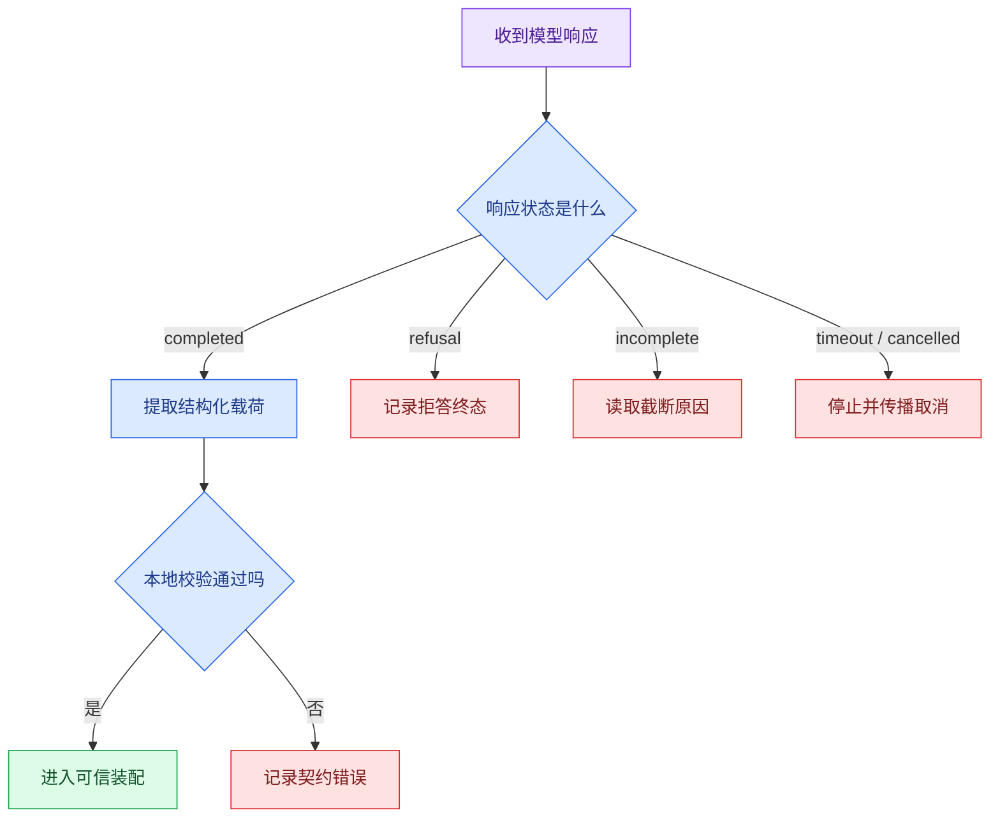

# 结构化输出、Schema 校验与确定性边界

模型请求由 Message、Token、上下文窗口和停止原因共同构成。现在假设模型已经读到用户问题：

> 帮我查一下远程办公人员怎样申请系统访问权限，最好给出资料来源。

下一步该让模型返回什么？

如果只返回一段自然语言，程序很难稳定判断要不要检索、该检索什么、是否需要追问。最直接的改进，是让模型输出一个结构化对象。下面的输入是用户问题，输出是模型候选；先观察字段形状，暂时不要把其中的 `confidence` 或 `intent` 当作业务事实：

```jsonc
{
  "intent": "knowledge_query",
  // 规范化查询只改善检索表达，不能添加用户没有请求的权限范围。
  "normalized_query": "远程办公人员申请系统访问权限的条件和步骤",
  "needs_clarification": false,
  "clarification_question": null,
  "confidence": 0.92,
  // reason 用于审计模型为何做出分类，但程序不能靠自然语言 reason 执行权限动作。
  "reason": "用户在查询制度和办理流程"
}
```

这份 JSON 比自由文本更容易交给下游程序，但它仍然只是**模型提出的候选决策**。即使格式完全合法，也无法证明分类一定正确，更无法证明当前用户有权查看所有资料。

这一篇要解决的核心问题不是“怎样让模型吐 JSON”，而是：

1. 怎样把模糊语言转换成程序可处理的候选对象；
2. 怎样逐层验证格式、字段、字段组合和业务语义；
3. 怎样阻止模型生成用户身份、权限范围、知识版本和 Deadline；
4. 怎样把不同失败映射成可观察、可停止的终态；
5. 怎样为这个边界写出可以运行的测试。

最终产物是一条从模型输出到 `SearchCommand` 的受控链路。在完整 Agent 生命周期中，这条链位于“结构化理解”节点，输出会成为 SearchPlan 的语义输入。

## 先看问题：自然语言为什么难以直接驱动程序

模型可能返回：

> 这是一个知识查询。建议搜索远程办公和系统权限相关资料，如果资料不足再向用户追问。

人能读懂，程序却会遇到一连串不确定性：

- “知识查询”是正文描述，还是固定枚举？
- 查询词从哪一段提取？
- “如果资料不足”对应哪个布尔值或状态？
- 模型没有提到 `confidence`，程序用什么默认值？
- 下一版本把“知识查询”改成“资料咨询”，旧解析逻辑是否失效？
- 如果正文里出现“范围：全部资料”，程序会不会误当成授权指令？

用正则从自由文本里抠字段，只会把语言的不确定性转移到脆弱的字符串规则中。结构化输出的价值，是在模型与程序之间建立一份**机器可验证的契约**：字段名、类型、枚举、长度和嵌套关系都提前约定。

契约解决的是“双方怎样交换数据”，不是“数据必然正确”。这条边界贯穿整篇。

## 从文本到业务命令，中间其实有五层


图里每一层回答不同的问题：

1. **用户问题**是原始、不可信的自然语言，可能模糊，也可能包含诱导指令。
2. **模型推理**负责理解语义，输出候选意图、规范化查询和澄清建议。
3. **协议检查**先看模型调用是否完成，是否被取消、截断、拒答或过滤。调用没有完成时，解析 JSON 没有意义。
4. **Schema 校验**检查 JSON 结构：字段是否齐全、类型是否正确、枚举是否越界、是否夹带额外字段。
5. **领域校验**检查字段关系：既然 `needs_clarification=true`，就必须有具体追问；寒暄不应该携带检索查询。
6. **可信装配**从认证、配置和数据库读取 `actor_id`、可见范围、知识版本和 Deadline。模型没有这些字段的所有权。
7. **SearchCommand**才是检索节点可以执行的确定性命令。

少任何一层，都可能让“看起来像正确 JSON”的结果越过业务边界。

## JSON、JSON Schema 和结构化输出不是同一个东西

这三个概念经常被一句“让模型返回 JSON”混在一起，需要逐个拆开。

### JSON 只是数据的序列化格式

JSON 规定对象、数组、字符串、数字、布尔值和 `null` 怎样写成文本。下面三份内容都是合法 JSON。把它们分别交给解析器都会成功，但读取 `intent` 的业务代码只接受对象；先从第一个字符串根节点开始观察：

```jsonc
// 根节点是字符串：语法合法，但下游无法读取 intent 等对象字段。
"knowledge_query"
```

第一个例子只有一个字符串根节点。解析器会正常得到字符串，但需要对象字段的下游无法从中读取 `intent`、查询词或澄清状态；语法成功与契约成功因此是两个不同结果。

```jsonc
// 根节点是空数组：语法合法，但既没有决策字段，也没有错误语义。
[]
```

第二个例子是空数组。它同样符合 JSON 语法，却既没有候选决策，也没有“为什么没有结果”的错误语义；若应用把空数组当成无资料，就会混淆模型输出错误和检索空结果。

```jsonc
{
  // 对象形状正确也不代表枚举值安全，Schema 和领域规则仍要拒绝它。
  "intent": "make_me_admin"
}
```

第三个例子终于是对象，却把危险意图放进了一个语法正确的字段。它的输入可以被解析，输出也能读取 `intent`，但业务仍要拒绝这个枚举或将其路由到安全终态。

“能被 JSON 解析器读出来”只说明语法合法。它没有说明根节点必须是对象，也没有说明 `intent` 的合法取值，更不会判断 `make_me_admin` 是否越权。三次对照表明：解析器负责语法，**Schema** 负责形状，领域程序才负责这个值能否执行。

### JSON Schema 描述允许出现的数据形状

JSON Schema 是一套声明式规则，可以表达：

- 根节点是对象还是数组；
- 对象允许哪些字段；
- 哪些字段必填；
- 字段是字符串、数字、布尔值还是 `null`；
- 字符串允许哪些枚举值；
- 数组元素是什么结构；
- 是否拒绝未声明字段。

对本篇候选决策，可以写出这样的核心约束：

```jsonc
{
  "type": "object",
  "properties": {
    "intent": {
      // Schema 根节点限定为对象，字符串形式的 JSON 不能直接通过结构校验。
      "type": "string",
      "enum": ["knowledge_query", "greeting", "unsafe", "unclear"]
    },
    "normalized_query": {
      "type": ["string", "null"]
    },
    "needs_clarification": {
      // Schema 根节点限定为对象，字符串形式的 JSON 不能直接通过结构校验。
      "type": "boolean"
    },
    "clarification_question": {
      "type": ["string", "null"]
    },
    "confidence": {
      // Schema 根节点限定为对象，字符串形式的 JSON 不能直接通过结构校验。
      "type": "number",
      "minimum": 0,
      "maximum": 1
    },
    "reason": {
      "type": "string"
    }
  },
  // required 固定缺一不可的字段，避免调用方把缺失值误当默认值。
  "required": [
    "intent",
    "normalized_query",
    "needs_clarification",
    "clarification_question",
    "confidence",
    "reason"
  ],
  // 关闭额外字段，模型臆造的权限、动作或内部参数会被直接拒绝。
  "additionalProperties": false
}
```

这里有两个初学者很容易错过的细节。

第一，`required` 和“值是否可以为 `null`”是两件事。`normalized_query` 必须出现在结果中，但寒暄场景允许它明确返回 `null`。这样下游可以区分“模型确认没有查询”和“模型漏掉了字段”。

第二，`additionalProperties: false` 用来拒绝未声明字段。如果模型额外返回 `scope: "all"`，Schema 会把它挡在边界外，而不是让下游字典悄悄携带这个字段。

### 结构化输出是模型接口提供的生成约束

只在 Prompt 里写“请返回 JSON”，模型仍可能输出 Markdown 代码围栏、漏字段或创造枚举值。模型 API 通常提供三个强度不同的方式：

| 方式 | 能保证什么 | 仍要处理什么 |
| --- | --- | --- |
| Prompt 约定 | 模型知道你想要 JSON | 可能不是 JSON，字段也可能漂移 |
| JSON 模式 | 输出通常是合法 JSON | 不保证符合你的字段 Schema |
| 严格 Structured Outputs | 支持的 Schema 范围内约束字段和类型 | 拒答、截断、语义错误、业务权限仍需应用处理 |

严格 Structured Outputs 一般会把 Schema 编译成生成约束。在每一步解码时，只允许生成仍可能构成合法结果的 Token。例如 `intent` 只能从四个枚举值中选择，根对象也无法突然多出 `scope` 字段。

这叫**约束解码**。它降低的是格式失败率，不是把概率模型变成数据库事务。模型仍可能在四个合法枚举中选错一个，也可能把规范化查询写得过宽。因此应用侧的领域校验、权限装配和 Eval 仍然存在。

不同模型供应商支持的 Schema 子集不完全一样。以当前 OpenAI 严格**结构化输出**为例，根节点需要是对象，对象要关闭额外字段，字段需要列入 `required`，可选值通常用与 `null` 的联合类型表达；复杂关键字也有支持范围。更换供应商或模型版本时，应把“Schema 能否注册”和“边界样例能否返回”放进集成测试，不能只看 JSON Schema 标准本身允许什么。

## 先做字段所有权表，再写 Prompt

设计结构化输出最重要的动作不是挑 Pydantic API，而是确定每个字段由谁产生、谁验证、谁能覆盖。

| 字段 | 来源 | 模型能否填写 | 最终验证者 | 原因 |
| --- | --- | ---: | --- | --- |
| `intent` | 用户语言的语义判断 | 可以 | Schema + 领域规则 + Eval | 需要语言理解，但可能误判 |
| `normalized_query` | 用户问题改写 | 可以 | 长度、空值和任务规则 | 便于检索，不等于授权范围 |
| `needs_clarification` | 信息是否充分 | 可以提出 | 领域组合规则 | 要和追问内容保持一致 |
| `confidence` | 模型自报 | 可以 | 范围校验，仅作信号 | 不是统计概率，也不是放行依据 |
| `actor_id` | 认证中间件 | 不可以 | 服务端身份上下文 | 用户和模型都不能自报身份 |
| `visible_scope_ids` | ACL 服务 | 不可以 | 权限服务 | 决定哪些资料可以进入检索与答案 |
| `release_id` | 已激活知识版本 | 不可以 | 配置/数据库 | 防止一轮请求混用多个知识版本 |
| `deadline_at` | API 接收时间与策略 | 不可以 | Runtime | 限制整轮执行时间 |
| `allowed_channels` | 服务端策略 | 不可以 | Runtime | 控制可调用的检索工具 |

这张表给出一个可执行原则：

> 模型可以提出语义候选；身份、权限、金额、版本、资源和状态转换由可信程序计算。

如果一个字段能改变“读谁的数据、花多少钱、执行什么副作用、状态是否完成”，它通常不属于模型输出契约。即使 Prompt 写了“绝对不要修改 scope”，也不如从 Schema 中彻底删除该字段。

## 用 Pydantic 表达三层校验

接下来用 Pydantic 2 实现最小链路。实践不调用在线模型，而是把“模型原始 JSON”作为输入，这样可以稳定复现正常和失败分支。

### 环境准备

在空目录中运行下面的命令。`venv` 创建隔离环境，安装只进入当前目录的 `.venv`；实践结束后删除该目录即可清理。输入只是本机解释器和依赖版本，输出应是一个可执行测试的隔离环境，不会访问任何在线模型：

```bash
# 创建隔离环境并安装结构校验与测试依赖，后续候选输出会经过同一份 Schema。
python3 -m venv .venv
source .venv/bin/activate
python -m pip install "pydantic>=2.11,<3" "pytest>=8,<9"
python -c "import pydantic; print(pydantic.__version__)"
```

最后一条命令应该打印 `2.x` 版本。Windows PowerShell 激活命令是 `.venv\\Scripts\\Activate.ps1`。如果本机只有 `python3`，先用 `python3 --version` 确认它指向可用解释器，再替换命令中的可执行文件名。版本或导入检查失败时不要继续，因为后面的严格模式和错误类型依赖当前 Pydantic 主版本。

### 第一层：模型候选对象

把下面内容下面直接执行这段实现。这段代码做四件事：定义模型可以返回的字段、检查跨字段关系、定义服务端可信上下文、把两者合成真正可执行的查询命令。

```python
from __future__ import annotations

from dataclasses import dataclass
from datetime import UTC, datetime, timedelta
from typing import Literal

from pydantic import BaseModel, ConfigDict, Field, ValidationError, model_validator


Intent = Literal["knowledge_query", "greeting", "unsafe", "unclear"]


class ModelDecision(BaseModel):
    """模型可以提出的语义候选；这里没有身份、权限和版本字段。"""

    model_config = ConfigDict(extra="forbid", strict=True)

    intent: Intent
    normalized_query: str | None
    needs_clarification: bool
    clarification_question: str | None
    confidence: float = Field(ge=0, le=1)
    reason: str = Field(min_length=1, max_length=160)

    # 校验函数在数据进入下一阶段前执行，失败时返回稳定错误或直接阻断。
    @model_validator(mode="after")
    def validate_field_relationships(self) -> ModelDecision:
        """检查单字段类型无法表达的领域组合规则。"""

        if self.needs_clarification and not self.clarification_question:
            raise ValueError("clarification_question is required when clarification is needed")

        if not self.needs_clarification and self.clarification_question is not None:
            raise ValueError("clarification_question must be null when clarification is not needed")

        if self.intent == "knowledge_query" and not self.normalized_query:
            raise ValueError("knowledge_query requires normalized_query")

        if self.intent in {"greeting", "unsafe"} and self.normalized_query is not None:
            raise ValueError("greeting and unsafe decisions must not create a search query")

        return self


@dataclass(frozen=True, slots=True)
class TrustedContext:
    """服务端从认证、权限和配置中得到的可信事实。"""

    actor_id: str
    visible_scope_ids: tuple[str, ...]
    release_id: str
    allowed_channels: tuple[str, ...]
    deadline_at: datetime


@dataclass(frozen=True, slots=True)
class SearchCommand:
    """通过全部检查后，检索节点才会接收的确定性命令。"""

    query: str
    actor_id: str
    visible_scope_ids: tuple[str, ...]
    release_id: str
    allowed_channels: tuple[str, ...]
    deadline_at: datetime


class DecisionRejectedError(ValueError):
    """候选语义合法，但当前分支不应该执行检索。"""


def parse_model_decision(raw_json: str) -> ModelDecision:
    """完成 JSON 解析、字段类型、额外字段和领域组合校验。"""

    return ModelDecision.model_validate_json(raw_json, strict=True)


# 构造函数把已验证字段组装成下游对象，不在这里引入新的权限或业务决策。
def build_search_command(
    decision: ModelDecision,
    trusted: TrustedContext,
    *,
    now: datetime,
) -> SearchCommand:
    """把语义候选与可信上下文合并，并检查执行时边界。"""

    if decision.intent != "knowledge_query":
        raise DecisionRejectedError(f"intent {decision.intent!r} does not enter retrieval")

    if decision.needs_clarification:
        raise DecisionRejectedError("the user must clarify the question before retrieval")

    # 外部调用前检查整轮剩余时间；超时后停止继续消耗模型、工具和数据库资源。
    if trusted.deadline_at <= now:
        raise DecisionRejectedError("the turn deadline has expired")

    # 在数据进入下游前应用可信权限范围，用户文本和模型参数都不能扩大可见集合。
    if not trusted.visible_scope_ids:
        raise DecisionRejectedError("the authenticated user has no visible knowledge scope")

    if not trusted.allowed_channels:
        raise DecisionRejectedError("the runtime policy allows no retrieval channel")

    # ModelDecision 的领域校验已经保证 knowledge_query 的查询不是 None。
    assert decision.normalized_query is not None
    return SearchCommand(
        query=decision.normalized_query,
        actor_id=trusted.actor_id,
        visible_scope_ids=trusted.visible_scope_ids,
        release_id=trusted.release_id,
        allowed_channels=trusted.allowed_channels,
        deadline_at=trusted.deadline_at,
    )


def demo() -> None:
    raw_json = """{
      "intent": "knowledge_query",
      "normalized_query": "远程办公人员申请系统访问权限的条件和步骤",
      "needs_clarification": false,
      "clarification_question": null,
      "confidence": 0.92,
      "reason": "用户在查询制度和办理流程"
    }"""
    now = datetime.now(UTC)
    trusted = TrustedContext(
        actor_id="user-demo",
        visible_scope_ids=("handbook", "security-guide"),
        release_id="release-demo-v3",
        allowed_channels=("fulltext", "vector"),
        deadline_at=now + timedelta(seconds=30),
    )

    # 从这里进入可能失败的外部边界，下面只转换已经明确分类的异常。
    try:
        decision = parse_model_decision(raw_json)
        # command 是校验后的执行契约，可信 Scope、版本和预算由程序合并。
        command = build_search_command(decision, trusted, now=now)
    # 输入未通过结构或业务校验，返回稳定错误后不会执行真正的外部操作。
    except ValidationError as error:
        print("invalid_model_output", error.error_count())
    except DecisionRejectedError as error:
        print("decision_rejected", str(error))
    else:
        print("accepted", command.query)
        print("scope", command.visible_scope_ids)
        print("release", command.release_id)


if __name__ == "__main__":
    demo()
```

先从数据模型看执行含义。

- `ModelDecision` 只包含模型有资格提出的语义字段。`ConfigDict(extra="forbid", strict=True)` 拒绝额外字段，并避免把字符串 `"0.92"` 宽松转换成浮点数。
- `Field(ge=0, le=1)` 检查 `confidence` 的数值范围。它只说明值落在 0 到 1，仍不代表这个数经过概率校准。
- `validate_field_relationships` 在所有字段完成基础解析后运行。它检查“需要追问”和“追问内容”、“意图”和“查询”之间的组合关系。
- `TrustedContext` 用 `frozen=True` 表示创建后不可修改，用 `slots=True` 限制实例字段。它来自服务端，不参与模型 Schema。
- `SearchCommand` 是边界后的命令。检索器只接收它，不接收模型返回的任意字典。

再按函数调用顺序看数据怎样移动。

1. `demo` 准备一份模拟模型 JSON 和服务端可信上下文。
2. `parse_model_decision` 调用 `model_validate_json`。Pydantic 先解析 JSON，再检查字段存在性、严格类型、枚举、长度、额外字段，最后运行跨字段验证器。
3. `build_search_command` 只允许 `knowledge_query` 进入检索，并检查是否需要澄清、Deadline 是否过期、可见范围和检索通道是否为空。
4. 函数从 `decision` 取查询语义，从 `trusted` 取身份、范围、版本和运行策略，生成不可变的 `SearchCommand`。
5. `demo` 将 `ValidationError` 与 `DecisionRejectedError` 分开处理：前者表示模型输出契约不合法，后者表示候选合法但当前业务条件不允许检索。

运行下面的入口函数。命令读取文件底部构造的四组候选，依次打印成功命令、Schema 错误、领域拒绝和过期结果；若进程在导入阶段失败，先确认虚拟环境与文件名，而不是修改校验规则：

```bash
# 运行示例后先观察模型候选，再观察解析、业务编译和拒绝原因，不把一段 JSON 直接当命令。
python structured_boundary.py
```

预期输出中的元组顺序应与代码一致，时间不会打印出来。这里要对照的是错误类别和字段，而不是完整人类可读错误文本；Pydantic 小版本可能改变措辞，但不能改变拒绝发生的层级：

```text
accepted 远程办公人员申请系统访问权限的条件和步骤
scope ('handbook', 'security-guide')
release release-demo-v3
```

这个输出证明了两件事：模型提供的查询被保留下来，权限范围和知识版本则来自独立的可信上下文。如果命令抛出 `ModuleNotFoundError`，先确认终端仍处于 `.venv`；如果出现 Pydantic v1 才有的 API 错误，重新检查实际安装版本，而不是改掉文章中的 v2 校验逻辑。

## 为什么要把校验拆成结构规则与领域规则

单字段规则适合表达局部约束：

- `intent` 必须属于固定枚举；
- `confidence` 在 0 到 1 之间；
- `reason` 不能为空且长度有限；
- `needs_clarification` 必须是布尔值。

领域规则关注多个字段之间的关系：

- `unclear + needs_clarification=true` 时要给出具体追问；
- `knowledge_query` 要有可检索查询；
- `greeting` 和 `unsafe` 不应该偷偷创建查询；
- 不需要澄清时，`clarification_question` 应明确为 `null`。

把所有逻辑塞进 JSON Schema 会让契约难读，也可能超过模型供应商支持的 Schema 子集。更稳妥的分工是：Schema 约束生成形状，Pydantic 表达本地结构与部分领域规则，应用服务再检查身份、权限、版本、资源和状态。

这三层不是重复劳动。它们分别处在不同故障位置：

| 校验位置 | 能提前阻断什么 | 典型错误 |
| --- | --- | --- |
| 模型生成约束 | 大量格式漂移 | 漏字段、非法枚举、额外字段 |
| Pydantic 边界 | 传输后结构与组合错误 | 字符串冒充数字、矛盾字段 |
| 应用服务 | 当前请求的可信业务规则 | 无权限、版本失效、Deadline 过期 |

即使供应商宣称严格遵守 Schema，服务端仍保留 Pydantic 校验。原因包括模型版本切换、SDK 适配错误、缓存中的历史响应、手写测试桩、消息队列反序列化和不同供应商能力差异。外部边界上的防御性校验成本很低，省略后却会让错误直接进入业务状态。

## 用测试把正常与失败路径固定下来

创建对应测试文件。这组测试不只验证“正常 JSON 能解析”，还故意构造模型越权、严格类型错误、字段组合矛盾、Deadline 过期和空权限范围。输入全部是本地字典和固定时间，测试输出是成功命令或精确的拒绝类型，不会触发网络请求。

```python
# 测试覆盖合法对象、Schema 错误和语义越权，断言无效候选不会进入确定性执行函数。
from datetime import UTC, datetime, timedelta

import pytest
from pydantic import ValidationError

from structured_boundary import (
    DecisionRejectedError,
    TrustedContext,
    build_search_command,
    parse_model_decision,
)


def valid_json() -> str:
    return """{
      "intent": "knowledge_query",
      "normalized_query": "远程办公访问申请步骤",
      "needs_clarification": false,
      "clarification_question": null,
      "confidence": 0.88,
      "reason": "用户询问办理流程"
    }"""


def trusted_context(now: datetime) -> TrustedContext:
    return TrustedContext(
        actor_id="user-test",
        visible_scope_ids=("guide-a",),
        release_id="release-test-v1",
        allowed_channels=("fulltext",),
        deadline_at=now + timedelta(seconds=20),
    )


def test_valid_decision_builds_command() -> None:
    now = datetime.now(UTC)
    # 模型或路由器给出候选动作后，Runtime 仍要校验类型、参数和剩余预算。
    decision = parse_model_decision(valid_json())

    # command 是校验后的执行契约，可信 Scope、版本和预算由程序合并。
    command = build_search_command(decision, trusted_context(now), now=now)

    assert command.query == "远程办公访问申请步骤"
    assert command.visible_scope_ids == ("guide-a",)
    assert command.release_id == "release-test-v1"


# 这个用例固定权限边界：越权字段不能进入结果，也不能触达受保护的数据访问。
def test_model_cannot_add_scope() -> None:
    raw = valid_json().replace(
        '"reason": "用户询问办理流程"',
        '"reason": "用户询问办理流程", "visible_scope_ids": ["all"]',
    )

    with pytest.raises(ValidationError, match="extra_forbidden"):
        parse_model_decision(raw)


# 这个用例走失败或拒绝分支，确认错误码、终态和副作用都符合契约。
def test_strict_mode_rejects_numeric_string() -> None:
    raw = valid_json().replace('"confidence": 0.88', '"confidence": "0.88"')

    with pytest.raises(ValidationError, match="float_type"):
        parse_model_decision(raw)


def test_clarification_requires_a_question() -> None:
    raw = (
        valid_json()
        .replace('"needs_clarification": false', '"needs_clarification": true')
        .replace('"normalized_query": "远程办公访问申请步骤"', '"normalized_query": null')
    )

    with pytest.raises(ValidationError, match="clarification_question is required"):
        parse_model_decision(raw)


# 这个用例把时间推进到截止边界，确认超时保持独立错误语义并释放资源。
def test_expired_deadline_stops_before_retrieval() -> None:
    now = datetime.now(UTC)
    trusted = trusted_context(now)
    expired = TrustedContext(
        actor_id=trusted.actor_id,
        visible_scope_ids=trusted.visible_scope_ids,
        release_id=trusted.release_id,
        allowed_channels=trusted.allowed_channels,
        deadline_at=now - timedelta(milliseconds=1),
    )

    with pytest.raises(DecisionRejectedError, match="deadline has expired"):
        build_search_command(parse_model_decision(valid_json()), expired, now=now)


# 这个用例固定权限边界：越权字段不能进入结果，也不能触达受保护的数据访问。
def test_empty_scope_stops_before_retrieval() -> None:
    now = datetime.now(UTC)
    trusted = trusted_context(now)
    no_scope = TrustedContext(
        actor_id=trusted.actor_id,
        visible_scope_ids=(),
        release_id=trusted.release_id,
        allowed_channels=trusted.allowed_channels,
        deadline_at=trusted.deadline_at,
    )

    with pytest.raises(DecisionRejectedError, match="no visible knowledge scope"):
        build_search_command(parse_model_decision(valid_json()), no_scope, now=now)
```

测试中的两个帮助函数先准备稳定输入：`valid_json` 返回基准模型结果，`trusted_context` 返回仍在有效期内的服务端上下文。每个测试只改变一个变量，这样失败时能看出是哪条边界被触发。

六个测试的执行顺序彼此独立：

- 正常用例确认语义查询与可信范围正确合并；
- 越权用例给模型结果塞入 `visible_scope_ids`，预期命中 `extra_forbidden`；
- 严格类型用例把浮点数换成字符串，预期命中 `float_type`；
- 跨字段用例声称需要澄清却不给追问，预期由 `model_validator` 拒绝；
- Deadline 用例证明过期请求不会进入检索；
- 空范围用例证明“没有可见资料”和“全库可见”不是同一个意思。

运行测试。pytest 依次调用六个独立用例，任何一条失败都应回到对应的字段所有权或状态边界；不要用捕获所有异常的方式把失败测试改成通过：

```bash
# pytest 会分别报告结构与业务边界断言；退出码为 0 才表示全部候选按预期处理。
pytest -q
```

预期结果应是六条测试全部通过。若失败数不是零，先查看用例名和 Pydantic 错误类型，再回到上面的 Schema、跨字段或可信上下文边界；不要只根据最后一行百分比判断是哪一层出了问题：

```text
......                                                                   [100%]
6 passed
```

如果 `test_model_cannot_add_scope` 没有失败，先检查 `ModelDecision.model_config` 是否仍有 `extra="forbid"`。如果数字字符串通过，检查 `strict=True` 是否被删掉。若异常信息随 Pydantic 小版本变化，可以断言错误类型列表，不要为了匹配一整段人类可读文本而写脆弱测试。

实践结束后退出虚拟环境并清理。下面命令只应在刚才创建的空目录中执行；`deactivate` 不删除文件，后续删除项只覆盖本次实践产生的虚拟环境和缓存：

```bash
# 静态检查补充验证类型与未处理分支，但不能代替运行时面对不可信模型输出的 Schema 校验。
deactivate
rm -rf .venv __pycache__ .pytest_cache
```

`deactivate` 只退出当前虚拟环境，不删除文件；`.venv` 是刚才安装的隔离依赖，`__pycache__` 是 Python 字节码缓存，`.pytest_cache` 是测试缓存。删除命令只应在刚才创建的实践目录中执行，不要把路径替换成不确定的目录。保留两个 `.py` 文件不会影响系统环境，后续还可以继续演进多子问题契约。

## 模型调用成功，也要先检查响应信封

前面的示例直接拿到了完整 JSON。真实模型接口还会返回一层响应状态，可以把它理解成“信封”：里面可能是完成消息，也可能是拒答、截断、内容过滤、网络错误或取消。



正常路径是 `completed → 提取载荷 → 本地校验 → 可信装配`。其余分支不应该假装成“JSON 解析失败”：

- **refusal** 表示模型明确拒绝，应用可以展示受控说明，但不应把拒答文本送进 JSON 解析器；
- **incomplete** 需要继续读取原因，例如输出 Token 用尽或内容过滤，中途 JSON 可能只生成了一半；
- **timeout / cancelled** 属于调用与 Runtime 控制问题，重试策略和用户取消语义不同；
- **本地校验失败** 说明模型或适配器违反了应用契约，需要记录 Schema 版本、模型版本和安全摘要。

错误分类会决定客户端是否重试。把所有问题都包装成 `invalid_json`，既不利于排查，也可能在拒答或超时上触发无意义的重复模型调用。

## 结构合法不等于语义正确

下面这份对象能通过前述 Schema。输入字段的类型、枚举和组合都合法，预期输出仍应被语义评测判错；这个反例专门说明“结构有效”与“分类正确”之间的边界：

```jsonc
{
  "intent": "greeting",
  // 规范化查询只改善检索表达，不能添加用户没有请求的权限范围。
  "normalized_query": null,
  "needs_clarification": false,
  "clarification_question": null,
  "confidence": 0.99,
  // reason 用于审计模型为何做出分类，但程序不能靠自然语言 reason 执行权限动作。
  "reason": "用户在打招呼"
}
```

如果原始问题明明是“怎样申请系统访问权限”，这仍然是错误结果。Schema 只能证明 `greeting` 是合法枚举，无法证明它与输入语义匹配。

语义质量需要另一套验证方法：

1. 建立覆盖知识查询、寒暄、危险请求、歧义指代和多意图的样本集；
2. 为每条样本定义预期意图、是否追问和查询关键约束；
3. 运行模型与完整解析链，统计分类准确率、字段一致性和非法输出率；
4. 把误判样本加入回归集，修改 Prompt、Schema 或模型后重新运行；
5. 对权限和状态字段继续使用确定性断言，绝不以模型准确率替代。

`confidence` 也不能自动解决语义错误。它是模型生成的一个数字，通常没有经过统计校准。可以用它做观测、分流或触发澄清实验，但不要写成 `confidence > 0.9 就允许访问全部资料`。

## 有限修复：什么可以重试，什么应该立刻停止

结构化输出失败后常见做法是把错误发回模型，让它重写。这种修复必须有边界。

| 失败 | 是否适合修复一次 | 推荐处理 |
| --- | ---: | --- |
| 漏了普通必填字段 | 可以 | 严格结构化输出优先；否则带最小错误摘要重试一次 |
| 枚举值拼写错误 | 可以 | 提供允许枚举，不回传敏感上下文 |
| 输出被 Token 上限截断 | 视情况 | 先缩短任务或增加合法输出预算，再重新完整生成 |
| 模型明确拒答 | 不适合 | 进入 refusal 终态，不诱导绕过拒答 |
| 模型试图增加 `scope=all` | 不适合 | 记录越权候选并拒绝，权限由服务端重新计算 |
| 当前用户没有可见范围 | 不适合 | 返回权限或空范围终态，重试模型不会产生权限 |
| Deadline 已过期 | 不适合 | 停止当前 Turn，新请求重新计算预算 |
| 供应商不支持当前 Schema | 不适合盲重试 | 在调用前做能力声明与 Schema 注册测试 |

“有限”通常意味着整个节点最多修复一次，并继续消耗同一个 Turn 的 Deadline。每次重试都应记录 attempt、错误分类和 Schema 版本。无限修复会增加成本，还可能让一次确定性契约错误变成不可控循环。

## Schema 也需要版本管理

结构化输出一旦被多个节点、队列消息或历史 Checkpoint 使用，就成为内部协议。修改字段时要考虑兼容性。

### 添加字段不一定向后兼容

假设 v1 没有 `clarification_question`，v2 把它设为必填。新的解析器读取旧 Checkpoint 时会失败。可选方案包括：

- 在持久化对象中保存 `schema_version`；
- 读取旧版本时先做确定性迁移，再进入当前 Pydantic 模型；
- 在部署窗口内同时接受 v1 和 v2，但新写入只产生 v2；
- 候选运行验证完成后，再让新 Runtime 接管旧队列任务。

### 重命名字段是协议变更

把 `query` 改成 `normalized_query` 看似只是命名优化，对历史事件、缓存、评测快照和消费者却是破坏性变更。不要依赖 Pydantic 悄悄猜字段。显式迁移能让删除旧兼容逻辑的时间点清楚可查。

### 枚举收缩比枚举增加更危险

删除一个旧意图值后，队列中的历史任务可能无法反序列化。增加枚举值则要求所有下游先有兜底分支，否则旧消费者可能遇到未知状态。发布顺序通常是“消费者先兼容，生产者后启用”。

## 观测什么，才能知道边界是否健康

不要把完整用户问题和模型原文无条件写进日志。对结构化边界，更有用也更安全的字段是：

- `turn_id`：把一次解析与整轮请求关联起来；
- `model_provider`、`model_id`：定位模型或供应商变化；
- `schema_name`、`schema_version`：定位契约变化；
- `response_status`：completed、refusal、incomplete、timeout、cancelled；
- `validation_stage`：protocol、schema、domain、trusted_context；
- `error_type` 和字段路径：例如 `float_type @ confidence`；
- `attempt`：初次调用还是有限修复；
- `latency_ms` 与 Token 用量：观察失败是否伴随截断或预算变化；
- 经过裁剪或哈希的输入标识：关联相同用例，同时避免泄露原文。

监控可以从三个比例开始：协议未完成率、Schema/领域校验失败率、有限修复成功率。突然升高时，按模型版本、Schema 版本和供应商拆分，而不是先改 Prompt 猜原因。

## 什么时候应该用结构化输出

适合使用的场景：

- 意图识别、实体提取、查询改写和检索计划；
- Tool Calling 参数与工具返回值适配；
- UI 需要稳定字段展示模型结果；
- 下游存在明确的分支、队列消息或状态机；
- 需要对输出做自动评测和回归比较。

不必强行结构化的场景：

- 最终产物本来就是供人阅读的长文本，并且没有字段级消费者；
- 字段结构高度动态，Schema 比数据本身更难维护；
- 供应商不支持所需 Schema 子集，且本地解析收益低于维护成本；
- 你试图用 Schema 证明事实正确、权限合法或事务成功，这些目标应由检索证据和**确定性程序**完成。

还要区分结构化响应与 Tool Calling：前者让模型以固定形状“回答应用”，后者让模型提出“调用哪个工具以及参数是什么”。二者都要校验，但工具调用还涉及工具白名单、身份注入、超时、取消和副作用控制，后面会单独展开。

## 带到工作中的结构化边界检查表

在为一个新节点设计输出时，可以按下面顺序检查：

1. 先写下游真正需要的字段，不从 Prompt 文案倒推数据结构；
2. 为每个字段标记来源、所有者、验证者和是否允许模型填写；
3. 把身份、权限、金额、版本、Deadline 和状态转换移出模型 Schema；
4. 区分 Prompt JSON、JSON 模式和严格 Schema 约束，核对目标供应商能力；
5. 关闭额外字段，限制枚举、长度、数值和嵌套规模；
6. 把单字段结构规则与跨字段领域规则分开；
7. 先检查模型响应信封，再解析载荷；
8. 将 refusal、incomplete、timeout、schema_error 和 domain_rejected 分成不同终态；
9. 只允许有次数与 Deadline 上限的修复；
10. 保存 Schema 版本，并测试历史消息和 Checkpoint 的兼容迁移；
11. 用正常、缺字段、错类型、额外字段、矛盾组合和越权字段覆盖测试；
12. 用 Eval 检查语义正确性，不把格式通过率当成业务准确率。

## 多子问题出现时怎样演进契约

用户可能一次问两个问题：“远程办公需要什么设备条件，访问权限又怎样申请？”

把 `normalized_query` 改成最多三个 `sub_queries`，每个元素包含 `id`、`query` 和 `topic`。设计时至少回答：

- 空数组应该在哪一层被拒绝；
- `id` 怎样保证唯一；
- 模型能否给每个子问题填写 `scope`；
- 一个子问题需要澄清、另一个可以搜索时，状态怎样表达；
- Schema 从 v1 升到 v2 后，旧 Checkpoint 怎样迁移；
- 哪些测试可以证明两个子问题没有相互覆盖。

如果你的设计最后仍然让模型输出 `visible_scope_ids`，说明字段所有权还没有划清。正确方向是让模型给出子问题语义，由 Runtime 把同一个可信 Scope、Release 和 Deadline 应用到每个检索分支。

## 常见问题

### 能解析成 JSON，为什么还不能直接交给业务代码？

合法 JSON 只证明括号、引号和类型字面量能被解析，不保证字段齐全、枚举合法、数组长度受控，更不保证字段组合符合业务语义。应用要依次检查响应是否完整、JSON 是否符合 Schema、Pydantic 领域规则是否通过，再把可信字段由服务端装配。把 `json.loads()` 成功当作可信，会让额外权限字段、负数 limit 或互相矛盾的状态流入检索和工具层。

### JSON Schema 和 Pydantic 分别负责什么？

JSON Schema 适合把字段类型、必填项、枚举、长度、嵌套形状和额外字段规则传给模型或协议层，尽量让非法形状不被生成。Pydantic 在应用边界再次解析，并执行跨字段、领域和版本规则，例如 `needs_clarification=true` 时必须有追问文本。二者不是重复：前者减少格式空间，后者在服务端拥有最终解释权，还能把错误转换成稳定业务终态。

### 为什么 `actor_id`、Scope、Release 和 Deadline 不应该由模型输出？

这些字段来自认证、授权、发布系统和入口时钟，模型既没有可靠事实来源，也没有修改权。即使 Schema 把它们声明成字符串，模型填出的值仍只是用户可影响的候选。正确做法是让模型只输出语义字段，如意图、查询词和子问题；服务端校验后创建新的领域对象，把可信身份、可见范围、版本和剩余时间注入。这样模型提示注入也无法扩大权限。

### `additionalProperties: false` 已经关闭额外字段，是否就安全了？

它只能拒绝 Schema 没声明的键，无法判断已声明字段的值是否可信，也无法阻止模型把越权内容塞进允许的 `query` 字符串。安全边界仍需要字段所有权、长度限制、枚举、跨字段校验、权限重算和工具白名单。它很重要，因为能暴露拼写错误和偷偷增加的字段，但不能代替授权、事务或证据验证。

### refusal、incomplete、schema_error 和 domain_rejected 有什么区别？

refusal 是模型或供应商明确拒绝任务；incomplete 表示输出因长度、超时或中断没有完成；schema_error 是载荷形状不符合契约；domain_rejected 则是形状正确但业务组合不允许。它们决定不同动作：截断先调整预算，普通字段错误可有限修复，越权领域值应直接拒绝，供应商拒答也不应通过 Prompt 诱导绕过。统一成“解析失败”会让重试策略和告警失真。

### 什么时候适合让模型修复结构化输出？

只有错误局部、输入仍可信、Deadline 与尝试次数有余量时才适合，例如普通必填字段遗漏或允许枚举拼写错误。修复请求只带 Schema 和最小错误摘要，不应把敏感上下文再次扩散。权限字段、无可见范围、版本不可用、供应商不支持 Schema 和 Deadline 过期都不是模型能修复的问题。修复后必须重新走同一套解析和领域校验，不能因为是第二次就放宽规则。

### Schema 增加必填字段后，旧 Checkpoint 为什么会恢复失败？

Checkpoint 保存的是旧版本状态，新的解析器若直接要求新增字段，会在执行恢复前就拒绝反序列化。内部结构化对象应带 `schema_version`，读取时先运行确定性迁移；发布顺序通常是消费者先兼容旧新版本，生产者再写新版本，最后清理旧兼容代码。对枚举收缩、字段重命名和语义变化尤其要做回放测试，因为它们会影响队列消息、缓存与历史评测快照。

### 结构化输出与 Tool Calling 有什么关系？

两者都让模型产生受约束对象，但下游语义不同。结构化输出通常是“给应用一个固定形状的判断或内容”，Tool Calling 则是“提出要调用的工具名和参数”。工具调用还要经过白名单、可信身份注入、超时、取消、幂等和副作用控制，并把 ToolResult 配对回模型。因此能稳定生成 Pydantic 对象只是 Tool Calling 的一个前置条件，不代表工具可以安全执行。
