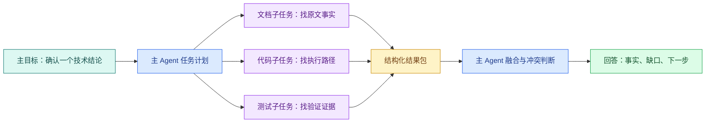

# SubAgent：上下文隔离、任务契约与并行协作

## SubAgent 是什么

SubAgent 是由主 Agent 创建、在限定上下文和工具权限内完成一个子任务的执行单元。它位于主任务编排和具体工具调用之间，用于隔离独立调查、并行处理无依赖工作，并把结果按约定结构交回主 Agent。

“多开几个 Agent”不等于系统就变强。真正需要回答的是：哪些任务可以独立执行，子任务需要看到什么，能使用哪些工具，结果以什么格式返回，主 Agent 怎样合并**冲突**。

本文用一次技术资料核对作例子：主 Agent 需要同时确认文档事实、代码行为和测试证据。三件事可以并行，但它们不应共享一份无限上下文，也不能直接互相修改文件。

## SubAgent 的适用条件

**SubAgent** 是主 Agent 委派出来的独立执行单元。它可以有自己的上下文、工具白名单、预算和结果契约。主 Agent 仍然拥有最终目标和合并责任。

适合委派的任务：

- 输入一次就能说明白；
- 输出字段可以定义和校验；
- 与其他任务共享状态很少；
- 可以并行或需要独立复核；
- 失败后主任务还有可处理的部分结果。

不适合委派的任务：

- 每一步都依赖上一步的未完成状态；
- 多个执行单元要同时改同一个文件；
- 任务需要持续共享大量中间上下文；
- 子任务本身没有可判断的终态。

如果只是把一个固定的三步程序拆给三个子 Agent，增加的可能是调度和合并**成本**。普通函数或工作流更容易测试。

## 三层状态要分开



图中有三种状态：主计划决定委派范围；子 Agent 只处理被授予的子任务；结构化结果包跨越上下文边界回到主 Agent。子 Agent 的内部思考不是主状态，主 Agent 不应依赖无法验证的“我已经想过了”，而要依赖事实、位置、证据强度和缺口字段。

## 任务契约先于并行调用

下面是一份数据模型契约，不绑定具体产品 API：

下面把“任务契约先于并行调用”落成最小实现。代码关注“Subtask 限定子 Agent 能看到和能使用的内容；EvidencePackage 是唯一回传契约”；输入从函数参数或上文定义的状态对象进入，关键分支负责校验或修改状态，返回值再交给后续调用。

```python
# Subtask 限定子 Agent 能看到和能使用的内容；EvidencePackage 是唯一回传契约。
from dataclasses import dataclass
from typing import Literal

@dataclass(frozen=True)
class Subtask:
    task_id: str
    objective: str
    inputs: str
    allowed_tools: tuple[str, ...]
    scope: tuple[str, ...]
    deadline_ms: int
    output: Literal["evidence-package-v1"] = "evidence-package-v1"
# Fact 表示一个可单独核查的事实单元，后续必须为它找到证据或明确拒绝。

@dataclass(frozen=True)
class Fact:
    statement: str
    location: str
    confidence: Literal["direct", "derived", "missing"]
# EvidencePackage 保存可追溯来源、稳定标识和可见范围，供 Claim 绑定与引用校验。

@dataclass(frozen=True)
class EvidencePackage:
    task_id: str
    # status 区分继续执行、答案就绪和需要追问，调用方无需解析回答文本判断终态。
    status: Literal["ok", "no_evidence", "failed"]
    facts: tuple[Fact, ...]
    gaps: tuple[str, ...]
```

`Subtask` 约束输入、工具、范围、截止时间和输出版本；`EvidencePackage` 约束子 Agent 交付的事实与缺口。这里没有放“最终答案”，因为子 Agent 只负责取证，主 Agent 还要比较来源和冲突。

用统一结果版本的好处是：文档、代码和测试子任务可以由不同模型或不同语言执行，主 Agent 只需要验证同一 Schema。若未来增加字段，发布 `evidence-package-v2`，并在合并器中明确兼容策略。

## 上下文隔离的四个边界

### 输入边界

只传完成子任务所需的材料。例如代码核对任务需要文件路径和目标符号，不需要整个用户历史对话。减少上下文不仅节省 Token，也降低无关指令污染。

### 工具边界

文档子 Agent 只读文件和检索工具；代码子 Agent 可以读源码但不应写入；测试子 Agent 可以运行隔离测试但不能连接生产数据库。工具白名单要在运行时执行，不能只写在 Prompt 里。

### 数据范围边界

租户、目录、版本和敏感字段要随任务显式传递或由运行时注入。主 Agent 无权访问的资料，不会因为“交给子 Agent”就绕过 ACL。结果包也要做脱敏，避免把受限正文带回主上下文。

### 时间与成本边界

每个子任务有自己的 Deadline、Token 预算和最大工具调用次数，整轮还有总预算。子任务不应在主任务已经取消后继续运行；合并器需要识别迟到结果。

## 并行与串行的判断

把任务画成依赖图：如果 B 的输入包含 A 的结果，A→B 是串行；如果 A、B 都只依赖同一份只读输入，它们可以并行。

```text
文档事实 ───────┐
代码行为 ────────┼─> 合并冲突 ─> 主答案
测试证据 ───────┘

查询改写 -> 检索 -> 重排 -> 回答
```

上面第一条链的三个节点互不写共享状态，可以并行。第二条链每一步依赖前一步，拆成 SubAgent 只会增加消息传递。并行不是目标，缩短等待或隔离上下文才是目标。

## 一个可读的调度伪代码

下面用 Python `asyncio` 表达调度器，不假设某个产品的 `spawn` API。重点是**并行任务**的结果如何回收和判定。

下面把“一个可读的调度伪代码”落成最小实现。代码关注“三个只读子任务共享同一输入但互不依赖；异常会转成失败结果，而不是丢掉其他证据”；输入从函数参数或上文定义的状态对象进入，关键分支负责校验或修改状态，返回值再交给后续调用。

```python
# 三个只读子任务共享同一输入但互不依赖；异常会转成失败结果，而不是丢掉其他证据。
import asyncio

async def collect_evidence(input_text: str) -> list[EvidencePackage]:
    # 三个只读子任务共享输入，但工具权限和 Token 上限分别写入各自契约。
    tasks = [
        run_subtask(Subtask("docs", "找公开原文事实", input_text, ("docs.read",), (), 1000)),
        run_subtask(Subtask("code", "找执行路径", input_text, ("repo.read",), (), 1000)),
        run_subtask(Subtask("tests", "找验证证据", input_text, ("test.run",), (), 1000)),
    ]
    # 并发等待全部子任务；return_exceptions 保留局部失败，不让一个异常取消其余结果。
    settled = await asyncio.gather(*tasks, return_exceptions=True)
    results: list[EvidencePackage] = []
    for task_id, result in zip(("docs", "code", "tests"), settled, strict=True):
        # 单个子任务失败会转成带 task_id 的失败包，其他子任务结果仍然保留。
        if isinstance(result, Exception):
            results.append(EvidencePackage(task_id, "failed", (), (str(result),)))
        else:
            results.append(result)
    return results
```

`tasks` 只创建三个彼此独立的协程；`asyncio.gather(..., return_exceptions=True)` 不会因为一个子任务失败就丢掉其他结果；成功项原样保留，失败项被转换成有 `status` 和 `gaps` 的结果包。若子任务之间存在输入依赖，应改成串行调用，而不是为了并行而并行。

这段代码是调度示意，实际 `runSubtask` 需要实现权限、Deadline、取消、重试和结果 Schema 校验。若某个子任务返回不是 `EvidencePackage`，合并器应标为契约错误，而不是猜测字段含义。

## 冲突合并需要确定性规则

假设文档写“超时 10 秒”，代码常量是 5 秒，测试断言也是 5 秒。三个子任务都可能正确描述了自己看到的证据。主 Agent 应输出冲突和版本，而不是用多数票挑一个：

```text
事实 A：文档版本 v3 写 10 秒，位置 docs/timeout.md#L18
事实 B：当前代码配置为 5 秒，提交版本 abc123
事实 C：测试在当前代码上断言 5 秒，测试名 timeout_defaults
结论：资料与实现不一致，不能回答“系统当前值是多少”而不说明版本
下一步：确认发布版本或更新文档
```

来源位置、版本和时间让主 Agent 能解释冲突。模型“觉得代码更可信”只是一个假设，不能替代发布状态判断。

## 子任务失败和取消

三种情况要分开：

- `no_evidence`：任务完成，但限定范围内没有找到证据；
- `failed`：工具、网络或执行异常，不能据此推断没有证据；
- `cancelled`：主任务已经不需要结果，子任务停止。

主 Agent 可以在有一个子任务失败时继续整合其余证据，但必须把数据缺口写出来。若用户取消整轮，调度器要取消未完成任务，并忽略稍后抵达的结果。取消后仍完成写操作的子 Agent 属于设计错误，写工具应在委派前单独审批。

## 何时用多个 SubAgent，何时只用一个

| 条件 | 一个 Agent | 多个 SubAgent |
| --- | --- | --- |
| 任务依赖 | 强依赖、顺序明显 | 输入相同、可独立验证 |
| 上下文 | 需要完整对话 | 每个任务只需局部材料 |
| 结果 | 直接可回答 | 需要合并和冲突判断 |
| 延迟 | 任务很短 | 并行能抵消等待 |
| 成本 | 预算紧张 | 质量收益足以覆盖额外调用 |
| 权限 | 同一范围即可 | 需要不同只读工具或范围 |

“子 Agent 越多越高级”是错误认识。先测单 Agent 的错误位置和等待时间，再决定是否隔离。没有**结果契约**的并行只会把混乱变成更多消息。

## 一张 SubAgent 设计检查表

```text
[ ] 主目标和子目标是否明确区分
[ ] 每个子任务是否有输入、范围、工具、Deadline 和输出版本
[ ] 主 Agent 无权访问的资料是否无法被委派绕过
[ ] 子任务是否真的独立，还是被强行并行
[ ] 结果是否包含事实、位置、置信度和缺口
[ ] Promise/调度失败是否保留部分结果
[ ] 冲突是否按来源、版本和时间处理，而非投票
[ ] 取消后是否阻止迟到结果覆盖终态
[ ] 写工具是否有独立审批、幂等和最终状态查询
[ ] 是否有调用次数、Token 和成本上限
```

如果这十项有三项答不出来，先不要增加 SubAgent。把一个 Agent 的输入、输出和失败语义写清楚，通常比增加并行角色更能提升可维护性。


**SubAgent 越多，答案就一定越准确吗？**

不会。增加 SubAgent 只增加独立执行机会，也同时增加上下文、模型调用、工具竞争、取消和结果合并成本。如果所有子任务依赖同一份错误资料，多开实例只会重复错误；如果结果契约不清晰，还会得到无法比较的长文本。先分析单 Agent 的失败位置：只有任务可独立取证、**上下文隔离**能减少污染或并行能明显缩短等待时，拆分才有收益，并要用评测证明质量提升。

**子 Agent 可以继承主 Agent 的全部工具和对话吗？**

技术上某些产品可能默认传递一部分能力，但工程设计不应依赖全量继承。主 Agent 应为子任务构造最小输入、工具白名单、数据范围和 Deadline，避免把无关历史、写权限或敏感资料复制出去。主 Agent 无权访问的数据也不能通过委派绕过。验证时查看子任务实际可用工具和访问日志，并对返回包做脱敏与 Schema 校验，而不是只在 Prompt 里写“请只读”。

**三个子 Agent 给出不同结论，为什么不能少数服从多数？**

它们可能查看了不同版本、不同范围或不同证据类型，多数票无法判断哪一份对应当前发布状态。合并器应比较来源位置、版本、时间、证据强度和适用范围，把冲突显式呈现。例如文档写 10 秒、代码和测试写 5 秒，结论应是资料与实现不一致，而不是自动选 5 秒。只有在预先定义的确定性规则能解决冲突时才合并，否则要求补充发布证据或用户确认。

**一个子任务失败时，主任务应该整体失败吗？**

取决于它是否属于必要证据。调度器应把 `no_evidence`、`failed` 和 `cancelled` 分开，并让 SearchPlan 标记必需与可选子任务。可选文档源失败时，主 Agent 可以使用其余证据，但报告必须保留缺口；权限检查或关键事实源失败时则不能继续给确定结论。`return_exceptions=True` 只帮助保留部分结果，不能自动决定业务是否可降级，这个决定应来自任务契约。

**用户取消后，迟到的 SubAgent 结果怎样处理？**

主 Agent 要向所有运行任务传播取消，子任务在工具边界检查信号并停止；调度器把主任务写入终态后，任何迟到结果都只能记录为审计事件，不能覆盖答案或继续触发工具。已经开始的不可撤销副作用还需幂等键与最终状态查询。测试时模拟一个忽略取消的慢子任务，确认它稍后返回也不会改变主状态，这比只看界面停止加载更可靠。

**哪些任务看似可并行，实际应该串行？**

只要后一步的输入、权限或判断依赖前一步结果，就应串行或分阶段执行。例如先确定知识版本再检索、先生成数据库迁移再修改 Repository、先得到查询计划再分发检索。把它们同时启动会让后续使用过期假设。真正适合并行的是共享同一只读输入、互不修改状态、结果可以独立校验的工作，例如分别核对文档、代码和测试事实。

**怎样限制多个 SubAgent 的 Token 和工具成本？**

为整轮设置总预算，再为每个子任务分配 Deadline、最大模型调用、最大工具次数和结果字节数；调度器扣减同一份总账，重试不能重新获得预算。优先让低成本路由或检索先判断是否已有足够证据，再启动昂贵分支。Trace 中记录每个 task 的输入规模、调用次数、耗时和终态。若并行后总成本上升但等待和错误率没有改善，应减少分支或退回单 Agent。

**SubAgent 的返回结果为什么要版本化？**

主 Agent 依赖字段名称和语义做合并。若子 Agent 悄悄把 `confidence` 从证据强度改成模型自信，旧合并器仍可能解析成功却得出错误结论。结果包版本让生产者与消费者明确协商兼容性；新增可选字段可以兼容，删除字段或改变状态语义则需要新版本和迁移。契约测试应使用不同实现生成同一组样例，确保异常、空证据和冲突都能被稳定解释。
