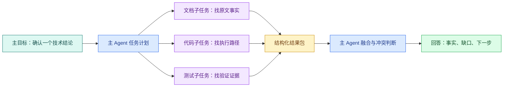

# SubAgent：上下文隔离、任务契约与并行协作

“多开几个 Agent”不等于系统就变强。真正需要回答的是：哪些任务可以独立执行，子任务需要看到什么，能使用哪些工具，结果以什么格式返回，主 Agent 怎样合并冲突。

本文用一次技术资料核对作例子：主 Agent 需要同时确认文档事实、代码行为和测试证据。三件事可以并行，但它们不能共享一份无限上下文，也不能直接互相修改文件。

## SubAgent 解决的不是所有问题

SubAgent 是主 Agent 委派出来的独立执行单元。它可以有自己的上下文、工具白名单、预算和结果契约。主 Agent 仍然拥有最终目标和合并责任。

适合委派的任务：

- 输入一次就能说明白；
- 输出字段可以定义和校验；
- 与其他任务共享状态很少；
- 可以并行或需要独立复核；
- 失败后主任务还有可处理的部分结果。

不适合委派的任务：

- 每一步都依赖上一步的未完成状态；
- 多个执行单元要同时改同一个文件；
- 任务需要持续共享大量中间上下文；
- 子任务本身没有可判断的终态。

如果只是把一个固定的三步程序拆给三个子 Agent，增加的可能是调度和合并成本。普通函数或工作流更容易测试。

## 三层状态要分开



图中有三种状态：主计划决定委派范围；子 Agent 只处理被授予的子任务；结构化结果包跨越上下文边界回到主 Agent。子 Agent 的内部思考不是主状态，主 Agent 不应依赖无法验证的“我已经想过了”，而要依赖事实、位置、证据强度和缺口字段。

## 任务契约先于并行调用

下面是一份子任务契约，不绑定具体产品 API：

```ts
interface Subtask<T> {
  id: string
  objective: string
  inputs: T
  allowedTools: string[]
  scope: string[]
  deadlineMs: number
  output: 'evidence-package-v1'
}

interface EvidencePackage {
  taskId: string
  status: 'ok' | 'no_evidence' | 'failed'
  facts: Array<{
    statement: string
    location: string
    confidence: 'direct' | 'derived' | 'missing'
  }>
  gaps: string[]
}
```

`Subtask` 约束输入、工具、范围、截止时间和输出版本；`EvidencePackage` 约束子 Agent 交付的事实与缺口。这里没有放“最终答案”，因为子 Agent 只负责取证，主 Agent 还要比较来源和冲突。

用统一结果版本的好处是：文档、代码和测试子任务可以由不同模型或不同语言执行，主 Agent 只需要验证同一 Schema。若未来增加字段，发布 `evidence-package-v2`，并在合并器中明确兼容策略。

## 上下文隔离的四个边界

### 输入边界

只传完成子任务所需的材料。例如代码核对任务需要文件路径和目标符号，不需要整个用户历史对话。减少上下文不仅节省 Token，也降低无关指令污染。

### 工具边界

文档子 Agent 只读文件和检索工具；代码子 Agent 可以读源码但不能写；测试子 Agent 可以运行隔离测试但不能连接生产数据库。工具白名单要在运行时执行，不能只写在 Prompt 里。

### 数据范围边界

租户、目录、版本和敏感字段要随任务显式传递或由运行时注入。主 Agent 无权访问的资料，不能因为“交给子 Agent”就绕过 ACL。结果包也要做脱敏，避免把受限正文带回主上下文。

### 时间与成本边界

每个子任务有自己的 Deadline、Token 预算和最大工具调用次数，整轮还有总预算。子任务不能在主任务已经取消后继续运行；合并器需要识别迟到结果。

## 并行与串行的判断

把任务画成依赖图：如果 B 的输入包含 A 的结果，A→B 是串行；如果 A、B 都只依赖同一份只读输入，它们可以并行。

```text
文档事实 ───────┐
代码行为 ────────┼─> 合并冲突 ─> 主答案
测试证据 ───────┘

查询改写 -> 检索 -> 重排 -> 回答
```

上面第一条链的三个节点互不写共享状态，可以并行。第二条链每一步依赖前一步，拆成 SubAgent 只会增加消息传递。并行不是目标，缩短等待或隔离上下文才是目标。

## 一个可读的调度伪代码

下面用普通 TypeScript 表达调度器，不假设某个产品的 `spawn` API。重点是并行任务的结果如何回收和判定。

```ts
async function collectEvidence(input: string): Promise<EvidencePackage[]> {
  const tasks: Array<Promise<EvidencePackage>> = [
    runSubtask({ id: 'docs', objective: '找公开原文事实', inputs: input, allowedTools: ['docs.read'] }),
    runSubtask({ id: 'code', objective: '找执行路径', inputs: input, allowedTools: ['repo.read'] }),
    runSubtask({ id: 'tests', objective: '找验证证据', inputs: input, allowedTools: ['test.run'] }),
  ]

  const settled = await Promise.allSettled(tasks)
  return settled.map((result, index) => {
    if (result.status === 'fulfilled') return result.value
    return {
      taskId: ['docs', 'code', 'tests'][index] ?? 'unknown',
      status: 'failed',
      facts: [],
      gaps: [String(result.reason)],
    }
  })
}
```

`tasks` 只创建三个彼此独立的调用；`Promise.allSettled` 不会因为一个子任务失败就丢掉其他结果；成功项原样保留，失败项被转换成有 `status` 和 `gaps` 的结果包。`Promise.all` 也能并行，但会在首个拒绝时抛出，无法自然保留部分证据。

这段代码是调度示意，实际 `runSubtask` 需要实现权限、Deadline、取消、重试和结果 Schema 校验。若某个子任务返回不是 `EvidencePackage`，合并器应标为契约错误，而不是猜测字段含义。

## 冲突不是让模型投票

假设文档写“超时 10 秒”，代码常量是 5 秒，测试断言也是 5 秒。三个子任务都可能正确描述了自己看到的证据。主 Agent 应输出冲突和版本，而不是用多数票挑一个：

```text
事实 A：文档版本 v3 写 10 秒，位置 docs/timeout.md#L18
事实 B：当前代码配置为 5 秒，提交版本 abc123
事实 C：测试在当前代码上断言 5 秒，测试名 timeout_defaults
结论：资料与实现不一致，不能回答“系统当前值是多少”而不说明版本
下一步：确认发布版本或更新文档
```

来源位置、版本和时间让主 Agent 能解释冲突。模型“觉得代码更可信”只是一个假设，不能替代发布状态判断。

## 子任务失败和取消

三种情况要分开：

- `no_evidence`：任务完成，但限定范围内没有找到证据；
- `failed`：工具、网络或执行异常，不能据此推断没有证据；
- `cancelled`：主任务已经不需要结果，子任务停止。

主 Agent 可以在有一个子任务失败时继续整合其余证据，但必须把数据缺口写出来。若用户取消整轮，调度器要取消未完成任务，并忽略稍后抵达的结果。取消后仍完成写操作的子 Agent 属于设计错误，写工具应在委派前单独审批。

## 何时用多个 SubAgent，何时只用一个

| 条件 | 一个 Agent | 多个 SubAgent |
| --- | --- | --- |
| 任务依赖 | 强依赖、顺序明显 | 输入相同、可独立验证 |
| 上下文 | 需要完整对话 | 每个任务只需局部材料 |
| 结果 | 直接可回答 | 需要合并和冲突判断 |
| 延迟 | 任务很短 | 并行能抵消等待 |
| 成本 | 预算紧张 | 质量收益足以覆盖额外调用 |
| 权限 | 同一范围即可 | 需要不同只读工具或范围 |

“子 Agent 越多越高级”是错误认识。先测单 Agent 的错误位置和等待时间，再决定是否隔离。没有结果契约的并行只会把混乱变成更多消息。

## 一张 SubAgent 设计检查表

```text
[ ] 主目标和子目标是否明确区分
[ ] 每个子任务是否有输入、范围、工具、Deadline 和输出版本
[ ] 主 Agent 无权访问的资料是否无法被委派绕过
[ ] 子任务是否真的独立，还是被强行并行
[ ] 结果是否包含事实、位置、置信度和缺口
[ ] Promise/调度失败是否保留部分结果
[ ] 冲突是否按来源、版本和时间处理，而非投票
[ ] 取消后是否阻止迟到结果覆盖终态
[ ] 写工具是否有独立审批、幂等和最终状态查询
[ ] 是否有调用次数、Token 和成本上限
```

如果这十项有三项答不出来，先不要增加 SubAgent。把一个 Agent 的输入、输出和失败语义写清楚，通常比增加并行角色更能提升可维护性。
