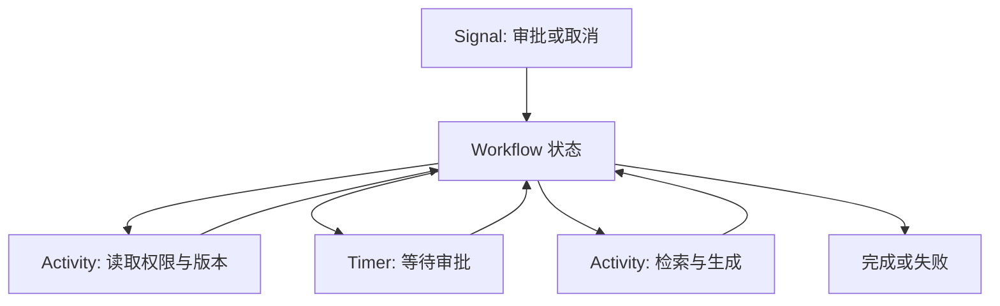
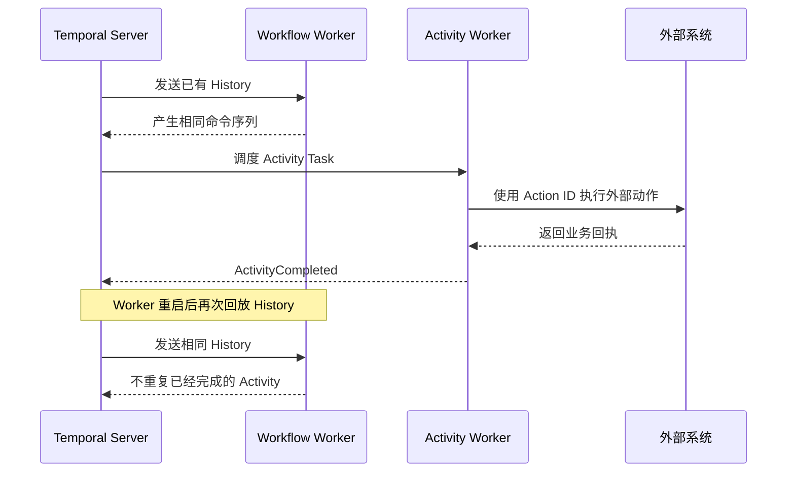

# Temporal 怎样执行可恢复的长流程

一个知识 Agent 需要等待用户审批，随后再运行检索、生成答案和发送通知。等待可能跨越几小时，Worker 可能在中间升级，浏览器也可能完全断线。只在 HTTP 请求里写 `await`，进程退出后就丢掉下一步；只靠 Celery 重投，又要自己保存每个等待点、信号和补偿。

Temporal 把一次长流程拆成两类代码：**Workflow** 描述确定性的控制逻辑，**Activity** 承担网络、数据库、模型和文件等外部动作。Temporal Server 保存事件历史，Worker 可以在另一台机器上根据历史重建 Workflow 内存状态。它解决的是流程状态的持久化与恢复，不会替 Agent 决定答案是否正确，也不会替外部动作提供幂等性。

::: info 四个对象先分开

- **Workflow**：只做可重放的决策，保存流程状态。
- **Activity**：执行不可重放的外部副作用，有自己的超时与重试。
- **Signal**：外部向运行中的 Workflow 发送异步输入，例如取消或审批结果。
- **Query**：读取当前 Workflow 状态，不推进历史。

:::

## 长流程为什么需要持久化控制逻辑

普通队列任务适合“取消息、处理、确认”。当流程只有几个快速步骤时，Turn 状态机和数据库已够用。流程一旦包含长等待、人工信号、定时器、子流程、补偿和跨版本部署，恢复代码会不断增加：暂停时保存什么，重启时从哪里继续，旧版本怎样读取新状态，重复的邮件是否已经发送。

Temporal 将这些控制动作写入事件历史。Workflow 运行到某一步时，SDK 记录输入、Activity 调度、Activity 完成、Timer 触发和 Signal 到达。Worker 失联后，新 Worker 读取历史并重放 Workflow 函数，重放只恢复内存状态，不再次执行已经记录完成的 Activity。

这和普通事件日志有一个差别：事件历史不仅供 UI 重放，也驱动 Workflow 的下一次决策。因而 Workflow 代码必须满足确定性。外部 HTTP、随机数、当前系统时间、线程和不稳定的全局变量不能直接参与决策；它们应放到 Activity，或使用 SDK 提供的可重放时间与 ID 接口。

## Workflow 与 Activity 的边界决定恢复是否安全

Workflow 适合比较状态、选择下一个 Activity、等待 Timer、处理 Signal、判断重试次数和返回最终结果。它不应该打开数据库连接、调用模型、读取环境变量或直接写文件。重放时这些动作会再次发生，结果与历史不一致，甚至产生重复副作用。

Activity 可以访问网络和数据库，但不能假设只运行一次。Worker 在 Activity 完成后、结果写入历史前崩溃，Temporal 可能再次调度它；供应商超时也可能让本地不知道请求是否已到达。每个有副作用的 Activity 都要有 Action ID、下游幂等键或可查询回执。

Activity 的重试不等于 Workflow 重试。网络短暂失败可以重试同一个 Activity；权限撤销、输入非法和不可逆业务拒绝应直接让 Workflow 进入失败或人工处理。重试策略有间隔、最大尝试、总超时和不可重试异常列表，不能把所有异常都自动重做。



图中的箭头回到 Workflow，表示 Activity 的结果要先写入历史，再由 Workflow 决定下一步。Activity 不能自己修改 Workflow 的终态；它返回结构化结果，Workflow 根据当前权限、Deadline 和策略快照判断是否继续。

## 安装 Python SDK 与本地开发服务

Temporal 官方 Python SDK 入口是 [Python SDK developer guide](https://docs.temporal.io/develop/python)，安装说明在 [Python SDK installation](https://docs.temporal.io/develop/python/installation)。只写 Workflow 和 Activity 的 Python 项目可以先安装 SDK：

```bash
python3 -m venv .venv
source .venv/bin/activate
python -m pip install --upgrade pip
python -m pip install temporalio
python -c "import temporalio; print(temporalio.__version__)"
```

<figure class="doc-shot">
  
  <figcaption>Temporal Python SDK 的官方安装页。截图只用于定位安装入口，SDK 版本和兼容要求以页面当前内容为准。</figcaption>
</figure>

本地开发需要 Temporal Server。官方 CLI 文档在 [Temporal CLI](https://docs.temporal.io/cli)，安装 CLI 后可以启动开发服务：

```bash
temporal server start-dev
```

开发服务的端口、Namespace 和持久化方式以当前 CLI 输出为准。它适合验证 Worker、Workflow 和 Activity 的调用顺序，不代表生产集群的备份、权限、可用区和升级配置。

Python Worker 的骨架如下，代码只展示组件关系：

```python
from temporalio.client import Client
from temporalio.worker import Worker

async def run_worker() -> None:
    client = await Client.connect("localhost:7233", namespace="default")
    worker = Worker(
        client,
        task_queue="knowledge-agent",
        workflows=[KnowledgeWorkflow],
        activities=[load_context, run_retrieval, publish_answer],
    )
    await worker.run()
```

Worker 进程只注册已审核的 Workflow 和 Activity。Task Queue 名称是交付路由，不是权限边界；Activity 内部仍要验证用户范围、Release、Policy 和 Deadline。把模型 API Key 放在 Workflow 输入或事件历史里，会让历史和 UI 暴露凭证，凭证应由 Activity 运行环境读取。

## 事件历史怎样驱动确定性重放



Workflow Worker 根据历史重建控制状态，Activity Worker 才接触网络、数据库和其他外部副作用。两者都可能重新收到任务，但只有 Activity 需要用 Action ID 和业务回执抵御重复执行。

第一次执行 `KnowledgeWorkflow` 时，Workflow 调度 `load_context`，历史记录 ActivityScheduled。Activity 完成后写入 ActivityCompleted，Workflow 继续执行并调度 `run_retrieval`。如果 Worker 此时退出，新 Worker 从头运行 Python 函数，但 SDK 在遇到已经存在的历史命令时返回历史结果，不重新调用 Activity。

Workflow 的每个分支都必须由输入和历史决定。用 `datetime.now()` 判断是否超时，会让第一次运行和重放看到不同时间；用随机数选择检索策略，会让新 Worker 走另一分支。应让时间和随机 ID 通过 SDK 的可重放接口产生，或者把选择放在 Activity 并把结果写入历史。

代码重放检查会发现许多隐蔽问题：修改 Activity 名称、改变调用顺序、在条件前插入一个新的 Timer，都可能让旧历史无法匹配。日志打印、指标上报和纯内存缓存可以存在于 Workflow，但它们不能改变返回值、调用数量或分支。

Workflow 状态不是数据库的替代品。历史适合恢复控制逻辑，业务查询、权限撤销、答案引用和大文档仍存放在业务数据库或对象存储。Activity 每次读取时使用 Workflow 固定的 Release 与 Policy 版本，不能在重放时悄悄取“最新版本”。

事件历史记录的是 Workflow 命令和结果，不是每一次 Python 函数执行的日志。第一次运行可能先产生 `ActivityScheduled`，几秒后才有 `ActivityCompleted`；重放时 SDK 读取这两条历史，直接把完成结果交给 Workflow。Workflow 代码必须继续发出同样的调度命令，事件类型、顺序和参数边界才能匹配。

历史里的 Payload 需要控制体积。问题全文、检索文档和模型原始响应放入历史，会拖慢每次重放并增加保留成本。Workflow 输入只保留稳定 ID、版本、范围和必要摘要，Activity 结果保存受控引用；下次 Activity 根据引用读取正文，并再次检查当前用户是否仍有权限。

Workflow 失败时，历史保留了最后一个可解释的命令边界。若错误发生在 Workflow 代码，重放会立即复现；若错误发生在 Activity，历史会显示调度、超时和重试次数。排障先确认错误属于哪一类，再选择修复代码、补偿外部动作或让新 Run 接管，不能通过删除历史掩盖问题。

重放是恢复机制，也是发布门禁。发布前用代表性的旧历史在新 Worker 上运行，检查每个历史事件都能被消费；对新增分支使用版本标记或新 Task Queue。只跑新输入无法发现旧历史在条件分支、Timer 和 Signal 处理上的不兼容。

Workflow Task 与 Activity Task 的失败位置也不同。Server 把历史变更交给 Workflow Worker，Worker 只需重放并产生下一批命令；Workflow Task 失败时可以重新从历史调度，不应重复外部动作。Activity Task 则由执行 Activity 的 Worker 领取，超时、心跳丢失或进程终止后按 Activity Retry Policy 再调度。两类任务都可能重复交付，只有 Activity 直接接触外部副作用。

Workflow Task 队列积压时，流程状态不会因为客户端 Query 而改变，Signal 会先进入历史，等待 Worker 消费。Activity 队列积压时，Workflow 已经记录调度但还拿不到结果。监控要区分两条队列，否则只看到“Workflow 运行中”却不知道是控制逻辑没有 Worker，还是外部动作没有容量。

Activity 结果经过 Payload Codec 或 Data Converter 序列化后进入历史。加密和压缩可以减少暴露与体积，但密钥轮换、旧历史解码和错误数据仍要测试。把用户问题、检索片段和模型原文全部写入历史，会让拥有 Temporal 运维权限的人看到超出业务范围的内容。更稳妥的做法是写稳定对象引用、摘要与哈希，Activity 读取正文时再次检查 ACL。

事件历史的保留与业务删除也要对齐。用户要求删除知识文档时，业务对象可以立即失效；历史里留下的引用 ID 仍可能属于审计记录，显示接口应隐藏正文。Temporal Server 的历史删除、归档和保留策略以部署能力为准，不能用业务表的删除语句假设历史已经消失。

## Timer、Signal 和 Query 处理长等待

Timer 把“等到某个时刻再继续”写进历史。Worker 可以完全退出，时间到达后 Server 再把 Workflow 放回任务队列。不要让 Worker 线程睡眠数小时，也不要用外部 Cron 直接发一个可能重复的消息；外部 Cron 如果存在，应该发送带幂等 ID 的 Signal。

Signal 是异步输入。审批结果、用户取消和管理员暂停都可以作为 Signal 写入 Workflow；Workflow 在下一个安全点读取状态并决定是否停止。Signal 到达时，正在运行的 Activity 不会凭空被撤销，取消传播与 Activity Cancellation 配置仍需要单独处理。

Query 只读取当前内存状态，不写事件、不推进 Activity，适合页面查看阶段、剩余预算和是否等待审批。Query 不是数据库事务快照，也不应返回未授权的上下文。服务端对 Query 请求重新做 Workflow 归属与业务权限检查。

Signal 和 Query 的并发顺序由历史决定。取消 Signal 可能和 Activity 完成同时到达，Workflow 通过明确的状态机选择“已完成”还是“取消生效”；不能让两个 Handler 直接各自写数据库抢终态。终态写入由一个确定性分支负责，重复 Signal 只产生一次状态变化。

启动 Workflow 时还要选择 Workflow ID 冲突策略。重复的业务请求可以复用已有运行、拒绝新请求，或在旧流程结束后排队启动；策略由业务 Idempotency Key 决定，不由客户端猜。Signal 也需要请求 ID，Workflow 在历史或状态中记录已处理的信号，重复投递只返回原处理结果。

有些 SDK 提供 Update 这类需要确认结果的同步输入，它比 Signal 更适合校验后立即返回，但仍然由 Workflow 代码串行处理。Query 适合读取，不应被用来写“已取消”或触发 Activity。无论使用 Signal 还是 Update，API 层都要先验证用户对 Workflow ID 对应 Turn 的权限，Handler 内再检查当前阶段是否接受该命令。

审批内容只保存必要字段和版本。原始表单放在业务存储，Workflow 历史记录审批 ID、决定和时间；后续 Activity 读取表单时重新检查是否撤回。这样既能重放控制逻辑，也不会让所有拥有历史读取权限的运维人员看到用户提交的完整材料。

## Retry、Timeout 与取消传播

Activity 至少设置 Start-to-Close Timeout，跨长排队的任务还要设置 Schedule-to-Start Timeout，心跳型长 Activity 可以配置 Heartbeat Timeout。不同 Timeout 暴露不同责任：任务未被 Worker 领取、领取后执行太久、或 Worker 长时间没有进度，排障入口不同。

Workflow 总 Deadline 包含等待 Timer、Activity Retry 和人工审批。Activity 的单次超时可以重试，但剩余 Workflow 时间不足时应停止重试。把 Activity 重试次数写在代码常量里而不关联业务 Deadline，容易让流程在用户已经取消后继续消耗模型。

取消 Workflow 时先请求 Activity Cancellation。可取消的 HTTP、数据库和模型调用在安全点结束；不可取消的外部请求可能继续运行，Activity 需要用 Action ID 记录结果。Workflow 收到取消后形成 Cancelled 或 Compensating 状态，补偿动作也要有独立幂等键。

补偿不是事务回滚。邮件已经发送不能撤回，工单已经创建只能调用关闭接口或人工处理。补偿失败要留在可观察状态，不能因为主流程取消就假装所有副作用都消失。

## Activity Heartbeat 与 Task Queue 负责另一种恢复

短 Activity 可以等待返回，长解析、批量 Embedding 和浏览器操作则需要 Heartbeat。Activity 在安全点发送进度与可恢复详情，Server 用 Heartbeat Timeout 判断 Worker 是否还活着。Heartbeat 不是 Workflow 事件，也不是对用户发送的进度；敏感正文和大对象仍应留在受控存储。

Worker 在 Heartbeat 超时后可能重新调度 Activity。Activity 从 Heartbeat Details 或自己的 Checkpoint 恢复时，要先确认 Action ID、输入版本和外部回执。Checkpoint 只保存已完成的块，不能把“正在写入对象存储”的半个块当成完成，否则重试会遗漏内容或产生重复索引。

Task Queue 是 Workflow 和 Activity 的路由。高延迟模型 Activity 可以放在独立队列，OCR、检索和通知按资源池分开运行。Workflow 任务本身也需要有可用 Worker，否则 Activity 即使执行完，控制逻辑仍然没有机会消费结果。队列隔离能改善资源分配，却不替代用户、租户和模型并发准入。

Schedule-to-Start Timeout 过期说明没有 Worker 在规定时间内领取，不等于 Activity 代码失败；Start-to-Close Timeout 过期说明已领取但执行超时；Heartbeat Timeout 说明长任务没有进度。三种超时写入不同错误类，重试和告警才能对应到容量、代码或外部依赖。

Worker 关闭时先停止领取新任务，再让当前 Activity 在时间窗口内结束或取消。强制 Kill 后，Server 会按超时和重试策略重新调度，但外部动作可能已经发生。部署排空、Heartbeat、Action ID 和下游回执要一起验证，单独查看 Worker 进程是否退出没有意义。

## Workflow ID、Run ID 与 Continue-As-New

Workflow ID 表示业务上同一个长期流程，Run ID 表示某次具体执行。Continue-As-New 结束当前 Run，使用新的 Run ID 和精简输入开始下一段历史，Workflow ID 保持不变。它适合长期对话、周期同步和历史快到上限的流程。

Continue-As-New 前要把下一段所需的状态压缩成明确输入：当前阶段、未完成 Action、版本快照、预算和必要的引用 ID。不能把完整对话或所有 Activity 结果无限复制到新 Run。前一 Run 的终态语义也要定义，外部查询按 Workflow ID 看到的是当前 Run 还是完整链路。

Child Workflow 适合有独立生命周期、权限和重试策略的子任务。并行检索可以用多个 Activity，未必需要多个 Child Workflow；过度拆分会增加历史、信号和运维对象。选择边界看是否需要独立取消、超时、版本和结果契约。

## 版本演进必须保护旧历史

Workflow 历史会在代码升级后继续被重放。直接改变分支、Activity 名称或参数结构，旧 Run 可能在新 Worker 上得到不同命令序列。官方提供版本管理和 Worker Versioning 等机制，具体 API 随 SDK 版本变化，实施时应以当前 [Workflow versioning](https://docs.temporal.io/develop/python/versioning) 文档为准。

版本切换先让新代码兼容旧历史，再让新 Run 使用新分支。旧分支排空后才能删除。新字段放入可选输入并给安全缺省值，旧字段移除前要完成历史迁移或 Continue-As-New。Activity 版本也需要路由或兼容适配，不能只升级 Workflow 文件。

部署回滚时，新历史可能已经写入新事件。回滚版本至少要能读取这些事件，或在发布前用 Worker Versioning 把新 Run 隔离到新 Worker。只验证“新代码能启动”不够，要回放一批旧历史、运行新历史，再模拟 Worker 在每个 Activity 边界退出。

## Namespace、Task Queue 与业务权限不是一回事

Namespace 用来隔离 Temporal 的工作流、历史和运维配置，Task Queue 用来把任务交给一组 Worker。它们能减少不同环境或团队之间的误消费，但不等于业务 ACL。用户请求某个知识库前，API 和 Activity 仍要验证用户、租户、文档范围、Release 和 Policy；Workflow 输入中的 `user_id` 只是快照，不是授权证明。

Temporal 的可见性查询适合按 Workflow ID、状态、时间和 Search Attribute 找运行记录，便于运维列出超时或等待审批的流程。它不是面向用户的答案接口，也不保证包含完整事件 Payload。对外状态接口读取业务投影，必要时再用 Temporal ID 关联历史。

一个 Workflow ID 的启动策略要明确：拒绝同 ID 的并发启动、复用已完成流程、还是允许新 Run。知识问答通常用业务 Idempotency Key 把重复提交映射到同一 Turn，再由 Workflow ID 或外部映射决定是否复用。不要让客户端随意生成可猜的 Workflow ID 并借此读取别人的 Query。

Namespace 和 Task Queue 的名称、连接地址、API Key、证书与 Worker 版本都进入部署配置。开发服务可以使用本地默认 Namespace，生产要单独设置权限和网络边界。把开发 Worker 连接到生产 Task Queue，会让测试 Activity 处理真实任务，发布门禁应检查队列和 Namespace 是否匹配。

## 用最小实现观察重放与 Signal

下面的示例不连接 Temporal Server，它用事件列表模拟 Workflow 历史，用 Action Ledger 模拟 Activity 的幂等回执。示例只证明相同历史得到相同状态，以及取消和重试不会重复副作用。

<<< ../../examples/ai-agent/temporal_workflow.py

第一次执行把 `activity.completed` 写入历史后崩溃，第二次重放读取同一结果，Action Ledger 的执行次数仍为一次。取消 Signal 进入历史后，Workflow 在下一步停止，不再调度生成答案。Continue-As-New 把未完成状态带入新历史，旧历史不再增长。

运行测试：

```bash
PYTHONDONTWRITEBYTECODE=1 PYTHONPATH=examples/ai-agent \
  python3 -m unittest examples/ai-agent/tests/test_temporal_workflow.py
```

## 沿一次审批、检索和恢复推演

Workflow ID 是 `knowledge:42`，第一次 Run ID 是 `run:a`。历史先写入 `workflow.started` 和 `approval.waiting`，Workflow 进入等待。用户在浏览器断线，不影响 Server 保存的 Timer 和等待状态。

审批 Signal 到达后，Workflow 读取权限快照仍然有效，调度 `retrieve` Activity。Activity 使用 Action ID `knowledge:42:retrieve:1` 查询知识库，写入候选引用并返回。模型生成 Activity 随后开始，Worker 在收到模型响应后、写入 ActivityCompleted 前退出。

新 Worker 取得 `run:a` 的任务，按历史重放到模型 Activity。Server 历史里没有 ActivityCompleted，因此它重新调度 Activity；Action Ledger 或模型调用层按 Action ID 查询已有回执。若响应已经生成但回执丢失，结果进入 Unknown，Workflow 等待人工或补偿，不偷偷生成第二份答案。

答案验证成功后，Workflow 写入 `answer.completed`，发送通知 Activity，再返回终态。若验证失败，有限修复可以重新调度一个有独立 Attempt 的 Activity；超过预算则写 `answer.refused`。页面通过 Query 或 SSE 查询 Workflow 状态，浏览器连接是否存在不影响流程。

| 时刻 | 历史事件 | Workflow 状态 | 外部动作 |
| --- | --- | --- | --- |
| T1 | `approval.waiting` | 等待 Signal | 无 |
| T2 | `approval.accepted` | 准备检索 | 无 |
| T3 | `activity.scheduled` | 等待检索 | 查询知识库 |
| T4 | `activity.completed` | 准备生成 | 已有引用 |
| T5 | Worker 退出 | 等待生成完成 | 回执可能未知 |
| T6 | 新 Worker 重放 | 恢复 Run | 按 Action ID 查询 |
| T7 | `answer.completed` | 完成 | 发送通知 |

这条推演里，Temporal 能恢复控制状态，却不能判断外部模型响应是否已经产生。回执、幂等键和 Unknown 状态仍然属于 Activity 与业务系统的职责。

## 失败证据怎样定位到 Workflow 或 Activity

| 现象 | 先看证据 | 责任层 |
| --- | --- | --- |
| 同一步在重放时分支不同 | Workflow History 与代码版本 | Workflow 确定性 |
| Activity 重复创建外部对象 | Action ID 与下游回执 | Activity 幂等 |
| 等待超时没有继续 | Timer、Deadline、Run 状态 | Workflow Timer |
| 取消后仍有网络请求 | Cancellation 日志与请求状态 | Activity 可取消性 |
| 新 Worker 无法读取旧 Run | Replay Error 与版本标记 | 发布兼容 |
| 历史过大、重放变慢 | History 长度、Continue-As-New | 运行策略 |

Workflow 重放错误不能靠重试 Activity 修复，因为控制代码本身已经和历史不一致。Activity 权限拒绝也不能让 Workflow 无限 Retry，错误要带入状态机的停止分支。页面没有更新先查 Query 与历史，再判断 SSE 或轮询交付，不能把 UI 断线归因给 Workflow。

## 测试需要重放历史而不是只测函数返回

Workflow 单元测试构造最小历史，执行两次并比较状态、Activity 命令和 Signal 处理顺序。任何非确定性时间、随机数、环境读取都在测试中固定或替换。重放旧历史时，断言新代码仍产生相同命令。

Activity 测试验证超时、可重试错误、不可重试错误、取消和外部回执未知。调用 Fake 外部服务两次，Action ID 相同时第二次应读旧回执或返回已存在，不得增加副作用计数。

集成测试启动本地 Temporal Server，注册真实 Worker，先在 Activity 完成前终止进程，再启动新 Worker，确认 Workflow 继续。Signal 在 Timer 前后、取消与 Activity 完成同时到达、Continue-As-New 临界点都要覆盖。

版本测试保留一批旧历史，部署新 Worker 回放；再让新 Worker 写入新分支，切回兼容版本读取。若没有真实历史和版本切换证据，不要写“升级可安全回滚”。

## Temporal 与 Celery、数据库状态机怎样取舍

Celery + 数据库适合任务边界清晰、恢复扫描和事件表已经存在的系统。它的组件少，排障可以直接查 Turn、Lease 和 Broker；代价是需要自己实现 Timer、Signal、历史压缩、版本重放和恢复竞态。

Temporal 把这些机制放入持久化工作流运行时，长等待与跨 Worker 恢复更直接；代价是引入 Server、Namespace、Worker 注册、历史存储、版本发布和新的运维指标。Workflow 代码也受确定性重放约束，团队要学习新的测试与部署方式。

固定 DAG 或数据库状态机更容易画出流程，适合步骤少、分支稳定的入库任务；当人工信号、补偿和长时间等待不断增加时，Temporal 的收益才开始超过额外组件。不要因为任务里出现一个模型调用，就自动换成 Workflow。

运行手册需要同时看 Workflow ID、Run ID、History、Activity Attempt、Task Queue、Signal、Timer、版本和业务 Turn。只看 Temporal UI 的“Completed”不能证明答案有证据、权限没有越界，也不能证明外部通知只发了一次。

## 人工操作要有明确的恢复边界

运维可以查询 Workflow、发送经过授权的 Signal、暂停某个 Task Queue 或让 Worker 排空，但不应直接修改历史。手动重试 Activity 前先查 Action ID 和下游回执；外部结果未知时，优先进入人工确认或补偿分支。直接删除 Workflow 可能丢失恢复线索，也不会撤回已经发出的邮件和工单。

恢复扫描与 Temporal 的内置重试也可能同时发现同一个业务故障。外部系统要用 Turn ID、Workflow ID 和 Action ID 做幂等，业务状态以数据库终态为准。若数据库显示 Completed，恢复任务只做收尾；若 Workflow 已 Completed 但数据库事务未提交，补偿程序不能凭“历史完成”伪造业务答案。

Workflow 终态事件和业务终态提交最好通过 Outbox 或可重试的同步步骤关联。Activity 写入答案后进程退出，Workflow 可能已经记录完成而业务库没有提交，下一次对账应查询 Action 回执并补写，或把 Turn 留在 Unknown。反过来业务库已经 Completed，Workflow 重放只应读取快照并结束，不能再次调用通知 Activity。

检索返回数百个证据时，Activity 只把候选 ID、排序版本和对象引用交给 Workflow，正文留在受 ACL 保护的存储。Workflow 需要生成答案时再由 Activity 按固定 Release 读取，读取失败会形成可重试的依赖错误，不会把半截正文写进历史。这样重放只处理稳定的小状态，也便于撤回已删除文档。

生成 Activity 返回的答案还要带 Evidence ID 和 Release ID，Workflow 只把通过验证的结果提交为终态。缺少任一绑定时进入拒答或人工处理，不能因为流程历史完整就直接展示模型文本。

验证结果也要写入审计事件。

可观测性至少关联三条线：Workflow History 的事件序列、Activity 的执行尝试和业务 Trace。Activity 日志保存输入摘要、Action ID、开始结束时间、错误类和回执引用；不保存完整 Prompt、凭证和未授权文档。告警按 Workflow Task 延迟、Activity 队列等待、心跳超时、重试耗尽、Signal 等待和重放错误分别设置，因为处理动作不同。

容量规划要把历史重放成本算进去。大量小 Activity 会增加事件数量和调度开销，单个超大 Activity 又会让失败重试的成本过高。长流程通过批量 Activity、Checkpoint 和 Continue-As-New 控制历史长度；批量大小由外部 API 限制、可接受重试损失和单次超时共同决定。

测试环境不要让开发 Worker 连接共享生产 Namespace。为本地服务设置独立 Task Queue，使用脱敏输入和可回收对象。部署脚本在启动前检查 Namespace、Task Queue、Worker 版本和凭证来源，启动后用无副作用 Workflow 验证 Signal、Query、Timer 与 Activity 路由，完成后清理测试历史。

Temporal 让长流程在 Worker 重启、浏览器断线和等待数小时后仍能恢复，但恢复正确性仍由确定性 Workflow、幂等 Activity、版本策略和业务证据共同决定。下一篇进入生产架构，把 Runtime、队列、事件、检索与安全边界放在一张组件图上。
