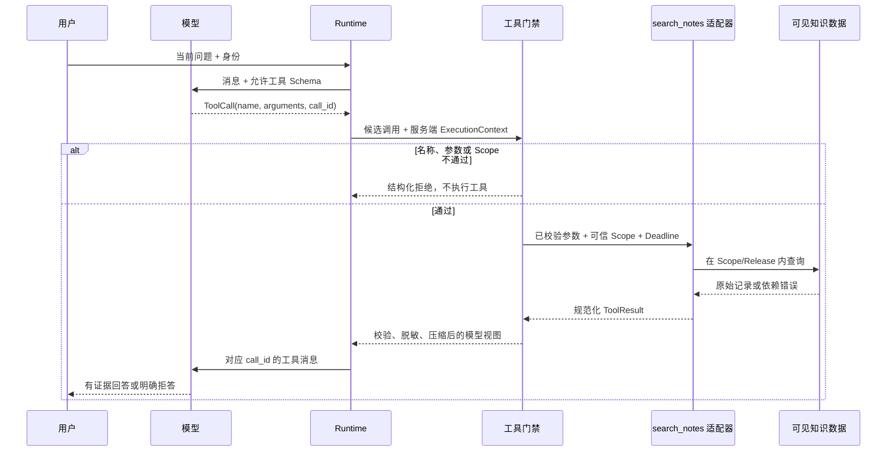

# 不用框架实现 Tool Calling：模型候选、程序执行与结果回传

用户问：“测试环境的回滚步骤是什么？”模型自身不知道当前制度，于是输出一个候选动作：调用 `search_notes`，参数是 `query="回滚步骤"`、`limit=5`。很多入门示例会直接执行这个 JSON，但企业系统还缺少最关键的一半：谁验证工具名，谁提供用户身份和数据范围，超时和取消怎样传播，工具返回的文本能否信任。

Tool Calling 的本质是**模型生成结构化调用建议，应用程序决定是否以及怎样执行**。模型不直接运行函数，也不能授予自己权限。应用把工具说明和 Schema 交给模型，模型选择工具并生成参数，确定性执行器再完成白名单、Schema、Scope、Deadline 和结果校验。

前面建立的 `ModelGateway` 只能收发文字，结构化输出只能约束对象形状。本篇给它们增加第一种外部能力，并建立普通 Python、LangChain Tool 与 MCP Server 都继续遵守的 `search_notes` 契约。

## 先看一次工具调用的四个对象

| 对象 | 谁创建 | 保存什么 | 信任级别 |
| --- | --- | --- | --- |
| `ToolDefinition` | 服务端开发者 | 名称、描述、输入/输出 Schema、只读提示 | 配置可信，仍需版本审查 |
| `ToolCall` | 模型 | 候选工具名、参数、调用 ID | 不可信候选 |
| `ExecutionContext` | 认证与 Runtime | 用户、租户、Scope、Deadline、Trace | 服务端可信状态 |
| `ToolResult` | 工具适配器 | 成功、空结果或错误，以及来源 ID | 外部数据，不可信内容 |

**四个对象的所有权不能混。** `ToolCall` 里不应出现 `tenant_id`、`allowed_scope_ids`、数据库连接或“是否已批准”等可信字段。即使 Schema 隐藏了这些字段，也要在执行器层拒绝额外参数，因为模型或恶意客户端可能绕过 UI 直接构造请求。

**ToolResult 是程序产生的，不代表其中正文可信。** 数据库记录、网页、MCP 返回和错误消息都可能包含过期数据或提示注入。结果进入下一轮模型前还要做 Scope 过滤、结构校验、脱敏和压缩。

## Tool Schema 解决什么，不解决什么

Schema 让模型和程序对输入形状达成约定：哪些字段存在、类型是什么、是否必填、数值范围和枚举是什么。下面是 `search_notes` 的最小 JSON Schema：

下面的 Schema 只允许模型提供查询文本和返回上限。用户身份、Scope、Release 与 Deadline 不属于模型参数，执行器会在 Schema 校验之后从可信请求上下文注入。
```jsonc
{
  "type": "object",
  "properties": {
    "query": {
      // Schema 根节点限定为对象，字符串形式的 JSON 不能直接通过结构校验。
      "type": "string",
      "minLength": 1,
      "maxLength": 200,
      "description": "要查找的知识问题，不包含用户身份或权限范围"
    },
    // limit 控制单次返回上限，Server 还会设置自己的硬上限防止资源滥用。
    "limit": {
      "type": "integer",
      "minimum": 1,
      "maximum": 10,
      "default": 5
    }
  },
  // required 固定缺一不可的字段，避免调用方把缺失值误当默认值。
  "required": ["query"],
  "additionalProperties": false
}
```

应用读取 `properties` 向模型说明两个可控参数，`required` 要求 query 存在，数值和长度限制缩小输入空间，`additionalProperties=false` 拒绝模型私自加入 `tenant_id` 或 `include_private`。输出 Schema 也应固定 `status`、`count`、`items` 和 `source_result_id`。

Schema 不能证明查询内容安全，也不能证明用户有权读结果。`query="导出全部秘密"` 仍然是合法字符串；`limit=5` 也不代表五条结果属于当前用户。Schema 负责结构，认证、授权和业务规则属于后续门禁。

## 描述为什么会影响模型选工具

模型通常根据工具名、description 和参数说明判断是否调用。描述要写任务边界，而不是宣传语：

- 好描述：“在当前用户可见的已发布知识中搜索只读文本；不修改文档；问题与知识无关时不要调用。”
- 差描述：“最强搜索工具，可以解决所有问题。”

过宽描述会让模型在寒暄、计算或已有答案时也调用工具，增加成本和错误面。多个工具描述高度重叠时，应合并能力或明确路由条件。描述只是选择提示，最终工具名仍要通过服务端白名单。

只读提示如 `readOnlyHint` 可以帮助 Host 呈现和决策，但它是声明，不是权限证明。Server 若把写操作错误标成只读，客户端无法仅靠提示发现；审查与沙箱仍然需要。

## 从候选 ToolCall 到 ToolResult 的完整执行链



Runtime 给模型的只是当前允许工具定义。模型返回候选调用后，门禁把它与服务端 `ExecutionContext` 合并；拒绝路径不会进入工具适配器。通过后，适配器在固定 Scope 和知识版本内查询。结果经过规范化、校验、脱敏和压缩，再以相同 `call_id` 回到模型。模型生成最终答案，但回答仍要做证据验证。

`call_id` 用来配对 ToolCall 与 ToolResult。并行调用时不能按返回顺序猜对应关系；超时或取消也要为原调用产生明确终态，避免消息历史留下“等待中的工具”。

## 执行器的门禁顺序为什么重要

一条调用可以依次检查：

1. **工具名白名单**：当前 Agent 和当前请求是否暴露这个工具。
2. **输入 Schema**：字段、类型、长度、范围和额外字段。
3. **领域规则**：空白查询、非法组合和禁止操作。
4. **可信上下文注入**：身份、租户、Scope、Release、Deadline 和 Trace 来自服务端。
5. **准入与预算**：并发槽、Token/调用次数和剩余时间。
6. **执行与取消传播**：给底层 I/O 传剩余 Deadline，保留取消语义。
7. **结果校验**：成功/空/部分/错误，Scope、Schema、脱敏和来源。

先查白名单可以快速拒绝未知能力；先完成 Schema 与领域校验再访问数据库，避免无效请求消耗资源。权限应在查询前限制候选，也要在返回后防御性复查。Deadline 是绝对时间点，重试不能把整轮预算重新计时。

## 错误要用联合类型表达，而不是一条字符串

至少区分：

| 状态 | 例子 | 是否可重试 | 给模型的语义 |
| --- | --- | --- | --- |
| `ok` | 找到两条可见证据 | 否 | 可以继续生成并引用 |
| `empty` | 查询成功但无匹配 | 可改写查询，不是原样重试 | 不能声称制度不存在 |
| `invalid_arguments` | limit 越界 | 否 | 修正参数，计入有限循环 |
| `unknown_tool` | 工具不在白名单 | 否 | 不允许换名字试探 |
| `scope_denied` | 候选范围越权 | 否 | 安全拒绝，不透露对象存在 |
| `timeout` | 依赖超过 Deadline | 仅有剩余预算时有限重试 | 说明依赖未完成 |
| `cancelled` | 用户断开或任务取消 | 否 | 停止后续工具与生成 |
| `dependency_error` | 数据库或远端失败 | 视错误类别 | 不得伪装成 empty |

空结果和依赖失败尤其容易混淆。`[]` 只能表示查询成功且没有匹配；超时返回空数组会让模型错误回答“没有资料”。错误还要保留关联 ID，原始堆栈留在日志，不直接进模型上下文。

## 实现受控执行器

下面的代码无第三方依赖。输入是模型产生的 `ToolCall` 和服务端 `ExecutionContext`；目标是只执行注册的 `search_notes`，拒绝额外字段和越权 Scope，并把正常与空结果规范化。示例 Repository 使用匿名内存数据。

```python
# 模型只能构造 ToolCall；用户身份、可见范围和截止时间由服务端上下文提供。
from __future__ import annotations

import asyncio
from dataclasses import dataclass
from typing import Any, Literal

@dataclass(frozen=True)
class ToolCall:
    call_id: str
    name: str
    arguments: dict[str, Any]

@dataclass(frozen=True)
class ExecutionContext:
    user_id: str
    allowed_scope_ids: frozenset[str]
    deadline_seconds: float

@dataclass(frozen=True)
class ToolOutcome:
    call_id: str
    # status 区分继续执行、答案就绪和需要追问，调用方无需解析回答文本判断终态。
    status: Literal["ok", "empty", "error"]
    code: str
    data: dict[str, Any]

NOTES = (
    {"id": "n1", "scope_id": "public", "title": "回滚", "text": "停止切流并恢复旧版本"},
    {"id": "n2", "scope_id": "team", "title": "内部记录", "text": "仅团队可见"},
)

# 校验函数在数据进入下一阶段前执行，失败时返回稳定错误或直接阻断。
def validate_arguments(arguments: dict[str, Any]) -> tuple[str, int]:
    if set(arguments) - {"query", "limit"}:
        raise ValueError("unexpected tool arguments")
    query = arguments.get("query")
    limit = arguments.get("limit", 5)
    # 去掉首尾空白后仍为空，说明没有可处理输入；在模型或检索调用前直接拒绝。
    if not isinstance(query, str) or not query.strip() or len(query) > 200:
        raise ValueError("query must be a non-empty string up to 200 characters")
    if not isinstance(limit, int) or isinstance(limit, bool) or not 1 <= limit <= 10:
        raise ValueError("limit must be an integer between 1 and 10")
    return query.strip(), limit

# 查询函数只接收业务查询参数；可信 Scope、版本和上限由调用侧一并传入。
async def search_notes(query: str, limit: int, context: ExecutionContext) -> list[dict[str, str]]:
    await asyncio.sleep(0)
    return [
        {"id": note["id"], "title": note["title"], "text": note["text"]}
        for note in NOTES
        if note["scope_id"] in context.allowed_scope_ids
        and query in f"{note['title']} {note['text']}"
    ][:limit]

# 入口函数按固定顺序编排各步骤，具体校验和副作用仍由各自函数负责。
async def execute(call: ToolCall, context: ExecutionContext) -> ToolOutcome:
    if call.name != "search_notes":
        return ToolOutcome(call.call_id, "error", "unknown_tool", {})
    try:
        query, limit = validate_arguments(call.arguments)
        rows = await asyncio.wait_for(
            search_notes(query, limit, context),
            timeout=context.deadline_seconds,
        )
    # 输入未通过结构或业务校验，返回稳定错误后不会执行真正的外部操作。
    except ValueError as exc:
        return ToolOutcome(call.call_id, "error", "invalid_arguments", {"message": str(exc)})
    except TimeoutError:
        return ToolOutcome(call.call_id, "error", "timeout", {})
    except asyncio.CancelledError:
        raise

    status: Literal["ok", "empty"] = "ok" if rows else "empty"
    return ToolOutcome(call.call_id, status, "search_completed", {"items": rows})

# 入口函数按固定顺序编排各步骤，具体校验和副作用仍由各自函数负责。
async def main() -> None:
    context = ExecutionContext("user-7", frozenset({"public"}), 1.0)
    outcome = await execute(
        ToolCall("call-1", "search_notes", {"query": "回滚", "limit": 3}),
        context,
    )
    print(outcome)

asyncio.run(main())
```

代码执行顺序如下：

1. `ToolCall` 只保存模型候选，因此 `arguments` 使用宽泛字典；任何字段都要重新验证。
2. `ExecutionContext` 由服务端创建，Scope 和 Deadline 不出现在模型 Schema 中。
3. `validate_arguments` 先拒绝额外字段，再检查 query 和 limit。Python 的 `bool` 是 `int` 子类，所以需要单独排除，避免 `limit=True` 被当作 1。
4. `search_notes` 在查询表达式中加入 Scope 条件，只返回公开字段。内存 `NOTES` 只是 Repository 的教学替身。
5. `execute` 先检查工具白名单，再校验参数，用 `asyncio.wait_for` 把时间上限传给异步调用。参数错误和超时映射成不同 code；取消重新抛出，让上层停止整条任务。
6. 查询成功后根据 `rows` 区分 ok 和 empty，并保留原 `call_id`。

预期输出包含 `status='ok'`，只返回 `n1`；`n2` 即使正文相关，也因 Scope 不在 `{"public"}` 中被过滤。示例没有数据库事务、真实 Deadline 绝对时间和结果来源对象，它们属于接入 Repository 后的扩展边界。

## 为什么取消不能被 `except Exception` 吞掉

用户关闭页面或上层 Turn 取消时，正在等待数据库、HTTP 或 MCP 的协程应该停止。如果宽泛捕获后返回 `dependency_error`，Worker 可能继续重试、继续生成答案，既浪费资源，也违背用户意图。

取消要从 Runtime 向工具传播，底层库支持取消时直接中止；不支持时至少停止等待并标记结果不可用。清理连接放在 context manager 或 `finally` 中，但清理完成后仍重新抛出取消。取消、超时和依赖错误是三个终态，不能合并。

## ToolResult 怎样安全回到模型

适配器返回后还要：

- 验证结果 Schema，拒绝类型和必填字段错误；
- 防御性检查每条记录仍属于请求 Scope 和 Release；
- 删除密钥、Cookie、内部路径和无关大字段；
- 生成模型视图并标记是否截断、来源 ID 和总数；
- 把外部正文标为不可信资料，不从中读取新的工具白名单；
- 用对应 `call_id` 构造 ToolMessage。

模型可以依据结果决定回答或下一次只读查询，但每次候选动作都重新经过相同门禁。不能因为第一个工具通过，就信任后续模型参数。

## 用 pytest 覆盖七条关键路径

下面的测试直接复用前文实现。测试使用 pytest 和内存数据，不连接真实服务。下面展示四条核心测试，其余三条按表补齐。

为了验证“用 pytest 覆盖七条关键路径”，下面的测试把“每个测试都从模型候选调用进入 execute，并断言执行器返回的稳定业务状态”变成可执行断言。每个用例自己构造输入，并用断言固定返回值或失败状态；某条测试失败时，可以从用例名直接定位到被破坏的契约。

```python
# 每个测试都从模型候选调用进入 execute，并断言执行器返回的稳定业务状态。
import pytest

from tool_executor import ExecutionContext, ToolCall, execute

CTX = ExecutionContext("u", frozenset({"public"}), 1.0)

# 这个用例固定权限边界：越权字段不能进入结果，也不能触达受保护的数据访问。
@pytest.mark.asyncio
async def test_visible_result_is_returned() -> None:
    result = await execute(ToolCall("c1", "search_notes", {"query": "回滚"}), CTX)
    assert result.status == "ok"
    assert [item["id"] for item in result.data["items"]] == ["n1"]

@pytest.mark.asyncio
async def test_unknown_tool_is_not_executed() -> None:
    # 调用执行器走完整工具边界，下面同时检查业务状态、公开数据和错误码。
    result = await execute(ToolCall("c2", "delete_notes", {}), CTX)
    assert result.code == "unknown_tool"

@pytest.mark.asyncio
async def test_model_cannot_add_scope_argument() -> None:
    # 调用执行器走完整工具边界，下面同时检查业务状态、公开数据和错误码。
    result = await execute(
        ToolCall("c3", "search_notes", {"query": "记录", "scope_id": "team"}),
        CTX,
    )
    assert result.code == "invalid_arguments"

@pytest.mark.asyncio
async def test_successful_no_match_is_empty_not_error() -> None:
    result = await execute(ToolCall("c4", "search_notes", {"query": "不存在"}), CTX)
    assert result.status == "empty"
    assert result.data == {"items": []}
```

第一条验证查询和返回都受 Scope 约束；第二条证明未注册写工具不会进入适配器；第三条拒绝模型偷偷加入权限字段；第四条区分成功零结果与错误。还要补：`limit=0` 的参数错误、慢依赖的 timeout、取消任务抛出 `CancelledError`。运行前需安装 `pytest` 与 `pytest-asyncio`，再执行：

```bash
# 退出码为 0 才表示全部契约断言通过；失败时 pytest 会指出具体用例和断言。
python3 -m pytest -q
```

命令先由 Python 启动 pytest，再由 pytest 收集当前文件中的异步用例，`-q` 只压缩进度输出，不会跳过断言。正常结果应显示七条通过，并以退出码 0 结束，适合放进 CI 门禁。

若取消测试返回 `ToolOutcome` 而不是抛出 `CancelledError`，说明执行器吞掉了控制信号；若空结果成为 `error`，Planner 可能进行无意义原样重试；若额外 Scope 字段被接受，权限边界已经交给模型。测试收集失败时先检查 Python 环境和插件，断言失败时再按“参数门禁 -> 执行器 -> 适配器 -> 结果归一化”的顺序定位，不要把所有失败都归因于模型。

## 什么时候不该使用工具

模型已从可信上下文得到确定答案时，不必重复查询；寒暄、格式转换和纯推理任务也不应强行调用知识工具。工具有网络、权限、延迟和失败成本。Router 或工具描述可以减少误调用，Runtime 的调用次数和 Deadline 负责硬停止。

写操作需要更强契约：幂等键、前置读取、用户确认、审批、事务、补偿和审计。不要把本文只读执行器加一个 `delete` 分支就当完成写工具设计。

## 常见问题

### Tool Calling 是模型真的执行了函数吗？

不是。模型只生成一个候选 `ToolCall`，通常包含工具名、调用 ID 和参数。真正查数据库、访问网络或写文件的是应用侧执行器。执行器先用白名单、Schema、身份 Scope、Deadline 和审批规则检查候选，再决定是否调用适配器。日志里应分别记录“模型提出调用”和“系统实际执行”，这样即使恶意文档诱导模型提出删除动作，也能证明实际副作用仍为零。

### 为什么身份、租户和权限范围不能放进工具参数让模型填写？

因为模型看到的是用户文字和外部资料，它生成的字段都属于不可信候选。如果 `tenant_id` 或 `is_admin` 由模型填写，提示注入就可能把权限扩大。可信身份应来自已经认证的连接，数据范围由服务端根据身份计算，并通过 `ExecutionContext` 注入 Repository。工具 Schema 只暴露完成意图所需的业务参数，例如查询词和数量；执行前后还要按同一 Scope 过滤和复核。

### 空结果、工具错误和模型不会回答有什么区别？

空结果表示工具成功执行，只是当前范围内没有匹配数据；工具错误表示依赖、参数、权限或超时使查询没有正常完成；模型不会回答则可能发生在工具之前或答案验证之后。三者对应不同动作：空结果可以改写查询或安全说明未找到，超时只在剩余预算足够时有限重试，权限拒绝不可通过换参数绕过，证据不足则应停止生成确定性结论。把它们都编码成空数组会破坏恢复策略。

### 工具描述写得越长，模型选择就越准确吗？

不一定。有效描述要说明工具处理的对象、适用意图、关键限制和返回结果，避免与其他工具产生重叠；堆入整份业务文档只会占用上下文并增加冲突。可以准备一组“应该调用、无需调用、容易误选”的样本，观察工具选择率与参数错误，而不是凭描述长度判断。若两个工具总被混淆，优先调整职责和名称，而不是继续添加形容词。

### 只读工具为什么仍需要安全边界？

读取也可能泄露受限资料、枚举资源是否存在、拖垮依赖或把恶意正文带回模型。只读工具仍要限制 Scope、条数、字节数、超时和调用频率，返回时删除敏感字段并标记外部正文为不可信数据。尤其不能先按全局 ID 读取完整对象、再在响应阶段过滤，因为日志、缓存或异常栈可能已经暴露越权内容。权限条件应进入真正的数据查询。

### 什么时候可以重试一次工具调用？

只有错误具有暂时性、操作满足幂等边界，并且整轮 Deadline 与调用预算仍有余量时才考虑重试。例如短暂网络错误可以指数退避后再试一次；参数错误应让模型修正参数，权限拒绝和未知工具不应重试；写操作还需要幂等键和最终状态查询。重试次数应记录在同一个调用链中，不能通过重新规划把计数清零，否则 Agent 会形成隐藏的无限循环。
