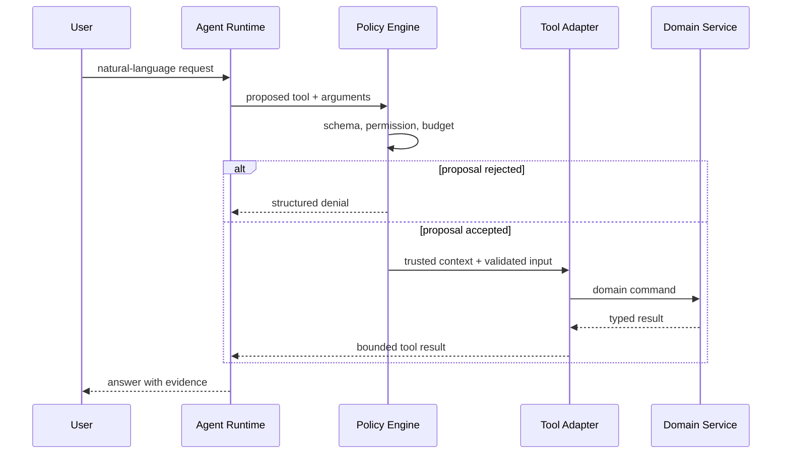

# Tool Calling 与工具契约设计

Tool Calling 不是让模型直接执行函数，而是让模型生成一个**待验证的调用提案**。宿主应用仍然负责候选工具过滤、参数校验、授权、执行、审计和结果裁剪。只要模型能够接触用户输入、网页或文档，就必须假设它可能提出错误、越权或成本失控的调用。

一个生产工具的质量不取决于描述写得多长，而取决于契约能否同时回答五个问题：允许谁调用、输入怎样才合法、重复调用会发生什么、失败如何分类、结果如何被模型安全消费。

## 调用链上的信任边界



模型输出位于信任边界之外。JSON Schema 只能证明数据形状满足约束，不能证明 `tenantId` 属于当前用户、目标记录存在，或者这次删除获得了人工批准。身份、租户、权限和预算必须由服务端上下文注入，不能暴露成模型可自由填写的参数。

## 从领域命令设计工具，而不是包装接口

不好的工具通常只是把 HTTP 接口机械暴露出来，例如 `requestApi(method, url, body)`。它让模型决定协议细节，扩大了 SSRF、越权和误操作空间，也使工具描述无法表达业务语义。

更稳妥的边界是一个工具对应一个清晰意图：

| 工具 | 领域意图 | 副作用 | 默认重试 |
| --- | --- | --- | --- |
| `search_documents` | 在固定可见范围内检索 | 无 | 可重试 |
| `create_draft` | 创建可再次编辑的草稿 | 有、可撤销 | 仅幂等重试 |
| `publish_release` | 发布已经审核的版本 | 高风险 | 不自动重试 |
| `get_task_status` | 查询任务终态 | 无 | 可重试 |

工具数量不是越少越好。一个万能工具虽然节省描述 Token，却会把权限、参数组合和错误语义都压进同一个入口。反过来，把每个数据库字段做成工具也会导致选择困难。合适的粒度通常与可独立授权、独立审计和独立回滚的领域命令一致。

## 输入 Schema 只表达模型应该决定的部分

下面的工具允许模型决定查询文本和返回数量，但不允许模型决定安全范围：

```ts
import { z } from 'zod'

const SearchDocumentsInput = z.object({
  query: z.string().trim().min(2).max(500),
  limit: z.number().int().min(1).max(20).default(8),
  filters: z.object({
    types: z.array(z.enum(['guide', 'spec', 'faq'])).max(3).optional(),
    updatedAfter: z.string().date().optional()
  }).strict().default({})
}).strict()

type TrustedContext = {
  actorId: string
  tenantId: string
  visibleCollectionIds: readonly string[]
  requestId: string
  deadlineAt: number
}
```

`strict()` 会拒绝未声明字段，避免模型偷偷带入 `tenantId` 或管理开关。字符串长度、数组上限和枚举能约束成本，但仍需执行层检查截止时间与当前权限。Schema 描述应该说明单位、边界、默认值和相互关系，而不是只重复字段名。

不要用 `string` 承载所有语义。时间使用带时区的 ISO 8601，金额使用整数最小单位或精确定点字符串，资源状态使用枚举。对互斥字段使用 discriminated union，减少模型猜测非法组合的机会。

```ts
const TimeRange = z.discriminatedUnion('mode', [
  z.object({ mode: z.literal('relative'), minutes: z.number().int().min(1).max(1440) }),
  z.object({ mode: z.literal('absolute'), from: z.string().datetime(), to: z.string().datetime() })
])
```

## 候选工具必须先做确定性过滤

把全部工具描述交给模型再要求“自行遵守权限”是错误顺序。候选集应由宿主在模型推理前按用户权限、租户能力、环境、风险等级和剩余预算过滤。语义检索可以用于从大量低风险工具中挑选相关候选，但权限判断必须是确定性的。

```ts
type ToolDescriptor = {
  name: string
  requiredPermissions: readonly string[]
  risk: 'read' | 'write' | 'irreversible'
  estimatedCost: number
  environments: readonly ('development' | 'production')[]
}

function isAvailable(
  tool: ToolDescriptor,
  permissions: ReadonlySet<string>,
  environment: 'development' | 'production',
  remainingBudget: number
): boolean {
  return tool.environments.includes(environment)
    && tool.requiredPermissions.every((item) => permissions.has(item))
    && tool.estimatedCost <= remainingBudget
}
```

高风险写操作还需要策略引擎返回批准要求，例如 `human_confirmation_required`。确认对象应绑定规范化参数摘要和有效期，防止用户确认 A 后模型把调用改成 B。

## 幂等不是“多调用几次也没关系”

读工具通常可以在超时后重试，写工具则需要明确的幂等语义。调用方生成 `idempotencyKey`，服务端把它与操作类型、主体和规范化参数摘要绑定，并持久化执行状态与结果引用。

```ts
type InvocationRecord = {
  key: string
  actorId: string
  operation: string
  argumentDigest: string
  status: 'running' | 'succeeded' | 'failed'
  resultRef?: string
}

async function executeOnce<T>(record: InvocationRecord, run: () => Promise<T>): Promise<T> {
  const existing = await invocationStore.claim(record)
  if (existing.status === 'succeeded') return resultStore.read<T>(existing.resultRef!)
  if (existing.status === 'running') throw new ToolError('IN_PROGRESS', true)

  try {
    const result = await run()
    await invocationStore.succeed(record.key, result)
    return result
  } catch (error) {
    await invocationStore.fail(record.key, classify(error))
    throw error
  }
}
```

唯一约束或原子 compare-and-set 才能阻止两个实例同时抢到同一个键。把幂等记录放在单进程 `Map` 中无法支持重启和水平扩展。失败是否允许同键重试也要定义：参数错误是终态失败，临时网络错误可以重新执行，结果未知的超时则应先查询原操作状态。

## 统一错误语义

模型不应该看到数据库堆栈、SDK 原始异常或一整页 HTML。适配层把异常转换为稳定错误类型：

```ts
type ToolFailure = {
  code: 'INVALID_ARGUMENT' | 'FORBIDDEN' | 'NOT_FOUND' | 'CONFLICT'
    | 'RATE_LIMITED' | 'DEPENDENCY_UNAVAILABLE' | 'DEADLINE_EXCEEDED'
  message: string
  retryable: boolean
  retryAfterMs?: number
  correlationId: string
}
```

`message` 面向模型解释如何修正，但不能泄露内部对象。`retryable` 由工具定义而非模型猜测。限流返回可接受的等待时间；冲突告诉模型先重新读取；权限拒绝不得通过换一个近义工具绕过。

工具结果同样需要边界。设置最大字节数、最大记录数和允许字段，超长结果写入受控存储并只返回引用。来自网页、文档和第三方 API 的文本仍是不可信内容，应以数据块传给模型，不能拼进系统指令。

## 超时、取消与资源清理

一次 Agent 请求有总截止时间，每个工具只能获得剩余预算的一部分。Node.js 可使用 `AbortSignal` 将取消传到底层 HTTP 客户端；Python 使用取消作用域或显式检查；队列任务则记录取消请求并在安全点停止。

超时不等于执行未发生。写操作若在服务端提交后响应丢失，调用方必须凭幂等键查询状态，而不是直接再次创建。工具还要保证流、临时文件、数据库连接和锁在成功、失败、取消三条路径都释放。

## 验证：契约测试矩阵

工具测试不应只覆盖一个成功示例。以下矩阵可以自动生成参数化测试：

| 场景 | 预期结果 | 需要证明的性质 |
| --- | --- | --- |
| 合法读取 | 返回限量字段 | 基本契约 |
| 未声明字段 | `INVALID_ARGUMENT` | Schema 严格性 |
| 跨范围资源 | `FORBIDDEN` 或统一隐藏 | 权限在查询前生效 |
| 同键并发写入 | 只有一个副作用 | 幂等与原子性 |
| 依赖超时 | 可分类失败并释放资源 | 截止时间传播 |
| 结果超长 | 返回截断或引用 | 上下文预算 |
| 工具文本含指令 | 仅作为数据引用 | 提示注入边界 |

```ts
it('does not execute the same command twice', async () => {
  const execute = vi.fn().mockResolvedValue({ id: 'draft-1' })
  const calls = await Promise.allSettled([
    executeTool({ idempotencyKey: 'call-1' }, execute),
    executeTool({ idempotencyKey: 'call-1' }, execute)
  ])

  expect(execute).toHaveBeenCalledTimes(1)
  expect(calls.some((item) => item.status === 'fulfilled')).toBe(true)
})
```

线上观测至少记录工具名和版本、调用 ID、主体的脱敏标识、参数摘要、状态、耗时、重试次数、结果大小与错误类别。禁止记录令牌、完整正文和未经脱敏的工具结果。

## 常见设计误区

- 认为参数能通过 JSON Schema 就可以执行，忽略对象归属与权限。
- 让模型提供租户、用户、角色或管理开关等可信上下文。
- 将所有 HTTP 能力包装成一个万能请求工具，扩大攻击面。
- 对写操作直接做指数退避重试，却没有幂等键和状态查询。
- 把工具异常原样放回上下文，泄露实现并浪费 Token。
- 只测试模型会不会选中工具，不测试执行层拒绝错误提案的能力。

## 参考资料

- [OpenAI Function Calling](https://developers.openai.com/api/docs/guides/function-calling)：工具定义、调用提案、严格 Schema 与多工具调用的接口语义。
- [JSON Schema 2020-12](https://json-schema.org/draft/2020-12)：对象、组合类型、枚举和验证关键字的规范来源。
- [OWASP Prompt Injection Prevention Cheat Sheet](https://cheatsheetseries.owasp.org/cheatsheets/LLM_Prompt_Injection_Prevention_Cheat_Sheet.html)：不可信内容、工具调用和最小权限的攻击边界。
- [从零开发 MCP 服务：原理到实战](https://juejin.cn/post/7490391876743921704)：我的 MCP 入门实践，可与本系列的生产约束配合阅读。
