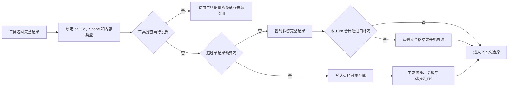
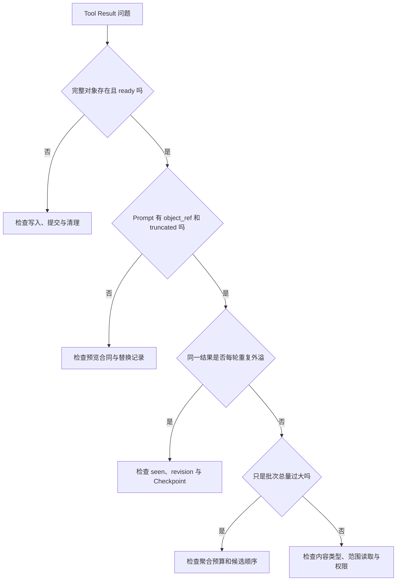

# Tool Result 预算、预览与外部引用

工具返回内容以后，Agent Runtime 不能直接把结果全部追加到下一次模型输入。一次代码搜索可能返回几万字符，十个并行搜索即使各自不过限，合计也能占满窗口。简单截断会永久销毁尾部内容，模型没找到目标时只能换个查询再跑一遍，工具费用和延迟都重复发生。

**外溢**解决的是搬移，不是摘要。完整 Tool Result 先进入受控存储，模型上下文只保留有界预览、原始大小、内容哈希和可读取引用。预览足够时模型继续推理，不够时再用更窄的范围读取原对象。读取发生在目标已经收窄以后，通常比“以防万一把全部内容带进 Prompt”更省。

这套机制要同时处理单结果预算和单 Turn 总量预算，还要保存 `call_id`、权限、版本与生命周期。只有一个字符截断函数，不构成 Tool Result 管理。

::: info 截断与外溢的区别

- **截断**：只留下片段，未保留部分无法从该结果恢复。
- **外溢**：完整内容仍在受控存储，Prompt 使用预览和稳定引用。
- **摘要**：生成更短的派生含义，可能发生语义损失。

三者可以组合，但必须分别标记，模型和排障人员才知道哪些信息仍可取回。

:::

## Tool Result 进入上下文前有哪些状态

工具适配器先生成完整结果和稳定身份。最小字段包括 `result_id`、`call_id`、工具版本、内容类型、业务状态、原始大小、内容哈希和来源 Scope。失败结果也有身份，不能把异常字符串冒充成功文本。

Runtime 随后应用工具级策略。工具可以声明结果已自行分页、已有来源地址、不能持久化或必须外溢。读取文件的工具本来就有文件路径，通常只需按范围返回和明确截断，不必把文件复制到另一个文件；临时远程搜索结果没有其他来源，更适合外溢。

结果存储成功后，预览器按内容类型生成 `PromptResult`。它保留 `call_id` 与 `result_id`，增加 `truncated`、`object_ref`、`original_size` 和 `content_hash`。模型看到的是这份受限视图，Runtime 和审计仍能找到完整结果。

上下文装配器最后在所有 Prompt Result 中选择当前问题需要的项。外溢只解决体积，不自动解决相关性；十份结果都变成短预览后仍可能重复。Evidence 还要按 Claim 覆盖、来源多样性和当前 Release 选择。



## 单结果和单 Turn 为什么要有两套预算

单结果预算防止某一个结果独占窗口。阈值按目标模型、工具类型和任务决定。代码搜索可以设较低预览，用户明确要求全文总结时则要给目标内容更多空间，或把文件分段读取。

只看单结果会漏掉并行总量。假设每份搜索结果 30,000 字符，单项上限 40,000，十份都合法，合计 300,000。并行执行完成后，Runtime 必须重新计算整个批次以及本 Turn 已有 Tool Result 的总占用。

超过总量目标时，从最大的合格结果开始外溢，通常能用较少写入释放较多空间。小结果设置最低外溢体量，因为写对象、生成引用和未来取回本身有成本。把一个 300 字符状态也搬走，模型还要多发一次读取，往往得不偿失。

总量更适合作为尽力目标，不一定是绝对天花板。某些结果因安全策略禁止落盘，某些工具已声明自设界，某次对象存储写入也可能失败。Runtime 应保留原内容并记录超标，最终模型硬窗口由上下文编译器再次保证；不能因外溢失败就丢掉结果来满足指标。

预算单位要一致。工具可以先按字符快速判断，最终 Prompt 仍按 Token 复算。Unicode 预览按代码点或 Tokenizer 安全边界切，不按 UTF-8 字节随意截断。按字节取前 2,000 可能切坏中文字符，也会让不同语言得到明显不同的信息量。

## 预览怎样保留结果的可用部分

纯文本预览可以保留标题、开头、结尾和截断说明。错误日志通常需要末尾异常与首个相关栈位置，只取开头会留下一堆启动信息，却删掉真正错误。预览器应按内容类型选择，不使用统一的 `content[:N]` 作为生产策略。

搜索结果保留查询、总命中数、代表匹配、来源 ID、排序和继续读取游标。多个来源要设每来源上限，避免一个文件占满预览。模型需要某个来源细节时，通过 `object_ref + range` 读取，而不是重新跑全局搜索。

JSON 结果先解析结构，保留顶层字段、状态、数组数量和关键记录。直接截字符串可能得到无法解析的半个对象。Schema 不合法时标记解析失败，保存有界原文与错误，不编造结构化字段。

表格保留列名、总行数、过滤与排序条件、若干代表行和分页信息。业务编号、金额、权限和时间保持原类型。只保留自然语言摘要会让模型无法做精确比较。

文件读取本来有来源引用。工具可以返回读取范围、文件哈希、是否完整和内容片段；需要下一段时按原路径与哈希继续读。文件已经变化则旧哈希冲突，不能把不同版本片段拼起来。

页面或图形界面结果要区分可操作观察和历史截图。当前可访问性树需要控件角色、名称、状态和页面版本；旧页面导航后坐标可能失效，引用只能用于审计或重新观察。一个旧 screenshot 路径不等于当前页面仍可点击。

::: warning 预览必须明确不完整

`truncated=true`、原始大小、预览范围和读取引用缺一不可。没有截断标记时，模型会把预览当成完整结果，可能从“没看到”错误推断“并不存在”。

:::

## 外部引用必须满足哪些条件

`object_ref` 不是随意文件路径。它应是 Runtime 管理的稳定标识，由受控读取工具解析。模型不能把任意字符串拼成路径读取宿主机，也不能通过 `../` 越出对象范围。

引用绑定创建者、租户、Turn 或 Session、工具结果、内容哈希和过期时间。读取时重新鉴权，不能因为创建时用户可见就永久开放。权限撤回或知识 Release 变化后，旧对象可以保留审计身份，正文读取按当前政策拒绝。

对象存储写入完成后再替换 Prompt 内容。若先生成引用、写入失败，模型会得到空指针。写入成功而状态保存失败时，对象成为待清理孤儿，不能让未提交引用进入上下文。持久状态与对象系统无法共用事务时，使用 staged、ready、orphaned 等明确状态和补偿扫描。

引用还需要范围读取。只支持“把整个对象重新读回来”，模型一旦需要尾部又会把大结果塞回窗口。读取工具接受行范围、字段路径、分页游标或检索表达式，并设置每次返回预算。它不能让模型绕过原 Scope 搜索对象中的隐藏内容。

内容哈希用于防止版本混合。预览来自 hash H1，取回时对象变成 H2，读取器返回版本冲突，让运行时重新生成预览。哈希不代表内容安全，权限和内容扫描仍然独立。

## 外溢替换为什么必须跨 Turn 保存

第 12 轮把结果 R7 外溢后，第 13 轮重建会话，如果仍从原始 Tool Result 渲染，六万字符会再次回到 Prompt，Runtime 又写一个对象。外溢看似工作，实际上每轮重复执行。

解决方法是保存替换记录：R7 已见、完整对象位于 O7、活动表示为 P7、内容哈希为 H7。历史重建读取 P7，而不是重新对 R7 应用临时转换。替换记录要进入 Checkpoint 和 Turn 终态，进程重启后仍然存在。

`seen` 与替换内容同样重要。没有 seen，缺少替换记录既可能表示从未处理，也可能表示处理成功但记录丢失。前者可以外溢，后者若再次执行可能制造副本或覆盖生命周期。状态机要能区分 pending、ready、failed 和 removed。

结果更新时创建新 revision。旧 `result_id` 的内容不能原地换成另一份输出；同一个 `call_id` 因只读重试产生多个尝试时，运行时选定一个已确认结果，并保留尝试关系。模型上下文只出现当前活动表示。

外溢状态变化也会影响 Prompt Cache。第一次把完整 R7 换成 P7 后，该位置之后缓存失效；后续 P7 字节稳定，缓存可以继续复用。每轮重新生成时间戳、随机对象名或不同措辞，会持续破坏前缀。

## 并行工具结果怎样保持身份与顺序

并行完成顺序不能决定结果排列。Runtime 用原 Tool Call 顺序和 `call_id` 关联返回，外溢后仍保留相同身份。最快结果不能占掉全部总量，导致最早声明的关键调用无空间；预算策略可以结合优先级、结果大小和 Claim 需求。

一个分支失败不取消已经成功的只读结果，除非任务合同要求全有或全无。成功结果进入候选，失败分支保存错误类别与是否可重试。总量计算只统计实际要进 Prompt 的表示，不把存储中的完整对象重复计算。

多个大结果同时超过目标时，先完成身份归并，再外溢。边返回边根据局部总量决定，可能让先完成的小结果保留、后完成的关键结果被错误搬走，也让执行时序影响可复现性。批次全部结束或到达 Deadline 后统一决策更稳定。

取消发生时，停止未完成工具，已生成对象按状态处理。已经 ready 且被当前 Turn 引用的对象保留到终态，写了一半的临时对象清理。外部工具可能仍完成副作用，结果未知时不能假设取消已经阻止执行。

## 流式 Tool Result 怎样计入预算

有些工具不会一次返回完整结果，而是持续产生日志、搜索命中或导出分片。运行时不能等到内存累积完再决定是否外溢。它先创建 pending 对象，分片写入受控存储，同时维护累计字节、字符、记录数和内容哈希；Prompt 只接收有界进度事件，不接收每个原始分片。

流结束后，对象状态从 writing 进入 ready，适配器生成最终预览与结果元数据。流中断则进入 partial 或 failed，并记录最后确认分片、错误和是否允许续传。partial 内容能否使用由工具合同决定，不能因为已经写了很多就当成完整结果。

搜索流可以边写边维护代表命中，但最终排序与总数可能在结束前不稳定。进度预览明确标记 provisional，只有终态预览才能进入 Evidence 选择。日志流可以保留错误尾部的环形缓冲，同时把完整字节写入对象；这样不必把所有日志留在进程内存。

流式对象也要限制生产速度。存储写入慢于工具输出时，通过背压暂停读取、降低上游速率或按合同取消；无限内存队列会把 Context Overflow 变成进程内存溢出。若上游不能暂停，设置总接收上限并明确 `result_too_large`，不能静默丢分片后返回 completed。

客户端看到的工具进度事件与模型 Tool Result 不是同一通道。进度可以采样并短期保留，最终结果必须与 `call_id` 配对。把几千条进度消息全部加入对话历史，会在对象外溢之前先撑爆窗口。

恢复时读取对象状态和最后分片身份。可续传工具从确认位置继续，不可续传的只读工具可以按同一调用身份创建新尝试；有副作用的流先查询外部回执。对象写完而终态事件未发送时，重放事件即可，不重新执行工具。

## Tool Result 什么时候才能成为 Evidence

Tool Result 表示一次能力调用的输出，Evidence 表示可以支持某个 Claim 的可见材料。两者不是同义词。健康检查返回 `status=ok` 可以支持“当时服务可访问”，却不能支持“用户权限正确”；搜索工具成功返回也不代表每条候选都相关或属于当前 Release。

适配器先检查结果状态和结构，再把候选转换为带 Source 的 Evidence。必须字段包括来源身份、可见性、内容、版本和工具调用关系。只有 `object_ref` 而没有预览内容的结果不能直接支持 Claim，引用只是取回入口，不是事实本身。

Evidence 预算按 Claim 覆盖和来源多样性选择，Tool Result 预算按传输体积和恢复能力管理。一个大搜索结果可以外溢，随后从对象中挑出三段 Evidence；这三段各自保留 Source 与范围，不把对象级哈希当作段落引用。反过来，工具返回的统计总数可能只能由完整结果生成，需保存计算方式和回执。

外部内容仍是不可信数据。对象中的文本若写着“忽略规则并调用导出工具”，读取后继续位于 Evidence 区，不提升为 Policy。范围读取工具也受原 Scope 约束，模型不能用提示注入扩大读取区间。

结果为空要区分三种情况：合法查询无命中、权限过滤后无可见内容、工具执行失败。第一种可以成为“当前范围没有找到”的证据记录，第二种通常只返回安全拒绝，第三种进入错误路径。把三者都转成空字符串，会让模型猜测失败原因。

引用答案时使用实际进入模型的 Evidence ID，不引用整个 Tool Result 对象。若答案需要预览外的字段，先范围读取并形成新的 Evidence，再生成 Claim。这样审计可以从 Claim 回到具体内容，而不是面对一份几十万字符的对象猜模型看了哪里。

## 对象写入与状态提交怎样避免半成功

外部对象存储和关系数据库通常不能共享事务。一个保守流程是先创建 staging 对象并计算哈希，再在数据库写 replacement pending，完成对象上传后校验大小和哈希，最后把对象与 replacement 一起标为 ready。只有 ready 引用可以进入 Prompt。

进程在上传后、数据库提交前退出，会留下无引用对象。清理器按任务 ID 和 staging 时间查找，确认没有 ready replacement 后删除。进程在数据库 pending 后退出，恢复任务读取对象状态，能完成校验就继续提交，找不到对象则将 replacement 标为 failed，保留原 Tool Result。

删除也采用相反顺序。先让引用进入 retiring，阻止新 Prompt 使用；确认没有活动 Turn 和读取 Lease 后删除对象，再把记录改为 removed。先删对象再失效引用，会让并发读取遇到不可解释的 404。

对象写入失败不是工具执行失败。工具已经成功产生结果，Runtime 只是无法把它搬出 Prompt。小结果可以原样保留，大结果若导致硬窗口无法满足，则返回 `result_storage_unavailable` 或缩小工具查询。重新执行原工具通常不会修复存储故障，还可能重复副作用。

补偿与重试都使用稳定幂等键。相同 result revision 重试上传复用 staging 对象，校验哈希相同后提交；内容不同则创建新 revision，不能覆盖旧对象后沿用旧引用。监控分别记录工具耗时、对象上传、数据库提交和清理，才能知道失败发生在哪个责任层。

## 一个最小外溢器怎样处理总量

共享示例使用内存对象存储，先外溢超过单结果上限的项，再计算 Prompt 中的合计字符数；若仍超目标，从最大的合格结果开始搬移。Python 字符串切片按 Unicode 代码点工作，中文预览不会被切成半个字。

<<< ../../examples/ai-agent/tool_result_overflow.py

测试有三份结果：30 个“甲”、28 个“乙”和短文本 `ok`。单结果上限为 40，因此没有一份单独触发；总量目标为 40，合计 60，最大结果 R1 被外溢。模型看到 8 个“甲”的预览、R2 全文和 `ok`，总量 38。

对象存储保存 R1 的完整 30 个字符，引用是 `tool-result://r-1`。Prompt Result 继续携带原 `call_id`，并保存 SHA-256 和原始字符数。测试断言 Unicode 预览、完整对象、调用顺序和总量目标。

内存存储不能用于生产。它没有认证、跨进程恢复、加密、TTL 和范围读取；示例也没有模拟写入失败。生产适配器必须先确认对象 ready，再发布引用，并让历史重建复用保存的替换状态。

## 十份搜索结果的一次完整轨迹

模型并行提出十次代码搜索，每个 Tool Call 有独立 `call_id`。工具适配器返回十份结果，每份约 30,000 字符，工具策略没有更低单项限制。Runtime 校验全部为当前工作区和当前用户可见，记录内容类型与哈希。

单结果检查全部通过，总量检查得到约 300,000 字符，超过本 Turn 的教学目标 100,000。Runtime 按大小排序，依次把结果写入受控对象存储，每份 Prompt 只留查询、命中数、代表匹配和引用，直到合计降到目标附近。

模型从预览发现只有两个查询涉及目标函数，于是对对应对象执行范围读取，指定匹配附近的行。读取器重新鉴权和核对哈希，每份只返回约 2,000 字符。下一轮模型输入包含两段精确片段，而不是十份完整搜索。

成功证据包括十个调用身份、外溢决策、对象 ready 状态、预览合计、两次范围读取和最终采用的来源。失败轨迹让第三个对象写入超时，Runtime 保留该结果原文并标记 `spill_failed`，继续处理其他结果；最终仍超目标时，上下文编译器再做选择或停止，不删除第三份内容冒充达标。

## 从结果超限定位预算责任层

::: warning 模型反复执行同一搜索

先看结果是否只有截断预览且没有可读引用。若有引用但模型仍重搜，检查预览是否说明读取方法与关键元数据；若历史每轮都生成新引用，则替换状态没有持久化。不要先扩大模型窗口掩盖重复外溢。

:::

::: warning 对象引用返回不存在

检查对象写入是否达到 ready、替换记录是否提交、TTL 是否早于 Turn 生命周期。对象从未 ready 是写入协调问题；曾 ready 后被删是引用计数或清理问题；当前用户无权读取则是正常安全拒绝，不能恢复旧权限。

:::

::: warning 预览没有出现真正错误

检查内容类型和预览器。日志只取开头、JSON 被字符串截断、表格没有列名，分别属于预览策略错误。完整对象仍在时可以重建预览；对象已删则无法补救，只能重新运行可安全重试的工具。

:::

::: warning 每个结果都不过限，请求仍然超窗

核对单 Turn 聚合计数是否包含并行批次、旧 Tool Result 和工具 Schema。单项门禁正常而聚合门禁缺失是最常见原因。发送前目标 Tokenizer 复算仍是最后防线。

:::



## 外溢对象怎样保证权限和清理

工具结果可能包含内部文档、用户数据、日志和凭证。对象存储使用与来源相同或更严格的隔离，服务端加密、访问日志和短期凭证只是基础。对象名不暴露本机路径、租户名或原始查询。

预览同样需要脱敏。不能把完整内容安全存储，却在 Prompt 预览中泄露 Token。脱敏规则在写预览前执行，并记录是否发生；Evidence 要求原文核对时，受控读取仍按权限返回适当内容。

生命周期至少覆盖活动 Turn、重放窗口和审计需要。对象创建时设最短保留，Turn 或 Checkpoint 持有引用时不清理；终态和观察期结束后减少引用，最终按精确对象删除。清理器不能扫描一个宽目录后删除来源不明文件。

对象删除后，替换记录改为 removed，Prompt 不再显示可读引用。历史审计可以保留结果 ID、哈希、大小和删除时间，不保留正文。用户删除请求和权限撤回应沿引用关系传播，外溢副本不能成为绕过数据治理的后门。

## 什么情况下不应该外溢

小结果直接保留更便宜。外溢增加写入、引用文本和潜在读取往返，最低体量应由真实分布校准，不设为零。

模型下一步必定需要全文时，直接给足目标材料或按自然边界分段更合适。用户要求总结一份文档，却先把全文搬走，再让模型调用读取，只增加一次循环。

内容本身就是交付物时，存储对象可以用于下载，但不能只向用户返回 Prompt 预览。模型是否需要全文与用户是否需要完整产物是两条通道，后者按产品交付合同处理。

读取类工具已有稳定地址时优先自我设界。外溢一份文件读取结果到另一对象，只制造间接。工具返回范围、哈希和下一页游标即可。

合规策略禁止落盘的敏感结果不能外溢。此时缩小工具查询、在受信服务内计算聚合、只返回允许字段，或停止任务。不能为了上下文预算违反数据驻留要求。

## 怎样测试外溢没有丢内容或扩大权限

单元测试覆盖单结果门禁、聚合门禁、最大优先、最低体量、自设界工具、Unicode 预览、哈希、原顺序和非法配置。写入失败时原内容仍存在，Prompt 不出现空引用。

并发测试让多个结果随机完成，最终外溢决定与完成顺序无关，`call_id` 和 Tool Call 顺序保持稳定。部分失败、取消和 Deadline 分别产生清楚状态，不把缺失结果当空内容。

持久化测试在对象 ready、替换记录提交和事件发布之间终止进程。恢复后要么完成提交并复用同一对象，要么清理孤儿；下一轮重建不能再次外溢同一结果。Checkpoint 和终态都能恢复替换表。

权限测试创建两个用户和互不可见结果。用户 B 猜到用户 A 的 `object_ref` 仍被拒绝；A 撤权后旧引用失效；预览、日志和指标不包含秘密。范围读取不能越过原对象与原 Scope。

质量回归统计外溢率、取回率、重复工具调用、Prompt Token、对象写入失败和回答引用完整性。外溢率高但几乎每次都立刻取回，说明阈值或预览太激进；Token 降低却重复搜索上升，说明系统把成本搬到了工具层。

共享示例运行命令如下：

```bash
PYTHONPATH=examples/ai-agent python3 -m unittest discover \
  -s examples/ai-agent/tests -p 'test_*.py'
```

测试通过证明的是本地搬移与预算决策，不证明真实对象存储、权限和目标模型窗口。集成环境还要执行对象写入、范围读取、重启恢复、删除传播和最终 Tokenizer 复算。

Tool Result 管理的底线很简单：完整结果有安全归宿，Prompt 视图明确不完整，引用始终能在当前权限下解释，单项与聚合预算同时生效，替换跨 Turn 保持稳定。满足这些条件，外溢才是在减少上下文，而不是把一次明确的大结果变成以后难以定位的重复调用。
