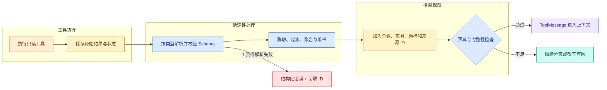

# 工具结果压缩：表格、日志和长文档怎样进入上下文

用户让 Agent 排查“发布任务为什么超时”。日志工具返回 8,000 行，数据库工具返回 300 行任务记录，文档工具又返回一整份操作手册。如果把三个结果原样塞回模型，Token 很快耗尽；如果只取前 1,000 个字符，真正的错误可能在末尾，表格列名和单位也可能被**截断**。

工具结果压缩不是通用的 `text[:1000]`。日志需要聚合错误级别和时间窗口，表格需要保留列名、类型、排序条件和行号，搜索结果需要保留总数与游标，长文档需要保留标题路径和来源定位。共同原则是把**原始结果**与**模型视图**分开：原始结果用于审计和继续读取，模型视图只携带本轮判断所需信息。

模型视图最终替换 `ContextSnapshot` 里的 tool_result Block，保留原 Block ID、`source_result_id`、Scope 与 Release；System、history、Evidence 和当前问题不变。这样工具压缩可以单独回归，也不会在生成一个短摘要时顺手改变权限或知识版本。

## 原始结果与模型视图为什么必须分层

一次工具执行至少产生两个对象：

| 对象 | 保存什么 | 主要消费者 | 生命周期 |
| --- | --- | --- | --- |
| `RawToolResult` | 完整数据、状态、错误和元数据 | 审计、**分页**、重试、人工排障 | 按业务保留策略 |
| `ModelToolView` | 任务相关字段、聚合、样本、来源指针 | 本轮模型调用 | 短期上下文 |

**模型视图**不是原始结果的替代品。它可能丢弃信息，所以必须声明 `truncated`、`source_result_id`、过滤条件和覆盖范围。模型如果发现信息不足，可以提出下一次只读分页调用；审计人员也能从 `source_result_id` 回到原始结果。

若系统只保存截断文本，会同时失去两种能力：无法证明回答依据，无法在新问题出现时读取被裁掉部分。若只保存全文并每次发给模型，则成本、延迟和注入面都会扩大。

## 压缩管线的六个阶段



工具先执行并保存原始结果，压缩器随后按结果类型解析。脱敏必须在模型摘要之前完成，否则敏感内容已经进入另一次模型调用。模型视图补上总数、范围、**游标**和来源 ID，再接受预算与完整性检查。正常路径产生 ToolMessage；信息不足时明确分页；工具失败或解析失败则产生结构化错误，不能返回 `status=ok, rows=[]`。

## 截断、采样、聚合和摘要不是一回事

四种操作解决不同问题：

- **截断**限制单字段或总长度，结果稳定，但可能丢掉尾部信息。适合异常堆栈的重复部分，不适合无排序日志的“取前 N 条”。
- **采样**从候选中选代表项。头部、尾部、按错误码分层和蓄水池采样的统计含义不同，必须记录方法。
- **聚合**把多条记录变成计数、分组和时间范围。例如按 `service + error_code` 统计，不改变计数事实。
- **摘要**把结构化结果重新表述成自然语言，适合帮助阅读，但可能无来源新增。它应是最后一层，并保留输入视图 ID。

一份可靠视图通常是“确定性过滤 + 聚合 + 少量样本”，而不是先让模型总结整个原始结果。只有当结构化信息仍然过长，才考虑模型摘要，并用 Eval 检查数字、实体和来源。

## 日志结果应该保留哪些语义

日志工具返回的不只是 `message`。最少还要关心查询范围、时区、过滤条件、总匹配数、错误分组、代表样本、是否截断和下一页游标。

| 字段 | 用途 | 缺失后的误判 |
| --- | --- | --- |
| `time_range` / `timezone` | 说明观察窗口 | 把不同日期的事件混在一起 |
| `filters` | 说明查了哪个服务、级别 | 把“没查到”当“没有发生” |
| `matched_count` | 区分零结果与抽样结果 | 三条样本被当成只有三条错误 |
| `groups` | 观察主要错误码和数量 | 只盯最早一条异常 |
| `samples` | 阅读具体上下文 | 只有计数无法排查 |
| `truncated` / `next_cursor` | 告诉模型还有数据 | 模型误以为视图完整 |
| `source_result_id` | 回查完整结果 | 引用和审计中断 |

日志顺序也有语义。若目标是定位首个错误，要按时间升序保留首个；若目标是看当前状态，要保留尾部；若目标是分析错误分布，要按错误码分层采样。压缩器需要接收任务目标，不能永远取前三条。

## 表格、搜索和长文档为什么不能共用一个压缩器

### 表格

表格必须保留列名、数据类型、单位、排序条件、主键或行号。只输出几行 CSV，模型不知道金额单位，也不知道这些行是 Top 5 还是任意 5 行。数值聚合应由确定性代码完成，并保留原始行范围。

### 搜索结果

搜索视图需要查询、范围、总候选数、当前页、游标、每条结果的标题和来源。只返回正文片段会丢失排序和分页语义。若进行了 ACL 过滤，应记录“过滤发生”，但不能向无权用户泄露被过滤对象详情。

### 长文档

文档压缩应保留标题路径、页码或段落 ID、相邻上下文和版本。删除导航、页眉、脚本是解析；按当前问题选择段落是检索；生成自然语言概述才是摘要。三个阶段不要混成一个黑盒函数。

### 二进制与多媒体

图片、音频和附件不应直接转成随意 Base64 文本塞进 Prompt。模型视图可以包含 OCR、转写、尺寸、媒体类型、校验和与对象 ID；原制品留在对象存储。是否允许模型直接读取多模态输入，由模型能力、权限和预算决定。

## 错误结果不能伪装成空数据

下面三种状态语义完全不同：

三个结果分别表示“成功但没有命中”“只返回了部分数据”和“工具执行失败”。它们必须使用不同状态，否则 Agent 无法判断该回答没有数据、继续翻页还是停止并报告依赖故障。
```jsonc
// ok + matched_count=0 表示工具成功完成，业务上确实没有匹配项。
{ "status": "ok", "matched_count": 0, "items": [] }
// partial 必须携带总数和游标，调用方才能判断是否继续读取。
{ "status": "partial", "matched_count": 83, "items": ["..."], "next_cursor": "c2" }
// error 保留稳定错误码和关联 ID，不能转换成空数组。
{ "status": "error", "error_code": "UPSTREAM_TIMEOUT", "correlation_id": "trace-7" }
```

第一条证明工具成功执行但没有匹配；第二条证明有 83 条，只给了部分；第三条无法证明是否有数据。若超时被压成空数组，Agent 可能回答“没有错误日志”，这比直接承认工具不可用更危险。

错误视图应给模型稳定错误码、可重试性、关联 ID 和允许的下一步。原始堆栈、数据库地址和凭证只留在受控日志。对于部分成功，要说明成功范围和失败范围，避免把半份数据当完整结果。

## 脱敏要发生在压缩和模型摘要之前

截短并不等于脱敏。一个 API Token 即使只保留前 160 字符也可能完整泄露；手机号和 Cookie 也可能藏在日志中。正确顺序是：先识别字段和数据分类，按规则删除或掩码，再聚合和采样，最后才让任何模型读取。

脱敏规则要按结构字段优先，而不是只依赖正则扫最终字符串。对 `authorization`、`cookie`、`password` 等已知字段直接删除；对自由文本再使用检测器补充。日志系统本身也不能记录未脱敏的模型视图。

## 压缩日志结果

下面实现一个确定性日志压缩器，不依赖第三方包。输入是一批已脱敏 `LogRecord`；目标是按错误码聚合、保留每组一条代表样本，并明确总数、截断状态和原始结果 ID。你要观察正常结果与空结果的差别。

```python
# 压缩器按错误类型聚合日志、保留代表样本与原始游标，并显式标记总数和截断状态。
from __future__ import annotations

from collections import Counter
from dataclasses import dataclass
from typing import Literal

@dataclass(frozen=True)
class LogRecord:
    timestamp: str
    level: str
    service: str
    error_code: str | None
    message: str

@dataclass(frozen=True)
class LogSample:
    timestamp: str
    service: str
    error_code: str
    message: str

@dataclass(frozen=True)
class LogModelView:
    # status 区分继续执行、答案就绪和需要追问，调用方无需解析回答文本判断终态。
    status: Literal["ok"]
    source_result_id: str
    matched_count: int
    error_count: int
    groups: tuple[tuple[str, int], ...]
    # 每个错误组只保留一个代表样本，并对消息长度设置硬上限。
    samples: tuple[LogSample, ...]
    truncated: bool

def compress_logs(
    source_result_id: str,
    records: list[LogRecord],
    max_groups: int = 3,
    max_message_chars: int = 120,
) -> LogModelView:
    if max_groups < 1 or max_message_chars < 20:
        raise ValueError("compression limits are invalid")

    # 只保留 ERROR 与 CRITICAL 进入摘要，普通日志数量仍记录在 matched_count。
    errors = [record for record in records if record.level in {"ERROR", "CRITICAL"}]
    counts = Counter(record.error_code or "UNKNOWN" for record in errors)
    # 按次数降序、错误码升序排序后截取预算内分组，输出顺序可以复现。
    top_groups = tuple(sorted(counts.items(), key=lambda item: (-item[1], item[0]))[:max_groups])

    # 每个错误组只保留一个代表样本，并对消息长度设置硬上限。
    samples: list[LogSample] = []
    for error_code, _count in top_groups:
        record = next(
            item for item in errors if (item.error_code or "UNKNOWN") == error_code
        )
        samples.append(
            LogSample(
                timestamp=record.timestamp,
                service=record.service,
                error_code=error_code,
                message=record.message[:max_message_chars],
            )
        )

    return LogModelView(
        status="ok",
        source_result_id=source_result_id,
        matched_count=len(records),
        error_count=len(errors),
        groups=top_groups,
        samples=tuple(samples),
        truncated=len(counts) > max_groups,
    )

records = [
    LogRecord("20:01:00", "ERROR", "worker", "DB_TIMEOUT", "连接池等待超过 3 秒"),
    LogRecord("20:01:02", "INFO", "worker", None, "准备有限重试"),
    LogRecord("20:01:04", "ERROR", "worker", "DB_TIMEOUT", "第二次连接超时"),
    LogRecord("20:01:10", "ERROR", "api", "UPSTREAM_502", "上游返回 502"),
]

print(compress_logs("result-42", records, max_groups=2))
```

代码执行顺序如下：

1. `LogRecord` 表示压缩前的结构化日志；真实系统应在创建它之前完成脱敏。
2. `compress_logs` 先校验上限，防止 `max_groups=0` 产生看似成功的空视图。
3. 函数筛出错误级别，再用 `Counter` 统计错误码。排序使用“数量降序、错误码升序”，保证同一输入结果稳定。
4. 每个 Top 错误组取时间顺序中的第一条代表样本，并限制单条消息长度。
5. 返回对象同时包含所有记录数、错误记录数、分组计数、样本、截断标记和原始结果 ID。

示例有四条记录、三条错误、两个错误组，预期 `matched_count=4`、`error_count=3`，`DB_TIMEOUT` 计数为 2。`truncated=False` 只表示错误组没有超过 `max_groups`，不表示每组所有日志都进入了视图；若业务需要更精确，应增加 `sampled=True` 或每组样本数，避免字段语义含糊。

这个函数没有处理工具执行失败，因为失败不是 `list[LogRecord]`。调用工具的适配器应返回 `ToolSuccess | ToolPartial | ToolFailure` 联合类型，只有 `ToolSuccess` 才进入该压缩器。

## 用 pytest 验证零结果、截断和稳定排序

将代码下面直接执行这段实现。下面测试输入为空结果和四个错误组；目标是确认成功零结果保留 `status=ok`，超过组上限时标记截断，同数量分组按错误码稳定排序。

```python
# 测试区分成功零结果、超限截断和工具失败，并保证相同输入产生稳定摘要顺序。
from tool_compression import LogRecord, compress_logs

def test_successful_empty_result_is_explicit() -> None:
    # 压缩后检查显式计数、截断标记与稳定分组顺序，而不是比较整段文本。
    view = compress_logs("result-empty", [])
    assert view.status == "ok"
    assert view.matched_count == 0
    assert view.error_count == 0
    assert view.source_result_id == "result-empty"

def test_more_groups_than_budget_marks_truncated() -> None:
    records = [
        LogRecord(f"20:00:0{i}", "ERROR", "api", code, code)
        for i, code in enumerate(["D", "C", "B", "A"])
    ]
    # 压缩后检查显式计数、截断标记与稳定分组顺序，而不是比较整段文本。
    view = compress_logs("result-many", records, max_groups=2)
    assert view.truncated is True
    assert view.groups == (("A", 1), ("B", 1))
```

第一条并未模拟上游超时，它只证明“工具成功且零匹配”有明确表示。第二条中四个错误码计数相同，稳定排序选择 A、B，并用 `truncated=True` 告诉模型还有 C、D 未展示。运行命令：

```bash
# pytest 的结构断言确保压缩不会把失败伪装成空成功，也不会丢掉回查指针。
python3 -m pytest -q
```

若空结果丢失 `source_result_id`，审计链会中断；若多组结果没有截断标记，模型可能把 Top 2 当成全部错误类型。
命令执行的是内存数据测试，不读取真实日志。它验证聚合排序和截断状态，却没有覆盖脱敏、对象存储或分页游标；这些能力接入后应增加集成测试，并确认测试失败时输出的是模拟数据与关联 ID，不把原始日志正文打印到 CI。

## 模型如何决定继续分页

模型视图可以告诉 Agent 还有数据，但是否继续读取应由预算与停止条件共同决定。一个只读诊断流程可以规定：当前 Claim 尚无证据且 `next_cursor` 存在时允许再读一页；已经找到明确根因或达到页数、Token、时间上限时停止；不同页的结果按稳定 ID 去重。

不要让模型构造任意游标。游标应是工具返回的不透明值，执行器验证它属于当前 `source_result_id`、用户范围和查询版本。过期游标返回稳定错误，不能悄悄从第一页重新开始并制造重复。

## 用结果 Schema 检查压缩后的可追溯性

为每个工具回答：原始结果存在哪里、模型真正需要哪些字段、怎样表示零结果/部分结果/失败、是否有总数和范围、怎样继续分页、怎样回查来源、在哪一步脱敏、怎样限制单字段和总预算、哪些数值必须由程序聚合。

进一步验证是为一个表格查询设计 `TableModelView`，至少包含列名、类型、单位、排序条件、总行数、所选行号、是否截断和 `source_result_id`。再写一个工具超时用例，证明它返回 `status=error` 而不是空表。完成后，你的 ToolResult 才是可预算、**可追溯**、可分页的上下文数据，而不是一段碰运气的截断字符串。

## 常见问题

### 为什么要同时保留原始 ToolResult 和模型视图？

原始结果是审计、分页、重新压缩和故障判断的事实，模型视图是受 Token、权限和任务约束的投影。若直接覆盖原始结果，摘要遗漏后无法回查；若全部塞给模型，日志和表格会迅速占满窗口。两者通过 source_result_id、Schema 版本和范围关联，模型输出引用模型视图时仍能回到受控原始数据。

### 截断、采样、聚合和摘要应该怎样选择？

截断保留前后固定范围，适合有序文本但可能丢中间异常；采样保留代表记录，适合重复数据；聚合计算计数、分组和分位数，适合表格与日志；摘要表达关系但有生成误差。先按数据结构做确定性聚合与去重，再在必要时摘要，且明确 total、selected、truncated 和排序条件，让模型知道它看到的不是全集。

### 工具超时为什么不能返回空列表？

空列表表示工具正常完成且没有匹配，超时表示系统不知道是否存在结果。把二者合并会让 Agent错误回答“没有资料”，也可能停止本应有限重试的研究。ToolResult 使用成功、empty、error、cancelled 等联合类型，错误包含稳定 code、retryable 和 source ID；模型视图可以缩短错误详情，但不能抹掉状态。

### 表格结果压缩时最少要保留哪些信息？

保留列名、类型、单位、筛选和排序、总行数、所选行号、是否截断、聚合规则与原始结果 ID。只给前十行会让模型误以为总共十行，也无法解释最大值来自何处。高风险统计由确定性代码计算，模型负责解释；需要查看更多时通过受控分页令牌继续，而不是一次提高 limit 到无上限。

### 日志压缩怎样避免把关键异常当成重复噪声？

先按时间、服务、级别、错误码和 Trace ID 结构化，再按错误签名分组，保留每组数量、首次/最后时间和一条脱敏代表样本。对当前请求 Trace 和罕见高严重度错误设置保留规则，不能只按出现频率抽样。压缩后用已知故障样本验证根因链仍可重建，并明确缺失的时间范围。

### 压缩前为什么要先脱敏和权限过滤？

若先把原始敏感结果交给摘要模型，秘密已经越过信任边界，即使最终文本被删除也无法挽回。执行器取得结果后先按当前 Scope 过滤字段和行，再做密钥、个人信息与凭证脱敏，然后才聚合或摘要。缓存键和原始结果存储也要隔离租户；压缩不是安全过滤器。
