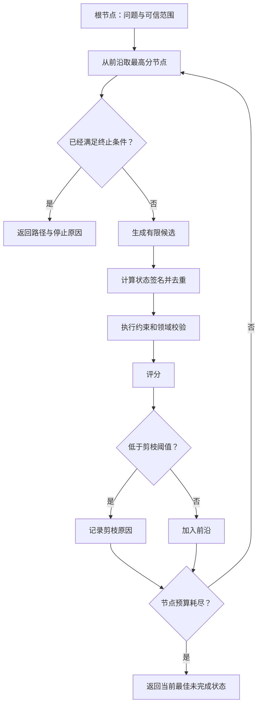

# Tree of Thoughts：候选路径如何搜索

知识 Agent 收到一个问题：“远程访问是否需要二次审批？”检索当前规则是一条路径，查通用手册是另一条路径，旧版本归档里也可能出现同名条款。若系统只沿第一条召回结果继续生成，它很容易把“找到相关文字”当成“已经找到当前有效答案”。

有些任务确实需要试几条路。难点不在于多生成几份文字，而在于怎样保存每条路径的状态、比较它们已经解决了什么、及时放弃无效分支，并在预算耗尽时给出诚实的未完成结果。

::: info Tree of Thoughts 处理什么

**Tree of Thoughts（ToT）** 把若干中间候选视为可搜索状态。控制器生成分支、评估状态、剪掉不合格候选，再选择下一条值得扩展的路径。搜索宽度、深度、节点总数和停止条件由程序控制。

:::

“Thought”在这里是面向任务的候选状态，不代表应用拿到了模型完整的内部思维。它可以是一种解法、一个检索方向、一组已确认事实，或一份尚未完成的方案。只要状态能被比较、验证并继续扩展，就可以进入搜索树。

## 单路径推导为什么会错过可行解

线性推导每次只保留一个后继。前一步选错检索范围、采用旧规则或误判约束，后面的步骤会在错误前提上继续写得很完整。重新生成一次也未必有用，模型可能再次选择同一条高概率路径。

ToT 保留多个候选，让早期选择暂时不必唯一。针对远程访问问题，根节点可以产生四个动作：

- 查当前策略标题并读取正文。
- 从通用手册搜索远程访问说明。
- 查历史归档，核对规则是否发生变化。
- 使用别名再次查询当前策略。

这四个动作并不等价。当前策略可能直接给出审批条件，但还需确认它是不是活动 Release；通用手册有背景说明，未必包含例外条件；历史规则即使文字完整，也不能支持当前答案；别名查询若得到和第一条相同的 Evidence，只是在重复同一状态。

线性推导会较早押注一个方向。ToT 的价值出现在两个条件同时成立时：任务有多个合理后继，并且中间状态可以评估。若无法判断一条路径有没有推进，搜索树只会把模型输出成倍复制。

## 搜索节点保存任务状态

一个节点至少需要稳定 ID、父节点、深度、任务状态、评分和累计成本。真正决定路径是否相同的是任务状态，不能只比较模型生成的句子。

远程访问示例把状态压成几项可检查数据：

| 字段 | 含义 | 为什么需要 |
| --- | --- | --- |
| `action` | 到达当前节点的动作 | 还原路径和调用顺序 |
| `evidence_ids` | 已取得的证据 | 判断答案能引用什么 |
| `missing_facts` | 尚缺的事实 | 衡量是否继续搜索 |
| `inactive_evidence_count` | 旧版本或已撤回证据数量 | 阻止过期材料进入答案 |
| `cost` | 已消耗的搜索单位 | 控制整体预算 |

根节点没有证据，还缺“规则内容、适用条件、活动版本”三项。查到当前策略后，规则内容和条件已经有来源，只缺活动版本；验证 Release 后，缺口为空，节点才成为可交付候选。

父子关系记录路径，状态签名负责去重。两个节点即使动作名不同，只要 Evidence、缺口和版本状态相同，继续扩展得到的信息也不会增加。把这种节点合并，可以避免别名、同义查询和模型改写制造虚假的搜索宽度。

节点还要区分候选文本与可信字段。模型可以建议查询词和下一动作，`scope_ids`、当前 Release、访问权限和 Deadline 由运行时注入。把这些字段放进 Thought 让模型自由改写，会让树搜索绕过原本的安全边界。

## 候选路径怎样被生成和选择

一次搜索循环包含生成、评估、剪枝、选择和停止。下面这张图使用 Best-first 策略，每次从前沿集合取评分最高的节点扩展：



### 生成分支要限制动作空间

分支生成器接收当前状态和允许的动作目录，输出有限候选。它不应该直接执行写操作，也不能自行扩大检索范围。模型可以产生“查当前规则”“核对活动版本”这样的候选，运行时再把动作编译成带权限和超时的命令。

`branching_factor` 限制一个节点最多接纳多少后继。这个值不是越大越好。候选数量增加后，评估调用、去重、持久化和后续扩展都会增加。更重要的是，模型常把同一个方向换几种措辞输出，看似有五个分支，状态签名可能只有两个。

生成器还要说明每个候选增加了什么。如果候选没有新增 Evidence、没有减少缺口，也没有排除一种可能，它通常不值得继续。远程访问示例里的 `search_more_policy_pages` 没改变 Evidence 和缺口，签名与父节点相同，因此被当成重复状态。

### 评估器比较中间状态

评分必须对应任务进度。示例使用三个可观察因素：事实覆盖越高分数越高；非活动证据会扣分；路径成本略作惩罚。它没有根据句子是否包含“因此”“结论”等词加分，因为这些词只能说明文本形状，不能证明任务推进。

评分可以来自确定性规则、启发式函数、模型评审或几者组合。确定性规则适合权限、版本、预算和结构约束；启发式函数便宜，适合估算覆盖和成本；模型评审能比较开放式候选，但输出仍是待校准的判断。

高风险禁用条件不该只变成轻微扣分。旧 Release、越权 Evidence、缺失审批和非法动作应先进入约束检查，直接拒绝或把分数压到剪枝线以下。否则一个语言很流畅的旧规则可能靠其他加分重新排到前面。

### 剪枝减少无效扩展

剪枝有三种常见来源。状态重复时做去重；违反权限、版本或领域不变量时做约束剪枝；评分低于阈值时做质量剪枝。记录中要保留是哪一种，不能只写 `pruned=true`。

质量剪枝最容易误伤。早期节点信息少，评分天然偏低；阈值太高会让树只剩一条路径，退化成成本更高的线性推导。可以按深度设置不同阈值，或在前几层保留最少候选数，再由后续 Evidence 拉开差距。

被剪节点不再扩展，但不必立即删除。保留节点 ID、父节点、分数、原因和状态摘要，才能解释为什么某条路线没有继续。正文、Prompt 和大体积工具结果可以放在受控存储中，Trace 只保存稳定引用。

### Best-first 选择和回溯

Best-first Search 把前沿节点按分数排序，优先扩展当前最有希望的状态。它比广度优先更快集中资源，也比深度优先更容易保留备选路径。代价是评分器的偏差会直接决定搜索顺序。

回溯不是撤销已经产生的外部副作用。这里的回溯是放弃当前候选，从前沿取下一个未扩展节点。搜索动作应尽量只读或可重建；若候选路径触发了真实写操作，控制器必须先查业务回执、执行补偿或停止，不能简单切换父节点假装动作没发生。

搜索找到一个终态后，也不一定立刻交付。终态只表示分支声称“答案完成”或“无法继续”，验证器还要检查 Evidence、计算和输出合同。验证失败时，可以把节点标为无效并继续前沿；预算不够则返回未确认状态。

## 评分器决定了搜索质量

ToT 常被描述成“生成多条思路再选最好的一条”，这句话漏掉了最难的一层：系统凭什么知道哪条更好。评估器若奖励长文本，模型会用更多解释换分；若奖励与问题词汇重合，复制问题就能得高分；若由同一个模型生成并评审，它可能重复自己的偏好。

一个可维护的评估器通常分两层。约束层先检查权限、活动版本、动作白名单、必填 Evidence 和预算，任何一项违反都不能靠其他维度抵消。质量层再比较覆盖、冲突、信息增量、预计后续成本和任务相关性。

以知识问答为例，可以把评分解释成以下组成：

```text
候选分数 = 证据覆盖 + 新信息增量 - 冲突惩罚 - 过期惩罚 - 成本惩罚
```

这不是通用公式。它只是把评估依据写出来，便于测试每一项怎样影响排序。不同任务需要不同状态：数学搜索可检查约束是否满足，代码修复可运行测试，规划问题可比较依赖和资源，开放式写作往往缺少可靠的中间评分，此时不适合为了形式套 ToT。

模型评审要使用结构化标准，让它分别返回缺失事实、冲突、不可验证断言和建议分数。程序先验证这些字段，再决定是否采用分数。评审模型超时或格式错误时，回到确定性基线或停止，不能默认为高分。

评估器也要做回归。准备已知好路径、死路、旧版本材料、语句华丽但无新事实的候选，以及早期分数低但后续可解的路径。只测“最终有没有答案”，看不出剪枝是否越来越偏，也看不出成本是否被重复状态吃掉。

## 深度、宽度和节点预算共同限制成本

假设每个节点最多产生 `b` 个分支，最大深度是 `d`，完整树的节点数可能达到 `1 + b + b² + ... + bᵈ`。真实搜索有剪枝和去重，通常不会遍历完整树，但不能把这件事留给运气。

至少要设置四类上限：

- **最大深度**，限制一条路径能走多少步。
- **分支上限**，控制每次扩展接纳多少候选。
- **节点预算**，约束整个请求最多评估多少状态。
- **绝对 Deadline**，让模型、工具和评估共享同一个截止时间。

节点预算比只限制深度更直接。宽度为四、深度为三时，完整树可能迅速增长；即使最大深度没有触发，节点预算也能提前停止。停止后返回当前最佳节点、仍缺哪些事实和 `budget_exhausted`，不能把未完成路径包装成答案。

Token 预算需要跟节点预算一起分配。生成候选、扩展候选和模型评审都可能调用模型。给每个节点固定完整上下文，会让后面的分支重复支付相同前缀；压缩上下文时又要保留父路径的状态、Evidence 引用和约束，不能只留一段无来源摘要。

并行扩展可以缩短等待，但不会降低总调用量。多个分支共享同一个 Deadline，每个分支还要有稳定 ID。迟到结果只能更新自己的节点，不能覆盖控制器已经选出的终态。

## 一次知识问题的完整搜索轨迹

示例的输入是“远程访问是否需要二次审批”，可信范围和活动 Release 由运行时提供。初始状态缺规则、条件和版本三项。

第一轮生成四个候选。`find_current_policy` 找到当前策略，缺口只剩活动版本；`find_general_handbook` 只覆盖背景规则，还缺条件和版本；`find_archived_policy` 使用了非活动 Evidence；`search_policy_alias` 与第一条状态签名相同。

评分后，当前策略路径最高，通用手册仍留在前沿。归档路径受到非活动证据惩罚，低于阈值后被剪枝；别名路径因状态重复而不进入前沿。

控制器扩展当前策略节点，生成 `verify_active_release`。这个动作取得 `release:active`，缺口变为空，节点成为终态。另一条 `search_more_policy_pages` 没增加证据，也没减少缺口，被签名去重。

最终路径是：

```text
start
└── find_current_policy
    └── verify_active_release
```

输出仍要绑定 `policy:current` 与 `release:active`。如果 Release 验证失败，树不能退回归档策略拼一个答案；它可以继续通用手册路径查找更新材料，或者在节点预算耗尽后返回“当前无法确认活动规则”。

这条轨迹里，输入、状态变化、调用顺序、输出、失败证据和停止原因都能定位。读者看到的不只是“系统探索了几条思路”，而是每个候选为什么保留或淘汰。

## 用 Python 实现一个有界搜索器

共享示例把搜索算法与领域函数分开。`best_first_search` 负责前沿队列、节点预算、去重、剪枝、路径回建和停止原因；`knowledge_search_branches`、`score_knowledge_state` 与 `knowledge_answer_ready` 负责知识问答的状态变化。

<<< ../../examples/ai-agent/thought_search.py

这段代码是**最小控制逻辑**。分支由脚本固定，没有调用真实模型，也没有访问向量库。它能验证搜索器不会重复扩展同一状态、旧证据会被剪枝、最佳路径可以回建，以及节点预算耗尽时不会伪造完成。

运行共享测试：

```bash
PYTHONPATH=examples/ai-agent \
python3 -m unittest discover -s examples/ai-agent/tests -p 'test_*.py'
```

当前执行得到 `Ran 55 tests` 和 `OK`。ToT 新增三项断言：当前策略与活动 Release 组成成功路径；归档证据和重复状态不会继续扩展；节点预算为二时返回 `budget_exhausted`，最佳节点仍保留事实缺口。

真实模型接入后还要增加契约测试。分支生成输出必须符合 Schema，动作只能来自白名单，Evidence ID 必须存在于当前范围。模型评审要用固定候选集做排序回归，并记录模型版本、Prompt 版本和评估配置。

## 搜索失败怎样定位

**分支数量持续增加**，先看状态签名是否真的表达任务进度。只按候选文本哈希去重，同义改写会变成不同节点。补上 Evidence、缺口、版本和领域状态后再比较。

**最优路径总是文字最长的候选**，问题通常在评分器。检查长度、逻辑连接词和模型自报置信度是否被当成质量信号；换成覆盖、验证结果和信息增量，再用对抗样本回归。

**所有分支在第一层被剪掉**，阈值可能过高，也可能根节点缺少生成候选所需的上下文。保留各节点原始分数和剪枝原因，区分“候选无效”与“评估器没有足够材料”。

**搜索很快结束却没有可用答案**，检查终态函数。模型写出“最终结论”不表示任务完成；终态应由缺口、约束和验证结果判断。

**同一工具被多条路径重复调用**，用动作指纹和幂等缓存合并只读请求。涉及外部副作用时不能只靠缓存，要查询业务回执并固定唯一动作 ID。

**恢复后路径顺序改变**，通常是队列排序缺少稳定的并列规则，或节点状态没有完整持久化。评分相同的节点要用深度和稳定 ID 排序，恢复时沿同一版本读取。

**搜索选中了旧规则**，先检查活动 Release 是否属于约束层。如果它只是一个很小的评分项，其他语言质量分可能抵消版本风险。旧版本应直接拒绝或施加强惩罚，并在交付前再次验证。

## 搜索树怎样持久化和恢复

内存列表足以演示算法，长任务却可能跨越进程退出、Worker 重启和用户断线。恢复所需的最小单位不是整段 Prompt，而是节点、前沿和预算三类状态。节点保存父子关系与评分分解；前沿标记哪些节点仍可扩展；预算记录已经评估多少节点、还剩多少时间和调用额度。

节点可以经历 `pending`、`expanding`、`expanded`、`pruned`、`terminal` 和 `failed`。状态迁移要单向进行。一个 Worker 领取 `pending` 节点后先写入租约和尝试号，再执行分支生成；写回候选时核对租约和树版本。租约过期后，另一个 Worker 可以重新领取，迟到的旧尝试不能覆盖新结果。

分支生成若调用外部模型，进程可能在模型返回后、候选写入前退出。恢复任务可以重新调用模型，但生成结果未必逐字相同。需要可重放的场景应保存原始响应引用和解析后的候选；只要求继续完成时，可以在同一 Prompt 与模型版本下重试，同时把尝试号写进 Trace，接受候选顺序可能变化。

只读工具结果适合按动作指纹缓存。指纹至少包含工具名、规范化参数、可信范围和数据版本，不能只哈希查询文本。当前策略和历史策略可能有相同关键词，缺少 Release 的缓存键会把旧结果带入新树。缓存命中后仍要执行可见性检查，因为用户权限可能已经变化。

Checkpoint 应落在稳定边界：当前节点已经完成扩展，所有新节点都写入成功，前沿和累计预算随后原子更新。若节点写入成功、前沿更新失败，恢复器可以从父子关系重建前沿；若只写了一半子节点，则根据扩展尝试号回滚未提交批次或补齐同一批次。不能把半批候选当成完整扩展，否则分支覆盖率会随故障时机变化。

用户取消时，树进入 `cancelling`，控制器不再领取新节点，并向正在执行的模型或工具调用传递取消信号。已经返回的只读结果可以保存为审计材料，但不能让树从已取消状态重新变成运行中。工具不支持取消时，运行时等待回执或超时，记录 `cancel_requested_but_call_in_flight`，而不是宣布资源已经释放。

活动 Release 或权限在搜索中途变化，需要明确一致性策略。要求一次请求使用同一快照时，所有节点继续引用入口版本，交付前确认该版本仍允许服务；要求始终读取最新规则时，版本变化会使已有评分和缓存失效，控制器应创建新树版本或整体停止。让一半节点使用旧规则、一半节点使用新规则，最终分数没有可比性。

恢复后的队列顺序也要可解释。节点分数、深度和稳定 ID 共同决定排序，不能依赖字典遍历或 Worker 完成时间。只要输入快照、候选集合和评分器版本不变，前沿选择就应稳定；模型生成本身存在变化时，则记录随机参数和响应版本，避免把两次不同搜索描述成同一次精确重放。

### 节点写入和答案交付分开

找到终态后，运行时先保存终态节点、路径、Evidence 集合和验证结果，再写树的完成事件。SSE 或页面通知属于交付通道，可以根据事件序号重放。客户端断开不应触发整棵树重新搜索，否则一次问题可能消耗两份预算，并得到两条不同路径。

若终态保存成功而通知失败，重连后直接读取已完成结果；若验证成功但终态没有写入，系统不能对外发送完成消息。这个顺序让“搜索成功”和“用户已经收到”成为两个可观察状态，排障时能区分核心处理失败还是传输失败。

## 怎样证明 ToT 比单路径基线更合适

是否采用 ToT，不能只看一两个看起来聪明的搜索轨迹。评测集要包含真正需要替代路线的任务，也要放入一批单路径就能解决的问题。前一组检查搜索能否救回早期错误，后一组检查系统会不会为简单任务制造无意义分支。

每个样本应标记最终验收条件、允许使用的 Evidence、至少一条可行路径和典型死路。开放任务不一定有唯一答案，但可以记录必须覆盖的约束、禁止引用的版本、需要运行的测试和可接受停止状态。只给一个参考文本，评估器容易奖励措辞相似，无法判断搜索是否真的找到有效路径。

至少比较三条基线：一次模型调用、带公开步骤的单路径推导，以及有相同总 Token 上限的 ToT。总预算必须相同，否则更高质量可能只来自更多模型调用。还要分别报告简单样本和分支样本，平均分会掩盖 ToT 在简单任务上的额外延迟。

结果质量之外，还需要观察搜索行为：

- 可行路径命中率，搜索是否至少访问过一条满足验收条件的路线。
- 错误剪枝率，可行节点是否在到达验证步骤前被淘汰。
- 重复状态比例，预算有多少耗在同义候选和重复工具调用上。
- 终态验证通过率，声称完成的节点有多少真正通过领域检查。
- 节点、Token 与墙钟时间，额外质量付出了多少资源。
- 预算耗尽比例，多少请求只能交付最佳未完成状态。

“最佳节点分数”不能单独当作线上质量指标，因为分数来自正在被评估的同一套规则。最终正确性要由测试、Evidence、人工标注或领域程序确认。评分器只负责控制搜索顺序，评测器负责判断整个系统有没有完成任务，两者若共用同一个模型和 Prompt，偏差会互相放大。

故障注入能验证停止边界。让分支生成器连续返回同一状态，预期重复率上升但节点总数不变；让评估器超时，预期回到确定性评分或停止；撤回一条 Evidence，旧节点应失效；把节点预算降到无法抵达答案，结果必须保留缺口和 `budget_exhausted`；在终态写入后断开客户端，只能重放交付事件。

还要专门测试过度剪枝。选一批早期信息少、经过两步才出现关键 Evidence 的路径，逐步提高阈值，观察可行路径在哪个深度消失。若阈值微调就让命中率剧烈变化，评分器没有稳定区间，生产配置不宜依赖单个固定分数。

上线时先把 ToT 限定在路由器识别出的复杂样本，保留单路径回退。发布比较按模型、Prompt、评分器和搜索配置分组，任何一项变化都可能改变节点排序。回滚除了代码，还要恢复对应配置和缓存命名空间，避免旧控制器读取新评分产生的前沿。

真实 Trace 最终应该回答三件事：单路径基线在哪里失败，ToT 访问了哪条替代路线，以及额外节点是否带来通过验证的新 Evidence。回答不了这三件事，复杂搜索很可能只是把相同结论重复生成了几次。

## ToT 与相邻模式的区别

| 模式 | 控制对象 | 保留多少候选 | 主要停止依据 |
| --- | --- | --- | --- |
| CoT 公开推导 | 一条候选解的步骤 | 一条 | 推导完成或验证失败 |
| Planning | 可执行任务及其依赖 | 一份可修订计划 | 计划编译通过或覆盖满足 |
| Tree of Thoughts | 中间状态组成的搜索空间 | 多条前沿路径 | 找到可验证终态或预算耗尽 |
| Reflection | 一个已有答案的问题与修复版本 | 原答案和有限修复候选 | 验证通过、阻断或修复上限 |
| Debate | 多个有来源的立场和质询 | 多个立场 | 证据裁决、分歧保留或轮次上限 |

Planning 可以先生成搜索维度，ToT 再探索某个维度里的候选路径。两者组合时，计划节点和 Thought 节点不要共用一个模糊的 `step` 结构：计划表达依赖，搜索节点表达中间状态。

Beam Search 也会保留多个候选，但常按固定宽度选择每一层的前若干项。ToT 可以使用 Best-first、宽度优先、深度优先或其他搜索策略，重点是中间状态可被生成、评估和回溯。算法名不能替代状态与评分设计。

Debate 处理的是立场之间的证据分歧。ToT 试图在解空间里找到一条可行或更优路径。一个客观检索任务可能适合 ToT，不需要虚构赞成派和反对派；一个政策取舍需要保留不同利益和未知项，也不该强行剪成唯一“最优”答案。

## 哪些任务值得使用 ToT

适合 ToT 的任务通常同时具备几个性质：早期选择会改变后续路径；存在多个可行后继；中间状态能用规则、测试或 Evidence 评估；错误路径可以安全停止；额外成本与任务价值相称。复杂约束求解、开放式调试、研究路线探索和多方案设计可能符合这些条件。

固定流程、单次事实查询、错误位置已经明确的排障，以及没有可靠中间评分的创意任务，通常用工作流、一次调用或有限 Reflection 更合适。搜索树不能给模糊目标自动补出验收标准。

生产接入前可以先跑一个单路径基线，再收集它在哪些输入上因为方向选择而失败。只有失败确实来自“早期路线选错”，且存在可评估的替代路线，ToT 才有明确收益。若问题只是答案漏了一项，有限修复更简单；若问题是 Evidence 根本不存在，增加分支只会更贵地得到空结果。

持久化实现至少保存请求 ID、节点 ID、父节点、状态摘要、分数分解、模型与 Prompt 版本、动作回执、节点预算和停止原因。恢复时从已保存前沿继续，不重建一棵可能顺序不同的新树。用户取消、Deadline 到达或权限版本变化后，控制器停止创建节点，迟到结果只作审计记录。
