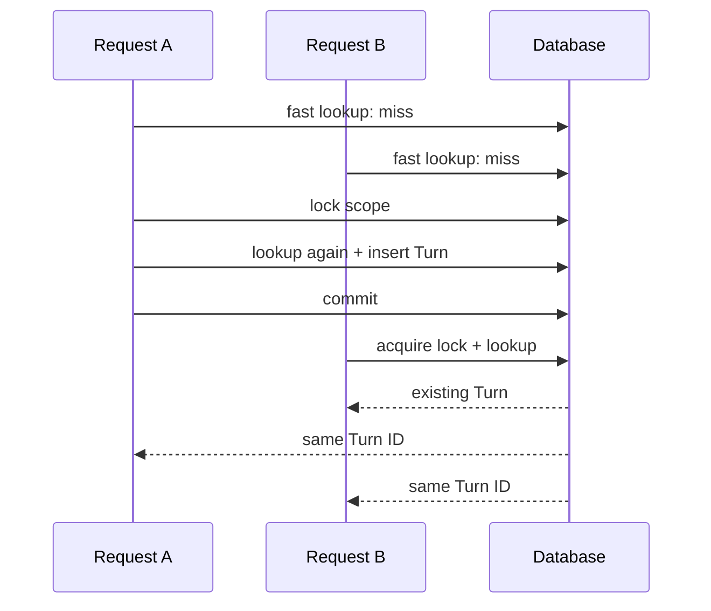
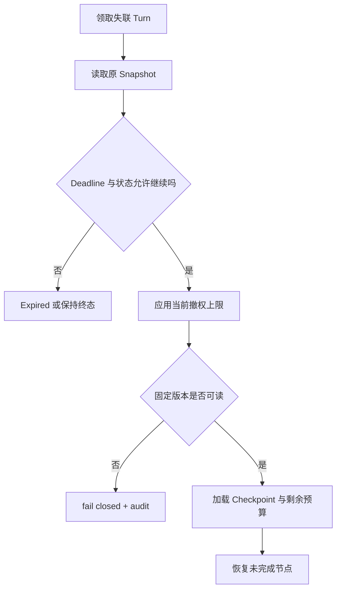

# Turn 幂等与版本快照

浏览器提交问题后没有收到响应，于是自动重试。第一次请求可能在响应丢失前已经创建 Turn 并投递 Worker，第二次若重新执行，就会生成两份答案，甚至重复调用带副作用的工具。幂等要让两次传输指向同一个逻辑 Turn，同时保留第一次执行时的知识、策略、权限和预算。

只把 `idempotency_key` 放进 Redis 并缓存一个 HTTP 响应不够。缓存会过期，Worker 可能跨越多个进程，终态也可能在几分钟后才形成。Runtime 需要持久化幂等作用域、请求指纹与 Turn ID，并在创建 Turn 的同一时刻固定版本快照。重复创建返回原对象，恢复任务读取原快照，活动 Release 和 Policy 后来怎样变化都不会污染这次执行。

::: info 幂等和快照回答两个不同问题

- **幂等**：同一次用户意图重复到达时，系统是否只创建一个逻辑执行。
- **版本快照**：这个逻辑执行重试或恢复时，是否仍使用开始时的事实、规则与权限。

:::

## 幂等对象是一次业务意图

HTTP 请求是一次传输，Turn 才是业务执行。网络重试、代理重发、用户刷新页面和队列重复投递可以产生多次传输，它们共享一个 Turn。用户主动修改问题或点击“重新生成”则是新意图，应使用新幂等键并创建新 Turn。

调用方在首次动作时生成键，格式可以是随机 ID，也可以由稳定业务操作 ID 派生。服务端不从问题正文计算唯一键，因为相同问题可以在不同时间合法执行两次，文本规范化还会误把不同 Scope 或模式合并。

键的作用域包含知识库和用户，数据库唯一约束可写成 `(kb_id, user_id, idempotency_key)`。同一字符串在两个用户下不会共享结果，知识库迁移也不会碰撞。若一个 API 支持多个操作类型，还应把操作类型放进作用域，避免“创建 Turn”和“取消 Turn”误用同一空间。

空键没有幂等保证，生产长任务通常直接拒绝。键长度设上下限，日志只记录受控摘要，不能让用户输入的超长字符串成为指标标签。服务端返回原 Turn 时明确 `created=false`，客户端不再重复订阅或创建消息。
## 请求指纹识别同键不同输入

两个请求使用相同键，不代表内容一定相同。前端 Bug 可能复用旧键，恶意调用方也可能尝试用同一键替换问题、Scope 或模式。若服务只按键返回原结果，调用方会看到与新输入无关的答案；若服务接受新输入更新 Turn，则破坏已经执行的状态。

请求指纹对影响执行语义的字段做规范化后计算哈希，例如问题、Requested Mode、Conversation、页面 Scope、Scope Revision 和关键选项。JSON 使用稳定键顺序，集合字段先去重排序，Unicode 与空白规则写入协议版本。身份和知识库已经在作用域中，无需再次放入 Payload，但审计记录要能还原指纹算法版本。

同一作用域和键命中已有 Turn 后，服务比较指纹。相同就返回原 Turn；不同则返回 `idempotency_conflict`，带上原 Turn ID 和不可重试提示，不展示原问题正文。调用方要执行新内容，生成新键。

指纹不能包含会自然变化的服务器字段，例如当前时间、活动 Release 或随机 Trace ID，否则重试永远冲突。它也不是签名或授权机制，不能证明请求来自某个用户；身份仍由认证层确认。

历史实现没有保存指纹时，可以先以键为准保持旧语义，新版本只对新 Turn 写入指纹。迁移期不能根据当前请求猜出旧 Turn 的原输入并覆盖。冲突率作为客户端契约指标单独观察。
## 三层并发保护只创建一个 Turn

常见路径先查询唯一键，命中后立即返回，避免重复申请准入和打开事务。首次请求进入创建事务，对该作用域取得事务锁，再查一次，解决两个 API 进程同时通过快速查询的竞态。

最后由数据库唯一约束兜底。两个事务即使因为实现错误都走到 Insert，也只有一个成功；失败方回滚或读取冲突记录，再返回同一 Turn。只靠应用锁容易在进程崩溃或锁服务分区时失效，只靠唯一约束则会让大量重复请求走异常路径，三层各有作用。



数据库集成测试应同时发起多次相同创建，并断言所有返回的 Turn ID 相同、User Message 和首个 Event 只有一组、Dispatcher 只产生一个逻辑执行。顺序运行两次无法证明并发竞态被保护。

幂等锁的粒度不能是全知识库，否则一个用户的请求会阻塞所有人。粒度太细，只锁随机 Turn ID，又保护不了同一键。锁名使用作用域的稳定哈希，数据库唯一约束保留原字段供审计。
## Turn 幂等之外还有三层重复风险

Turn 创建幂等只保证一个逻辑目标，不保证链路里的每个动作都只发生一次。队列可能重复投递同一 Turn，Event 写入可能在客户端重试时重复，工具可能在 Worker 崩溃后再次调用。把这些问题都寄托在创建键上，故障仍会产生双写。

**调度幂等**使用 `turn_id` 作为业务身份。Dispatcher 重复发送消息没有关系，Worker 先用状态条件或执行 Lease 取得推进权。Celery Task ID 可以帮助观测，不能作为唯一锁，因为 Broker 和恢复任务可能使用不同 Attempt ID。

**状态与事件幂等**使用状态修订和事件身份。完成命令只允许 Pending 或 Running 转到 Completed，取消后迟到完成受影响行数为零；终态 Event 通过 Turn 级锁保证最多一条。普通阶段事件如果可能重试，可以用 `(turn_id, stage, revision)` 去重，而流式 Delta 要用连续 Sequence 保持顺序。

**动作幂等**使用 Action Fingerprint。指纹包含 Turn、工具名、规范化参数和动作序号，工具适配器在执行前写 Pending，成功后保存外部回执。重试先查询账本和供应商状态。转账、发信和改权限这类不可逆操作如果结果未知，停在 Unknown 或人工确认，不能猜测失败后再执行。

```text
Create Request  ── request idempotency ──> one Turn
Queue Delivery  ── execution ownership ──> one active Worker
State Commit    ── revision + terminal guard ──> one terminal result
Tool Action     ── action fingerprint ──> one external side effect
```

四层使用不同身份，因为它们去重的对象不同。一条 Turn 可以合法调用多个工具，同一个工具也可以在不同步骤用不同参数调用；强行共用请求键会把合法动作合并。排障时先确认重复发生在哪一层，再修对应账本与条件更新。
## 版本快照固定可重放的执行环境

Turn 创建时至少固定知识 Release、PolicyVersion、ACL Snapshot、Requested Mode、绝对 Deadline 和请求指纹。具体模型配置可能作为 Policy 的一部分，也可以单独保存 Model Resource ID 与版本。Prompt、Reranker、Embedding 和工具目录只要会影响结果，也需要通过不可变配置或版本引用进入快照链。

```text
TurnSnapshot
├── release_id
├── policy_version_id
├── model_resource_id / model_revision
├── acl_snapshot / acl_revision
├── requested_mode
├── request_fingerprint / schema_version
├── deadline_at / action_budget / token_budget
├── conversation_revision
└── tool_catalog_revision
```

快照保存的是稳定引用和少量安全字段，不必复制所有配置正文。执行上下文按版本 ID 读取不可变 Policy，检索按 Release 读取已发布知识。旧版本退休后仍允许历史 Turn 读取；物理删除受外键 Restrict 和保留期约束。

可重放不等于追求字节级相同。外部模型可能存在随机性，供应商也可能更新同名服务。保存模型版本、参数、请求摘要和响应 Trace 能解释差异；需要确定性控制流测试时使用 Fake Adapter 或保存 Fixture。版本快照能消除应用侧漂移，不能承诺第三方模型永远输出同一句话。

### 谁生成并维护每个快照字段

Release ID 由知识发布服务提供，Runtime 只选择活动版本或验证恢复版本；PolicyVersion 由策略发布服务管理，Runtime 按稳定分桶读取；ACL Snapshot 由认证与权限服务计算；模型与工具 Revision 由各自 Registry 解析。用户请求只能提供模式偏好、页面范围和 Deadline 候选。

| 字段 | 来源所有者 | Turn 创建后能否修改 | 安全例外 |
| --- | --- | --- | --- |
| Release ID | 知识发布服务 | 否 | 对象撤权可阻止交付 |
| PolicyVersion ID | 策略发布服务 | 否 | 紧急停用工具可失败关闭 |
| ACL Snapshot | 权限服务 | 不扩大 | 当前撤权做交集 |
| Model Revision | 模型 Registry | 否 | 资源下线则显式失败或批准降级 |
| Tool Catalog Revision | 工具 Registry | 否 | 安全封禁立即生效 |
| Deadline 与预算 | Runtime Policy | 只能消耗 | 人工取消可提前终止 |

快照不可变指 Turn 上的引用不被普通执行改写，不表示安全团队失去停止能力。紧急封禁属于上限控制：它可以减少能力或结束任务，不能让恢复任务换到权限更大的新 Policy。降级到另一模型或工具时，需要 Policy 预先允许，并记录实际资源与原因。

每个版本对象都有生命周期。Active 或 Champion 供新 Turn 选择，Retired 只服务历史引用，Rejected 不接受新流量，删除要等引用和保留期结束。Registry 查不到固定版本是治理错误，Runtime 返回稳定失败，不能通过“找一个名字相似的版本”继续。

快照读取也应集中在 Execution Context Builder。Graph Node 和工具适配器不各自调用“当前配置”接口，避免一条 Turn 在不同阶段读到不同值。Context Builder 输出不可变结构，Trace 记录字段摘要和 Schema Version。
## 请求指纹也需要 Schema 版本

系统迭代后，请求增加新字段，例如答案语言或页面 Scope Revision。旧指纹算法不知道这些字段，新算法若直接用于历史 Turn，重复请求可能被误判冲突。Turn 保存 `fingerprint_schema_version`，比较时使用创建时算法或提供兼容投影。

字段分为三类。改变执行语义的字段进入指纹；只影响传输的 Header、客户端时间和 Trace ID 不进入；服务端解析出的 Release 与 Policy 进入 Snapshot，不放进客户端指纹。分类需要协议评审，不能每次新增字段都默认忽略。

规范化规则同样版本化。Scope 作为集合时排序去重，Message 列表则保留顺序；问题是否折叠首尾空白要固定，不能做语义改写。把“多久生效”和“什么时候能用”归一成同一指纹，会误合并两个合法问题。

指纹只保存哈希有利于隐私，但冲突排查需要知道哪个字段变化。可以额外保存字段级哈希或受控请求摘要，外部响应只报告冲突，不回显原内容。哈希算法使用稳定加密散列，不能用进程随机 Hash。

客户端升级时先验证键生成逻辑。离线契约测试给出固定输入和期望指纹，前后端共享规范；移动端离线重试也必须保留原键与原 Payload。服务端统计冲突时按客户端版本切片，方便发现某次发布复用了键。
## Release 固定检索事实

活动 Release 表示新 Turn 默认使用的知识版本。Turn 7 创建时固定 Release 12，几分钟后 Release 13 激活，Turn 7 的查询、Rerank、Evidence、Citation 和恢复仍限定在 Release 12。新 Turn 才使用 13。

检索缓存键包含 Release ID，命中后再次检查 ACL。若缓存只按查询文本，恢复的旧 Turn 可能读到新 Release 候选，反过来新 Turn 也可能引用已撤回版本。Candidate、Evidence 与 Claim 记录都保存 Source Version，最终 Eval 能确认引用链。

Release 退休不代表立即不可读。已经运行的 Turn、Eval Run 和反馈审计需要读取它。发布服务维护 Active、Candidate、Retired 与删除规则，在没有活动引用且满足保留策略后再清理大体积索引。数据库外键防止误删元数据，向量索引和对象存储还要有独立引用检查。

安全撤权是例外。文档虽然属于固定 Release，当前安全策略已经撤回用户访问时，恢复不能为了复现旧结果继续暴露内容。快照记录当时 Scope，执行前还要应用不可绕过的撤权状态。文章中的“固定 ACL”指防止重试扩大权限，不是让历史授权永久有效。
## Policy 固定行为规则

PolicyVersion 保存模式路由、Prompt 版本、召回数量、研究轮次、Evidence 覆盖阈值、工具规则、预算和质量门禁。Turn 创建时从 Champion 与可能的 Challenger 中稳定选择一个 ID，之后不跟随分配比例变化。

灰度选择使用知识库、用户和幂等键的稳定哈希。相同用户重试同一意图落在相同 Policy，不会第一次走 Champion、第二次走 Challenger。Challenger 晋升或回滚只影响新 Turn，运行中的 Turn 仍能读取旧版本。

Policy 回滚不能覆盖版本行。旧 Champion 退休、Challenger 成为新 Champion，历史 ID 保持不变；回滚把 Challenger 标为 Rejected 并停止新分配。若直接在原 Policy JSON 上改字段，旧 Turn、Eval 和反馈都会被重新解释成新规则。

Policy 还保存质量门禁，但 Turn 的运行时结果不自行修改 Policy。反馈与 Eval 创建新的 Optimization Run 和 Challenger，发布事务完成后才改变新请求分配。模型输出无权写入策略版本。
## ACL Snapshot 固定身份范围又服从撤权

ACL Snapshot 来自认证与权限服务，包含用户、角色、Subject、Group、页面文档范围、范围来源和修订。问题文本中的“查询全部资料”不会增加 Scope。Worker、Checkpoint 恢复、检索缓存、图谱扩展和 Citation 都使用同一快照。

只保存用户 ID 不够。用户组在执行期间变化，恢复时重新计算可能扩大或缩小范围，结果无法解释。Snapshot 记录创建时有效集合及修订，审计可以回答某个 Evidence 当时为何可见。

权限仍有实时安全上限。账号禁用、文档撤权、租户封禁和密钥吊销属于必须立即生效的状态。执行时先取快照范围，再与当前不可绕过的撤权集合求交。权限增加不会让旧 Turn 扩大，权限减少会阻止继续交付受限内容。

Snapshot 自身属于敏感数据。普通 Event 和指标只保存哈希或数量，详细 Subject 与 Group 留在受控记录。跨租户读取 Turn 时，先按 Owner 和 Knowledge Base 过滤，不能因为拥有 `turn_id` 就返回 ACL 内容。
## 模型、工具和预算也需要版本语义

模型路由可以由 Policy 决定，但实际执行时还要记录解析后的 Model Resource、供应商与配置版本。`model=default` 不是可审计快照，Registry 后来切换默认模型，恢复会产生另一套行为。Turn 保存 Resolved Model 或 Trace 按阶段记录实际模型。

工具目录变化同样影响动作空间。Policy 指向 Tool Catalog Revision，Runtime 只暴露该版本允许的名称与 Schema；安全撤销的工具可以立即禁用。恢复时旧 Tool Call 找不到原版本，进入受控失败或人工确认，不映射到同名新工具直接执行。

Deadline、最大动作数、研究轮次和 Token 预算在创建时固定总量。重试读取剩余额度，不能重新发一份完整预算。Checkpoint 保存已消耗值，Worker 接管后继续扣减。供应商返回 Usage 不可用时，使用保守估算并记录 Unknown，不能按零成本继续。

Conversation Revision 也会影响输入。Turn 固定本轮开始时纳入哪些历史 Message，后续用户追加内容不会悄悄进入旧执行。运行中控制协议若允许追加，显式产生新 Revision 与 Event，由 Runtime 决定重新规划或排队到下一 Turn。
## 恢复只读取原快照

Worker 退出后，恢复扫描器领取同一个 `turn_id`。它从数据库读取 Release、Policy、ACL、Deadline、Conversation Revision 与 Checkpoint，而不是调用“获取当前活动版本”的便利方法。任何一个固定版本不可读，都留下明确错误，不自动改用最新值。

Checkpoint 的 Thread ID 使用 Turn ID，Graph 从最后持久边界继续。已经完成的工具动作通过 Action Fingerprint 查询，未知结果停在人工或幂等确认路径。模型调用可以重做，但保存前一次 Attempt，并消耗原剩余预算。

恢复时若发现当前安全撤权与 ACL Snapshot 冲突，停止使用相关 Evidence，重新验证候选或安全拒答。若只是新 Release 激活，不影响旧 Turn。两类变化一个是事实版本演进，一个是即时安全约束，处理规则不同。


## 一次重试怎样保持相同事实环境

用户在 10:00 提交问题，键为 `request-123`。服务创建 Turn 1，指纹覆盖问题、Auto Mode 和页面 Scope，快照固定 Release 7、Policy 3、Model 2、ACL Revision 9，Deadline 为 10:03:10。

API 响应在网络中丢失。10:00:02 客户端重试相同键和输入，快速查询命中 Turn 1，指纹一致，返回 `created=false`。系统不重新准入、不创建 Message、不投递第二个 Worker，Deadline 仍是 10:03:10。

10:01 Release 8 激活，Policy 4 晋升。原 Worker 在 10:01:20 退出，恢复任务读取 Turn 1，继续使用 Release 7 和 Policy 3；当前账号没有撤权，因此 ACL Revision 9 的范围仍可用。新建 Turn 才使用 8 和 4。

若客户端重试时把问题改成“请查询所有管理员资料”，指纹冲突，服务返回原 Turn ID 与 `idempotency_conflict`，不更新问题和 Scope。用户确认要发新问题后生成 `request-124`，权限服务仍会限制管理员资料。

如果管理员在恢复前撤销了某文档访问，Runtime 从 Snapshot 范围中移除该对象，已有候选标为不可交付，并重新验证或拒答。它不会把 Release 升到 8 寻找替代答案，也不会保留旧权限继续引用。
## 最小示例验证键、指纹和快照

共享示例把幂等作用域、规范化请求指纹与 VersionSnapshot 放在同一个 Store。相同键和等价 Scope 顺序返回原 Turn；同键改问题产生冲突；不同用户作用域互不影响；活动 Release 变化后，Resume 仍返回原 Release。

<<< ../../examples/ai-agent/idempotency_snapshot.py

运行示例与测试：

```bash
python3 examples/ai-agent/idempotency_snapshot.py

PYTHONPATH=examples/ai-agent \
  python3 -m unittest examples/ai-agent/tests/test_idempotency_snapshot.py
```

内存实现不能证明并发安全，没有事务锁、唯一索引、外键与多进程 Worker。生产集成测试需要并发创建、数据库冲突重读、Policy 灰度、Release 切换、ACL 撤权和 Checkpoint 恢复，逐项断言 Turn ID 与快照不变化。
## 自测要覆盖状态变化而非只看返回值

创建测试先验证同一用户、知识库和键的顺序重放，再并发发起多次请求，断言只有一个 Turn、一个 User Message 和一组首事件。随后改变 Question、Mode 和 Scope，逐项确认指纹冲突；更换用户或知识库则应独立创建。

版本测试在 Turn 创建后激活新 Release、晋升新 Policy、切换默认模型和更新工具目录，再恢复旧 Turn。所有普通依赖继续读取旧 ID；新 Turn 读取新版本。删除被引用版本应被外键或治理层拒绝。

安全测试在恢复前撤销文档、禁用账号和封禁工具。旧 Snapshot 不得绕过撤权，Runtime 记录安全终止；向用户新增权限则不扩大旧 Turn。两个租户使用相同键和问题也不能共享缓存、Turn 或 Event。

副作用测试让 Worker 在工具返回成功后、动作账本提交前退出。适配器从供应商回执或幂等 API 确认结果，不能再执行一次。结果无法查询时状态保持 Unknown，并验证人工处理后才能继续。

性质测试随机排列 Create、Retry、Dispatch、Cancel、Complete、Expire 和 Recover，持续检查四条不变量：逻辑 Turn 唯一、快照引用不变、终态单调、权限不扩大。失败时保存最短操作序列，便于复现竞态。

指标验证也要检查分母。Idempotent Replay Rate 以创建请求为分母，Conflict Rate 以相同作用域键命中为分母，Duplicate Side Effect 是红线次数。没有动作回执的 Unknown 单独展示，不能归入成功或失败后从报表消失。
## 删除内容时保留幂等墓碑

用户要求删除问题和答案后，系统仍可能收到移动端积压的旧请求。若删除 Turn 时连同幂等键一起清空，迟到请求会创建新 Turn，再次处理已经删除的内容。保留一条不含正文的墓碑，可以在重试窗口内返回 Gone 或原终态摘要，阻止旧键复用。

墓碑保存作用域键、请求指纹、原 Turn ID、终态、删除时间和过期时间，不保存问题、答案、ACL 列表与 Evidence。外部读取仍经过 Owner 校验。保留期限由客户端最大重试时间、队列滞留时间和合规策略共同决定，不能永久保存所有身份关联。

VersionSnapshot 的删除策略不同。Release 与 Policy 可能被多条历史 Turn 引用，先删除大体积正文或索引，再保留版本元数据、哈希和审计原因。仍在运行、可恢复或处于申诉期的 Turn 会阻止版本清理。安全撤回立即阻止交付，却不需要抹去“当时使用过哪个版本”的审计关系。

清理任务本身要幂等。重复执行只推进 Deleted At 和资源清单，遇到活动引用就跳过；对象存储删除结果未知时先查询，不连续发送删除命令后假设成功。清理失败不会复活正文，也不能解除幂等墓碑。

数据生命周期测试创建 Turn、删除内容、重放旧请求并等待墓碑过期，分别检查重试被阻止、隐私字段已清除、审计引用仍可解释。过期后若允许键重新使用，调用方还应生成新键，避免历史客户端与新意图发生碰撞。
## 失败证据按创建、执行和恢复分类

`idempotency_conflict` 表示同一作用域和键的请求指纹不同，责任通常在调用方键管理；`idempotent_create_race` 表示并发创建没有正确重读唯一记录，责任在持久层；重复工具副作用说明动作级幂等缺失，不能只修 Turn 创建。

`snapshot_version_missing` 表示固定 Release、Policy 或模型版本已被误删；`snapshot_scope_invalid` 表示快照归属不一致；`security_revoked` 表示当前撤权上限阻止继续。前两类检查版本治理和外键，后一类是预期安全终止。

恢复答案变化时，先比较 Turn Snapshot 与每个依赖实际请求。Turn ID 未变而检索用了活动 Release，说明适配器忽略显式版本；Policy ID 被更新，说明有组件越权改写 Turn；Snapshot 相同但模型输出不同，则查看模型版本、参数和随机性，不能先归因于检索。

指标按幂等重放、指纹冲突、并发唯一冲突、固定版本缺失、撤权终止和恢复次数分开。键本身、问题和 ACL 不作为标签。高重放率可能是网络问题，高冲突率更可能是客户端复用错误，两者处理动作不同。
## 幂等层级和存储方案的取舍

内存 Map 适合单进程 Demo，重启后丢失，也无法协调多个 Worker。Redis `SET NX` 能做短期锁或响应缓存，网络分区和 TTL 仍可能让历史键消失。数据库唯一约束与 Turn 记录适合业务幂等事实，代价是每次创建增加事务写入。

Outbox 解决数据库提交与队列投递之间的可靠衔接，动作账本解决外部副作用的幂等。它们与 Turn 幂等互补：Turn 保证一个逻辑目标，Outbox 保证调度最终发生，动作账本保证某个工具不会执行两次。只实现其中一层，故障窗口仍会暴露。

幂等记录需要保留多久取决于重试窗口和审计要求。过早删除会让迟到重试创建新 Turn，永久保留所有问题指纹又增加隐私与索引成本。可以长期保留随机键、Turn ID、指纹与状态，问题正文按内容策略清理；删除后仍应有墓碑阻止旧键复用一段时间。

快照越完整，复现能力越强，存储与迁移成本也越高。稳定版本引用优于复制大配置，但依赖版本必须可长期读取。无版本的外部服务要保存请求参数与结果证据，并承认无法完全复现，不能用一串“latest”伪装成快照。

设计验收可以用四个问题收尾：重复请求是否得到同一 Turn，同键不同输入是否被拒绝，恢复是否读取原 Release 和 Policy，安全撤权是否仍能立即阻止交付。任何一项依赖模型自觉或缓存碰巧未过期，都没有建立可靠的幂等与版本边界。
## 一个 Turn 需要三种幂等

创建幂等保证同一用户意图只有一个 Turn，任务幂等保证队列重复投递不会重复推进，动作幂等保证外部副作用只有一个业务结果。三层分别保存指纹、状态和回执，不能用一个缓存键代替。

快照固定模型、Policy、Release、ACL 和输入版本。恢复或重试都读取快照，权限撤回仍可阻止交付；快照无法读取时进入人工核对或安全失败。
