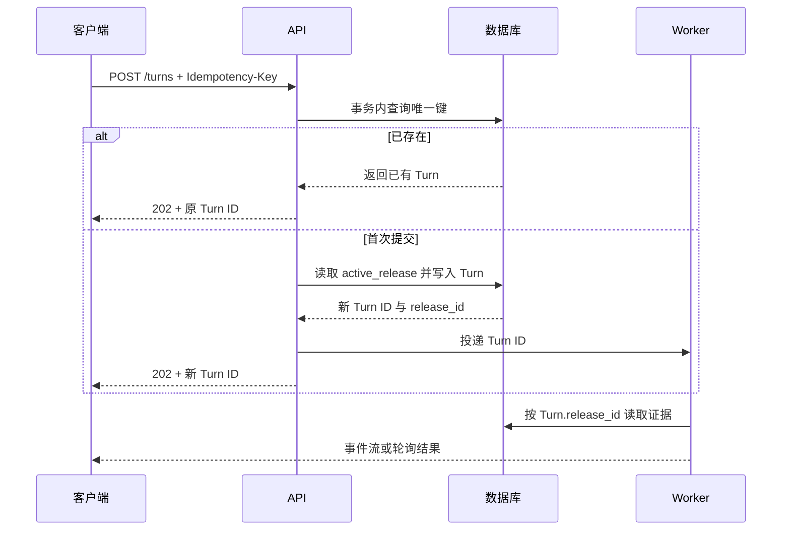

# Turn 幂等、准入与版本快照：一次请求怎样获得稳定边界

用户点击一次发送，浏览器可能因为网络抖动再次提交；网关超时后，客户端也可能重试。若服务端每次都创建新的 Agent 执行，模型费用和副作用会翻倍。与此同时，知识管理员发布了新版本，正在执行的请求应该继续使用旧版本，还是中途换成新版本？如果没有明确答案，引用和评测都无法复现。

这篇文章把一次可恢复的执行单元称为 **Turn**。它不是 HTTP 请求的同义词：一个 HTTP 请求可以只是查询 Turn 状态，而一个 Turn 也可能跨越 API、队列和 Worker。我们会建立状态机，模拟唯一幂等键、版本快照和重复请求，并说明数据库事务应该锁住什么。

## 三个 ID 的关系

| 标识 | 创建时机 | 用途 | 生命周期 |
| --- | --- | --- | --- |
| Request ID | 每次收到 HTTP 请求 | 串联网关和日志 | 一次网络请求 |
| Idempotency Key | 客户端生成或服务端补全 | 判断是否重复提交 | 客户端重试窗口 |
| Turn ID | 第一次成功准入时创建 | 标识实际 Agent 执行 | 从 accepted 到终态 |

重复请求可以拥有不同 Request ID，但只要 **Idempotency Key、用户和请求摘要**相同，就应该返回同一个 Turn ID。请求摘要要参与唯一性判断，防止客户端错误地复用同一 Key 执行不同问题。

## 版本快照必须在执行前建立



第一次提交在一个事务里完成两件事：用唯一约束保护幂等键，用当前 `active_release_id` 写入 Turn。**Worker 永远读取 Turn 自己的版本快照**，而不是每一步重新查询“当前激活版本”。发布新版本只影响之后创建的 Turn。

## 幂等的边界

**幂等不是“接口调用两次结果一样”这么简单。** 对只读检索，重复执行通常没有副作用；对发送邮件、扣费、写入向量等动作，必须把幂等键传到副作用边界，并由目标系统的唯一约束或去重表保护。模型调用本身很难做到严格幂等，因此应把模型输出写入 Turn 事件，再由事件状态决定是否可以再次调用。

## 用内存状态机模拟准入

下面的代码把数据库唯一约束抽象成字典，把发布版本抽象成整数。它的目的不是替代数据库，而是让你先观察第一次提交、重复提交和版本切换的状态差异。

```python
# 准入用幂等键找到或创建唯一 Turn，并在同一状态中固定知识、策略与模型版本。
from __future__ import annotations

from dataclasses import dataclass


@dataclass(frozen=True)
class Turn:
    turn_id: str
    user_id: str
    idempotency_key: str
    request_fingerprint: str
    release_id: int
    status: str


class TurnStore:
    def __init__(self, active_release_id: int) -> None:
        self.active_release_id = active_release_id
        self._turns: dict[tuple[str, str], Turn] = {}
        self._next_id = 1

    def admit(self, user_id: str, key: str, fingerprint: str) -> tuple[Turn, bool]:
        # 幂等索引同时包含用户和客户端键，避免不同用户碰撞到同一 Turn。
        lookup_key = (user_id, key)
        existing = self._turns.get(lookup_key)
        # 命中用户与幂等键后复用原 Turn，不创建第二条任务。
        if existing is not None:
            if existing.request_fingerprint != fingerprint:
                raise ValueError("idempotency_key_reused_for_different_request")
            return existing, False
        # 新 Turn 创建时固定当前 Release，后续发布不会改变正在运行的快照。
        turn = Turn(
            turn_id=f"turn-{self._next_id}",
            user_id=user_id,
            idempotency_key=key,
            request_fingerprint=fingerprint,
            release_id=self.active_release_id,
            status="accepted",
        )
        self._turns[lookup_key] = turn
        self._next_id += 1
        return turn, True

    def publish_release(self, release_id: int) -> None:
        # Release 只能单调向前发布，防止新请求重新绑定到旧知识快照。
        if release_id <= self.active_release_id:
            raise ValueError("release_must_move_forward")
        self.active_release_id = release_id


if __name__ == "__main__":
    store = TurnStore(active_release_id=7)
    first, created = store.admit("user-1", "key-1", "hash-question-a")
    again, created_again = store.admit("user-1", "key-1", "hash-question-a")
    store.publish_release(8)
    later, later_created = store.admit("user-1", "key-2", "hash-question-b")
    print(first, created)
    print(again, created_again)
    print(later, later_created)
```

`Turn` 保存执行所需的不可变边界，尤其是 `release_id`。`TurnStore.admit` 先用用户和幂等键查找；找到相同指纹就返回旧 Turn，找到不同指纹则抛出错误，避免客户端把一个 Key 当成通用请求 ID。首次提交才读取当前激活版本并递增 ID。`publish_release` 只改变后续 Turn 的默认版本，已存在 Turn 的字段不会被修改。

示例输出中，第二次提交的 `created_again` 为 `False`，且 Turn ID 与第一次相同；发布 8 后的新 Turn 使用 8，旧 Turn 仍使用 7。真实数据库实现要把查找和插入放在事务中，并对 `(user_id, idempotency_key)` 建唯一索引；多 Worker 场景还需要处理唯一冲突后重新读取已存在行。

## 请求指纹怎样计算才不会误判

幂等键表示“这是同一次业务意图的重试”，请求指纹证明请求内容没有被偷换。指纹应基于规范化后的业务字段，例如问题、显式知识空间、附件内容哈希和客户端选择项；Request ID、时间戳和网络头不应进入，否则每次重试都会不同。

规范化只能处理没有语义差异的变化，如 JSON 键顺序和多余空白。不能删除否定词、附件顺序或版本条件。服务端可以把规范对象排序序列化后计算 SHA-256，日志只记录摘要，不记录完整敏感问题。

幂等窗口也要明确。短时间网络重试可以复用原 Turn；业务希望“再次执行同一个问题”时应生成新 Key，从而得到新 Turn 和当前 Release。永久把“相同问题”去重会让用户无法在知识更新后重新提问。

## 数据库事务如何处理并发首次提交

一个常见实现是给 `(subject_id, idempotency_key)` 建唯一约束，并在同一事务中：

1. 读取当前 active Release 和相关配置版本；
2. 尝试插入 `accepted` Turn 与请求指纹；
3. 若唯一约束冲突，读取已存在 Turn；
4. 比较指纹，相同则返回已存在 Turn，不同则返回 Key 冲突；
5. 为新 Turn 写 Outbox 事件并提交。

Outbox 与 Turn 同事务写入，提交后由派发器把 Turn ID 发给队列。这样 API 进程在数据库提交后、发送消息前崩溃，Outbox 仍可补派。不要先发队列再提交 Turn，Worker 可能拿到不存在的 ID。

PostgreSQL 的 `INSERT ... ON CONFLICT` 可以帮助获得已有行，但仍要核对指纹。对已存在的终态 Turn，重复请求返回同一结果或状态链接；对 `running` Turn 返回重连事件流；不创建第二个 Worker 任务。

## 用 pytest 推演重复、冲突与快照

下面的测试直接复用前文实现。测试输入覆盖同 Key 相同请求、同 Key 不同请求和发布后的新 Key，输出直接断言 Turn 身份与 Release。


为了验证“用 pytest 推演重复、冲突与快照”，下面的测试把“测试覆盖相同请求重放、同键不同内容冲突和 active 变化，证明已创建 Turn 的快照不漂移”变成可执行断言。每个用例自己构造输入，并用断言固定返回值或失败状态；某条测试失败时，可以从用例名直接定位到被破坏的契约。

```python
# 测试覆盖相同请求重放、同键不同内容冲突和 active 变化，证明已创建 Turn 的快照不漂移。
import pytest

from turn_store import TurnStore


# 这个用例改变缓存边界字段，确认权限、版本或策略变化会产生不同键。
def test_same_key_returns_the_same_turn() -> None:
    store = TurnStore(active_release_id=7)
    first, first_created = store.admit("user-1", "key-1", "hash-a")
    again, again_created = store.admit("user-1", "key-1", "hash-a")
    assert first_created is True
    assert again_created is False
    assert again.turn_id == first.turn_id


# 这个用例改变缓存边界字段，确认权限、版本或策略变化会产生不同键。
def test_same_key_cannot_hide_another_request() -> None:
    store = TurnStore(active_release_id=7)
    store.admit("user-1", "key-1", "hash-a")
    with pytest.raises(ValueError, match="different_request"):
        store.admit("user-1", "key-1", "hash-b")


# 这个用例固定版本快照，确认一次运行不会混用新旧知识、策略或模型配置。
def test_existing_turn_keeps_its_release_snapshot() -> None:
    store = TurnStore(active_release_id=7)
    old_turn, _ = store.admit("user-1", "key-1", "hash-a")
    store.publish_release(8)
    new_turn, _ = store.admit("user-1", "key-2", "hash-b")
    assert old_turn.release_id == 7
    assert new_turn.release_id == 8
```

执行 `python -m pytest -q`，预期三条通过。第一条证明重复网络请求只对应一个执行单元；第二条证明 Key 不能覆盖不同输入；第三条证明 Release 切换只影响新 Turn。数据库集成测试还要并发发送两个首次请求，验证唯一冲突后只产生一行 Turn 和一条逻辑 Outbox 任务。

## 快照不只有知识 Release

要让运行可重放，Turn 通常还应固定 Agent 配置版本、提示模板版本、检索策略版本、工具集合版本、模型路由策略和用户 Scope 快照或权限版本。并非所有字段都复制一份完整内容，可以保存不可变版本 ID。

权限是否允许使用创建时快照取决于安全策略。权限收紧通常应立即生效，因此每次检索仍读取当前授权并与 Turn 最大范围求交；知识 Release 则保持固定。把“内容一致性快照”和“安全实时撤权”分开，避免为了可重放保留已撤销权限。

## 常见竞态与检查顺序

如果两个请求同时查询到“没有 Turn”，仅靠应用层 `if` 判断仍会双写。正确顺序是：数据库唯一约束兜底，冲突的一方捕获 `IntegrityError` 后重新查询；不要在异常后再次盲目创建。若 Turn 已是 `running`，重复请求应返回状态查询地址或从事件流重放，而不是重新排队。

建议在日志中记录 Request ID、幂等键哈希、Turn ID、release_id、状态迁移和创建结果。测试至少覆盖首次创建、相同 Key 重放、不同请求复用 Key、发布并发以及 Worker 读取旧版本五条路径。

这些稳定边界让后续资源准入、队列执行、恢复和验证都围绕同一个 Turn 工作；任何终态都能回到创建时的版本身份和请求指纹。

## 常见问题

### Request ID、幂等键和 Turn ID 有什么区别？

Request ID 标识一次网络尝试，重连或重试通常会变化；幂等键由客户端在同一业务提交中复用，用来归并重复请求；Turn ID 是服务端创建的唯一执行单元，保存状态、快照、事件与答案。相同幂等键和相同请求指纹应返回同一 Turn，不同内容复用同一键则报冲突。把 Request ID 当 Turn ID 会让网络重试重复执行，把幂等键当日志 ID 又无法表达一次尝试。

### 幂等是不是把接口调用两次都返回 200 就够了？

不是。关键是重复提交只产生一个逻辑执行单元和一组副作用，并能返回同一最终状态。数据库唯一约束是并发兜底，冲突方重新查询既有 Turn；任务派发通过 Outbox 或稳定任务键保证逻辑一次。响应码可以都是 200，但若后台创建两个 Worker 任务、两次模型调用或两份答案，幂等已经失败。测试要并发发送首次请求并核对 Turn、Outbox 和事件数量。

### 请求指纹应该包含哪些字段？

包含会改变业务含义的规范化输入，如用户问题、显式范围、附件稳定 ID 和关键选项；不包含 Request ID、时间戳、字段顺序等每次都会变化的传输噪声。身份通常作为幂等命名空间，不让两个用户共享同一键。敏感正文可先规范化后哈希，日志只保存摘要。指纹过少会把不同请求误合并，过多会让同一请求因无关差异无法重放，需要用代表样本测试。

### 为什么 Turn 要固定知识 Release 和策略版本？

一次 Agent 执行可能跨越多个检索、工具和验证步骤，期间知识或提示可能发布。若每一步读取最新配置，答案无法复现，也可能引用两个版本。准入时保存不可变版本 ID，后续节点和缓存都使用它们；新 Turn 再使用新版本。安全撤权通常实时生效，因此每次访问把当前权限与创建时最大范围求交，不能为了可重放继续使用已撤销权限。

### 两个首次请求同时到达时，应用层先查再插为什么不安全？

两个事务都可能在插入前看到“没有记录”，随后各自创建一行。应在数据库上建立用户加幂等键唯一约束，插入冲突的一方回滚当前事务并查询已创建 Turn；不要捕获异常后再次盲目插入。任务派发与 Turn 创建放同一事务的 Outbox，避免一行创建成功却没有任务。集成测试使用两个真实连接制造竞态，内存字典无法证明数据库语义。

### 权限变化会不会破坏固定快照？

内容一致性和安全授权要分开。知识 Release、提示和检索策略可以固定，使答案可重放；权限收紧应立即生效，查询时读取当前授权并与 Turn 的初始范围求交。权限扩大是否作用于旧 Turn则按产品策略决定，通常不会自动扩大。这样既不会在一次回答中混用内容版本，也不会因为“快照”保留已撤销访问。Trace 记录初始与有效 Scope 摘要。
