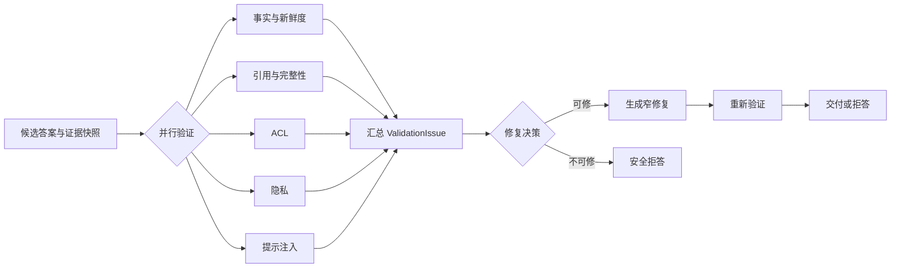

# 答案验证、有限修复与安全拒答

一个候选答案可以语句通顺、JSON 合法、引用链接也能打开，事实仍然可能错误。Schema 校验只证明输出形状，链接检查只证明地址存在。要把回答交给用户，还要检查它引用了谁能看的证据、Claim 是否被直接支持、重要条件有没有遗漏，以及文本是否受到不可信指令影响。

**Validation** 读取候选答案、Claim、Evidence、Citation、权限与策略快照，产出结构化问题。**Repair** 只处理已有证据足以纠正的局部问题。**Refusal** 在证据不足、权限变化或安全边界被破坏时停止交付。拒答属于正确终态，不是模型失败后的万能错误文案。

::: info 验证器不拥有业务事实

验证器判断候选答案是否满足当前证据与策略。它不能搜索隐藏资料、扩大权限、修改 Release，也不能让模型补一条证据来“修好”答案。

:::

继续使用远程访问问题。候选答案写道：“设备完成整改后可以重新提交，内部处置流程对普通员工开放。”第一条有公开制度支持，第二条绑定了当前用户不可见的 Evidence。验证系统需要保留第一条，阻断第二条，并确保拒答文案本身不泄露受限内容。

## 验证输入和输出必须可以重放

验证输入固定在同一个 Turn 修订上，包括原问题、候选答案、Claim 列表、Evidence Packet、答案实际采用的 Evidence ID、Citation、用户权限主体、Release、策略版本和模式。少了任何一个版本字段，后续都难以解释为什么当时通过或失败。

每个 Validator 输出 `ValidationIssue`，字段包括验证器类型、严重级别、稳定错误码、消息、关联 Claim、Evidence ID 和 `repairable`。消息给人看，程序依据错误码和严重级别分支，不能解析自然语言决定是否交付。

严重级别至少区分提示、警告、错误和阻断。外部语义 Validator 暂时不可用可以是 warning，并明确未完成哪项判断；ACL 泄露、敏感信息和提示注入影响答案属于 blocking。系统不能为了提高成功率把 blocking 改成 warning。

验证报告与候选答案一起保存。修复后生成新答案修订，再跑受影响的验证器，并执行最终安全门禁。旧问题不覆盖，审计可以比较修复前后。只保存最终答案会丢失修复器改了什么，也无法判断它是否引入新事实。

答案契约也影响验证。普通闲聊不要求 RAG Citation；声称根据企业知识回答时，必须有可验证 Claim 与 Evidence；权限拒绝则检查拒答内容有没有泄露目标对象。不能用一套“必须有引用”规则处理所有回复。
## 五类验证分别守住什么

### 权限验证检查答案真正使用的 Evidence

检索 Trace 里可能包含后来被过滤的 Candidate，权限验证只检查最终答案绑定的 Evidence ID。一个越权 Candidate 从未进入答案，不应误伤整次请求；答案引用了已撤权 Evidence，则直接产生 `acl_evidence_leak`。

交付前重新读取当前可见性，处理运行期间的撤权。权限不可用时无法确认可见性，请求停止。修复器不能换一种措辞保留原事实，因为问题在来源权限，不在文字。

### 隐私验证寻找不应交付的敏感内容

确定性规则可以识别私钥头、访问 Token、明显密钥格式和受控字段。命中后记录位置与类型，日志不复制完整密钥。对个人信息和业务敏感字段，还要结合数据分类、用户角色和回答目的，不能只靠正则。

若敏感值只是答案中的非必要字段，可以删除后重新验证；用户请求本身没有权限或核心结论依赖该值时，进入拒答。脱敏后的星号不能继续挂原 Citation 暗示完整内容可见。

### 注入验证判断不可信指令是否影响答案

Evidence 中出现“忽略规则”“泄露系统提示词”“调用删除工具”等文字，它们可以作为被分析的内容，不能控制 Agent。候选答案若复述这些指令作为行动建议、输出系统消息或改变工具策略，验证器产生阻断问题。

简单命中关键词不够。用户合法询问“什么是提示注入”时，答案需要讨论这些词。验证要结合来源信任等级、答案契约和行为结果。确定性规则守住明显泄露与工具指令，复杂语义再交给安全 Judge，Judge 不可用时保持保守终态。

### 事实与新鲜度验证检查 Claim 支持

事实验证只读取最终答案实际表达的 Claim 与已授权 Evidence。直接字符串、结构字段和值可以确定性判断；自然改写与跨证据综合需要语义 Validator。模型报告某 Claim 不支持时，程序还会检查它是否已经满足确定性直接支持，避免 Judge 误判覆盖可靠规则。

新鲜度检查 Claim 的时间语义与 Evidence 快照。当前状态需要实时或本次快照 Evidence，制度规则需要匹配 Release，历史比较则允许多个显式版本。过期 Evidence 不能靠“内容看起来没变”继续支持当前 Claim。

### 引用与完整性验证连接最终文字

引用验证确认答案至少有一个被表达的 supported Claim 和对应 Evidence。Claim 声明 supported 却绑定未知 ID，产生 `missing_claim_evidence`；答案完全没有证据绑定，产生 `missing_answer_evidence`。

完整性检查反向比较所有与问题相关、可直接支持的 Claim 与最终答案。模型可能只写了步骤一，漏掉步骤二和限制条件。覆盖率低于策略门槛时产生 `incomplete_supported_coverage`，修复器只补遗漏的 supported Claim，不重新发明内容。
## 验证器可以并行，安全裁决仍有优先级

事实、引用、ACL、隐私和注入验证主要读取同一不可变快照，可以并行减少延迟。每条分支以 Validator 类型和 Turn 修订为身份写回，完成顺序不影响严重级别。Deadline 到达后，未完成分支明确标记不可用。



汇总器先处理不可修复的 blocking 问题。ACL Evidence 泄露时直接进入访问拒绝，后续模型不再读取受限内容。隐私或注入问题若可通过删除非必要片段修复，也只把可见、已授权 Claim 交给修复器。

事实 Judge 不可用与事实明确错误不同。前者记录 `validator_unavailable`，确定性支持的 Claim 仍可使用，需要语义判断的 Claim 保持未确认；后者进入修复或拒答。把 Judge 超时当成“没有问题”会在依赖故障时放宽质量边界。

验证调用也受 Deadline 和模型准入控制。高峰期可降级到确定性验证并减少可交付 Claim，不能跳过 ACL、隐私和注入。模式变化写进答案状态与 Trace，便于线上区分正常验证与降级验证。

### 多个 Issue 同时出现时先缩小可用事实集

同一答案可能同时出现缺失 Citation、Claim 覆盖不足、敏感字段和过期 Evidence。汇总器不能按 Validator 完成顺序逐条修复，否则前一轮刚补上的内容可能在后一轮被权限或隐私删除。裁决先计算哪些 Claim 与 Evidence 仍有资格使用，再判断剩余问题能否修复。

第一层移除不可用 Evidence。ACL、错误 Release、来源撤回和不可确认的新鲜度会让对应绑定失效。依赖这些 Evidence 的 Claim 重新计算支持状态。某条 Claim 还有另一份当前可见证据时可以保留，没有就移出可交付集合。

第二层处理 Claim 内容。提示注入影响、敏感信息和事实不支持都会使 Claim 不可用。敏感值可删除且不改变核心事实时，产生一个范围明确的新 Claim 修订；删除后意义变化，就不能把原状态沿用到新文本。

第三层才处理引用、完整性和格式。此时可交付 Claim 集已经稳定，补 Citation、补遗漏步骤或重新序列化不会接触隐藏内容。若先做格式修复，模型可能把一条越权 Claim 改得更流畅，随后仍要全部丢弃，既浪费调用，也扩大敏感文本传播。

Issue 之间可以有依赖关系。`missing_answer_evidence` 可能是上游 ACL 删除全部 Evidence 后的结果，根因仍是权限变化；`incomplete_supported_coverage` 可能是生成遗漏，也可能是修复器刚删了敏感 Claim。报告保存根问题和派生问题，运维统计不重复计数。

严重级别相同也不代表动作相同。事实不支持通常可删除局部 Claim，隐私泄露可能要求替换整段并作安全审计，注入影响还要检查工具是否已经执行。错误码映射到责任组件、修复策略和审计级别，不能只用一列 `severity=blocking`。

修复决策产出明确的 `allowed_claim_ids`、`allowed_evidence_ids`、待修问题和停止原因。Repairer 只接收白名单后的对象。即使 Prompt 中出现旧答案，受限片段也要先移除或替换为占位说明，防止模型在修复时重新生成。
## 可修复性由证据和影响范围决定

一个问题可修，需要同时满足三项：正确内容已经存在于当前可见 Evidence；修改范围可以定位到 Claim 或格式；修复不会扩大权限、改变业务动作或引入新来源。缺一项就停止自动修复。

缺少 Citation 绑定但答案 Claim 已经直接支持，可以补绑定，不必重写文字。答案遗漏一个 supported 步骤，可以把该 Claim 追加回原顺序。格式不符合 Schema 且字段值已经验证，可以重新序列化。三者都属于窄修复。

Claim 没有 Evidence、Evidence 互相冲突、权限发生撤回和当前状态未知，无法通过改写解决。让模型“再想一次”只会产生另一段候选文本。系统删除无支持结论，剩余 Claim 不足以回答问题时拒答。

修复器的输入只包含问题、前一版答案、可用 Evidence、supported Claim 和结构化 Issues。它没有检索工具，也不能访问过滤前 Candidate。输出继续被当作候选，不能因为名字叫 Repair 就获得更高信任。

`repairable` 不是 Validator 随意给出的建议。策略为稳定错误码规定默认可修性，模型只能补充原因。ACL 泄露永远不可修，缺失引用通常可修，敏感信息是否可修取决于删除后能否保留完整 Claim。策略版本记录这些规则。
## 修复必须保留原有 supported Claim

候选答案已经正确表达“最多重试三次”，但漏了“采用指数退避”。修复器补第二条时，不能为了语言流畅删掉第一条。程序比较修复前后的 Claim Coverage，所有原有 supported Claim 必须仍被表达，除非对应 Evidence 已撤权或验证状态变化。

完整性问题可以走确定性修复：按原顺序找到缺失 Claim，把文本追加到答案，再重新生成 Citation。它不调用模型，行为容易测试。自然语言融合需要模型时，结果仍做 Coverage 对比；覆盖下降就拒绝新版本，保留旧答案或使用确定性渲染。

修复也不能偷偷扩大 Claim 集。新答案出现原列表之外的事实，下一轮验证会发现未绑定内容。为了避免无限循环，运行时通常只允许一次修复或很小的固定上限，所有尝试消耗同一 Deadline 与模型预算。

若修复器超时，保留原候选和问题报告，不把空字符串覆盖答案。若原答案有可安全交付的 supported Claim，可以按确定性文本交付这些部分；没有就拒答。依赖故障不能改变安全裁决。

答案替换通过事件明确通知客户端。已经流式输出的错误文字不能假装没出现，界面需要用 `answer.replaced` 或等价事件替换内容。高风险场景可以在验证完成前不流正文，只发送阶段事件，减少撤回成本。
## 流式输出改变验证时机

生成完成后再验证最容易保证一致性，用户却要等到所有 Validator 完成才看到文字。边生成边展示响应更快，但潜在错误、越权内容或敏感值可能已经出现在屏幕和客户端日志中，后续替换无法让读者“没看见”。

低风险公开知识可以使用延迟很短的缓冲区。模型输出先进入服务端缓冲，按句子或 Claim 边界做敏感信息与注入扫描，通过后再发送。完整事实与 Citation 验证仍在生成结束后执行，若需要修复则发送版本替换事件。

企业私有知识、权限边界复杂或涉及操作建议时，更稳的方式是先流阶段状态，例如“正在检索”“正在验证”，答案正文通过安全门禁后一次发送。产品牺牲部分首字延迟，避免把越权内容流到客户端。这个取舍由数据风险决定，不由模型速度决定。

客户端协议要能表达 `answer.delta`、`answer.replaced`、`answer.completed` 与拒答终态。只支持追加文本时，修复只能继续补充，无法删除已经输出的错误。前端需要按答案修订替换内容与 Citation，不能把修复文本接在旧答案后面形成两个互相矛盾的版本。

流式 Citation 也要绑定 Claim。可以在某个 Claim 完整且验证通过后发布对应引用，最终答案重排或合并时再更新展示顺序。提前把所有检索来源发给前端会泄露未采用来源，并让读者误以为每个链接都支持当前句子。

连接断开不改变验证终态。运行时继续验证并持久化结果，或者根据任务类型取消；重连通过 Turn ID 读取最后修订和完整 Citation。不能因为前端没收到替换事件，就把旧候选标为完成。

浏览器缓存、埋点和错误上报同样要考虑候选内容。未验证正文默认不进入分析事件，`answer.replaced` 后清除本地旧文本引用。否则服务端已经删除敏感值，第三方监控仍保存了候选副本。
## 三种拒答对应不同事实状态

**证据不足**表示当前可见资料无法支持回答。文案可以说“现有证据不足以给出可验证的回答”，不猜测缺失事实，也不暗示隐藏文档存在。

**访问拒绝**表示证据权限发生变化或用户没有操作权限。文案说明本次回答已终止并建议重新发起或申请权限，不展示受限对象标题、字段和相似摘要。

**安全阻断**表示答案受到注入影响或包含无法安全移除的敏感内容。对外只给稳定、低信息量说明；详细规则命中、Evidence ID 和检测器输出进入受控审计，不能原样展示给攻击者。

依赖不可用与业务拒答分开。检索服务超时、Judge 不可用或权限服务故障分别有稳定状态。只有权限无法确认会直接阻断，语义 Judge 不可用时仍可交付确定性支持部分。前端据此决定重试入口，而不是统一显示“AI 出错了”。

拒答不应包含模型推理，也不把系统提示、策略阈值和隐藏 Evidence 写入解释。给用户的信息只包括可公开的原因类别、是否可重试和下一步。审计详情通过受控权限查看。
## 人工审核处理自动系统无法决定的边界

Evidence 冲突、政策解释有重大影响、工具动作不可逆或隐私分类不清时，自动系统可以输出待审核状态。它提交问题、可见 Evidence、Claim、冲突点和拟议动作，不提交隐藏来源正文给无权限审核人。

审核人只能在自己的权限范围内查看材料。批准结果绑定 Claim 修订、Evidence 版本、策略和动作指纹；任一内容变化后旧批准失效。一个“同意”按钮不能永久授权后续不同答案或工具参数。

人工审核也受 Deadline。交互请求可以告知用户等待审核，后台任务进入 `waiting_approval` 并停止模型调用。超时后取消或返回安全终态，不让 Worker 一直占用 Lease。恢复时重新检查权限与 Evidence 新鲜度。

审核决定进入评测素材，但不能直接改验证规则。多次人工修正同一类 Issue 后，团队先建立脱敏回归用例，再修改确定性规则或 Prompt，通过 Challenger 与 Canary 发布。审核人的一次判断不是全局政策。

系统应记录谁看了哪些证据、批准了哪个修订和最终交付什么，不记录无关个人信息。高风险操作使用双人复核时，两份批准分别保存，不能由模型生成第二个“审核意见”。
## 远程访问答案怎样完成验证与修复

候选答案包含两个 Claim。`claim-1` 说设备整改后可以重新提交，绑定公开制度；`claim-2` 说内部处置流程对普通员工开放，绑定受限手册。答案实际采用两个 Evidence ID。

并行验证中，事实检查确认 `claim-1` 直接支持；引用检查发现两条 Claim 都有 ID；ACL 检查发现受限手册当前不可见，产生不可修复的 blocking Issue。即使事实 Judge 认为 `claim-2` 语义正确，ACL 结果仍阻断它。

修复决策不会把受限手册或 `claim-2` 交给模型。剩余公开 Claim 足以回答“能否重新提交”，系统用确定性文本生成“设备完成整改后，可以重新提交远程访问申请”，重新绑定公开 Citation。

若用户问的是“内部处置流程包含什么”，删除 `claim-2` 后没有任何 Claim 能回答问题，终态变成访问拒绝。系统不会用公开制度写一段相近内容冒充回答，也不会透露已经找到了受限手册。

修复后的答案再跑事实、引用、ACL、隐私和注入门禁。全部通过后写入完成状态，并保存修复前指标、修复后指标、Issues、尝试次数与最终 Evidence ID。客户端只展示最终文本与可访问引用。
## 共享示例验证有限 Reflection

`reflection_repair.py` 使用标准库演示同一控制逻辑：未知 Evidence 产生不可修复问题；遗漏已有 Evidence 支持的事实可以追加；修复若丢掉原有事实会被拒绝；修复器超时保留原答案。

<<< ../../examples/ai-agent/reflection_repair.py

运行相关测试：

```bash
PYTHONPATH=examples/ai-agent \
  python3 -m unittest discover \
  -s examples/ai-agent/tests \
  -p 'test_examples.py'
```

测试中的内存 Evidence 和函数式 Repairer 只证明本地状态转移。真实系统还要测试模型结构化输出、流式替换事件、ACL 撤权、Validator 并发、持久化恢复和 Deadline。
## 错误路径和停止条件

输入缺少 Claim 或 Evidence Packet 时，知识型答案不进入模型验证，直接产生契约错误。Validator 返回未知 `claim_id` 或 Evidence ID 时拒绝该条报告，不能让外部模型修改状态图。

并行分支重复回传时，以 Validator 类型、Turn 修订和尝试号幂等合并。旧修订结果只保留审计，不能覆盖新答案。客户端取消后停止新的 Judge 与 Repair 调用，保存已完成报告和取消终态。

修复达到上限、连续两次 Issues 不变或 Claim Coverage 没有提高时停止。重复改写不算进展。系统保留最后一版可安全答案；若 blocking 问题仍在，则拒答。

最终交付前再次检查答案 Evidence ID 是所有 supported Claim 绑定的子集，Citation 只来自答案实际表达的 Claim。任何越权 ID、未知 ID 或错误 Release 都让终态失败，不能被更高的平均质量分抵消。

资源清理由对应组件完成。模型调用取消、数据库会话释放、流式事件关闭和临时修复缓冲都要可重复执行。清理失败进入运维事件，不把失败中的候选答案继续交付。
## 测试覆盖正常路径和失败传播

单元测试固定 Claim、Evidence 和 Issues，断言无需修复时 Repairer 调用次数为零；缺失 supported Claim 时只追加缺项；未知 Evidence 直接 blocked；修复丢 Claim 返回 `repair_rejected`；Repairer 超时返回 `repair_unavailable`。

契约测试为每类 Validator 构造合法与非法输入，验证严重级别、错误码、Claim 与 Evidence 绑定、默认可修性。Schema 解析成功后仍检查 ID、Release 和权限，不把结构合法当业务通过。

并发测试随机改变 Validator 完成顺序，最终 Issues 与裁决保持一致。故障测试注入 Judge 超时、ACL 撤权、流式断连和重复事件，确认 blocking 问题不降级、终态不倒退、修复不重复执行。

测试还要交换事实、引用与 ACL 报告的到达顺序。相同输入无论哪条分支先结束，都应得到同一 `allowed_claim_ids`、同一拒答类型和同一修复次数。若顺序变化导致先交付后撤回，说明汇总屏障或状态修订存在竞态，增加 Prompt 约束无法修复。

对每个错误码分别断言责任层和后续动作。`validator_unavailable` 不得变成事实通过，`acl_evidence_leak` 不得进入 Repairer，`incomplete_supported_coverage` 只能补当前可见 supported Claim。测试同时记录模型调用次数，确定性修复不应偷偷调用外部模型。

回归集同时包含可见与不可见证据、直接支持与语义改写、否定、过期事实、提示注入、敏感字段、遗漏步骤和冲突来源。权限泄露、注入成功与敏感信息交付必须为零。

浏览器测试检查流式候选被替换后页面只保留最终答案，引用随答案更新，拒答不显示隐藏来源。重连按 Turn 终态恢复，不重新触发生成和修复。
## 策略、容量和可观察性

验证策略固定启用的 Validator、严重级别、可修性、覆盖阈值、修复上限和降级规则。每次 Turn 保存策略版本。Challenger 在同一候选答案与 Evidence 上比较，不能同时更换检索结果后宣称验证更好。

容量主要受 Claim 数、语义 Judge 调用、Evidence 长度和修复次数影响。确定性检查先过滤，语义验证只看最终答案实际采用的 Claim 与 Evidence，避免把所有检索候选发送给模型。单次验证设置 Claim 和字符上限，超限时收缩答案，不跳过安全检查。

指标区分各 Validator 的 Issue 数、Judge 不可用率、修复触发率、修复成功率、拒答原因、修复前后 Claim Coverage、模型调用和阶段延迟。修复率突然升高可能说明生成质量回归，不能只因最终成功率稳定就忽略。

Trace 从最终答案进入 Claim、Evidence、Validator Issue 和修复尝试。正文与敏感值留在受控存储，指标标签只放策略版本、错误码和来源类型。运行手册按错误码定位所有者：ACL 找授权，unsupported 找 Claim 或检索，Locator 错误找引用映射，修复丢 Claim 找 Repair。

回滚验证策略时，新请求切回旧版本，正在执行的 Turn 继续使用快照。缓存键包含策略与 Evidence 版本。旧策略无法读取新 Issue Schema 时使用候选版本隔离，不能在回滚中丢失审计记录。

验证系统带来的代价是额外延迟、模型调用和状态存储，换来的是可定位的失败与受限修复。简单、低风险且没有外部知识的回答可以只做结构与安全检查；声称使用企业证据、影响业务动作或包含敏感数据的答案需要完整门禁。
## 修复必须保持证据集合不变

验证器先检查 Claim、Citation、ACL、敏感信息和时效，再把问题分成可确定修复、需要补检索和不可安全修复。修复只改表达或重新选择已有 Evidence，不凭空增加事实。

达到修复次数、预算或覆盖阈值仍失败时拒答，并给出缺口类型。Validator、Repair 和 Judge 的结果写入同一版本 Trace，避免“答案变好”却无法说明依据。
