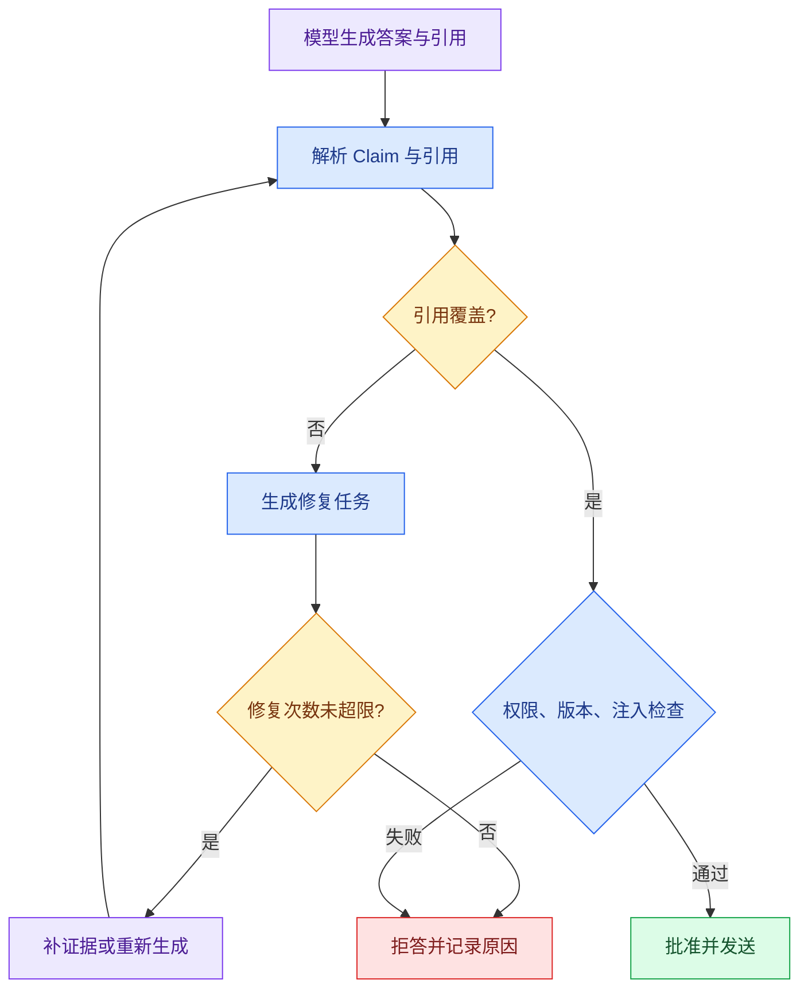

# 验证器、有限修复与安全拒答：答案不可信时怎么办

模型返回一段语法正确的中文，并不等于它可以直接展示。用户问“退款期限是多少”，答案可能引用了错误版本的政策，或用一个公开 FAQ 支撑了企业客户专属条款。工程上要先回答三个问题：答案中的每个 Claim 是否有证据？证据是否属于当前用户？发现问题后能否自动修复，什么时候必须停止？

这篇文章把验证拆成明确的程序阶段。你会实现一个离线**验证器**：输入 Claims、Evidence 和引用关系，输出 `approved`、`repairable` 或 `refused`。这段代码不调用模型，所以每个判断都能被测试和复现。

## 验证器在 Agent 哪个位置



解析节点把自然语言答案变成带 ID 的 Claim。覆盖验证只判断每个 Claim 是否有至少一个证据，不能判断“语义上一定正确”；**权限**和版本验证要读取确定性元数据；注入验证检查证据正文中是否出现要求改变系统规则的指令。修复分支必须带 `repair_count`，否则一个坏答案会无限调用模型。

## 五类验证器分别拥有哪部分真相

“验证答案”不是再问一次模型“你确定吗”。至少要拆成五类，因为它们依赖的真相源、可恢复动作和硬失败边界不同。

### 结构验证器：答案能否被程序读取

输入是生成模型返回的 JSON 或领域对象，处理字段类型、必填项、枚举、长度和 Claim/Reference ID 唯一性，输出 `valid` 或字段路径错误。Pydantic/JSON Schema 很适合这一层。

结构正确只说明“长得像合法答案”，不说明引用存在或事实正确。结构失败可以在预算内重新生成一次，但修复提示只包含字段错误，不能扩大数据范围。

### 引用验证器：对象和原文位置是否存在

输入是 Reference、Evidence 存储和当前 Release，检查 ID、版本、内容哈希、quote 与 source locator。输出具体缺失或过期引用。它是确定性验证，不需要模型。

引用不存在时可以重新绑定当前 Evidence；若来源已删除或候选来自另一个 Release，不能把脚注指向“最接近”的新页面。

### 权限与安全验证器：当前用户能否使用这些内容

输入是服务端身份、Scope、Evidence ACL 和内容安全标记，处理可见性、敏感字段和不可信内容边界。越权和提示注入属于硬失败，不能通过重复模型调用修复。

这层必须在生成前过滤、发布前复核。验证器读取服务端字段，不接受模型声称“用户有权限”。

### 语义支持验证器：原文是否真的支持 Claim

输入是单个原子 Claim 与允许 Evidence，输出 `full/partial/contradicted/unknown`。确定性规则可以先核对数字、单位、否定词和实体；NLI 或验证模型处理更复杂语义；高风险样本进入人工复核。

验证模型也是概率系统，需要独立标注集、版本和阈值。生成模型与验证模型相同也不能视作独立事实证明。

### 冲突与完整性验证器：整份答案能否同时成立

单个 Claim 都有支持，不代表整份答案一致。例如一条 Evidence 说“v7 有效期 7 天”，另一条来自 v8 说“有效期 30 天”；若回答没明确版本，两条局部支持会形成整体冲突。

这层检查所有 required Evidence 槽位是否覆盖、Claim 之间是否矛盾、Release/时间/实体是否一致，以及成功**终态**所需的结论是否齐全。输出可能是澄清、补搜、收窄或拒答。

## 四类失败动作不能混为一谈

| 问题 | 典型信号 | 是否可自动修复 |
| --- | --- | --- |
| 引用缺失 | Claim 没有 Evidence ID | 通常可以，重新检索或删掉 Claim |
| 证据过期 | `release_id` 小于当前版本 | 可以重新按当前版本检索 |
| 权限越界 | `scope` 不在用户范围 | 不应修复，直接拒答或删掉证据 |
| 注入或恶意文本 | 证据要求忽略系统规则 | 不交给模型继续推理，隔离并记录 |

“修复”只适用于信息缺口，不能把权限错误变成重试。验证器的返回值要告诉 Runtime 下一步是重新生成、删减答案，还是进入不可逆拒答终态。

## 数据结构先于算法

一个可审计的验证结果至少包含问题类型、涉及的 Claim、证据 ID、建议动作和修复次数。没有这些字段，日志里只能看到一个“生成失败”，无法知道是召回不足还是用户无权访问。

```python
# 验证结果区分硬失败、可修复缺口和证据不足，Runtime 据此选择修复、澄清或拒答。
from __future__ import annotations

from dataclasses import dataclass
from enum import StrEnum


class Decision(StrEnum):
    APPROVED = "approved"
    REPAIRABLE = "repairable"
    REFUSED = "refused"
# Claim 表示一个可单独核查的事实单元，后续必须为它找到证据或明确拒绝。


@dataclass(frozen=True)
class Claim:
    claim_id: str
    text: str
    evidence_ids: tuple[str, ...]
# Evidence 保存可追溯来源、稳定标识和可见范围，供 Claim 绑定与引用校验。


@dataclass(frozen=True)
class Evidence:
    evidence_id: str
    release_id: int
    visible: bool
    trusted: bool


@dataclass(frozen=True)
class Validation:
    decision: Decision
    reasons: tuple[str, ...]
    repair_count: int


# 校验函数在数据进入下一阶段前执行，失败时返回稳定错误或直接阻断。
def validate_answer(
    claims: tuple[Claim, ...],
    evidence: dict[str, Evidence],
    *,
    current_release: int,
    repair_count: int,
    max_repairs: int = 1,
) -> Validation:
    reasons: list[str] = []
    for claim in claims:
        if not claim.evidence_ids:
            reasons.append(f"{claim.claim_id}:missing_evidence")
            continue
        # 逐项保留正文之外的来源和稳定标识，后续引用才能回到原始位置。
        for evidence_id in claim.evidence_ids:
            item = evidence.get(evidence_id)
            if item is None:
                reasons.append(f"{claim.claim_id}:unknown_evidence")
            elif not item.visible:
                reasons.append(f"{claim.claim_id}:acl_denied")
            elif not item.trusted:
                reasons.append(f"{claim.claim_id}:untrusted_content")
            elif item.release_id != current_release:
                reasons.append(f"{claim.claim_id}:stale_release")
    if not reasons:
        return Validation(Decision.APPROVED, (), repair_count)
    hard_fail = any(reason.endswith(("acl_denied", "untrusted_content")) for reason in reasons)
    # 任何安全或基础设施硬失败都会阻断候选版本，质量分数不能抵消它。
    if hard_fail or repair_count >= max_repairs:
        return Validation(Decision.REFUSED, tuple(reasons), repair_count)
    return Validation(Decision.REPAIRABLE, tuple(reasons), repair_count)


if __name__ == "__main__":
    claims = (Claim("c1", "七天内可退款", ("e1",)), Claim("c2", "企业版需要审批", ()))
    evidence = {"e1": Evidence("e1", release_id=3, visible=True, trusted=True)}
    print(validate_answer(claims, evidence, current_release=3, repair_count=0))
    print(validate_answer(claims, evidence, current_release=3, repair_count=1))
```

`Claim` 只保存答案中可单独核对的一句话；`Evidence` 保存发布版本和安全属性；`Validation` 是 Runtime 的决策输入。`validate_answer` 先遍历 Claim，再逐个查证据：缺失和未知证据属于信息缺口，权限、非可信文本和过期版本则分别记录原因。没有问题时返回 `approved`；有硬失败或已经达到 `max_repairs` 时返回 `refused`；其余情况才允许 Runtime 进入一次修复。

运行示例会先得到 `repairable`，因为第二个 Claim 没有引用；当 `repair_count=1` 时变成 `refused`。注意，示例中的 `trusted` 只是输入字段，生产系统必须由导入管道和安全策略产生，不能让模型自己填写。

这个最小实现把五类验证压缩在一个函数中，是为了观察决策顺序。真实工程应让每个验证器返回统一的 `Finding`：包含 `validator`、`code`、`claim_ids`、`evidence_ids`、`severity` 和 `allowed_action`，再由聚合器决定终态。这样新增数字验证器不会改动 ACL 代码，Trace 也能统计失败发生在哪一层。

## 用 pytest 锁住修复预算和硬失败

下面的测试直接复用前文实现。测试输入分别制造缺引用、越权与正常引用；输出应区分 `repairable`、`refused` 和 `approved`。

为了验证“用 pytest 锁住修复预算和硬失败”，下面的测试把“测试证明引用缺失只能**有限修复**，ACL 与隐私硬失败永远不会被模型重写绕过”变成可执行断言。每个用例自己构造输入，并用断言固定返回值或失败状态；某条测试失败时，可以从用例名直接定位到被破坏的契约。

```python
# 测试证明引用缺失只能有限修复，ACL 与隐私硬失败永远不会被模型重写绕过。
from answer_validation import Claim, Decision, Evidence, validate_answer


# 这个用例核对证据与引用关系，防止无来源 Claim 被当成已经验证的答案。
def test_missing_evidence_gets_one_repair() -> None:
    result = validate_answer(
        (Claim("c1", "七天内可退款", ()),),
        {},
        current_release=3,
        repair_count=0,
        max_repairs=1,
    )
    assert result.decision is Decision.REPAIRABLE
    assert result.reasons == ("c1:missing_evidence",)


# 这个用例固定权限边界：越权字段不能进入结果，也不能触达受保护的数据访问。
def test_acl_failure_is_not_repaired() -> None:
    result = validate_answer(
        (Claim("c1", "内部条款", ("e1",)),),
        {"e1": Evidence("e1", 3, visible=False, trusted=True)},
        current_release=3,
        repair_count=0,
    )
    assert result.decision is Decision.REFUSED
    assert result.reasons == ("c1:acl_denied",)


def test_valid_answer_is_approved() -> None:
    result = validate_answer(
        (Claim("c1", "七天内可退款", ("e1",)),),
        {"e1": Evidence("e1", 3, visible=True, trusted=True)},
        current_release=3,
        repair_count=0,
    )
    assert result.decision is Decision.APPROVED
    assert result.reasons == ()
```

运行 `python -m pytest -q`，预期三条通过。第一条证明信息缺口最多进入一次修复，第二条证明 ACL 不会被当作可重试错误，第三条锁住正常终态。完整测试还要覆盖未知引用、旧 Release、冲突 Evidence、验证模型超时和修复后 Claim ID 变化。

## 有限修复怎样执行，而不偷偷改变问题

修复任务只携带失败 Claim、允许 Evidence ID、稳定错误码和剩余一次预算。允许动作应枚举为 `remove_claim`、`narrow_claim`、`bind_existing_evidence`、`retrieve_missing_slot`；禁止修改 Scope、Release、用户问题和已通过 Claim。

修复后重新运行全部验证器，而不是只重跑失败的一项，因为收窄句子可能改变引用范围。若没有新增 Evidence、相同错误再次出现、Deadline 不足或修复次数耗尽，直接进入 `refused` 或“部分可靠答案”终态。部分答案必须明确哪些问题没有资料，不能用流畅文字掩盖缺口。

## 修复、重试和拒答的边界

修复是改变答案或证据集合后重新验证；重试是同一操作因暂时性错误再次执行，例如网络超时；拒答是系统明确表示当前证据不足或权限不允许。三者的计数器、日志和成本预算要分开。把所有失败都重试会放大供应商故障，把所有失败都拒答又会浪费可以自动补证据的机会。

验证器还应记录“哪一个 Claim 失败、哪一个证据导致失败、下一动作是什么”。前端收到拒答时展示可理解的原因，后台保留结构化事件；这样评测可以统计引用覆盖率、越权拦截率和修复成功率。

## 带走的实践

1. 为答案定义稳定的 Claim ID，并让引用关系使用 ID 而不是文本匹配。
2. 把 ACL、发布版本和可信标记放在 Evidence 元数据中，验证器只读这些字段。
3. 为缺证据、过期、越权和注入分别定义错误码。
4. 独立设置模型重试次数、答案修复次数和总 Deadline。
5. 写四组测试：全部通过、缺引用、越权证据、修复次数耗尽。
6. 把验证使用的 Turn、Scope 与知识版本固定下来，避免修复前后换了一套事实边界。

## 常见问题

### 为什么不能只让另一个模型判断答案是否正确？

模型可以辅助判断语义支持，却不知道服务端真实 ACL、Release、引用对象是否存在，也可能与生成模型共享同一偏差。验证应分层：Schema、引用存在、权限和版本由程序确定；语义支持可由模型结合规则与人工抽样；冲突与完整性读取结构化 Claim。让一个模型输出“通过/不通过”会丢失失败类型，无法决定该修复、重试、澄清还是拒答，也不便建立硬门禁。

### 哪些问题可以自动修复，哪些必须直接拒绝？

引用遗漏、句子范围过宽或缺一个可检索证据槽，在预算和 Scope 不变时可以有限修复；越权 Evidence、敏感信息、提示注入、未知来源和不可解决冲突属于硬失败，不能通过改写绕过。修复任务只携带失败 Claim、允许 Evidence 与枚举动作，并在完成后重跑全部验证器。没有新证据、相同错误重复或 Deadline 不足时停止，返回部分答案或拒答。

### 修复与重试有什么本质差异？

修复改变答案、Claim 或 Evidence 集合，例如收窄陈述、绑定现有引用或补搜缺失槽；重试是在输入与操作语义相同的情况下处理暂时性失败，如网络超时。它们使用不同计数器和预算。参数或权限错误不应原样重试，模型超时也不能通过“修复答案”解决。Trace 分别记录 repair attempt 与 dependency retry，才能判断系统是在提高证据质量还是放大基础设施故障。

### 部分可靠答案应该怎样展示？

只保留已经通过验证的 Claim，每条引用仍可回查；未覆盖的问题明确说明缺少哪类资料或权限，不用流畅过渡暗示完整结论。不能在同一句里混合已支持和猜测内容，也不能把删除的 Claim 留在摘要中。终态可以是 `partial`，事件和 Eval 记录覆盖率与缺口。若用户的问题要求所有条件同时成立，缺一项可能就应整体拒答，是否允许部分回答由任务契约决定。

### 验证器超时后可以默认放行吗？

不可以，尤其是权限、隐私和引用验证。超时表示验证没有完成，不是答案正确。可选的语义评分器超时时，可以按策略使用更保守的确定性结果或拒答；不能为了成功率跳过。整轮 Deadline 要预留验证与终态提交时间，生成阶段不能耗尽全部预算。监控应区分模型生成超时与验证超时，并让候选答案保持不可见，直到最终决策原子提交。

### 有限修复怎样避免改变用户原问题？

Runtime 将用户问题、Scope、Release、已通过 Claim 和修复动作白名单设为不可变输入。修复模型只能删除、收窄、绑定允许 Evidence 或请求某个证据槽，输出再经过 Schema 与语义守恒检查。它不能扩大数据源、换用户实体或重写已通过事实。测试应故意让修复候选加入新结论和越权引用，证明编译器拒绝，而不是只在 Prompt 中要求“不要改变问题”。
