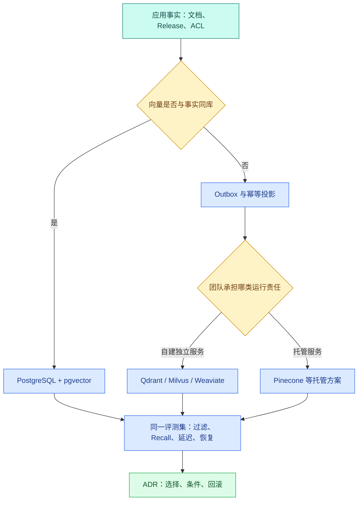

# 向量库怎样选：pgvector、Qdrant、Milvus、Weaviate 与 Pinecone

“我们要做 RAG，向量库选哪个？”这个问题如果从产品名称开始，最后通常会变成一张功能勾选表。真正影响系统的约束往往在功能表之外：用户只能看哪些 Chunk，权限变化多久生效，文档和向量是否需要同一事务，团队能否值守新集群，备份恢复是否演练过，模型换维度时怎样双轨迁移。

向量存储的职责是保存向量、**过滤**元数据并执行精确或近似最近邻检索。它不负责替你保证 Chunk 正确、Embedding 兼容、ACL 没有延迟、引用可追溯或答案有证据。这些仍属于导入、权限、Release、Retriever 和评测。

向量写入链稳定后，选型输入应是一份明确的数据模型与访问约束，输出是一份可验证的 ADR，而不是“某产品最好”。

## 先写数据和查询，再看产品

为一个多租户知识库，向量记录至少需要这些逻辑字段：

```text
chunk_id
knowledge_release_id
tenant_id / visibility_scope / visibility_subjects
document_id / document_version_id
content_hash
embedding_model / revision / dimension
vector
title / section_path / source_location
index_status / deleted_at
```

典型在线查询不是“找最近的十个向量”，而是：

```text
在当前 tenant、用户可见 subject、固定 Release、指定文档范围、未删除状态中，
按与 query vector 的距离取候选，再返回可追溯字段。
```

这意味着过滤正确性是查询语义的一部分。若向量服务的 ACL payload 比关系库晚同步 30 秒，结果再快也可能泄露刚被撤权的 Chunk。

## 三种数据所有权模式

### 同库事实：关系数据与向量在 PostgreSQL

文档、Release、ACL 与向量同库时，一个 SQL 事务可以同时写元数据和向量，一个查询可以用关系条件过滤后排序。**pgvector** 属于这一模式。

优点是所有权清楚、事务和备份路径复用；代价是向量索引、写入和扫描与 OLTP 共用 PostgreSQL 资源，需要容量隔离、查询治理和索引维护。

### 双存储投影：关系库是事实，独立向量服务是投影

关系库保存文档与权限事实，通过 Outbox 把 Chunk、向量、Release 和 ACL payload 投影到 Qdrant、Milvus、**Weaviate** 等独立服务。在线检索在向量服务过滤，再回关系库复核或取详情。

优点是向量负载独立扩展；代价是双写、延迟、删除、回放和灾难恢复更复杂。权限字段不是复制一次就结束，它们每次变化都要产生可重放事件。

### 托管向量服务：平台承担底层运行

**Pinecone** 等托管方案让团队通过服务接口使用索引，节点运维、部分扩缩容和基础可用性由供应商承担。团队仍负责数据模型、Namespace/Metadata 设计、访问控制、导入幂等、备份/导出策略、成本和供应商故障降级。

托管不等于“没有运维”，只是责任边界变化了。



图中的选择不是一次性的。数据规模、过滤复杂度、团队能力和供应商约束变化后，可以重新评估；因此 ADR 必须写触发重新评估的条件。

## 五种方案分别是什么，不是什么

### pgvector

pgvector 是 PostgreSQL 扩展，为表增加向量类型、距离运算符和近似索引。它不是独立数据库。你仍使用 PostgreSQL 的事务、SQL、连接池、备份、复制和权限体系。

适合：已经以 PostgreSQL 为文档/权限事实库，过滤和事务一致性优先，团队熟悉数据库运维，规模可由实测支撑。需要关注：大向量列和 ANN 索引内存、写放大、Autovacuum、连接竞争、备份恢复时间，以及 OLTP 与检索负载隔离。

### Qdrant

**Qdrant** 是独立向量检索服务，通常以 Collection、Point、Vector 与 Payload 组织数据。Payload 可用于过滤，API 边界清楚，适合把向量检索作为独立投影服务。

它不自动知道关系库的用户权限。应用要把 Release、租户和 ACL 所需字段同步为 Payload，并测试过滤与近似索引组合。还要承担 Collection 版本、快照、恢复、扩容和客户端重试。

### Milvus

**Milvus** 面向独立、可扩展的向量数据服务，支持多种索引和分布式部署形态。它适合数据量、吞吐或资源隔离需求已经超过单库边界，并且团队愿意承担更多组件和集群运行责任的场景。

“能扩到很大”不是选择理由。你要用自己的数据验证分片/分区、标量过滤、索引构建、Compaction、备份恢复、版本升级和节点故障。小团队在数据量还很小时引入分布式平台，可能把主要精力花在运行系统而不是提升检索质量。

### Weaviate

Weaviate 以 Collection/Object 等概念组织对象、属性和向量，并提供向量、关键词或混合检索能力。适合希望由独立服务同时管理对象 Schema 与检索接口的团队。

要明确谁是对象事实来源。如果关系库和 Weaviate 都能修改同一字段，会出现双主冲突。Embedding 模块、Schema 迁移、备份恢复、过滤和版本兼容都要在锁定版本上验证。

### Pinecone

Pinecone 是托管向量服务，常以 Index、Namespace、Record/Metadata 等边界组织数据。适合希望减少底层集群运维、能接受网络与供应商依赖，并且成本和合规条件满足的团队。

Namespace 不是完整权限系统；Metadata 过滤仍要正确设计。还要测试区域、数据驻留、配额、批量导入/删除、备份或导出、供应商故障和退出迁移。不能把服务 SLA 直接写成应用端到端 SLO。

## 不能直接横向比较的能力

产品版本、部署形态和付费计划会改变特性。不要把“支持 HNSW”“支持过滤”“支持备份”当作相同实现：

- 过滤是在 ANN 前、后还是迭代执行，会影响 Recall 与延迟；
- 备份是索引快照、数据导出还是跨区恢复，RPO/RTO 不同；
- 多租户可能是字段过滤、Namespace、Collection 或物理隔离，成本和爆炸半径不同；
- 混合检索可能是同一服务原生实现，也可能仍需应用融合；
- 一致性和删除可见时间需要实测，不能只看“支持删除”。

所以先写行为用例，再在候选版本上执行。

## 一张可执行的选型矩阵

| 维度 | 要问的问题 | 验证方式 |
| --- | --- | --- |
| ACL 正确性 | 撤权后多久不可检索 | 撤权并连续查询禁止 ID |
| Release 隔离 | 新旧版本会不会混读 | 同文档双版本 + 固定 Release |
| 过滤后 Recall | 高选择性过滤是否漏召回 | 与精确扫描 Gold Set 对比 |
| 写入/删除 | 幂等 upsert、删除和回放语义 | 重复事件、乱序事件、重建 |
| 模型升级 | 两个维度/revision 如何并存 | 双索引影子查询与切换 |
| 容量 | 数据量、QPS、更新率和向量维度 | 真实分布压测，不用随机小样本代替 |
| 可恢复性 | 备份能否恢复到新环境 | 隔离恢复演练并跑查询集 |
| 可观测性 | 能定位过滤、索引、网络和服务错误吗 | Trace、指标、慢查询/请求日志 |
| 团队责任 | 谁升级、值守、扩容、处理数据一致性 | Runbook 与值班边界 |
| 成本/锁定 | 存储、请求、网络、节点和退出成本 | 月度成本模型 + 导出/迁移实验 |

“裸向量 P95”只占一行，而且必须与 Recall 一起看。近似索引把延迟降下来但漏掉关键证据，不是成功。

## 把选择理由写成可复核评分

评分不能自动替代架构决策，但可以暴露权重和硬性门槛。下面的代码先检查 required 约束，再按团队定义的权重比较候选。输入是需求清单和候选能力分数，输出是可接受状态、加权总分以及缺失的硬约束；运行后可以直接观察为什么某个候选被排除，再把这个结果与前面的选型矩阵逐项核对。

```python
# 评分器只把已经写明的业务权重与证据相乘，缺失数据保持未知，不用主观分数伪造结论。
from __future__ import annotations

from dataclasses import dataclass

@dataclass(frozen=True)
class Requirement:
    name: str
    weight: int
    required: bool = False

@dataclass(frozen=True)
class Candidate:
    name: str
    # 同一文档在不同通道的名次贡献累加到 scores，键使用稳定文档 ID。
    scores: dict[str, int]

@dataclass(frozen=True)
class DecisionRow:
    name: str
    accepted: bool
    score: int
    missing_required: tuple[str, ...]

# 评估函数把安全与基础设施问题作为硬失败，把质量问题保留为人工复核项。
def evaluate(
    requirements: list[Requirement],
    candidates: list[Candidate],
) -> list[DecisionRow]:
    rows: list[DecisionRow] = []
    # 逐个候选检查硬约束并计算可解释得分，最终排序不会修改输入证据。
    for candidate in candidates:
        missing = tuple(
            req.name
            for req in requirements
            if req.required and candidate.scores.get(req.name, 0) == 0
        )
        score = sum(
            req.weight * candidate.scores.get(req.name, 0)
            for req in requirements
        )
        rows.append(DecisionRow(candidate.name, not missing, score, missing))
    # 先排可接受候选，再按加权得分降序；缺失硬约束的方案不会靠高分翻盘。
    return sorted(rows, key=lambda row: (row.accepted, row.score), reverse=True)
```

代码从 `Requirement`、`Candidate`、`DecisionRow` 这些职责点进入，按定义的调用关系读取输入并更新状态，最终把返回值交给本节下游。正常结果要与后文预期一致；参数非法、依赖失败或状态不允许时应抛出或映射稳定错误，不能静默继续。

`Requirement.weight` 表示当前项目重要性，`required` 表示一票否决；候选 score 建议使用 0～3，并附真实实验链接。`evaluate` 先找缺失 required，再计算加权分。排序把通过门槛的候选放前面，即使未通过候选总分较高也不能被选中。

### 为一个同库 ACL 场景填数据

下面的分数只是**示例输入**，不代表产品固定能力或性能。团队必须用锁定版本和自己的验证结果替换。

下面把“为一个同库 ACL 场景填数据”落成最小实现。输入是两组数据：一组是团队已经确认的需求约束，另一组是候选向量库在这些约束上的证据分数。目标不是凭总分拍板，而是先检查 `required=True` 的硬约束，再对剩余能力做加权比较；这样可以观察到“缺少事务或 ACL 能力的候选不能靠其他高分翻盘”。函数返回带有接受状态、总分和缺失项的结果，后续可以把它写入 ADR 或评审表。

```python
# 该场景把事务、ACL 过滤和运维责任设为硬约束，用于比较同库与独立服务的迁移成本。
requirements = [
    Requirement("same_transaction", 5, required=True),
    Requirement("row_acl", 5, required=True),
    Requirement("independent_scaling", 2),
    Requirement("low_ops_burden", 3),
    Requirement("tested_restore", 5, required=True),
]

# 候选分数必须来自文档或实测证据；零分表示不满足或尚未证明。
candidates = [
    Candidate("pgvector", {
        "same_transaction": 3,
        "row_acl": 3,
        "independent_scaling": 1,
        "low_ops_burden": 2,
        "tested_restore": 3,
    }),
    Candidate("independent-service", {
        "same_transaction": 0,
        "row_acl": 1,
        "independent_scaling": 3,
        "low_ops_burden": 1,
        "tested_restore": 3,
    }),
]

# 逐行输出硬约束结果、加权分数和缺失项，选择理由可以被复核。
for row in evaluate(requirements, candidates):
    print(row)
```

这个场景把“同一事务”设为 required，因此独立服务即使扩展分更高，也会因缺失门槛被拒绝。若系统接受 Outbox 最终一致，并能在 Retriever 二次复核 ACL，就应把这个条件从 required 改为带明确延迟 SLO 的评分项，再重跑决策。

代码输入是团队已经验证的事实，输出是透明的候选顺序与缺失门槛。它不会自动证明分数正确，所以 ADR 还要保存每个 score 的实验、版本和日期。

## 多租户隔离不能只选一个字段

常见选择有共享索引 + tenant filter、每租户 Namespace/Partition、每租户 Collection/Index，以及物理实例隔离。隔离越强，资源和运维成本通常越高；共享越多，过滤正确性与“邻居噪声”越重要。

选择时看：租户数量、单租户规模、法规要求、删除/导出、热点差异、单租户故障隔离和索引数量上限。不要为每个小租户无条件创建独立索引，也不要把高敏感租户与公共数据只靠模型 Prompt 隔离。

无论哪种方式，测试都要构造允许与禁止的相似文档，确认禁止 ID 在任何 Top K、分页、查询改写和降级路径中都不出现。

## 过滤与 ANN 的组合要专门评测

假设全库有一百万条向量，当前用户只允许其中 0.1%。如果 ANN 先在全库取 20 条，再后过滤，很可能全部被删掉，即使允许范围内有正确答案。不同数据库可能使用预过滤、后过滤或迭代扩展候选，具体行为与索引和版本相关。

评测必须包含不同过滤选择性：100%、10%、1%、0.1%，并与同 Scope 下的精确扫描比较 Recall@K。观察候选扫描数、延迟和空结果率。不能用无过滤性能推断多租户查询。

## 独立向量服务需要怎样的 Outbox

同一个应用事务先写文档/ACL，再写 Outbox 事件。消费者按 `(chunk_id, content_hash, model_revision, release_id)` 幂等投影。事件包含版本而不是只发“更新了”，这样乱序时可以拒绝旧版本覆盖新版本。

删除、撤权、Release retired 也要产生事件。消费者失败进入可重放状态；发布验证器比较关系库 expected 与向量服务 actual。在线查询在高风险场景还可以回关系库复核候选可见性，代价是额外延迟。

双写代码若直接“数据库 commit 后调用向量 API”，进程在两步之间崩溃就会永久丢投影；先调用向量 API 再 commit 则会留下无事实记录的向量。Outbox 正是为这个不一致窗口提供可恢复记录。

## 迁移和回滚怎样避免同时改三个变量

从旧后端迁移到新后端时，保持 Chunk、Embedding 模型、距离函数和 Rerank 不变，只改变存储。步骤是：

1. 从固定 Release 重放到新后端；
2. 对账数量、hash、维度、过滤字段；
3. 用同一查询集做影子检索，比较 Recall、排名和禁止 ID；
4. 新写入通过 Outbox 同时投影，但旧后端仍服务；
5. 用版本化 Retriever 配置小范围切换；
6. 异常时切回旧配置，不删除新索引；
7. 观察期后再停止双写并按保留策略清理。

如果迁移时同时更换切片和 Embedding，结果变化后无法知道是存储、数据还是模型造成的。

## ADR 应留下什么

```text
场景与数据所有者：
预计向量数、维度、增长、QPS、更新/删除率：
查询中的 tenant/Release/ACL 过滤：
required 门槛：
候选及锁定版本/部署形态：
过滤正确性与 Recall 实验：
容量、延迟与成本实验：
备份恢复证据：
团队运行责任与告警：
双写/Outbox 与权限变更延迟：
模型升级和双索引方案：
选择与放弃理由：
迁移、回滚和重新评估条件：
```

完成 ADR 后，应能解释 pgvector、独立向量服务与托管服务的所有权差异，能把过滤和恢复放在裸性能之前，并能用证据化决策做选择。

## 常见问题

### 已经使用 PostgreSQL，是否应该默认选择 pgvector？

它是很好的基线候选，尤其当关系数据、ACL、知识版本和向量需要同一事务与备份时，但仍要验证规模、查询吞吐、过滤后的 Recall、索引内存和运维窗口。若向量规模或并发远超现有集群规划，专用服务可能更合适。决策不能只看“少一个组件”，也不能只看单次延迟；要把数据所有权、恢复、团队能力和未来增长写入 ADR，并设置重新评估条件。

### Qdrant、Milvus、Weaviate 和 Pinecone 怎样比较才公平？

先锁定部署形态和版本，因为自托管与托管、单机与分布式的责任完全不同。然后用同一数据、Embedding、距离函数、过滤条件和查询集比较导入、更新删除、Recall、延迟、备份恢复、扩缩容和成本。产品能力随版本变化，文章中的静态功能表只能做候选筛选，不能代替 PoC。还要明确谁负责值班、升级和数据迁移，避免把平台便利误算成零运维。

### 为什么过滤能力比“裸向量 QPS”更重要？

多租户 RAG 每次查询通常都带 tenant、Release、ACL 和状态条件。近似索引先取全局 Top-K 再后过滤，可能把可见候选全部挤掉，既降低 Recall 又有越权风险。评测必须使用真实过滤选择性和禁止 ID，观察过滤在索引内、查询计划还是应用层执行。一个无过滤基准很快的产品，放进安全查询后可能需要过采样、分区或独立集合，成本和质量都会变化。

### 独立向量服务中的数据以谁为事实真相？

通常关系库或对象存储保存文档、ACL、版本和 Chunk 真相，向量服务是可重建投影。应用事务通过 Outbox 记录待投影事件，Worker 幂等写入向量服务并回报状态；权限收紧要有明确传播延迟和查询侧复核。若把独立服务视为唯一真相，删除、回滚和重建时很难对账。托管服务也不改变这一原则，只是投影运行责任由供应商承担一部分。

### 向量库迁移时为什么只能一次改变一个主要变量？

若同时更换切片、Embedding、距离函数和存储，Recall 或延迟变化后无法归因，也失去可靠回滚。先固定 Release 与向量数据，只重放到新后端；用影子查询比较数量、禁止 ID、Recall、排名和性能，再通过版本化 Retriever 小范围切换。观察期保留旧后端与配置，异常只切回读取，不急着删除新索引。之后再单独评估模型或切片升级。

### 托管向量数据库是否会消除备份和恢复工作？

供应商可能承担节点、复制和底层备份，但应用仍要知道如何导出或重建向量、恢复到哪个知识 Release、权限元数据是否一致，以及供应商不可用时怎样降级。应实际演练删除集合、区域故障或凭证失效后的恢复，并记录 RPO、RTO 与数据导出成本。若所有向量都能从稳定 Chunk 重建，也要估算重算时间与 Embedding 费用，不能把“可重建”当成即时恢复。
