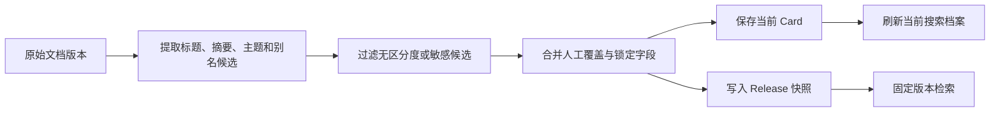
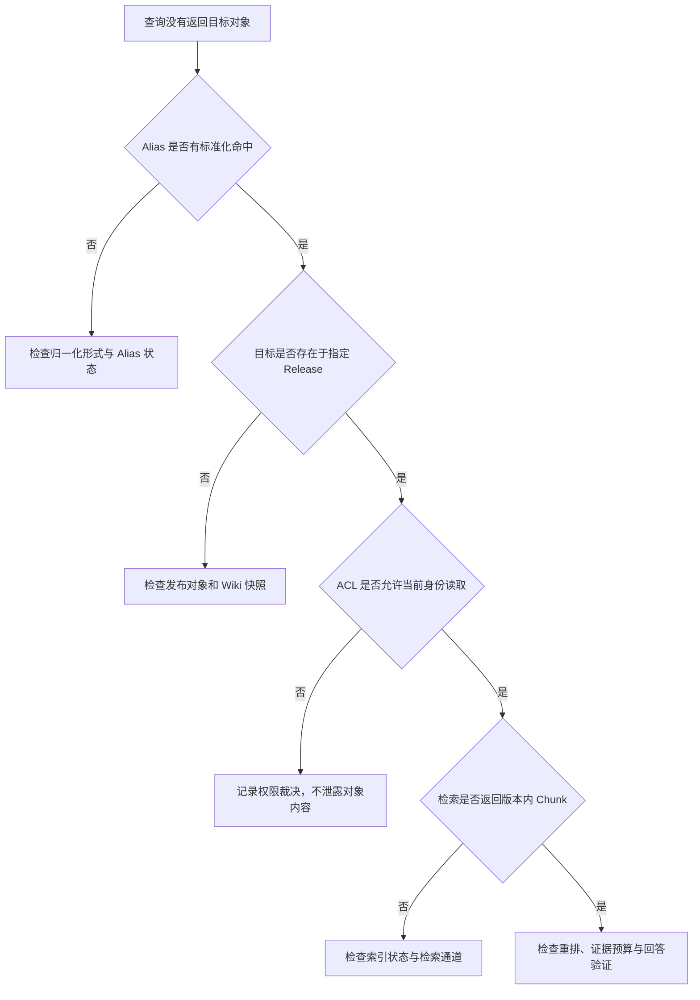
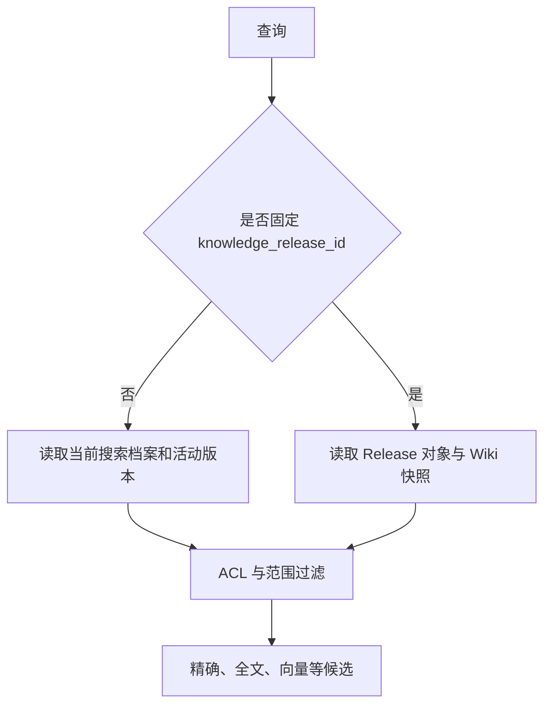

# Wiki、Alias 与知识治理

一套知识库收进几千份文档后，用户通常不会记得文件名。他可能问“六六活动怎么验收”，文档标题却是《AI 66 活动交付规范》。检索系统需要知道这两个名称可能指向同一个知识对象，也需要给出简短说明，让人先确认找对了对象。**Wiki Card** 和 **Alias** 就用来处理这类问题。

麻烦也从这里开始。摘要可能来自自动生成，别名可能来自管理员，查询又必须固定在某个已经发布的知识版本。如果系统把这些信息混进一张可以随意覆盖的表，后台重算一次，就可能把人工修订抹掉；同名对象更新一次，又可能让旧 Release 的查询结果悄悄变化。

这篇围绕一个具体问题展开：文档第 7 版已经发布，管理员把“AI 66 活动”补充为“六六活动”，并人工修订了摘要。第 8 版草稿随后进入系统。用户查询旧 Release 时，应该命中第 7 版的别名和摘要，不能读到第 8 版草稿，也不能因为 Alias 命中而绕过权限检查。

::: info 先分清三个对象

- **原始文档**保存事实内容，是引用和回答的来源。
- **Wiki Card**是文档或知识对象的派生视图，保存标题、摘要、主题、别名和来源版本。
- **Alias**把用户用词映射到候选对象，只参与理解与路由，不证明候选对象可见，也不证明它包含问题答案。

:::

## Wiki Card 把分散字段整理成可追踪的知识视图

Wiki Card 适合承载“这个对象叫什么、通常怎样称呼、主要讲什么”这类导航信息。它不应该复制全文，更不能成为脱离原文独立演化的事实库。答案中的制度条款、负责人、时间和状态仍要从当前用户可见的 Chunk 或结构化系统读取。

可以把一张 Card 看成下面这组字段：

| 字段 | 用途 | 可信来源 | 更新方式 |
| --- | --- | --- | --- |
| `object_id` | 标识稳定知识对象 | 应用分配 | 不随标题变化 |
| `source_version` | 指向生成所依据的文档版本 | 发布系统 | 每次生成时固定 |
| `title` | 显示规范名称 | 文档标题或人工值 | 自动生成，可人工覆盖 |
| `summary` | 帮助人确认对象 | 原文派生或人工值 | 自动生成，可人工锁定 |
| `topics` | 主题导航和图谱候选 | 标签、目录、派生结果 | 需要证据和版本 |
| `aliases` | 查询路由候选 | 标题拆分、导入、人工维护 | 归一化后检查冲突 |
| `status` | 表示待生成、可用、锁定、过期或失败 | 状态机 | 由程序迁移 |
| `content_hash` | 识别来源内容是否变化 | 标题与正文哈希 | 来源变化时重算 |

这里最容易混淆的是 `object_id` 和 `source_version`。前者回答“它是不是同一个知识对象”，后者回答“这次看到的是对象的哪个版本”。规范改名后，`object_id` 可以保持稳定；内容重新发布后，Release 查询必须换成对应的 `source_version`，否则系统只能知道对象没变，却无法证明答案来自哪一版。

Wiki 的生成链路并不长，但每一步的状态归属必须清楚：



提取器可以是确定性程序，也可以包含模型。无论用哪一种，生成结果都只是 `ai_generated` 或 `generated` 层。运行时读取的是自动值与 `admin_override` 合并后的结果。人工值最后合并，后台任务才不会把已经审核的摘要覆盖掉。

::: warning Card 里有摘要，不等于摘要已经成为事实

摘要适合帮助路由和浏览。回答具体问题时，系统仍要检索原文证据。若摘要写着“允许远程访问”，原文却限定为“仅限值班人员”，只返回摘要会丢失决定性条件。

:::

## 自动生成先处理区分度和敏感信息

从标题生成 Alias 看似简单，实际要先排除一批不适合作为路由键的文本。文件扩展名、URL、邮箱、过长字符串和只有一两个字的通用词都缺少区分度。“需求”“文档”“说明”几乎会命中整个知识库，把它们登记为 Alias 只会增加歧义。

标题《【收藏夹】收藏夹优化 - 小程序&Web》可以拆出“收藏夹”“收藏夹优化”“小程序”和“Web”等候选，但不应该无条件全部保存。候选要经过长度、字符组成和重复检查。系统还要限制数量，避免一个标题经过分隔符组合后制造几十个近义名称。

摘要也有一道不同的过滤。若正文首段出现 `Token:`、`Password:`、`Secret:` 或密钥字段，自动提取不能把这一行放进 Card。更严格的做法是只从已经过准入和脱敏处理的文档表示生成摘要，并在生成后再次扫描。这个检查不证明全文没有敏感内容，它只阻止明显秘密进入更容易被搜索和展示的派生层。

自动生成还要保留生成方法和运行时版本。规则发生变化时，系统才能判断哪些 Card 需要重算。只保存最后一段 JSON，看不出它来自旧规则、人工输入还是新模型，后续迁移也无法决定要重算哪些字段。

一张刚生成的 Card 可以按字段完整度计算辅助置信度，但这个分数只表示派生视图的材料是否齐全。它不能代表摘要正确率，更不能替代人工审核。标题、Alias 和主题都有值时分数较高，只说明这张 Card 更适合浏览，并不说明原文中的每项事实都被准确概括。

## 生成任务选同步还是异步

打开一份文档详情时同步生成 Card，实现最直接，调用方也能马上拿到结果。代价是页面延迟被解析器或模型延迟拖长，重复打开还可能触发重复生成。若生成依赖 OCR、外部模型或大批量文档，同步请求一旦超时，服务端任务是否仍在执行也很难向用户说明。

异步生成更适合导入和发布链路。文档写入后先创建 `pending` Card 与生成任务，Worker 领取任务时改为 `processing`，成功后保存自动字段并刷新搜索档案，失败则记录 `last_error` 和尝试次数。管理界面可以继续展示旧的 `ready` 或 `locked` 视图，同时标明新来源正在处理。这样不会因为一次生成失败让整个知识树不可浏览。

异步方案增加了队列、任务幂等和过期结果处理。任务开始时要带来源内容哈希或版本 ID，写回前再次比较。第 7 版任务执行很慢，第 8 版任务先完成时，第 7 版结果只能进入对应的 Release 快照或历史记录，不能覆盖当前 Card。依靠完成时间排序会把最慢的旧任务当成最新结果。

批量重新生成也不应该把目录节点当作文档处理。入口先去重所选 ID，只给存在且类型正确的文档排队。任务表可用知识范围与来源节点组成唯一键，同一个节点再次提交时更新触发原因和优先级；正在处理的任务不强行改回 `pending`。这能减少重复执行，却不能替代 Worker 端的幂等检查，因为消息系统仍可能重复投递。

同步和异步并非只能二选一。确定性的标题拆分、敏感字段过滤可以在写入事务中完成，较慢的摘要与主题生成放入异步任务。发布动作则要等待指定版本的必要派生结果就绪，或明确把 Wiki 标为未就绪，不能一边返回发布成功，一边让固定版本检索随机读取当前 Card。

## 从 Wiki 版本冲突定位治理责任层

Wiki 页面显示“没有结果”时，可能是 Alias 没生成、Card 已过期、Release 没有快照、ACL 拒绝，也可能只是检索没有找到 Chunk。把它们统一记录为 `wiki failed`，排障只能靠猜。



每层留下的证据不同，排障记录也应该分开：

| 责任层 | 最小证据 | 不能据此断言的事 |
| --- | --- | --- |
| Alias | 标准化输入、命中形式、候选对象 ID | 对象对用户可见 |
| Wiki | Card 状态、来源版本、内容哈希、锁定字段 | 摘要中的事实足够回答 |
| Release | Release ID、来源快照 ID、投影状态 | 当前草稿与发布内容相同 |
| ACL | 策略版本、主体摘要、允许或拒绝 | 检索一定有相关内容 |
| Retrieval | 通道、Chunk ID、文档版本、分数 | 候选能够支撑最终 Claim |
| Answer | Claim、Evidence ID、验证结果 | 上游没有遗漏其他证据 |

日志中保存稳定 ID、状态版本和错误类型即可，完整文档、Prompt、凭证和用户隐私不应进入指标标签。请求 ID 用来串联这些层，但每个组件还要记录自己的输入版本。只有请求 ID，没有 `source_version` 或 `policy_version`，仍然无法复现当时为什么命中或拒绝。

重试应回到失败边界。搜索档案刷新失败，可以重做刷新；Release 快照缺失，需要从不可变来源补生成。若 Alias 冲突来自两个真实对象，再跑一次模型不会让歧义消失，系统应停在冲突状态并等待明确选择。

## Alias 归一化解决写法差异，不解决语义歧义

用户输入和管理员登记的名称常有宽字符、空格、标点与数字写法差异。`ＡＩ ６６ 活动`、`AI-66【活动】` 和 `ai66活动` 在路由层通常应该落到同一个比较键。可以先用 Unicode NFKC 把全角字母和数字折叠成常见形式，再转小写并移除空白、标点和符号。

数字还有中文形式的问题。“66 活动”和“六六活动”可能是同一名称。实现时可以为连续数字片段生成阿拉伯数字与中文数字的匹配形式，但要限制片段数量。否则一个包含很多数字的长查询会产生组合爆炸。这里处理的是逐位别名，比如 `66` 与 `六六`；它不负责把 `12` 理解为“十二”，后者需要另一套数值语义，不能混在字符串归一化里。

归一化后的键只消除表面差异。两个团队都把项目叫“统一登录”时，它们会得到同一个 Alias，但指向两个不同对象。此时不能按更新时间选择最近写入者。更新时间说明记录何时变化，不说明用户问的是哪个对象。

较稳的写入流程是：

1. 计算 `normalized_alias`，空键直接拒绝。
2. 在同一知识范围内查找活动 Alias。
3. 没有冲突时写入目标对象并记录操作者。
4. 已有记录指向另一对象时返回冲突，保留两个目标供管理员处理。
5. 只有带明确管理权限的覆盖操作才能更新既有人工记录，并写审计日志。

查询时也不能把第一条匹配直接当答案。Alias 层返回对象候选、命中形式、来源和置信度。查询理解层再结合知识范围、对象类型和用户问题判断是否唯一。仍有多个候选时，应请求补充上下文，或让检索器分别取少量候选后用可见证据消歧。

::: danger Alias 不能授予访问权

命中一个不可见对象的别名，只能说明系统认识这个名称。权限过滤必须发生在返回标题、摘要、Chunk 和图谱关系之前。不能先把不可见对象的 Card 发给模型，再要求模型“不要泄露”。

:::

## Wiki Alias 与业务 Alias 应该分层

工程中常见两类 Alias。Wiki Alias 绑定 Card，主要来自文档标题和主题，用于知识检索；业务 Alias 绑定需求、任务或其他领域对象，通常由管理员维护，用于查询理解和工具参数解析。它们可以共享归一化函数，但不应偷偷共用同一张没有类型边界的表。

原因很具体。“六六活动”作为 Wiki Alias 可能指向一份交付规范；作为业务 Alias 则可能指向一个需求对象。前者适合追加精确检索通道，后者可能让 Agent 调用结构化查询工具。若记录中没有 `target_type` 和 `target_object_id`，路由器无法知道该进入文档检索还是业务查询。

Alias 来源也影响治理方式。人工来源通常比自动标题拆分更值得保留，导入来源需要随上游同步，自动来源则应在下一次生成时替换。这里的优先级用于决定冲突怎样处理和候选怎样排序，不等于人工 Alias 永远正确。管理员也会写错，所以人工变更同样需要前后值、操作者和时间戳。

业务 Alias 的匹配结果可以提前交给 Planner，减少模型对专有名称的猜测。传入的对象仍然是候选：

```text
用户问题
  └─ Alias 匹配：六六活动 -> 候选 requirement-66
       └─ Planner 选择结构化查询或文档检索
            └─ 工具再次校验知识范围与 ACL
                 └─ 返回可见字段或明确拒绝
```

如果 Planner 看到 Alias 后就直接填充答案，路由层便越过了检索和授权。Alias 的职责到“减少名称歧义、提供候选 ID”为止。

## 人工锁定控制字段，不能冻结整个知识对象

管理员可能只修订摘要，不希望标题、主题和 Alias 全部停止更新。因此锁定状态最好细化为 `locked_fields`，例如只锁定 `summary`。自动生成第 8 版时，系统仍可刷新自动 Alias 和主题，合并结果时保留人工摘要。

数据可以分成三层：

| 层 | 示例 | 谁写入 |
| --- | --- | --- |
| 自动结果 | `generated.summary`、`generated.aliases` | 生成任务 |
| 人工覆盖 | `admin_override.summary` | 有权限的管理员 |
| 运行时视图 | `{**generated, **admin_override}` | 程序合并 |

锁定字段存在时，Card 状态记为 `locked`，便于后台任务和管理界面识别。解除全部锁定后，状态可以根据自动结果的置信度回到 `ready` 或 `low_confidence`。这里不能简单把 `locked` 改成 `ready`，否则低完整度的自动结果会被伪装成已经可靠。

来源内容发生变化时，未锁定 Card 进入 `stale`，排队重新生成。锁定 Card 可以继续显示人工值，但仍应标记它依赖的来源版本。锁定的含义是“自动任务不能改这个字段”，不是“旧内容永远有效”。如果原文撤回或 ACL 收紧，锁定摘要也不能继续对无权限用户展示。

生成失败时同样要保护锁定状态。失败记录保存错误类和有限长度的消息，后台任务增加尝试次数；Card 若已锁定，不能因为一次依赖错误就把状态改成普通 `failed` 并丢失人工值。管理界面可以同时显示“人工内容仍在”和“本轮重算失败”，这两个事实并不冲突。

## Release 快照保证旧查询不会读到新草稿

只维护“当前 Card”无法支持可复现查询。第 7 版发布后，第 8 版草稿可能马上修改标题、摘要和 Alias。用户回看第 7 版时若读取当前 Card，答案会混入未来内容。

发布时需要从不可变文档版本生成 Wiki 快照，并把快照放到该来源版本的元数据或独立版本表中。快照至少包含运行时 Card、置信度、状态、生成器版本和内容哈希。生成任务读取 `node_release` 或同等的不可变对象，而不是再次读取当前编辑表。

这条链路有一个容易忽略的写入边界：为旧 Release 补生成 Wiki 时，可以保存 Release 快照，但不应该回写当前 Card。当前文档可能已经进入第 8 版，拿第 7 版结果覆盖它会造成反向污染。程序在保存快照后比较当前节点与 Release 内容，只有确实相同才允许继续刷新当前视图。

检索也必须显式选择版本来源：



假设管理员只在第 7 版快照里登记了“六六活动”，当前 Card 没有这个 Alias。普通当前查询不应命中；携带第 7 版 `knowledge_release_id` 的查询应该命中，而且返回的 Chunk 也必须属于该 Release 关联的文档版本。只让 Alias 固定版本、正文仍读当前 Chunk，依然会拼出跨版本答案。

发布、查询和图谱构建都应使用同一个版本选择规则。某个组件读取 Release Wiki，另一个组件读取当前 Topic，会让同一请求中的别名、关系和正文互相矛盾。

## Topic 进入图谱时必须带回原文证据

Wiki Card 中的 Topic 很适合生成 `has_topic` 关系，但它仍是派生字段。图谱不能只保存“文档 A 具有主题 B”，还要记录这条边来自哪张 Card、哪份文档版本以及什么证据。

确定性标签可以直接生成候选关系，语义提取出的 Topic 需要更谨慎。无论来源如何，关系边都要绑定稳定节点 ID、构建版本和 Evidence。Evidence 可以保存受控的引用片段或明确的来源引用；面向用户展示时，再按当前身份检查该来源是否可见。

如果 Card 状态是 `pending`、`failed` 或 `stale`，图谱构建不应把它当成已确认主题。`ready` 和 `locked` 说明视图可供当前流程使用，但仍不表示 Topic 是全局真理。文档撤回后，可以保留历史构建记录用于审计，活动查询必须过滤已经失效的边。

图谱读取 Release 内容时，也要优先用绑定到文档版本的 Wiki 快照。这样第 7 版的 Topic 关系不会因为第 8 版 Card 更新而变化。图谱的构建版本、Wiki 的来源版本和 RAG Chunk 的文档版本三者对齐，引用才有机会还原。

## ACL 要同时约束路由、检索和派生结果

权限检查只放在最终答案前还不够。Alias、搜索建议、Wiki 树和图谱都可能泄露对象名称、目录结构或摘要。治理链路至少有四个检查位置：

- 写入 Card 时保存来源对象和知识范围，避免生成无归属记录。
- Alias 查询返回候选前按租户或知识库隔离，不能跨范围匹配。
- 检索候选进入重排前检查用户、用户组、对象状态和 Release。
- 返回 Card、Chunk 或图谱关系时再次确认可见性，防止缓存和异步任务带入旧权限。

缓存键需要包含影响可见性的版本和范围。只用标准化 Alias 作为键，会把管理员查询到的对象候选复用给普通用户。若缓存保存的是全量候选，命中后也必须重新鉴权；更容易审计的方案是把权限快照或范围哈希纳入键，并设置失效机制。

撤回与删除也要区分。稳定 ID 和审计记录可以保留，便于解释历史 Release；正文、摘要和搜索档案则按数据策略失效。删除 Alias 后若搜索档案没有刷新，精确检索仍可能命中旧名称。变更事务要把 Alias、审计记录和搜索档案更新纳入同一成功边界，或用可靠事件保证补偿。

## 变更事务和审计记录要回答不同问题

事务保证一组写入同时成功或同时回滚，审计记录解释谁在什么时候改了什么。两者不能互相代替。更新 Card 时，`admin_override`、`locked_fields`、运行时合并值和状态应处在同一事务里；Alias 写入、冲突裁决和对应审计记录也要保持一致。若事务回滚后审计记录仍显示“修改成功”，排障人员会追查一件从未生效的变更。

搜索档案刷新通常比单行更新复杂。可以把它放在同一数据库事务中，换取强一致性；也可以在事务提交后发送可靠事件，由异步消费者刷新。前一种方式容易理解，但刷新 SQL 变慢会延长管理操作的锁持有时间。后一种方式缩短请求事务，却要保存 Outbox、消费位置和重试状态，还要接受短暂的读写延迟。不能只发一条不落库的进程内消息，因为服务在提交后、发送前退出时，Alias 已经更新，搜索档案会永久停在旧值。

审计内容应保存对象类型、对象 ID、动作、操作者、前值和后值。前后值只记录治理字段，不复制原始文档或秘密。对 Release 快照，还要记录生成所用的来源版本和生成器版本。这样才能区分“管理员修改了摘要”“自动任务换了来源版本”和“显示层读取错了版本”。

删除操作同样要有明确语义。停用 Alias 适合保留历史关系，物理删除适合清理错误测试数据。公开查询只读取 `active` 记录，审计和历史 Release 可以保留停用前的状态。若产品允许恢复，恢复动作应产生新的审计事件，而不是直接篡改旧日志。

事务测试可以在隔离连接中完成修改、确认当前事务可见，再主动回滚，最后用新连接查询残留数量。Card、Alias、生成任务和审计表的相关记录都应回到修改前。这个测试证明数据库边界，不证明队列消息已经补偿；异步刷新还需要单独验证事件提交、重复消费和失败重试。

## 一次查询怎样穿过 Alias、Release 和证据过滤

回到 `ai六六活动怎么验收` 这个输入。请求携带 `release-2026-08` 和当前用户身份，系统按下面的顺序处理：

1. 查询归一化得到 `ai六六活动`，并生成受限的数字匹配形式。
2. Alias 注册表返回 `policy-66` 候选，不返回文档正文。
3. Release Catalog 在 `release-2026-08` 中找到该对象的第 7 版 Wiki 快照。
4. ACL 根据当前用户、知识范围和 Release 状态过滤候选。
5. 精确检索使用快照 Alias，RAG 只读取第 7 版关联的 Chunk。
6. 排序结果转成 Evidence，回答中的 Claim 绑定对应引用。
7. 若 Alias 同时指向两个可见对象，请求进入歧义状态，不选择更新时间较新的对象。

下面的共享示例实现了这条链路中最小的本地状态控制。它没有数据库，也没有模型，专门验证归一化、冲突拒绝、字段锁定和 Release 快照。

<<< ../../examples/ai-agent/wiki_governance.py

示例需要 Python 3.11 或更高版本。没有 Python 时可从 [Python 官方下载页](https://www.python.org/downloads/) 选择当前受支持版本。代码只用标准库，创建独立虚拟环境后即可运行：

<figure class="doc-shot">
  
  <figcaption>Python 官方下载页。选择受支持版本后，仍要在项目虚拟环境中运行示例，避免系统 Python 与项目依赖混用。</figcaption>
</figure>

```bash
cd examples/ai-agent
python3 -m venv .venv
source .venv/bin/activate
python wiki_governance.py
```

输出中的 `resolved` 应只有 `policy-66`。当前 Card 即使拿到第 8 版自动摘要，`current_summary` 仍保留管理员锁定值；已发布快照继续指向 `version-7`。

```text
{'resolved': ['policy-66'], 'current_summary': '验收前先核对发布范围。', 'released_version': 'version-7', 'released_summary': '验收前先核对发布范围。'}
```

这个例子能证明纯 Python 控制逻辑符合预期，不能证明数据库唯一约束、事务回滚、并发写入、真实 ACL 或检索 SQL 正确。生产实现还要在真实 PostgreSQL 事务中测试冲突，并用集成夹具验证版本固定检索。

## 测试要覆盖更新之后仍然成立的不变量

只测“能创建 Card”太弱。Wiki 治理真正需要的是跨更新不变量。单元测试可以覆盖 Alias 候选过滤、敏感摘要排除、NFKC 归一化、数字形式和循环目录保护；仓储与检索则需要事务型集成测试。

本地示例的测试命令是：

```bash
cd examples/ai-agent
source .venv/bin/activate
python -m unittest discover -s tests -p 'test_wiki_governance.py'
```

测试中有三条直接断言：宽字符和标点得到同一键；相同 Alias 绑定另一个对象时抛出冲突；自动重算不能覆盖人工摘要，Release 仍读取旧版本快照。它们分别对应输入归一化、写入治理和版本隔离。

数据库层还应补齐这些场景：

| 场景 | 操作 | 应观察到的结果 |
| --- | --- | --- |
| 人工编辑 | 更新 `admin_override` 与 `locked_fields` | 运行时值保留人工内容，并产生审计记录 |
| 重新生成 | 写入新的自动字段 | 锁定字段不变，自动 Alias 按来源替换 |
| 内容变化 | 修改来源内容哈希 | 未锁定 Card 进入 `stale` 并排队 |
| Release 生成 | 发布后再修改当前草稿 | 快照来自发布版本，当前 Card 不被旧值覆盖 |
| 固定版本检索 | Alias 只存在于 Release 快照 | 当前查询不命中，固定 Release 查询命中 |
| 图谱构建 | 从 Wiki Topic 建边 | 边包含文档 ID、版本和 Evidence |
| 事务回滚 | 在事务内修改 Card 与 Alias 后回滚 | Card、Alias 和审计记录都没有残留 |

并发冲突还要用数据库唯一约束兜底。应用先查再写存在竞态，两个请求可能同时看到“没有冲突”。唯一键应至少包含知识范围、标准化 Alias、目标类型和目标对象；若产品要求一个 Alias 在范围内只能指向一个对象，则唯一键要收紧，并把歧义作为显式记录处理。约束怎样设计取决于产品是否允许多义词，但“最后提交的人赢”不应成为默认语义。

## Wiki、词典、实体链接和知识图谱的边界

Wiki Card 适合人类浏览和检索路由，词典适合维护稳定的术语解释，实体链接负责把文本片段映射到候选对象，知识图谱表达带来源的节点关系。四者会共享名称，却不承担同一职责。

如果只需要把几个固定缩写展开，用一张受审计的词典就够了；为了这件事生成整套 Wiki 会增加版本和审核成本。若问题是从长文本中识别“它”“这个项目”具体指谁，重点应放在实体链接和上下文，不应继续扩充 Alias 表。需要跨对象追踪关系时，再让通过治理的 Topic 和 Entity 进入图谱。

Wiki 也不适合保存高频变化的业务状态。订单状态、任务进度和账号权限应从业务系统读取，Card 最多保存入口和对象说明。把动态状态复制进摘要，更新延迟会让它很快过期，还会增加错误回答的机会。

这套设计最终保留了一条可以核对的链路：Alias 解释用户可能在说哪个对象，Wiki Card 帮助确认对象，Release 固定所看的版本，ACL 决定对象是否可见，RAG 和图谱提供带来源证据。任何一层失败都应返回对应状态，而不是用一段看似完整的摘要把缺口盖住。
