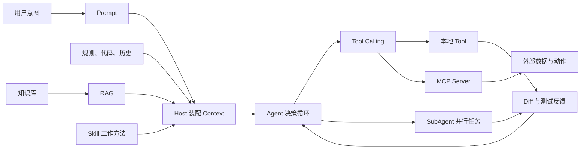
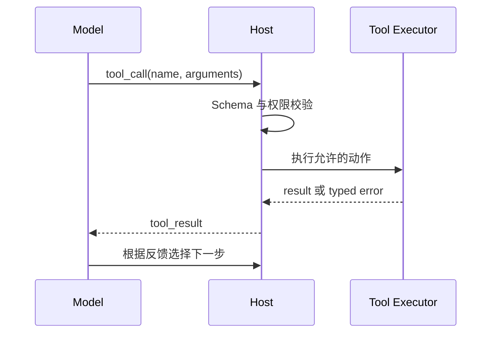
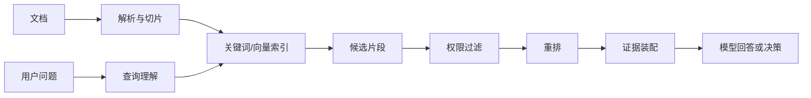

# Prompt、Tool、RAG、Agent、Skill 与 MCP：一张图建立完整认知

“给用户列表增加批量导出，先读项目规范，确认权限和现有接口，完成修改后检查 Diff、运行测试，再准备 PR。”

这句话看起来像一个 Prompt，真正执行时却经过了八种能力。模型要理解意图，Host 要装配规则和代码，Agent 要选择下一步，Tool 才能读取文件或运行测试；遇到当前仓库没有的资料，还要经过检索或 MCP。发布检查若已经反复做过，可以由 Skill 提供方法。影响分析与安全审查彼此独立时，才值得交给 SubAgent 并行取证。

把它们全叫“AI 能力”，故障就只剩一句“模型不行”。把责任拆开后，问题会变得具体：Prompt 是否含糊，Context 是否漏了权限规则，Tool 是否把超时伪装成成功，RAG 是否召回旧文档，还是 Agent 根本没有停止条件。



**这张图最重要的分界是：模型提出动作，执行器产生真实副作用；资料提供证据，Agent 决定下一步。** 任何一层都不该冒充另一层。

## Prompt 是本轮意图，不是整个工程系统

Prompt 是送给模型的一段消息。它可以来自用户，也可以由应用生成。它的作用是表达当前目标、必要约束和期望结果，例如“只修改导出功能，不提交，不部署”。模型接收 Token 序列后，根据已有参数和当前上下文预测后续 Token；Prompt 没有单独的数据库，也不会自行执行命令。

好的 Prompt 会减少模型需要猜的部分，但无法承载整个仓库。把全部编码规范、业务字典、历史决策、几百个文件和外部文档都塞进同一段 Prompt，既浪费窗口，也会让真正影响当前任务的信息被淹没。

在日常工作中，Prompt 最适合表达“这一次有什么不同”：

```text
为用户列表增加批量导出。
只允许管理员导出当前筛选结果；超过 10,000 条转异步任务。
先调查现状并列出未决问题，确认后再改代码。
不要提交、推送或部署。
```

其中，目标和本次授权属于 Prompt；长期代码边界应来自仓库规则；当前实现应由文件工具读取；最新 SDK 行为应通过可信资料查询。**Prompt Engineering 的价值，是把人的意图写到足够可判断，而不是用一段咒语替代系统设计。**

开发 Prompt 相关能力时，应保存真实任务集，观察模型遗漏了哪些信息，再调整任务模板。不要只在一个成功示例上反复润色。能被程序确定的约束，例如允许修改的路径、禁止出现的密钥、测试退出码，应下沉到工具或 CI，而不是期待模型永远记住一句提醒。

## Context 决定模型此刻看见什么

用户只写了一句话，模型实际收到的内容通常还包括系统规则、项目规范、当前对话、文件片段、Tool Schema、检索证据和上一次工具结果。这些合在一起才是 Context。

Context Engineering 解决的不是“写一句更强的提示词”，而是四个更难的问题：选什么、按什么顺序放、给多少预算、怎样标记可信度。一个编码任务至少可能有以下信息源：

| 信息 | 典型来源 | 为什么重要 |
| --- | --- | --- |
| 用户目标与授权 | 当前对话 | 决定要做什么以及哪些动作未经允许 |
| 仓库规则 | 规则文件 | 约束目录、测试、Git 和生产操作 |
| 当前代码 | 文件读取与搜索结果 | 说明系统今天真实如何工作 |
| 依赖行为 | 锁文件、公开文档、源码 | 防止按过期记忆调用 API |
| 执行反馈 | Diff、测试、日志 | 决定下一轮是修复、停止还是交付 |

模型窗口有限，装配器必须保留高优先级规则和当前证据，并压缩冗长历史。外部网页即使相关，也只是**不可信数据**，不能覆盖系统规则或替用户授予权限。工作中学会识别 Context 问题，可以避免无效地重写 Prompt：Agent 忘了子目录约束，可能是规则被截断；反复读同一文件，可能是工具结果没有形成可复用摘要；引用旧接口，可能是检索结果缺少版本标签。

最小的 Context 装配器不需要模型。它可以给每段材料记录来源、优先级、Token 估算和可信级别，在总预算内确定性选择。复杂系统再加入语义相关性、缓存和压缩，但权限规则不能被“相关性较低”淘汰。

## Tool Calling 让语言意图进入真实世界

模型不会真的读取磁盘。它只能产生类似“调用 `read_file`，参数为某个路径”的结构化候选。Host 校验参数，检查权限，调用本地函数或远程服务，再把结果作为新消息交回模型。这个往返才是 Tool Calling。



Function Calling 通常描述同一机制的模型接口视角：模型按函数 Schema 生成名称与参数。Tool Calling 更强调函数背后可能是文件系统、浏览器、数据库或 MCP Server。两者都不等于模型执行了函数。

Tool 的开发质量首先体现在契约，而非描述写得多漂亮。名称要能区分动作，参数只允许业务真正需要的字段，身份与租户范围由服务端上下文注入，输出要区分空结果、拒绝、超时和失败。写操作还要考虑幂等、审批和审计。

例如导出工具不应接受模型填写的 `is_admin: true`，而应从已认证会话得到操作者：

```jsonc
{
  "name": "request_order_export",
  "arguments": {
    "filters": { "status": "paid" },
    "format": "csv"
    // actor、tenant 与权限由服务端注入，模型不能伪造。
  }
}
```

学会 Tool Calling 后，工作收益很直接：把“请认真检查”改成可执行的 lint，把“看看数据库”改成受限只读查询，把“应该发布成功了”改成有状态码和发布 ID 的结果。模型负责判断，确定性系统负责事实。

## RAG 不是搜索框，它是一条证据生产线

当前代码可以直接读，几十万页企业文档却不能全部进入 Context。RAG 先在模型调用之外准备知识，再按问题找到少量相关证据。完整链路通常包括导入、解析、切片、索引、查询理解、召回、重排、权限过滤和证据装配。



RAG 的核心不是“向量数据库”，而是**在正确权限和版本下，把可追溯证据送进当前推理**。向量召回擅长语义相似，却可能错过精确错误码；关键词搜索擅长字面匹配，却不理解同义表达。实际系统经常混合两路候选，再重排和去重。

开发 RAG 时，应先建立问题与相关片段的评测集。没有评测集就无法知道错误发生在召回还是生成。文档更新要形成版本化 Release，避免一半新索引、一半旧索引同时回答；权限必须在检索层强制，不能先召回越权内容再要求模型忽略。

对工作而言，RAG 适合政策、产品手册、历史决策和大量业务文档。只有少量稳定规范时，直接放入项目规则或 Skill reference 更简单；需要精确实时数值时，应调用 Tool，而非期待向量索引立即同步。

## Agent 是带状态和反馈的控制循环

单次模型调用会给出一个结果，Agent 则会观察当前状态，选择动作，接收反馈，再决定继续、修复、询问或停止。任务中的“先查代码，再改文件，失败后定位测试”就是控制循环。

可以把最小 Agent 写成一个状态机：

```python
while state.status == "running":
    decision = model.choose_next(context=assemble(state))
    action = policy.validate(decision)
    observation = tools.execute(action)
    state = reducer.apply(state, action, observation)

    if state.steps >= state.step_budget:
        state.status = "budget_exhausted"
```

真正困难的部分不在 `while`，而在状态、策略和终态。Agent 需要知道已读文件、已改范围、测试结果、剩余预算和未决问题；相同 Tool Call 重复失败时要停止；用户取消后不能被下一轮覆盖；写操作超时不能盲目重试。

固定步骤、低不确定性的任务通常用工作流更可靠。只有下一步确实依赖中间反馈、路径无法预先完整枚举时，才需要让模型参与路由。**Agent 的价值来自受控自主性，不来自把所有步骤交给模型。**

学习 Agent 原理后，你会更容易设计可恢复的开发任务：测试失败进入修复分支，需求缺信息进入询问终态，越权动作进入拒绝终态，达到预算则交付证据而非无限循环。

## Skill 把一次成功方法变成可重复能力

第一次做文章发布检查时，可以用 Prompt 详细说明 Frontmatter、链接、隐私和构建命令。第五次还在复制同一段文字，说明稳定方法值得沉淀。

Skill 通常由一个短入口和按需资源组成。描述帮助 Host 判断何时加载，`SKILL.md` 组织步骤，`scripts/` 承担确定检查，`references/` 保存长规范，`assets/` 提供输出模板。它没有训练新模型，也不会自动获得额外权限；执行者仍是当前 Agent。

Skill 在链路里的位置类似“可加载的作业方法”。Prompt 说这次要检查哪篇文章，Skill 提供如何检查，Tool 读取文件并运行脚本，Agent整合语义判断。适合开发 Skill 的信号包括重复 Prompt、固定检查表、频繁发生同类纠错和稳定的产物格式。

开发时先收集真实任务说法与失败例，而不是先写一份很长的 `SKILL.md`。触发描述要覆盖“帮我验收这篇文章”之类自然表达，同时避免普通润色也误触发发布流程。确定步骤用脚本回归，语义步骤用正反案例评测。**Skill 的价值是稳定方法，不是囤积知识。**

## MCP 统一的是连接方式

本地 Tool 可以直接注册在某个应用里，但企业数据散落在设计平台、知识库、事件分析和浏览器环境中。每个 Host 都写一套私有插件，能力发现、认证和升级会反复实现。MCP 用统一协议连接 Host 与 Server，让客户端发现 Tool、Resource 等能力并按约定调用。

MCP Server 是能力提供方，Client 负责建立连接和协议会话，Host 把能力呈现给模型并执行安全策略，Transport 负责 stdio 或 HTTP 等消息传输。模型仍然只产生 Tool Calling 意图；MCP 不会替业务 API 完成授权，也不会自动把外部数据变可信。

开发 MCP 的起点应是工作摩擦：是否每天跨系统复制数据，是否需要当前状态，是否有多个 Agent Host 需要同一能力，动作能否设计成窄而稳定的契约。若只在一个脚本中调用一次 API，普通客户端更轻；若资料适合批量索引，RAG 更合适；若重复的是方法，优先做 Skill。

一个好的 MCP Tool 会隐藏后端偶然细节，返回稳定领域对象，并明确超时、限流、拒绝和结果未知。Server 还要处理身份、租户、审计、幂等、速率限制和部署。协议减少重复胶水，**业务安全仍是 Server 的责任**。

## SubAgent 用上下文隔离换并行

批量导出功能可能同时需要调查前端入口、后端权限、已有测试和发布风险。若四项工作输入独立、只读取证且输出格式明确，可以交给四个 SubAgent 并行。它们各自拥有较小上下文，减少互相污染，主 Agent 最后合并证据。

并行不是免费加速。子任务需要清晰目标、范围、工具权限、完成条件和输出格式；结果可能冲突，主 Agent 还要验证。多个 Agent 同时修改同一文件、依赖上一步 Schema 决策或竞争同一外部状态时，合并成本会超过收益。

SubAgent 在链路中不是更高级的 Tool。Tool 给出确定执行结果，SubAgent 会自行推理和调用工具，因此输出仍需审查。它最适合代码检索、安全取证、测试调查和互相独立的方案比较；最后的需求判断、冲突解决、工作区写入与交付责任应由主 Agent 收口。

## 回到这次开发任务

现在可以把最初的一句话还原成真实执行轨迹：

1. 用户 Prompt 给出批量导出的目标与授权。
2. Host 将仓库规则、当前对话和 Tool Schema 装入 Context。
3. Agent 选择读取目录、搜索权限实现和测试。
4. 文件 Tool 返回当前代码；RAG 或文档 MCP 提供相关规范。
5. 独立影响分析可委派给 SubAgent，主 Agent合并证据并制定修改。
6. Agent 通过编辑 Tool 产生原子 Diff，再读取 Diff 和测试输出形成反馈。
7. 发布检查 Skill 提供既有检查方法，脚本执行确定门禁。
8. Agent 达到完成条件后准备 PR 说明；是否提交、创建 PR 或部署，仍取决于真实授权。

遇到新需求时，不必把八种能力全部堆上去。先问问题缺的是意图、上下文、知识、动作、控制、方法、连接还是并行，再选择最小组件。**能准确删除不需要的能力，才算真正理解了这张图。**

## 常见问题

### Tool、Skill 和 MCP 都能复用能力，应该先选哪个？

先看要复用的究竟是什么。单个应用内部需要一次确定动作，直接注册 Tool 最省事；多个 Host 都要连接同一个实时系统，并且需要统一发现、认证和错误契约时，再考虑 MCP。若重复的是检查顺序、判断标准和交付格式，Skill 更贴切。可以用同一项任务做判断：它依赖实时外部状态，就偏向 Tool 或 MCP；它主要依赖稳定方法，就偏向 Skill。三者可以组合，但不必为一次性脚本增加协议层。

### 已经有 RAG，为什么还要管理 Context？

RAG 只负责从知识源产生候选证据，Context 还要容纳用户目标、对话状态、项目规则、工具结果和当前工作区事实。召回正确并不表示装配正确：片段可能超过预算、版本互相冲突，或权限标签在进入模型前丢失。排查时应分别记录查询、候选、重排结果和最终装配内容，确认关键规则是否被截断、证据是否属于当前版本，以及模型回答中的 Claim 能否回到具体片段。
