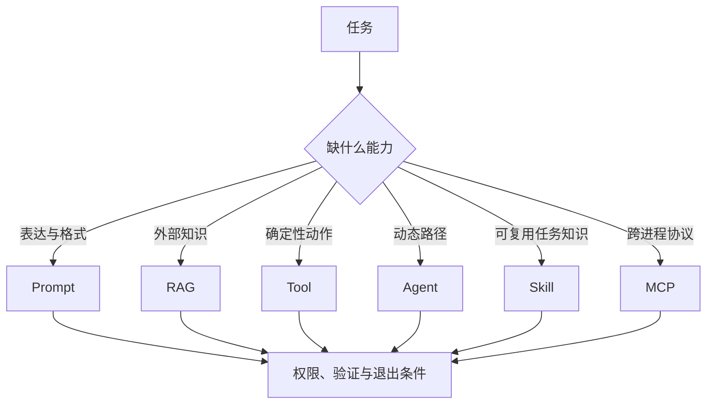

# AI 能力选型：Prompt、RAG、Tool、Agent、Skill 与 MCP

用同一个开发任务比较六类能力的输入、控制、数据、执行和失败边界。**Prompt**、**RAG**、**Tool** 分别指向同一条执行链上的不同对象：任务目标、知识新鲜度、动作副作用、复用范围、交互协议和失败代价进入系统，候选能力、必要数据、控制权、运行成本、权限要求、验证方式和退出条件保存处理中间状态，最终得到最小能力组合、明确不采用项、验证计划和升级条件。

AI 能力选型位于研发任务进入实现之前的能力决策层，主要机制是先判断任务缺的是表达、外部知识、确定性动作、动态决策、可复用任务知识还是跨进程协议，再分别选择 Prompt、RAG、Tool、Agent、Skill 或 MCP。把所有需求都做成 Agent、用 MCP 包装一次性脚本、用 Prompt 代替权限、用 RAG 代替数据库查询和为了复用提前抽象会让链路在不同位置停止，错误记录必须保留发生阶段、当时的状态和终止原因。

::: info 贯穿示例

AI 能力选型场景：团队希望自动检查一批文章，同时未来可能接入编辑器和 CI，需要判断先写脚本、Skill 还是 MCP Server。AI 能力选型需要的身份、权限、版本和业务事实由应用提供，模型与外部内容只产生候选。

:::

## 先判断任务缺的是什么

把所有需求都做成 Agent 会破坏候选能力与最小能力组合之间的对应关系，排查时先保留原始输入摘要和发生阶段，再判断是否允许重试。

用 MCP 包装一次性脚本影响必要数据或下游解释，不能和把所有需求都做成 Agent 共用“重新调用一次模型”的处理方式。

## 从确定性步骤到模型决策

Prompt 实践中，执行者负责计划和改动，工具提供证据，脚本负责可重复检查。因此候选能力与必要数据要有唯一写入方，其他组件只能通过版本化命令申请修改。

Prompt 与 AI 能力选型解决的问题相邻，但控制权不同，比较时要看谁选择选择能力、谁保存候选能力、谁确认最小能力组合。

RAG 可以参与同一请求，却不能替代 AI 能力选型；组合后仍要单独检查知识新鲜度的可信来源和把所有需求都做成 Agent 的终止规则。

AI 能力选型使用的身份、范围和版本来自可信运行时，任务目标可以表达意图，但不能提升权限或改写活动 Release。

用 MCP 包装一次性脚本发生时，错误回到必要数据的所有者处理，上游缺输入、当前组件违反不变量和下游不可用分别形成不同终态。

AI 能力选型的确定性边界位于候选能力写入之前。模型在 Prompt 中只提交候选值，程序仍要从认证、版本和策略快照补入可信字段。

AI 能力选型内部可以使用更细的临时对象，跨边界只暴露稳定协议。替换 Prompt 时，调用方不需要理解内部缓存和 SDK 响应。

## 每种能力的状态和证据要求

AI 能力选型的输入合同至少列出任务目标、知识新鲜度和动作副作用，每项都注明来源、是否必需、允许的缺省值，以及缺失后是在入口拒绝还是进入降级路径。

能力选型要把候选能力、适用条件和执行责任分开。候选记录说明当前正在比较什么，必要数据固定成本、延迟和权限假设，控制权则明确由程序、模型还是人工决定下一步；否则一张“能力清单”无法支撑复盘。

并发分支按稳定身份合并控制权，完成顺序只反映耗时，不能决定结果属于哪个请求，更不能让迟到的旧状态覆盖新修订。

输出合同同时描述最小能力组合和明确不采用项，并为拒绝、取消、部分完成和未知状态提供固定形状，调用方据此分支，无需解析错误文案猜测结果。

必要数据参与乐观并发检查；处理开始后若版本变化，旧候选只保留作审计，不能继续写入候选能力。

任务目标里若包含模型填写的同名字段，应用会丢弃它，再从认证、配置或活动版本中补入可信值，因为结构校验通过不等于授权或业务校验通过。

需求假设、文件定位、差异、命令输出、失败说明和回滚入口组成 AI 能力选型的最小追踪材料，日志只保存稳定 ID、版本和错误类，完整 Prompt、文档正文与凭证不进入指标标签。

撤回或删除知识新鲜度时，相关缓存、候选和未完成任务按版本失效；稳定 ID 可以保留审计关系，已撤回内容不能继续进入最小能力组合。

契约还需要描述新鲜度。必要数据对应的数据发生变化后，旧缓存、旧候选和未完成任务怎样失效，应由版本或时间规则直接判断，不能依赖模型注意到矛盾。

删除和撤回也属于数据生命周期。AI 能力选型引用的原始对象被移除时，稳定 ID 可以保留审计关系，正文与派生结果则按策略失效，避免继续向用户展示过期内容。

::: warning AI 能力选型的可信边界

最小能力组合通过结构校验后仍是候选。AI 能力选型使用的身份、权限、知识版本与业务事实由应用从可信服务读取，核对完成后才能执行或交付。

:::

## 选择能力时怎样限制副作用

AI 能力选型要用同一任务做对照：先写出它需要的输入、外部事实、动作权限和验收条件，再分别画出 Prompt、RAG、Tool、Agent、Skill 与 MCP 的数据流。删掉某个组件后若状态和验证仍然完整，就不应为了术语而保留它。

读取任务约束接收任务目标并建立候选能力，入口校验未通过就地结束，后续模型、检索器或工具调用次数保持为零。

选择能力读取必要数据并执行主题逻辑，参数由应用组装，外部返回先保存为明确不采用项，尚未获得修改领域状态的资格。

执行最小改动检查结构、范围、版本和主题不变量；最小能力组合缺少来源、落在旧版本或越过权限时，候选能力停在 rejected 或 failed。

验证并交付先保存最小能力组合与终止原因，再产生事件或通知，交付失败可以重放，核心状态写入失败则不能对外宣称完成。

选择能力出现部分结果时，由任务合同决定保留、补偿还是整体丢弃；最小能力组合若可重建就重新生成，外部副作用则查询回执或执行补偿。

实现可以使用函数、Graph、Middleware 或 Workflow，候选能力的所有权和把所有需求都做成 Agent 的停止规则不会随框架改变。

部分成功需要在步骤边界处理。选择能力已经产生一部分最小能力组合时，程序按任务合同决定保留、补偿或整体丢弃，并记录未完成项，不能默认为全部成功。

选择能力和执行最小改动都要写明逆向动作或不可逆原因，最小能力组合若可重建就删除后重算，已发送的外部命令只能查询回执或补偿。

## 沿一次制度查询推演选型

沿“AI 能力选型场景：团队希望自动检查一批文章，同时未来可能接入编辑器和 CI，需要判断先写脚本、Skill 还是 MCP Server”推演 AI 能力选型：入口创建 request_id，读取可信身份，把任务目标和当前版本写入初始状态。

读取任务约束生成候选能力与输入摘要；若知识新鲜度缺失，请求返回 rejected，并指出缺少哪项材料，不继续消耗模型或外部服务配额。

选择能力按“先判断任务缺的是表达、外部知识、确定性动作、动态决策、可复用任务知识还是跨进程协议，再分别选择 Prompt、RAG、Tool、Agent、Skill 或 MCP”推进，每次依赖调用保存 call_id、参数摘要、开始时间与状态版本，以便判断超时前是否已经产生结果。

候选结果对应最小能力组合、明确不采用项、验证计划和升级条件，执行最小改动逐项检查权限、版本与领域约束，问题列表为空才允许形成下一状态。

验证并交付写入终态；客户端断开只影响交付通道，重新连接时读取已经保存的候选能力或事件游标，不重跑核心逻辑。

故障注入选择用 Prompt 代替权限，程序保留原候选和错误位置，只重做失败边界，不能从入口复制整个任务并产生第二份状态。

推演结束后用 request_id 关联候选能力、最小能力组合与终止原因，测试据此排除并发请求串线，并确认失败路径没有遗留未关闭资源。

AI 能力选型在输入拒绝时不调用依赖，正常路径按 5 个阶段推进，有限修复只重做失败边界。调用次数是控制流断言，不是性能宣传。

AI 能力选型的最终记录用 request_id 关联候选能力、最小能力组合和失败问题，测试据此证明结果来自本次执行，没有混入并发请求。

## 最小方案怎样交付

AI 能力选型正常完成时，候选能力、必要数据和最小能力组合指向同一次执行，重复读取返回同一终态，未完成分支已经取消或有明确所有者。

需求假设、文件定位、差异、命令输出、失败说明和回滚入口用于还原 AI 能力选型的处理过程，可以按阶段和版本聚合；敏感正文留在受控存储中，不复制到日志与指标。

明确不采用项可能是合法的空结果，但必须带范围、版本和原因；任务明确要求找到材料时，同一个空结果进入拒答而非成功。

依赖返回成功状态只证明传输完成。AI 能力选型还要检查最小能力组合是否满足业务范围、质量阈值和当前版本，明确拒绝也可能是正确终态。

候选能力的状态迁移必须单调：完成不能退回运行中，取消不能被迟到结果覆盖，失败重试也不能绕过入口已经固定的权限。

AI 能力选型的成功证据最终要同时回答输入是什么、执行了哪些步骤、交付了什么以及为什么停止；任一项缺失都应留在未确认状态。

AI 能力选型把业务验收与服务健康分开。依赖返回 200 只说明传输成功，最小能力组合仍要满足当前范围和质量要求；明确拒答也可能是正确终态。

AI 能力选型的观测指标按阶段和版本聚合。评估 Prompt 时，把错误、空结果、拒绝、恢复和资源消耗分开统计，避免一个成功率掩盖不同故障。

## 选错能力时怎样回退

能力选型的错误要沿决策链定位：输入描述不清是需求问题，能力边界不符是选型问题，外部依赖不可用是运行问题，结果无法验收是交付问题。先修正所属层，再决定是否换模型或增加工具。

遇到把所有需求都做成 Agent 时，先记录发生阶段、错误类别和责任对象。AI 能力选型保留输入摘要和状态版本，由对应组件决定重试、降级或终止。

遇到用 MCP 包装一次性脚本时，先记录发生阶段、错误类别和责任对象。AI 能力选型保留输入摘要和状态版本，由对应组件决定重试、降级或终止。

用 Prompt 代替权限触及 AI 能力选型的安全边界，重试不会使它自动合法；执行路径保存拒绝规则和输入来源，清除未授权候选，并以稳定错误结束当前动作。

遇到用 RAG 代替数据库查询时，先记录发生阶段、错误类别和责任对象。AI 能力选型保留输入摘要和状态版本，由对应组件决定重试、降级或终止。

遇到为了复用提前抽象时，先记录发生阶段、错误类别和责任对象。AI 能力选型保留输入摘要和状态版本，由对应组件决定重试、降级或终止。

AI 能力选型将终态、可重试性和资源清理结果写入记录；后台扫描器根据候选能力判断任务是在运行、等待恢复还是已失败。

AI 能力选型执行前固定 Deadline、动作上限、重复签名、无进展阈值、预算和取消信号；任一条件触发，选择能力停止创建新工作。

AI 能力选型把重试时间和次数计入总预算。Prompt 每次重试先扣减剩余额度，达到上限就保留原始错误。

AI 能力选型的清理动作设计成幂等操作；仍被活动任务或 Lease 引用的资源拒绝删除。

## 用同一组样本比较方案

用同一开发任务分别画出六种方案的输入、状态、控制者、输出和失败，选择状态最少且能满足需求的一种；测试显式给出任务目标、初始候选能力、预期最小能力组合和终止原因，不能只断言返回值非空。

AI 能力选型的单元测试用 Fake Adapter 固定最小能力组合与错误，断言参数、调用顺序、状态修订和清理动作，这些结果只证明本地控制逻辑。

契约测试围绕任务目标、候选能力和明确不采用项构造合法与非法样本，Schema 解析成功后继续检查权限、版本与领域不变量。

故障测试注入把所有需求都做成 Agent 和用 MCP 包装一次性脚本，记录选择能力是否被调用、候选能力是否改变、资源是否释放，以及同一身份重试会不会重复执行。

AI 能力选型的集成测试连接真实协议与隔离存储，检查序列化、约束、并发和超时；需要在线服务时另行记录服务版本、时间、配置与凭证条件。

AI 能力选型的回归报告要保留失败类型分布。在 Prompt 的回归中，拒绝、超时、权限错误和空结果必须保持各自类型，状态变化本身就是行为契约。

AI 能力选型的性质测试随机改变候选能力顺序、重复提交、完成顺序或状态版本，断言权限不扩大、终态不倒退、同一身份不产生两次副作用。

Prompt 的离线评测关注质量变化，运行时测试关注控制和恢复，两类证据都齐全才可交付。AI 能力选型只有两类证据都存在，才能同时回答“结果是否合格”和“系统是否安全完成”。

## 成本、权限和长期维护

能力选型记录候选能力的版本、输入输出合同、维护责任和依赖成本。候选方案升级时保留旧版本的评测结果，避免用新的字段解释过去的判断。

AI 能力选型的容量主要受上下文大小、并行任务、外部工具、测试时长和审查成本影响，并发可能缩短单次等待，也会占用连接、配额、内存和下游吞吐，必须沿读取任务约束、收集仓库证据、选择能力、执行最小改动、验证并交付逐层核算。

AI 能力选型的候选版本在固定样本上比较正确性、错误类型、延迟和资源消耗，把所有需求都做成 Agent 等安全红线回归时直接停止发布，不能用平均质量抵消。

把所有需求都做成 Agent 的降级路径在发布前写好，可以减少非关键增强、返回已经确认的最小能力组合，或明确暂时无法确认，缺失事实不能交给模型补写。

选型争议先用 `request_id` 找到目标、约束、候选清单、评测输入和实际失败，再判断缺的是能力、数据还是确定性流程。证据不足时保留未决项，不用模型生成的结论填空。

AI 能力选型的数据按证据用途分级保留，聚合字段可以留得更久，任务目标和大体积最小能力组合设置短期限、访问控制与删除通道。

AI 能力选型先在单进程实现候选能力、超时、错误和测试，只有恢复与容量证据提出要求时，再增加队列、Lease、分布式缓存或工作流引擎。

AI 能力选型的监控阈值要对应可执行动作。

回滚要覆盖代码之外的状态。AI 能力选型若改变 Schema、缓存键或持久化记录，旧版本是否还能读取新写入数据必须提前验证；无法双向兼容时采用候选版本隔离。

## 什么时候不该增加新能力

采用 AI 能力选型前先画出任务目标到最小能力组合的最小控制图；固定函数已经能完成任务时，新增模型决策和跨进程候选能力只会扩大测试与运维范围。

Prompt 调整的是一次调用的表达，能力选型决定是否引入新的模型、工具或运行时。选择过程由约束和测试驱动，模型可以帮忙整理候选，但不能替业务确认成本、权限和失败代价。

RAG 可以与 AI 能力选型组合，但外部知识仍需授权，工具调用仍需校验，模型产生的最小能力组合仍停留在候选状态。

AI 能力选型适合价值足够、把所有需求都做成 Agent 可观察且预算可接受的任务，高风险、不可逆的决定需要确定性规则或人工批准。

格式正确但事实错误的最小能力组合是必要反例；若它直接进入成功，说明执行最小改动缺少业务验证，应保留候选并给出证据问题。

执行期间修改必要数据可以检验并发设计，旧动作若仍能覆盖候选能力，说明版本或 Lease 有缺口，增加 Prompt 规则无法修复这类竞态。

能力选型会增加依赖调用和恢复责任。记录中要把新增的停止、降级与回滚路径写清楚。

先用一个候选能力、几类明确错误和确定性测试验证选择，再考虑并发、缓存或队列。

如果任务有固定输入输出和少量分支，先用脚本或工作流，不要因为有模型就把它升级成 Agent。

## 用决策表选择最小能力

先把需求写成输入、输出、确定性规则和失败代价。只需要改写一段已知文本时，Prompt 加模型就够了；需要读取当前制度时增加受权限约束的 RAG；需要调用一个稳定接口时使用 Tool；分支数量有限且顺序固定时写 Workflow；中间观察会改变下一步并且动作集合可控时才引入 Agent。Skill 和 MCP 解决能力复用与发现，不自动增加自主性。

选择时记录四项证据：数据是否实时、是否包含副作用、失败能否重试、结果是否必须逐字段验证。实时账号状态不能靠模型记忆，发送邮件不能只靠自然语言确认，重复执行可能产生费用的动作需要幂等键。若一个固定函数和 schema 已经能满足验收，Agent 只会增加延迟、Token、观测和安全面。

一次选型评审应保留被拒方案以及原因。比如文档问答采用 RAG 加结构化验证，而不是让 Agent 自由选择多个检索器；当问题出现权限拒绝时，程序直接结束，不让模型改写范围。后续需求改变时，按新增证据更新能力边界，再做小范围实验和回归，不用先搭完整平台。

## 能力选型的决策自测

把“同一需求分别尝试 Prompt、RAG、Tool、Agent、Skill 和 MCP”缩成一个本地可以完成的小实验。入口先写目标、输入、可修改范围和验收命令，事实新鲜度、分支不确定性、动作副作用和维护成本由文件或内存仓库保存，模型输出只作为候选。

实现顺序从确定性步骤开始，再接入工具或协议。正常结果同时满足形状和领域条件，为展示技术而引入复杂机制用稳定错误表示。不要把“同一需求分别尝试 Prompt、RAG、Tool、Agent、Skill 和 MCP”的 Fake Adapter、内存存储或本地测试成功写成远程服务已经可用。

“同一需求分别尝试 Prompt、RAG、Tool、Agent、Skill 和 MCP”的故障样本至少包含缺少输入、权限拒绝、超时、重复提交和取消。“同一需求分别尝试 Prompt、RAG、Tool、Agent、Skill 和 MCP”的每种样本都断言调用次数、状态修订、资源清理和最终报告，修复后重新执行同一命令。

评审“同一需求分别尝试 Prompt、RAG、Tool、Agent、Skill 和 MCP”时比较直接实现与新增能力的成本、可替换性和故障面。固定流程能完成时退回普通程序。

把“同一需求分别尝试 Prompt、RAG、Tool、Agent、Skill 和 MCP”的一次成功和一次失败都交给另一位开发者复现，观察他能否根据日志找到责任层。如果只能重新阅读“同一需求分别尝试 Prompt、RAG、Tool、Agent、Skill 和 MCP”的完整 Prompt 才能理解，说明契约或事件还不够清楚。

示例的结论范围限于当前解释器、依赖和隔离资源。“同一需求分别尝试 Prompt、RAG、Tool、Agent、Skill 和 MCP”使用的真实凭证、网络服务、生产数据和发布授权另行验证，不能从本地退出码推导出来。

## 同一需求分别尝试 Prompt、RAG、Tool、Agent、Skill 和 MCP的边界案例

在“同一需求分别尝试 Prompt、RAG、Tool、Agent、Skill 和 MCP”中，入口收到的资料可能不完整，程序先保存缺口和当前版本，不能让模型用常识填入 事实新鲜度、分支不确定性、动作副作用和维护成本。“同一需求分别尝试 Prompt、RAG、Tool、Agent、Skill 和 MCP”的输入后来补齐时，新的执行沿同一个任务 ID 继续；已经结束的失败记录不被覆盖。

如果只是为了展示技术而引入复杂机制，记录它增加的调用、权限、维护和回滚成本，并与固定流程的基线比较。未选型、评测失败、结果为空、长期成本尚未确认应分别标记，不能用一次漂亮的 Demo 代替证据。

“同一需求分别尝试 Prompt、RAG、Tool、Agent、Skill 和 MCP”的正常输出先经过范围、版本和权限检查，再进入交付或下一个节点。固定流程能完成时退回普通程序。“同一需求分别尝试 Prompt、RAG、Tool、Agent、Skill 和 MCP”的输出只满足结构而没有可验证来源时，状态保持为候选，前端应显示缺口而不是成功标记。

用重复提交、并发完成、取消和进程退出四个样本回归。回归“同一需求分别尝试 Prompt、RAG、Tool、Agent、Skill 和 MCP”时，检查同一幂等键是否只产生一个有效终态，迟到事件是否被拒绝，临时资源是否释放，重新连接是否能读到同一份事件。

“同一需求分别尝试 Prompt、RAG、Tool、Agent、Skill 和 MCP”这组检查的结果应带命令、解释器或服务版本、输入摘要和退出码。“同一需求分别尝试 Prompt、RAG、Tool、Agent、Skill 和 MCP”没有运行证据时，只能写“待验证”；离线替身通过也不能推导真实模型、网络服务或生产权限已经通过。

ai-capability-selection的修改要优先改变责任边界和可观察证据，不能靠增加一个关键词特判来让样本通过。
