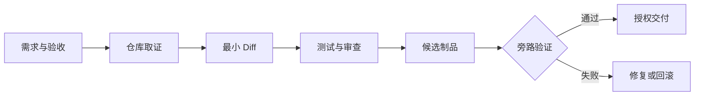

# AI Coding 交付链：从需求到候选发布

用一个功能贯穿需求、仓库取证、最小 Diff、测试、审查、候选验证与回滚。**AI Coding**、**Testing**、**Delivery** 分别指向同一条执行链上的不同对象：需求、验收条件、仓库约束、现有代码、测试、运行环境、风险和发布授权进入系统，需求假设、代码证据、计划、Diff、测试结果、审查意见、候选制品、回滚点和交付状态保存处理中间状态，最终得到聚焦的代码差异、可复现验证、候选制品、残余风险和回滚说明。

AI Coding 交付链位于从需求澄清到候选发布的端到端研发控制链，主要机制是先读约束与现状，再确定最小影响面；实现后按风险运行测试、审查差异、构建候选并旁路验证，只有获得授权才发布。跳过现状调查、越权提交或部署、覆盖用户差异、只跑单测不构建、候选与发布制品不同和没有回滚点会让链路在不同位置停止，错误记录必须保留发生阶段、当时的状态和终止原因。

::: info 贯穿示例

AI Coding 交付链场景：在已有应用增加一个带权限的新筛选项，要求前后端契约一致、移动端可用且未经授权不得发布。AI Coding 交付链需要的身份、权限、版本和业务事实由应用提供，模型与外部内容只产生候选。

:::

## 交付目标、仓库状态和审批范围

跳过现状调查会破坏需求假设与聚焦的代码差异之间的对应关系，排查时先保留原始输入摘要和发生阶段，再判断是否允许重试。

越权提交或部署影响代码证据或下游解释，不能和跳过现状调查共用“重新调用一次模型”的处理方式。

## 从候选补丁到可发布制品

AI Coding 实践中，执行者负责计划和改动，工具提供证据，脚本负责可重复检查。因此需求假设与代码证据要有唯一写入方，其他组件只能通过版本化命令申请修改。

Coding Agent 与 AI Coding 交付链解决的问题相邻，但控制权不同，比较时要看谁选择选择能力、谁保存需求假设、谁确认聚焦的代码差异。

CI/CD 可以参与同一请求，却不能替代 AI Coding 交付链；组合后仍要单独检查验收条件的可信来源和跳过现状调查的终止规则。

AI Coding 交付链使用的身份、范围和版本来自可信运行时，需求可以表达意图，但不能提升权限或改写活动 Release。

越权提交或部署发生时，错误回到代码证据的所有者处理，上游缺输入、当前组件违反不变量和下游不可用分别形成不同终态。

AI Coding 交付链的确定性边界位于需求假设写入之前。模型在 AI Coding 中只提交候选值，程序仍要从认证、版本和策略快照补入可信字段。

AI Coding 交付链内部可以使用更细的临时对象，跨边界只暴露稳定协议。替换 Coding Agent 时，调用方不需要理解内部缓存和 SDK 响应。

## 任务、差异和版本证据

AI Coding 交付链的输入合同至少列出需求、验收条件和仓库约束，每项都注明来源、是否必需、允许的缺省值，以及缺失后是在入口拒绝还是进入降级路径。

AI Coding 交付链要把需求假设、代码证据和执行计划分开。假设可以被验证推翻，代码证据必须指向当前工作区版本，计划只描述尚未完成的动作；三者分开才能在测试失败时知道是理解错了，还是修改没有生效。

并发分支按稳定身份合并计划，完成顺序只反映耗时，不能决定结果属于哪个请求，更不能让迟到的旧状态覆盖新修订。

输出合同同时描述聚焦的代码差异和可复现验证，并为拒绝、取消、部分完成和未知状态提供固定形状，调用方据此分支，无需解析错误文案猜测结果。

代码证据参与乐观并发检查；处理开始后若版本变化，旧候选只保留作审计，不能继续写入需求假设。

需求里若包含模型填写的同名字段，应用会丢弃它，再从认证、配置或活动版本中补入可信值，因为结构校验通过不等于授权或业务校验通过。

需求假设、文件定位、差异、命令输出、失败说明和回滚入口组成 AI Coding 交付链的最小追踪材料，日志只保存稳定 ID、版本和错误类，完整 Prompt、文档正文与凭证不进入指标标签。

撤回或删除验收条件时，相关缓存、候选和未完成任务按版本失效；稳定 ID 可以保留审计关系，已撤回内容不能继续进入聚焦的代码差异。

契约还需要描述新鲜度。代码证据对应的数据发生变化后，旧缓存、旧候选和未完成任务怎样失效，应由版本或时间规则直接判断，不能依赖模型注意到矛盾。

删除和撤回也属于数据生命周期。AI Coding 交付链引用的原始对象被移除时，稳定 ID 可以保留审计关系，正文与派生结果则按策略失效，避免继续向用户展示过期内容。

::: warning AI Coding 交付链的可信边界

聚焦的代码差异通过结构校验后仍是候选。AI Coding 交付链使用的身份、权限、知识版本与业务事实由应用从可信服务读取，核对完成后才能执行或交付。

:::

## 读取、修改、测试和旁路验证

AI Coding 交付链要用一条真实变更验证顺序：读取约束后记录假设，修改后保存差异，测试和构建分别留下退出码，旁路验证再确认交付条件。任何一步没有证据，就把结果停在候选状态。

读取任务约束接收需求并建立需求假设，入口校验未通过就地结束，后续模型、检索器或工具调用次数保持为零。

选择能力读取代码证据并执行主题逻辑，参数由应用组装，外部返回先保存为可复现验证，尚未获得修改领域状态的资格。

执行最小改动检查结构、范围、版本和主题不变量；聚焦的代码差异缺少来源、落在旧版本或越过权限时，需求假设停在 rejected 或 failed。

验证并交付先保存聚焦的代码差异与终止原因，再产生事件或通知，交付失败可以重放，核心状态写入失败则不能对外宣称完成。

选择能力出现部分结果时，由任务合同决定保留、补偿还是整体丢弃；聚焦的代码差异若可重建就重新生成，外部副作用则查询回执或执行补偿。

实现可以使用函数、Graph、Middleware 或 Workflow，需求假设的所有权和跳过现状调查的停止规则不会随框架改变。

部分成功需要在步骤边界处理。选择能力已经产生一部分聚焦的代码差异时，程序按任务合同决定保留、补偿或整体丢弃，并记录未完成项，不能默认为全部成功。

选择能力和执行最小改动都要写明逆向动作或不可逆原因，聚焦的代码差异若可重建就删除后重算，已发送的外部命令只能查询回执或补偿。

## 沿一次补丁发布推演

沿“AI Coding 交付链场景：在已有应用增加一个带权限的新筛选项，要求前后端契约一致、移动端可用且未经授权不得发布”推演 AI Coding 交付链：入口创建 request_id，读取可信身份，把需求和当前版本写入初始状态。

读取任务约束生成需求假设与输入摘要；若验收条件缺失，请求返回 rejected，并指出缺少哪项材料，不继续消耗模型或外部服务配额。

选择能力按“先读约束与现状，再确定最小影响面；实现后按风险运行测试、审查差异、构建候选并旁路验证，只有获得授权才发布”推进，每次依赖调用保存 call_id、参数摘要、开始时间与状态版本，以便判断超时前是否已经产生结果。

候选结果对应聚焦的代码差异、可复现验证、候选制品、残余风险和回滚说明，执行最小改动逐项检查权限、版本与领域约束，问题列表为空才允许形成下一状态。

验证并交付写入终态；客户端断开只影响交付通道，重新连接时读取已经保存的需求假设或事件游标，不重跑核心逻辑。

故障注入选择覆盖用户差异，程序保留原候选和错误位置，只重做失败边界，不能从入口复制整个任务并产生第二份状态。

推演结束后用 request_id 关联需求假设、聚焦的代码差异与终止原因，测试据此排除并发请求串线，并确认失败路径没有遗留未关闭资源。

AI Coding 交付链在输入拒绝时不调用依赖，正常路径按 5 个阶段推进，有限修复只重做失败边界。调用次数是控制流断言，不是性能宣传。

AI Coding 交付链的最终记录用 request_id 关联需求假设、聚焦的代码差异和失败问题，测试据此证明结果来自本次执行，没有混入并发请求。

## 交付包需要包含哪些回执

AI Coding 交付链正常完成时，需求假设、代码证据和聚焦的代码差异指向同一次执行，重复读取返回同一终态，未完成分支已经取消或有明确所有者。

需求假设、文件定位、差异、命令输出、失败说明和回滚入口用于还原 AI Coding 交付链的处理过程，可以按阶段和版本聚合；敏感正文留在受控存储中，不复制到日志与指标。

可复现验证可能是合法的空结果，但必须带范围、版本和原因；任务明确要求找到材料时，同一个空结果进入拒答而非成功。

依赖返回成功状态只证明传输完成。AI Coding 交付链还要检查聚焦的代码差异是否满足业务范围、质量阈值和当前版本，明确拒绝也可能是正确终态。

需求假设的状态迁移必须单调：完成不能退回运行中，取消不能被迟到结果覆盖，失败重试也不能绕过入口已经固定的权限。

AI Coding 交付链的成功证据最终要同时回答输入是什么、执行了哪些步骤、交付了什么以及为什么停止；任一项缺失都应留在未确认状态。

AI Coding 交付链把业务验收与服务健康分开。依赖返回 200 只说明传输成功，聚焦的代码差异仍要满足当前范围和质量要求；明确拒答也可能是正确终态。

AI Coding 交付链的观测指标按阶段和版本聚合。评估 AI Coding 时，把错误、空结果、拒绝、恢复和资源消耗分开统计，避免一个成功率掩盖不同故障。

## 构建失败和回滚如何处理

AI Coding 的失败要沿交付顺序回看：需求没有验收条件时先补规格，仓库约束缺失时停止修改，测试失败时保留差异和退出码，审查证据不足时不生成完成通知。再次生成一遍代码不能替代对具体失败层的复测。

遇到跳过现状调查时，先记录发生阶段、错误类别和责任对象。AI Coding 交付链保留输入摘要和状态版本，由对应组件决定重试、降级或终止。

越权提交或部署触及 AI Coding 交付链的安全边界，重试不会使它自动合法；执行路径保存拒绝规则和输入来源，清除未授权候选，并以稳定错误结束当前动作。

AI Coding 交付链发现覆盖用户差异后重新读取权威状态，旧候选可以保留作审计，却不能覆盖新版本；前后状态无法兼容时，当前尝试以 conflict 结束。

遇到只跑单测不构建时，先记录发生阶段、错误类别和责任对象。AI Coding 交付链保留输入摘要和状态版本，由对应组件决定重试、降级或终止。

遇到候选与发布制品不同时，先记录发生阶段、错误类别和责任对象。AI Coding 交付链保留输入摘要和状态版本，由对应组件决定重试、降级或终止。

遇到没有回滚点时，先记录发生阶段、错误类别和责任对象。AI Coding 交付链保留输入摘要和状态版本，由对应组件决定重试、降级或终止。

AI Coding 交付链将终态、可重试性和资源清理结果写入记录；后台扫描器根据需求假设判断任务是在运行、等待恢复还是已失败。

AI Coding 交付链执行前固定 Deadline、动作上限、重复签名、无进展阈值、预算和取消信号；任一条件触发，选择能力停止创建新工作。

AI Coding 交付链把重试时间和次数计入总预算。AI Coding 每次重试先扣减剩余额度，达到上限就保留原始错误。

AI Coding 交付链的清理动作设计成幂等操作；仍被活动任务或 Lease 引用的资源拒绝删除。

## 测试、扫描与人工审查

选择一个有失败用例的小功能，记录从红测到绿测、静态检查、构建和候选验证的完整证据，并模拟发布取消；测试显式给出需求、初始需求假设、预期聚焦的代码差异和终止原因，不能只断言返回值非空。

AI Coding 交付链的单元测试用 Fake Adapter 固定聚焦的代码差异与错误，断言参数、调用顺序、状态修订和清理动作，这些结果只证明本地控制逻辑。

契约测试围绕需求、需求假设和可复现验证构造合法与非法样本，Schema 解析成功后继续检查权限、版本与领域不变量。

故障测试注入跳过现状调查和越权提交或部署，记录选择能力是否被调用、需求假设是否改变、资源是否释放，以及同一身份重试会不会重复执行。

AI Coding 交付链的集成测试连接真实协议与隔离存储，检查序列化、约束、并发和超时；需要在线服务时另行记录服务版本、时间、配置与凭证条件。

AI Coding 交付链的回归报告要保留失败类型分布。在 AI Coding 的回归中，拒绝、超时、权限错误和空结果必须保持各自类型，状态变化本身就是行为契约。

AI Coding 交付链的性质测试随机改变需求假设顺序、重复提交、完成顺序或状态版本，断言权限不扩大、终态不倒退、同一身份不产生两次副作用。

AI Coding 的离线评测关注质量变化，运行时测试关注控制和恢复，两类证据都齐全才可交付。AI Coding 交付链只有两类证据都存在，才能同时回答“结果是否合格”和“系统是否安全完成”。

## 多仓库协作和版本维护

交付链要把需求版本、源码修订、测试环境和制品元数据绑定在一起。任一字段升级都留下迁移规则，旧制品仍按原合同核验，不能只看最新流水线的状态。

AI Coding 交付链的容量主要受上下文大小、并行任务、外部工具、测试时长和审查成本影响，并发可能缩短单次等待，也会占用连接、配额、内存和下游吞吐，必须沿读取任务约束、收集仓库证据、选择能力、执行最小改动、验证并交付逐层核算。

AI Coding 交付链的候选版本在固定样本上比较正确性、错误类型、延迟和资源消耗，跳过现状调查等安全红线回归时直接停止发布，不能用平均质量抵消。

跳过现状调查的降级路径在发布前写好，可以减少非关键增强、返回已经确认的聚焦的代码差异，或明确暂时无法确认，缺失事实不能交给模型补写。

交付异常时先用 `request_id`串起需求假设、文件差异、测试命令、制品摘要和授权事件，再决定补跑测试、重新构建还是回滚。发布权限与构建权限分开，任何一方缺证据都不能交付。

AI Coding 交付链的数据按证据用途分级保留，聚合字段可以留得更久，需求和大体积聚焦的代码差异设置短期限、访问控制与删除通道。

AI Coding 交付链先在单进程实现需求假设、超时、错误和测试，只有恢复与容量证据提出要求时，再增加队列、Lease、分布式缓存或工作流引擎。

AI Coding 交付链的监控阈值要对应可执行动作。

回滚要覆盖代码之外的状态。AI Coding 交付链若改变 Schema、缓存键或持久化记录，旧版本是否还能读取新写入数据必须提前验证；无法双向兼容时采用候选版本隔离。

## 何时退回人工或固定流水线

采用 AI Coding 交付链前先画出需求到聚焦的代码差异的最小控制图；固定函数已经能完成任务时，新增模型决策和跨进程需求假设只会扩大测试与运维范围。

Coding Agent 负责提出和执行局部改动，交付链负责把改动固定成可审计制品。Agent 可以修改工作区，发布系统仍要独立检查源码修订、测试结果、镜像摘要和审批记录。

CI/CD 可以与 AI Coding 交付链组合，但外部知识仍需授权，工具调用仍需校验，模型产生的聚焦的代码差异仍停留在候选状态。

AI Coding 交付链适合价值足够、跳过现状调查可观察且预算可接受的任务，高风险、不可逆的决定需要确定性规则或人工批准。

格式正确但事实错误的聚焦的代码差异是必要反例；若它直接进入成功，说明执行最小改动缺少业务验证，应保留候选并给出证据问题。

执行期间修改代码证据可以检验并发设计，旧动作若仍能覆盖需求假设，说明版本或 Lease 有缺口，增加 Prompt 规则无法修复这类竞态。

交付链会增加需求假设、依赖调用和恢复责任。记录中要写清新增的停止、降级与回滚路径。

先用一个需求假设、几类明确错误和确定性测试跑通交付，再考虑并发或自动发布。

Coding Agent 必须从现状调查开始，无法读取仓库约束和验证入口时，不应获得写权限。

交付链的每个阶段都要有可回退的产物。规格冻结后生成任务清单，代码修改形成候选补丁，测试输出和构建产物绑定同一版本，发布前由人工确认风险。任何阶段失败都保留输入、命令和原始输出，不能只留下“失败”两个字。这样后续接手的人可以从版本和证据继续排查，而不是重新猜测当时做过什么。

## 交付链的制品自测

把“一个补丁从需求确认走到旁路验证”缩成一个本地可以完成的小实验。入口先写目标、输入、可修改范围和验收命令，需求版本、源码修订、测试报告、制品摘要和回滚点由文件或内存仓库保存，模型输出只作为候选。

实现顺序从确定性步骤开始，再接入工具或协议。正常结果同时满足形状和领域条件，本地通过但候选制品不同或未获发布授权用稳定错误表示。不要把“一个补丁从需求确认走到旁路验证”的 Fake Adapter、内存存储或本地测试成功写成远程服务已经可用。

“一个补丁从需求确认走到旁路验证”的故障样本至少包含缺少输入、权限拒绝、超时、重复提交和取消。“一个补丁从需求确认走到旁路验证”的每种样本都断言调用次数、状态修订、资源清理和最终报告，修复后重新执行同一命令。

评审“一个补丁从需求确认走到旁路验证”时比较直接实现与新增能力的成本、可替换性和故障面。交付报告区分已执行与未执行。

把“一个补丁从需求确认走到旁路验证”的一次成功和一次失败都交给另一位开发者复现，观察他能否根据日志找到责任层。如果只能重新阅读“一个补丁从需求确认走到旁路验证”的完整 Prompt 才能理解，说明契约或事件还不够清楚。

示例的结论范围限于当前解释器、依赖和隔离资源。“一个补丁从需求确认走到旁路验证”使用的真实凭证、网络服务、生产数据和发布授权另行验证，不能从本地退出码推导出来。

## 一个补丁从需求确认走到旁路验证的边界案例

在“一个补丁从需求确认走到旁路验证”中，入口收到的资料可能不完整，程序先保存缺口和当前版本，不能让模型用常识填入 需求版本、源码修订、测试报告、制品摘要和回滚点。“一个补丁从需求确认走到旁路验证”的输入后来补齐时，新的执行沿同一个任务 ID 继续；已经结束的失败记录不被覆盖。

本地测试通过但候选制品摘要不同，说明构建或依赖没有固定；未获发布授权则停在审批层。构建未开始、构建失败、构建成功但测试缺失、制品已生成但还未授权应保留各自回执，回滚点只指向已核验的制品。

“一个补丁从需求确认走到旁路验证”的正常输出先经过范围、版本和权限检查，再进入交付或下一个节点。交付报告区分已执行与未执行。“一个补丁从需求确认走到旁路验证”的输出只满足结构而没有可验证来源时，状态保持为候选，前端应显示缺口而不是成功标记。

用重复提交、并发完成、取消和进程退出四个样本回归。回归“一个补丁从需求确认走到旁路验证”时，检查同一幂等键是否只产生一个有效终态，迟到事件是否被拒绝，临时资源是否释放，重新连接是否能读到同一份事件。

“一个补丁从需求确认走到旁路验证”这组检查的结果应带命令、解释器或服务版本、输入摘要和退出码。“一个补丁从需求确认走到旁路验证”没有运行证据时，只能写“待验证”；离线替身通过也不能推导真实模型、网络服务或生产权限已经通过。

ai-coding-delivery-chain的修改要优先改变责任边界和可观察证据，不能靠增加一个关键词特判来让样本通过。
