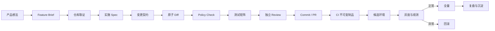

# AI Coding 研发闭环：从需求文档、原子 Diff 到 PR 与部署

“给订单列表增加批量导出。”人看到这句话，会自然补出按钮、CSV 和下载；Agent 也会补，但它补出的每个细节都可能变成代码事实：所有员工都能导出，浏览器同步拉取十万行，CSV 带出手机号，失败后重复创建任务，测试只覆盖成功路径。

AI Coding 的瓶颈已经不只是生成代码。难点在于怎样把产品意图变成可执行文档，怎样让 Agent 以仓库事实而非想象实施，怎样限制 Diff，怎样把验收标准变成自动测试，怎样生成可审的 PR，最后又怎样把同一制品安全发布并在异常时回退。

本文用“管理员按当前筛选条件批量导出订单”贯穿整条链路。我的判断是：**真正的研发闭环不是 Agent 能连续做多少动作，而是每个动作都能被前一份证据约束，并给下一阶段留下可复核证据。**



## 产品想法先变成可以拒绝的 Feature Brief

一份给 AI 的需求文档，不是把聊天记录写得更长。它要把容易被模型静默补全的决定显式化，并允许出现“尚未决定”。只有这样，Agent 才知道何时停止询问。

```markdown
# Feature Brief：订单批量导出

## 目标
管理员可以在订单列表中导出当前筛选结果，减少人工逐页整理。

## 用户行为
- 用户先设置状态与时间范围，再点击“导出”。
- 结果不超过 1,000 条时直接生成 CSV。
- 超过 1,000 条时创建异步任务，页面展示进度；完成后提供 24 小时下载地址。

## 业务规则
- 只有拥有 `orders.export` 权限的用户可以发起和下载。
- 数据范围与页面查询一致，不能由客户端提交 tenant_id。
- CSV 不包含手机号、地址和内部备注。
- 同一用户、同一筛选条件在 60 秒内重复提交，只返回原任务。

## 非目标
- 本次不支持 Excel、定时导出和邮件发送。
- 不调整现有订单查询语义。

## 成功信号
- 授权用户能导出正确范围和字段。
- 未授权用户无法发起、查询或下载他人的任务。
- 导出不会拖慢在线订单查询。

## 未决问题
- 1,000 条阈值是否需要配置化？负责人：产品。
- 下载文件是否需要独立审计事件？负责人：安全。
```

“目标”解释为什么做，“用户行为”说明可观察路径，“业务规则”约束数据与权限，“非目标”保护范围，“未决问题”阻止 Agent 自作主张。成功信号仍是产品语言，还没有指定文件、类名或技术方案。

这份 Brief 可以由 AI 根据访谈、工单和会议纪要起草，但产品负责人要确认关键行为。模型擅长找缺口，不拥有需求决定权。涉及资金、权限、隐私和合规时，未决问题不能以“采用行业惯例”自动关闭。

## 仓库取证：需求不能告诉 Agent 当前系统怎样工作

同一句需求在两个仓库里的实现可能完全不同。一个系统已有异步导出框架，另一个只能通过消息队列新建任务；一个权限在路由层判断，另一个由查询 Scope 强制。Agent 在写计划前应先形成“现状证据包”。

取证不等于通读全仓。可以从现有页面路由、查询接口、权限中间件、任务框架、文件存储和同类测试逐层搜索，记录路径与符号：

| 需求问题 | 要找的证据 | 取证结论示例 |
| --- | --- | --- |
| 筛选条件从哪里来 | 列表请求和 Query Schema | 前后端已共享 `OrderFilter` 字段 |
| 数据范围怎样限制 | Repository、Scope、权限测试 | tenant 来自会话，不接受请求参数 |
| 异步任务怎样运行 | Queue、Worker、状态模型 | 已有 report job，可复用状态机 |
| 文件放在哪里 | 对象存储适配和签名 URL | 下载 URL 由服务端按任务所有者签发 |
| 发布会改什么 | 迁移、环境变量、部署清单 | 需要新表与 Worker，不需要新公网服务 |

证据包要区分“确认事实”和“推断”。文件存在不代表当前路由使用它；同名权限常量也不证明覆盖下载接口。必要时运行现有测试或追踪调用链。**仓库取证是防止 AI 用合理想象覆盖当前事实的第一道门禁。**

复杂仓库可以并行派出只读 SubAgent 分别调查前端、后端、数据和发布，但主 Agent 应统一问题清单和输出格式。涉及共享决策或同一文件的修改仍需串行。

## 实施 Spec 连接业务行为与代码

Feature Brief 经确认后，Agent 才能结合仓库证据编写实施 Spec。它不需要预测每行代码，却要让 Reviewer 看见行为落到哪里、接口怎样变化、数据如何迁移、失败如何恢复。

```markdown
# Implementation Spec：订单批量导出

## 现状证据
- 列表筛选由 `OrderFilter` 统一解析，Repository 自动应用调用者 Scope。
- 现有 report worker 支持 queued/running/succeeded/failed 状态。
- 下载签名入口会校验资源 owner。

## 行为契约
1. `POST /order-exports` 复用 `OrderFilter`，不接受 tenant_id。
2. 服务端校验 `orders.export` 后计算请求指纹。
3. 小结果同步返回文件；大结果创建或复用 60 秒内相同指纹的任务。
4. Worker 只查询已固化的 Scope 与 Filter，输出字段使用服务端白名单。
5. 下载接口同时校验权限、任务 owner、过期时间和终态。

## 接口变化
- 新增创建、查询状态和下载三个端点。
- 创建响应为 discriminated union：`ready` 或 `queued`。

## 数据变化
- 新增 export_jobs 表，保存 owner、scope_snapshot、filter、status、object_key、expires_at。
- 迁移可前向兼容；旧应用忽略新表，回滚应用前停止新任务消费。

## 风险
- 过滤语义漂移：复用同一解析器并做契约测试。
- 重复任务：请求指纹加唯一窗口约束。
- 越权下载：服务端 owner 校验与权限测试。
- 大查询拖垮主库：批量游标、Worker 并发与查询超时。
```

规格中的每个行为都应能映射到测试。若写着“保证安全”“性能良好”，却没有主体、数据范围、阈值或失败表现，Agent 和 Reviewer 仍会各自解释。

## 用变更契约给 Diff 画硬边界

实施 Spec 仍是叙述文档。变更契约把本次允许触碰的文件范围、迁移与测试义务变成机器可读配置：

```yaml
feature: order-export
allowed_paths:
  - web/src/features/order-export/
  - server/api/order_exports.py
  - server/services/order_export.py
  - server/workers/order_export.py
  - server/models/order_export.py
  - server/migrations/
  - tests/order_export/
forbidden_paths:
  - deploy/production/
  - server/auth/
requires_migration: true
migration_paths:
  - server/migrations/
requires_tests: true
test_paths:
  - tests/order_export/
secret_patterns:
  - '-----BEGIN [A-Z ]+ PRIVATE KEY-----'
  - '(?i)(api_key|token|password)\s*[:=]\s*["''][^"'']+["'']'
```

这不是让开发者永远只能改这些文件。发现现状证据有误时，先更新 Spec 与契约并说明原因，再继续实现。边界变化应成为显式决策，不能由格式化工具顺手改遍全仓。

“原子 Diff”指一个差异只承载一项可命名的行为变化。功能实现、无关重构、依赖升级和全局格式化混在一起，Reviewer 很难判断哪一行支撑需求，回滚时也无法只撤掉风险部分。适合拆开的顺序可能是：先加迁移和模型，再加领域服务与测试，最后接 API 与 UI。拆分不要求每个临时状态都发布，但每个提交应尽量可构建、可解释。

## 可运行的 Diff Policy Checker

下面的脚本读取变更契约和待检查文件列表。它不会判断业务正确性，只负责几项确定问题：越界文件、禁止目录、明显密钥、缺少迁移和缺少测试。

```python
from __future__ import annotations

import argparse
import json
import re
from pathlib import Path

import yaml


def is_under(file: str, prefixes: list[str]) -> bool:
    return any(file == prefix.rstrip("/") or file.startswith(prefix) for prefix in prefixes)


def check(contract_path: Path, root: Path, changed_files: list[str]) -> list[str]:
    contract = yaml.safe_load(contract_path.read_text(encoding="utf-8"))
    allowed = contract.get("allowed_paths", [])
    forbidden = contract.get("forbidden_paths", [])
    errors: list[str] = []

    for file in changed_files:
        if not is_under(file, allowed):
            errors.append(f"out_of_scope:{file}")
        if is_under(file, forbidden):
            errors.append(f"forbidden_path:{file}")

        target = root / file
        if target.is_file():
            content = target.read_text(encoding="utf-8", errors="replace")
            for pattern in contract.get("secret_patterns", []):
                if re.search(pattern, content):
                    errors.append(f"possible_secret:{file}")
                    break

    if contract.get("requires_migration") and not any(
        is_under(file, contract.get("migration_paths", [])) for file in changed_files
    ):
        errors.append("missing_migration")

    if contract.get("requires_tests") and not any(
        is_under(file, contract.get("test_paths", [])) for file in changed_files
    ):
        errors.append("missing_tests")

    return sorted(set(errors))


def main() -> int:
    parser = argparse.ArgumentParser()
    parser.add_argument("--contract", type=Path, required=True)
    parser.add_argument("--root", type=Path, default=Path.cwd())
    parser.add_argument("files", nargs="+")
    args = parser.parse_args()

    errors = check(args.contract, args.root, args.files)
    print(json.dumps({"ok": not errors, "errors": errors}, ensure_ascii=False))
    return 1 if errors else 0


if __name__ == "__main__":
    raise SystemExit(main())
```

CI 可以从 Git 获取文件列表并调用它：

```bash
uv run --with pyyaml python scripts/check_diff_policy.py \
  --contract change-contract.yaml \
  $(git diff --name-only origin/main...HEAD)
```

检查器要有自己的 fixture：正常 Diff 应通过；改到 `server/auth/` 同时报越界和禁止；代码中放入测试占位 Token 应报敏感信息；只有模型变化但无迁移应报 `missing_migration`；只有实现没有测试应报 `missing_tests`。它不能替代秘密扫描器、静态分析或 Review，却能把反复发生的低级越界从 Prompt 下沉到确定门禁。

## 验收标准要进入测试追踪矩阵

让 Agent “把测试补齐”通常只会得到最容易通过的单元测试。更可靠的做法是把 Feature Brief 与实施 Spec 中的行为编号，映射到不同验证层：

| 行为 | 单元/类型 | 契约/集成 | 权限/安全 | 浏览器/E2E |
| --- | --- | --- | --- | --- |
| 当前筛选范围进入导出 | Filter 序列化 | 列表与导出查询同结果 | tenant 不可由请求覆盖 | 筛选后发起导出 |
| 小结果直接下载 | 结果阈值 | CSV 字段与编码 | 敏感列不存在 | 下载文件可打开 |
| 大结果转异步 | 状态机 | Queue 与 Worker | 任务 owner 固化 | 进度到完成 |
| 重复请求复用任务 | 指纹计算 | 唯一窗口并发 | 用户间不复用 | 连点只出现一个任务 |
| 下载受保护 | 过期判断 | 签名 URL | 越权与过期拒绝 | 他人链接不可用 |

单元测试证明局部规则，契约测试证明接口和 Schema，集成测试证明数据库、队列和对象存储协作，权限测试专门攻击 Scope，浏览器测试验证用户真实路径。不是每个行为都需要所有层；矩阵的作用是暴露空白和重复，而非追求满格。

测试生成可以自动化，测试意图必须独立于实现。若实现 Agent 与测试 Agent 共享“tenant 来自请求参数”这一错误假设，绿色结果只证明它们错得一致。高风险行为应由独立 Reviewer 从需求重新推导反例，已有历史回归不得为让新实现通过而静默删除。

## 从 Diff 到 Commit、PR 和独立 Review

代码、契约和测试全部通过后，AI 可以生成原子 Commit 建议与 PR 草稿：

```markdown
## 目标
为拥有 orders.export 权限的管理员提供按当前筛选条件导出订单的能力。

## 变更
- 新增导出任务模型、迁移与 Worker。
- 复用 OrderFilter 和调用者 Scope，新增创建、状态与下载接口。
- 前端增加导出入口、进度和下载状态。

## 风险与处理
- 越权：创建、查询、下载均校验权限与 owner。
- 大查询：异步批量游标、并发限制和查询超时。
- 重复提交：用户 + Scope + Filter 指纹窗口去重。

## 证据
- Diff Policy Checker 通过。
- 测试矩阵中的单元、契约、集成、权限和 E2E 均通过。
- 迁移前滚、应用回滚和 Worker 停止顺序已在候选环境演练。

## 未执行
- 未合并、未部署生产；等待授权。
```

独立 AI Reviewer 不应只复述 Diff。它要拿 Feature Brief、实施 Spec、变更契约和测试矩阵重新检查行为覆盖，尤其关注权限、数据迁移、并发、失败恢复和被实现者忽略的反例。工具结果、测试日志和源码位置应成为 Finding 的证据；没有证据时写问题或不确定性，不制造确定结论。

Commit、创建 PR、合并和推送是四个不同动作。技术上可以由自动化执行，不代表当前对话已经授权。组织可以预先授予机器人在特定分支创建 PR 的权限，但合并保护、审批人数和生产发布仍由平台强制。**“AI 能做”与“AI 获准做”必须在流程和凭证上分开。**

## CI 构建一次，候选环境验证同一制品

合并前后的 CI 应从干净环境安装锁定依赖，运行测试矩阵、安全与迁移检查，再构建不可变制品。镜像或包使用提交 SHA、版本和内容摘要标识。候选环境、灰度和生产应提升同一制品，不能在生产重新构建另一份“同版本”结果。

候选环境验证的不只是健康检查：

- 迁移能前滚，旧应用在迁移后仍可短暂运行；
- Worker 只消费候选任务，不与生产重复执行；
- 创建、状态、下载与权限路径通过真实依赖；
- 日志、指标和 Trace 能关联 release、request 与 export job；
- 回滚应用与停止任务的顺序已经演练。

发布状态也应结构化：

```jsonc
{
  "release": "commit-sha",
  "artifactDigest": "sha256:...",
  "environment": "candidate",
  "checks": {
    "health": "passed",
    "migration": "passed",
    "authorization": "passed",
    "rollbackDrill": "passed"
  },
  "approval": "waiting",
  "productionTraffic": 0
}
```

获得发布授权后，先给内部或小比例流量，观察技术与业务指标。技术指标包括错误率、延迟、队列积压和数据库负载；业务指标包括导出成功率、平均完成时间、重复任务比例和权限拒绝。只有健康检查而没有业务探针，可能出现“容器正常，CSV 全为空”。

回滚条件要在发布前定义。应用回退不一定能撤销已执行的数据迁移和外部副作用，因此迁移应优先向前兼容，写操作需要幂等与状态查询。指标越过硬阈值可以触发预先授权的自动流量回退；无法判断的数据异常应暂停扩量并交给人确认，不能由模型临场决定不可逆清理。

## 复盘不是写总结，而是改变下一次系统行为

任务完成后，复盘至少比较计划与实际 Diff、测试漏网、Review Findings、发布信号和恢复过程。真正有价值的结论会进入长期系统：

- 仓库长期边界进入项目规则；
- 可确定的缺陷进入测试或 Diff Policy；
- 重复工作方法进入 Skill；
- 多个 Host 都需要的实时数据或动作进入 MCP；
- 一次性背景和决策留在任务记录或 ADR；
- 新的失败样本进入 Agent Eval 与发布演练。

不是所有教训都写入根规则。规则无限增长会挤占上下文，Skill 没有触发评测会变成另一个长 Prompt，MCP 没有所有者会成为无人维护的生产接口。沉淀前要问：它是否重复、能否验证、应该由哪一层负责、失效时谁更新。

这条闭环看起来比“Prompt 到代码”慢，却把最昂贵的返工放在最早阶段发现。小而明确的修改可以压缩文档和门禁，但权限、数据、发布和不可逆动作不能因为 AI 写得快就被省略。**AI Coding 的上限，最终取决于组织能否把需求、代码、测试、权限和运行证据连成同一条可追溯链。**
