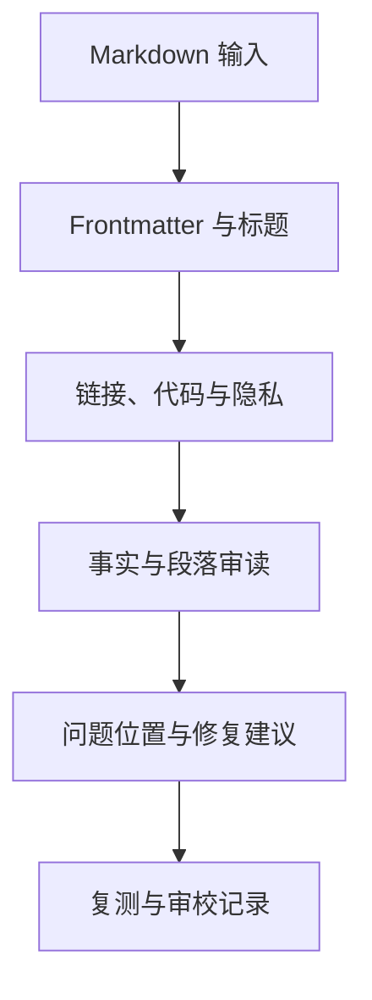

# 实现文章检查 Skill：规则、脚本与评测

将 Frontmatter、标题、链接、示例和隐私检查拆成写作判断与确定性脚本。**Skill**、**Content Quality**、**Testing** 分别指向同一条执行链上的不同对象：Markdown 文件、Frontmatter 规范、标题结构、链接规则、隐私规则、目标读者和事实来源进入系统，解析结果、规则命中、人工判断项、脚本错误、修复建议、回归用例和审校状态保存处理中间状态，最终得到带文件位置的问题、可自动修复项、需作者判断项、复测结果和未通过原因。

实现文章检查 Skill 位于写作判断与确定性内容门禁之间的协作层，主要机制是脚本负责唯一 H1、层级、链接、代码围栏和隐私模式等确定性检查，Skill 负责连贯性、事实边界和读者理解，二者输出统一问题位置。把关键词数量当质量、自动删除未知段落、正则解析代码块标题、语言润色改变技术事实和 Skill 只会给通用建议会让链路在不同位置停止，错误记录必须保留发生阶段、当时的状态和终止原因。

::: info 贯穿示例

实现文章检查 Skill 场景：文章发布前需要检查元数据、标题、断链、示例和隐私，同时不能用固定字数代替技术质量判断。实现文章检查 Skill 需要的身份、权限、版本和业务事实由应用提供，模型与外部内容只产生候选。

:::

## 先定义文章检查的通过条件

把关键词数量当质量会破坏解析结果与带文件位置的问题之间的对应关系，排查时先保留原始输入摘要和发生阶段，再判断是否允许重试。

自动删除未知段落影响规则命中或下游解释，不能和把关键词数量当质量共用“重新调用一次模型”的处理方式。

## 规则、脚本与模型判断的分工

Skill 实践中，执行者负责计划和改动，工具提供证据，脚本负责可重复检查。因此解析结果与规则命中要有唯一写入方，其他组件只能通过版本化命令申请修改。

Linter 与实现文章检查 Skill 解决的问题相邻，但控制权不同，比较时要看谁选择选择能力、谁保存解析结果、谁确认带文件位置的问题。

Markdown Parser 可以参与同一请求，却不能替代实现文章检查 Skill；组合后仍要单独检查 Frontmatter 规范的可信来源和把关键词数量当质量的终止规则。

实现文章检查 Skill 使用的身份、范围和版本来自可信运行时，Markdown 文件可以表达意图，但不能提升权限或改写活动 Release。

自动删除未知段落发生时，错误回到规则命中的所有者处理，上游缺输入、当前组件违反不变量和下游不可用分别形成不同终态。

实现文章检查 Skill 的确定性边界位于解析结果写入之前。模型在 Skill 中只提交候选值，程序仍要从认证、版本和策略快照补入可信字段。

实现文章检查 Skill 内部可以使用更细的临时对象，跨边界只暴露稳定协议。替换 Linter 时，调用方不需要理解内部缓存和 SDK 响应。

## 检查结果怎样保存证据

实现文章检查 Skill 的输入合同至少列出 Markdown 文件、Frontmatter 规范和标题结构，每项都注明来源、是否必需、允许的缺省值，以及缺失后是在入口拒绝还是进入降级路径。

文章检查 Skill 要分开保存解析结果、规则命中和人工判断项。解析结果说明读到了什么，规则命中说明哪条确定性检查触发，人工判断项保留需要上下文理解的疑点；只有这样，修改格式不会误改事实审查结果。

并发分支按稳定身份合并人工判断项，完成顺序只反映耗时，不能决定结果属于哪个请求，更不能让迟到的旧状态覆盖新修订。

输出合同同时描述带文件位置的问题和可自动修复项，并为拒绝、取消、部分完成和未知状态提供固定形状，调用方据此分支，无需解析错误文案猜测结果。

规则命中参与乐观并发检查；处理开始后若版本变化，旧候选只保留作审计，不能继续写入解析结果。

Markdown 文件里若包含模型填写的同名字段，应用会丢弃它，再从认证、配置或活动版本中补入可信值，因为结构校验通过不等于授权或业务校验通过。

需求假设、文件定位、差异、命令输出、失败说明和回滚入口组成实现文章检查 Skill 的最小追踪材料，日志只保存稳定 ID、版本和错误类，完整 Prompt、文档正文与凭证不进入指标标签。

撤回或删除 Frontmatter 规范时，相关缓存、候选和未完成任务按版本失效；稳定 ID 可以保留审计关系，已撤回内容不能继续进入带文件位置的问题。

契约还需要描述新鲜度。规则命中对应的数据发生变化后，旧缓存、旧候选和未完成任务怎样失效，应由版本或时间规则直接判断，不能依赖模型注意到矛盾。

删除和撤回也属于数据生命周期。实现文章检查 Skill 引用的原始对象被移除时，稳定 ID 可以保留审计关系，正文与派生结果则按策略失效，避免继续向用户展示过期内容。

::: warning 实现文章检查 Skill 的可信边界

带文件位置的问题通过结构校验后仍是候选。实现文章检查 Skill 使用的身份、权限、知识版本与业务事实由应用从可信服务读取，核对完成后才能执行或交付。

:::

## Markdown、链接和隐私检查链

文章检查 Skill 的一次运行应同时保存解析后的标题树、确定性规则命中和人工复核问题。故意放入一个断开的链接和一个事实缺口，检查器必须分别指出位置，Skill 不能把两个问题合并成一条模糊的“质量不足”。

读取任务约束接收 Markdown 文件并建立解析结果，入口校验未通过就地结束，后续模型、检索器或工具调用次数保持为零。

选择能力读取规则命中并执行主题逻辑，参数由应用组装，外部返回先保存为可自动修复项，尚未获得修改领域状态的资格。

执行最小改动检查结构、范围、版本和主题不变量；带文件位置的问题缺少来源、落在旧版本或越过权限时，解析结果停在 rejected 或 failed。

验证并交付先保存带文件位置的问题与终止原因，再产生事件或通知，交付失败可以重放，核心状态写入失败则不能对外宣称完成。

选择能力出现部分结果时，由任务合同决定保留、补偿还是整体丢弃；带文件位置的问题若可重建就重新生成，外部副作用则查询回执或执行补偿。

实现可以使用函数、Graph、Middleware 或 Workflow，解析结果的所有权和把关键词数量当质量的停止规则不会随框架改变。

部分成功需要在步骤边界处理。选择能力已经产生一部分带文件位置的问题时，程序按任务合同决定保留、补偿或整体丢弃，并记录未完成项，不能默认为全部成功。

选择能力和执行最小改动都要写明逆向动作或不可逆原因，带文件位置的问题若可重建就删除后重算，已发送的外部命令只能查询回执或补偿。

## 沿一篇文章的检查任务推演

沿“实现文章检查 Skill 场景：文章发布前需要检查元数据、标题、断链、示例和隐私，同时不能用固定字数代替技术质量判断”推演实现文章检查 Skill：入口创建 request_id，读取可信身份，把 Markdown 文件和当前版本写入初始状态。

读取任务约束生成解析结果与输入摘要；若 Frontmatter 规范缺失，请求返回 rejected，并指出缺少哪项材料，不继续消耗模型或外部服务配额。

选择能力按“脚本负责唯一 H1、层级、链接、代码围栏和隐私模式等确定性检查，Skill 负责连贯性、事实边界和读者理解，二者输出统一问题位置”推进，每次依赖调用保存 call_id、参数摘要、开始时间与状态版本，以便判断超时前是否已经产生结果。

候选结果对应带文件位置的问题、可自动修复项、需作者判断项、复测结果和未通过原因，执行最小改动逐项检查权限、版本与领域约束，问题列表为空才允许形成下一状态。

验证并交付写入终态；客户端断开只影响交付通道，重新连接时读取已经保存的解析结果或事件游标，不重跑核心逻辑。

故障注入选择正则解析代码块标题，程序保留原候选和错误位置，只重做失败边界，不能从入口复制整个任务并产生第二份状态。

推演结束后用 request_id 关联解析结果、带文件位置的问题与终止原因，测试据此排除并发请求串线，并确认失败路径没有遗留未关闭资源。

实现文章检查 Skill 在输入拒绝时不调用依赖，正常路径按 5 个阶段推进，有限修复只重做失败边界。调用次数是控制流断言，不是性能宣传。

实现文章检查 Skill 的最终记录用 request_id 关联解析结果、带文件位置的问题和失败问题，测试据此证明结果来自本次执行，没有混入并发请求。

## 通过结果与待修问题

实现文章检查 Skill 正常完成时，解析结果、规则命中和带文件位置的问题指向同一次执行，重复读取返回同一终态，未完成分支已经取消或有明确所有者。

需求假设、文件定位、差异、命令输出、失败说明和回滚入口用于还原实现文章检查 Skill 的处理过程，可以按阶段和版本聚合；敏感正文留在受控存储中，不复制到日志与指标。

可自动修复项可能是合法的空结果，但必须带范围、版本和原因；任务明确要求找到材料时，同一个空结果进入拒答而非成功。

依赖返回成功状态只证明传输完成。实现文章检查 Skill 还要检查带文件位置的问题是否满足业务范围、质量阈值和当前版本，明确拒绝也可能是正确终态。

解析结果的状态迁移必须单调：完成不能退回运行中，取消不能被迟到结果覆盖，失败重试也不能绕过入口已经固定的权限。

实现文章检查 Skill 的成功证据最终要同时回答输入是什么、执行了哪些步骤、交付了什么以及为什么停止；任一项缺失都应留在未确认状态。

实现文章检查 Skill 把业务验收与服务健康分开。依赖返回 200 只说明传输成功，带文件位置的问题仍要满足当前范围和质量要求；明确拒答也可能是正确终态。

实现文章检查 Skill 的观测指标按阶段和版本聚合。评估 Skill 时，把错误、空结果、拒绝、恢复和资源消耗分开统计，避免一个成功率掩盖不同故障。

## 检查脚本失败时怎样定位

文章检查的失败要对应具体证据：文件无法读取属于输入问题，代码围栏不闭合属于结构问题，事实缺少来源属于证据问题，作者未确认属于人工门禁。工具可以重新扫描，但不能把未确认项自动标成通过。

遇到把关键词数量当质量时，先记录发生阶段、错误类别和责任对象。实现文章检查 Skill 保留输入摘要和状态版本，由对应组件决定重试、降级或终止。

遇到自动删除未知段落时，先记录发生阶段、错误类别和责任对象。实现文章检查 Skill 保留输入摘要和状态版本，由对应组件决定重试、降级或终止。

实现文章检查 Skill 把正则解析代码块标题归到数据质量错误，保留原始对象与解析警告；只有可定位、可有限修复的问题才重跑当前阶段，关键内容缺失时关闭发布。

遇到语言润色改变技术事实和 Skill 只会给通用建议时，先记录发生阶段、错误类别和责任对象。实现文章检查 Skill 保留输入摘要和状态版本，由对应组件决定重试、降级或终止。

实现文章检查 Skill 将终态、可重试性和资源清理结果写入记录；后台扫描器根据解析结果判断任务是在运行、等待恢复还是已失败。

实现文章检查 Skill 执行前固定 Deadline、动作上限、重复签名、无进展阈值、预算和取消信号；任一条件触发，选择能力停止创建新工作。

实现文章检查 Skill 把重试时间和次数计入总预算。Skill 每次重试先扣减剩余额度，达到上限就保留原始错误。

实现文章检查 Skill 的清理动作设计成幂等操作；仍被活动任务或 Lease 引用的资源拒绝删除。

## 用正反样本评测 Skill

构造正确文章和多种单一缺陷样本，逐项断言规则；再用一篇标题连贯但事实薄弱的文章验证人工判断部分；测试显式给出 Markdown 文件、初始解析结果、预期带文件位置的问题和终止原因，不能只断言返回值非空。

实现文章检查 Skill 的单元测试用 Fake Adapter 固定带文件位置的问题与错误，断言参数、调用顺序、状态修订和清理动作，这些结果只证明本地控制逻辑。

契约测试围绕 Markdown 文件、解析结果和可自动修复项构造合法与非法样本，Schema 解析成功后继续检查权限、版本与领域不变量。

故障测试注入把关键词数量当质量和自动删除未知段落，记录选择能力是否被调用、解析结果是否改变、资源是否释放，以及同一身份重试会不会重复执行。

实现文章检查 Skill 的集成测试连接真实协议与隔离存储，检查序列化、约束、并发和超时；需要在线服务时另行记录服务版本、时间、配置与凭证条件。

实现文章检查 Skill 的回归报告要保留失败类型分布。在 Skill 的回归中，拒绝、超时、权限错误和空结果必须保持各自类型，状态变化本身就是行为契约。

实现文章检查 Skill 的性质测试随机改变解析结果顺序、重复提交、完成顺序或状态版本，断言权限不扩大、终态不倒退、同一身份不产生两次副作用。

Skill 的离线评测关注质量变化，运行时测试关注控制和恢复，两类证据都齐全才可交付。实现文章检查 Skill 只有两类证据都存在，才能同时回答“结果是否合格”和“系统是否安全完成”。

## 规则升级与回归维护

文章检查 Skill 要把解析器版本、规则集、文件修订和报告 Schema 一起记录。规则升级后，旧报告仍按原版本解释，重跑才产生新结果，避免把历史误报改写成事实。

实现文章检查 Skill 的容量主要受上下文大小、并行任务、外部工具、测试时长和审查成本影响，并发可能缩短单次等待，也会占用连接、配额、内存和下游吞吐，必须沿读取任务约束、收集仓库证据、选择能力、执行最小改动、验证并交付逐层核算。

实现文章检查 Skill 的候选版本在固定样本上比较正确性、错误类型、延迟和资源消耗，把关键词数量当质量等安全红线回归时直接停止发布，不能用平均质量抵消。

把关键词数量当质量的降级路径在发布前写好，可以减少非关键增强、返回已经确认的带文件位置的问题，或明确暂时无法确认，缺失事实不能交给模型补写。

排查一次误报时，用 `request_id` 找到文件位置、解析器输出、命中的规则、报告排序和修复后的 diff，再判断是解析层、规则层还是渲染层的问题。没有必要重新阅读整篇 Markdown 才能定位责任。

实现文章检查 Skill 的数据按证据用途分级保留，聚合字段可以留得更久，Markdown 文件和大体积带文件位置的问题设置短期限、访问控制与删除通道。

实现文章检查 Skill 先在单进程实现解析结果、超时、错误和测试，只有恢复与容量证据提出要求时，再增加队列、Lease、分布式缓存或工作流引擎。

实现文章检查 Skill 的监控阈值要对应可执行动作。

回滚要覆盖代码之外的状态。实现文章检查 Skill 若改变 Schema、缓存键或持久化记录，旧版本是否还能读取新写入数据必须提前验证；无法双向兼容时采用候选版本隔离。

## 何时不应自动改写正文

采用实现文章检查 Skill 前先画出 Markdown 文件到带文件位置的问题的最小控制图；固定函数已经能完成任务时，新增模型决策和跨进程解析结果只会扩大测试与运维范围。

Linter 通常按固定规则返回诊断，文章检查 Skill 还要组织来源、上下文和修复边界。规则脚本负责给出可复现的命中位置，Skill 只能编排和解释，不能把模型的猜测写成诊断。

Markdown Parser 可以与实现文章检查 Skill 组合，但外部知识仍需授权，工具调用仍需校验，模型产生的带文件位置的问题仍停留在候选状态。

实现文章检查 Skill 适合价值足够、把关键词数量当质量可观察且预算可接受的任务，高风险、不可逆的决定需要确定性规则或人工批准。

格式正确但事实错误的带文件位置的问题是必要反例；若它直接进入成功，说明执行最小改动缺少业务验证，应保留候选并给出证据问题。

执行期间修改规则命中可以检验并发设计，旧动作若仍能覆盖解析结果，说明版本或 Lease 有缺口，增加 Prompt 规则无法修复这类竞态。

实现文章检查 Skill 增加了解析结果、依赖调用、恢复责任和故障面，设计记录既要说明获得的能力，也要列出新增的退出、降级与回滚路径。

## 文章检查 Skill 的规则自测

把“一篇 Markdown 同时包含标题、链接和隐私问题”缩成一个本地可以完成的小实验。入口先写目标、输入、可修改范围和验收命令，规则级别、文件定位、报告排序和修复后回归由文件或内存仓库保存，模型输出只作为候选。

实现顺序从确定性步骤开始，再接入工具或协议。正常结果同时满足形状和领域条件，规则误报、代码块误判或报告泄露路径用稳定错误表示。不要把“规则检查”的 Fake Adapter、内存存储或本地测试成功写成远程服务已经可用。

“规则检查”的故障样本至少包含缺少输入、权限拒绝、超时、重复提交和取消。“规则检查”的每种样本都断言调用次数、状态修订、资源清理和最终报告，修复后重新执行同一命令。

评审“规则检查”时比较直接实现与新增能力的成本、可替换性和故障面。确定性规则不能代替事实审查。

把“规则检查”的一次成功和一次失败都交给另一位开发者复现，观察他能否根据日志找到责任层。如果只能重新阅读“规则检查”的完整 Prompt 才能理解，说明契约或事件还不够清楚。

示例的结论范围限于当前解释器、依赖和隔离资源。“规则检查”使用的真实凭证、网络服务、生产数据和发布授权另行验证，不能从本地退出码推导出来。

## 规则检查与人工判断的分工

文章检查 Skill 适合处理可确定的规则：Frontmatter 字段、标题层级、代码围栏、站内链接、隐私扫描和示例命令。它不应替作者判断观点是否充分，也不能用关键词出现次数证明概念已经讲清。规则发现风险后，报告要给出文件、行号和证据，让作者能回到正文修复。

回归样本应同时包含通过、拒绝和无法判断三类文章。规则升级时先比较旧报告与新报告的差异，再确认新增失败来自真实风险而不是格式变化；没有运行命令或外部服务证据时，报告只能写“待验证”。

## 规则检查的边界案例

在“规则检查”中，入口收到的资料可能不完整，程序先保存缺口和当前版本，不能让模型用常识填入 规则级别、文件定位、报告排序和修复后回归。“规则检查”的输入后来补齐时，新的执行沿同一个任务 ID 继续；已经结束的失败记录不被覆盖。

规则误报要保留输入片段和规则版本，代码块误判要记录解析边界，报告泄露路径则必须立即脱敏并阻止交付。没有运行检查、检查脚本失败、没有命中、结果还未完成四种状态分开显示，修复后用同一文件和同一命令回归。

“规则检查”的正常输出先经过范围、版本和权限检查，再进入交付或下一个节点。确定性规则不能代替事实审查。“规则检查”的输出只满足结构而没有可验证来源时，状态保持为候选，前端应显示缺口而不是成功标记。

用重复提交、并发完成、取消和进程退出四个样本回归。回归“规则检查”时，检查同一幂等键是否只产生一个有效终态，迟到事件是否被拒绝，临时资源是否释放，重新连接是否能读到同一份事件。

这组检查的结果应带命令、解释器或服务版本、输入摘要和退出码。“规则检查”没有运行证据时，只能写“待验证”；离线替身通过也不能推导真实模型、网络服务或生产权限已经通过。
