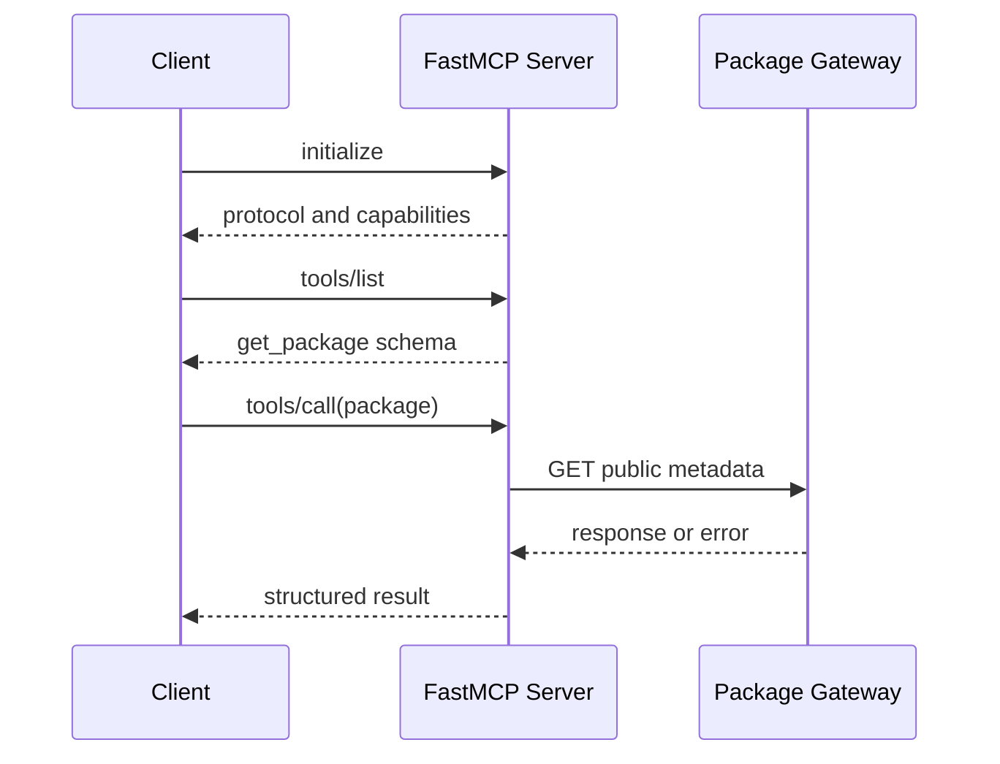

# 用 FastMCP 实现一个可测试的只读 Server

这篇实践文章做一件范围很窄的事：写一个 MCP Server，根据公开的软件包名称返回版本和主页。它不修改包信息，不访问用户私有数据，也不让模型决定权限。范围越窄，越容易把协议、业务函数、错误和测试分开，读者可以先掌握一条完整链路，再把同样的边界带到真实工具。

输入是包名，例如 `requests`；输出是带 `name`、`version` 和 `homepage` 的结构化结果。非法名称、上游 404、网络超时、返回内容不符合 Schema 和客户端断开，都要有不同的终态。工具返回 200 只证明网络请求成功，不能证明业务结果可信。

::: info 贯穿示例的责任边界

FastMCP 负责把 Python 类型和函数暴露成可发现工具。业务函数负责调用公开包索引并归一化响应。客户端负责初始化会话、发现工具和提交参数。策略、身份、审计和生产凭证仍由应用 Runtime 管理，不由 Server 自行推断。

:::

## 先准备 Python、FastMCP 和测试环境

Python 从 [官方下载页](https://www.python.org/downloads/) 选择维护中的版本。MCP Python SDK 的安装说明见 [官方文档](https://modelcontextprotocol.io/docs/sdk/python)，FastMCP 的 API 和版本要求以当前包文档为准。下面用 `uv` 管理隔离环境，方便锁定依赖并重复运行测试。

<figure class="doc-shot">
  
  <figcaption>Python 官方下载入口。先选择操作系统和维护中的版本，再让虚拟环境使用同一个解释器。</figcaption>
</figure>

<figure class="doc-shot">
  
  <figcaption>uv 官方安装入口。安装脚本、包管理器和预构建二进制以当前文档列出的方式为准。</figcaption>
</figure>

```bash
curl -LsSf https://astral.sh/uv/install.sh | sh
uv --version
uv init fastmcp-readonly
cd fastmcp-readonly
uv add "mcp[cli]" httpx pydantic
uv add --dev pytest
uv run python --version
```

安装脚本来自 [uv 官方安装文档](https://docs.astral.sh/uv/getting-started/installation/)。如果团队不允许执行远程脚本，可以按文档选择包管理器或预构建二进制。`uv run python --version` 只证明环境可用，后续还要运行本地单元测试和协议发现测试。

## FastMCP 在协议链路中做什么

MCP Server 启动后先创建 Transport，再向客户端暴露能力目录。客户端初始化时协商协议版本和能力，随后调用 `tools/list` 读取工具名称、描述和输入 Schema。只有发现结果满足预期，客户端才提交 `tools/call`。这几个阶段属于协议生命周期，不应和包索引请求混成一个函数。

FastMCP 的装饰器可以从 Python 签名和类型注解生成工具 Schema。Schema 解决输入形状问题，例如 `package` 必须是字符串；它不能证明包存在、当前用户有权限访问，或者返回的主页属于正确项目。业务函数仍要做长度、字符集、上游状态和结果字段校验。



Server 只做协议适配和窄能力交付。不要在工具函数里读取环境中的任意凭证、拼接用户传入 URL、执行 Shell 或把完整上游响应原样交给模型。能力越窄，越容易配置超时、缓存和审计。

## 设计工具输入和输出合同

输入合同只有一个字段 `package`。先去掉首尾空白，再限制长度和允许字符，拒绝空字符串、路径分隔符和控制字符。不要接受一个“任意 URL”字段来替代包名，否则 SSRF、跨域和缓存污染会一起进入这个小实验。

输出合同区分三类结果：找到时返回包名、版本、主页和来源时间；上游确认不存在时返回 `not_found`；请求超时、响应格式错误或上游 5xx 时返回可重试的错误类型。客户端不应通过解析自然语言错误文案判断下一步。

```python
from dataclasses import dataclass

@dataclass(frozen=True)
class PackageInfo:
    name: str
    version: str
    homepage: str | None

class PackageError(Exception):
    def __init__(self, code: str, message: str):
        super().__init__(message)
        self.code = code
```

业务函数只返回这些内部类型，Transport 层再把它们转换为 MCP 结果。这样单元测试不需要启动客户端，也不会因为 SDK 错误格式变化而修改核心逻辑。

### 代码怎样拆成可替换的边界

把文件拆成四个小模块会更容易测试。`validation.py` 只负责包名规范化和输入错误；`gateway.py` 定义 `PackageGateway` 协议并实现 HTTP 适配；`service.py` 把 Gateway 响应转换为 `PackageInfo` 和 `PackageError`；`server.py` 只负责 FastMCP 装饰器和 Transport 启动。模块之间传递内部类型，不传递 `httpx.Response` 或 SDK 的原始对象。

这种拆分有两个直接收益。第一，Fake Gateway 可以覆盖 404、超时和畸形数据，不需要模拟网络库的每个字段。第二，未来换成公司内部包索引时，只替换 Gateway 和允许主机策略，工具名称、Schema、错误码和客户端合同保持不变。模块拆分不是为了增加文件数量，而是把供应商协议、网络失败和业务校验放到各自拥有状态的位置。

错误映射要在业务边界完成。Gateway 可以返回 `GatewayTimeout`、`GatewayNotFound` 或 `GatewayBadResponse`，Service 再转换成对客户端稳定的 `upstream_timeout`、`not_found` 和 `invalid_upstream`。这样上游库更换异常类型时，调用方不会被迫修改重试和交付逻辑。测试同时断言原始原因摘要被保留，避免排障只剩一个通用错误码。

### 最小服务怎样启动和关闭

本地运行时把 `server.py` 作为唯一入口，先构造 Gateway、注册工具，再启动 stdio 或 HTTP Transport。启动前检查配置和允许主机，失败就退出，不要在第一个工具调用时才发现环境变量缺失。关闭时先停止接收新调用，再等待当前请求在 Deadline 内结束，最后关闭 HTTP 客户端和缓存连接。

```bash
uv run python server.py
```

命令启动成功只说明进程进入事件循环。还要用真实客户端完成 initialize、tools/list 和一次故意的非法参数调用，观察是否得到稳定的 `invalid_argument`。如果 stdout 出现调试文本，先修复日志通道，再继续协议测试；否则后续的“工具不存在”可能只是帧被污染。

## 实现一个带超时的只读工具

下面的实现使用 `httpx.AsyncClient` 请求公共包索引。`PackageGateway` 是外部依赖的边界，测试时可以用 Fake Gateway 替换。真实服务必须固定允许的主机、总超时和响应字节上限，不能把工具调用的 Deadline 无限传给网络客户端。

```python
import httpx
from mcp.server.fastmcp import FastMCP

mcp = FastMCP("package-readonly")

def validate_package(value: str) -> str:
    package = value.strip()
    if not package or len(package) > 100 or any(ch in package for ch in "/\\\x00"):
        raise PackageError("invalid_argument", "package name is invalid")
    return package

async def fetch_package(package: str) -> PackageInfo:
    url = f"https://pypi.org/pypi/{package}/json"
    try:
        async with httpx.AsyncClient(timeout=5.0) as client:
            response = await client.get(url, follow_redirects=False)
    except httpx.TimeoutException as exc:
        raise PackageError("upstream_timeout", "package index timed out") from exc
    except httpx.HTTPError as exc:
        raise PackageError("upstream_unavailable", "package index is unavailable") from exc

    if response.status_code == 404:
        raise PackageError("not_found", "package does not exist")
    if response.status_code >= 500:
        raise PackageError("upstream_unavailable", "package index returned server error")
    if response.status_code != 200:
        raise PackageError("upstream_rejected", "package index rejected the request")

    try:
        data = response.json()
        info = data["info"]
        return PackageInfo(
            name=str(info["name"]),
            version=str(info["version"]),
            homepage=info.get("home_page") or info.get("project_url"),
        )
    except (ValueError, KeyError, TypeError) as exc:
        raise PackageError("invalid_upstream", "package response has an invalid shape") from exc

@mcp.tool()
async def get_package(package: str) -> dict[str, object]:
    """Read public package metadata. This tool never changes package state."""
    normalized = validate_package(package)
    result = await fetch_package(normalized)
    return {
        "name": result.name,
        "version": result.version,
        "homepage": result.homepage,
    }
```

这段代码的输入是一个包名，输出是稳定字段。`follow_redirects=False` 把重定向保留给更外层的安全策略；超时和 404 被映射成不同错误；JSON 解析成功后还要检查字段，不把任意对象直接交给客户端。生产实现还应增加缓存键、缓存 TTL、来源时间和速率限制。

## 客户端初始化和工具发现

客户端不能假定工具名称和参数永远存在。初始化后先调用工具列表，检查 `get_package` 的输入 Schema，再提交调用。协议级测试需要捕获初始化、发现和调用三个阶段的事件，便于区分“Server 没启动”“工具没有注册”和“上游包索引失败”。

```python
async def call_readonly_session(client, package: str):
    await client.initialize()
    tools = await client.list_tools()
    tool = next((item for item in tools if item.name == "get_package"), None)
    if tool is None:
        raise RuntimeError("tool_not_found")
    return await client.call_tool("get_package", {"package": package})
```

工具发现结果是客户端看到的协议快照。Server 在运行期间更新工具目录时，要使用版本或重新初始化，不能让旧客户端把旧 Schema 当成当前合同。客户端收到未知字段时，应按协议层的兼容规则处理，不把供应商对象直接传入业务层。

### 协议事件怎样转换成内部状态

协议层返回的是初始化响应、工具列表、调用结果和错误消息，业务层需要把它们转换成自己的事件类型。转换时保留协议版本、原始 request ID、工具名和终止原因，另外生成内部 `call_id`。不要把 SDK 异常的字符串直接写入领域状态，因为升级依赖后同一个异常可能换一种文案。

一次调用可以用下面的状态变化表示：

| 内部状态 | 进入条件 | 离开条件 |
| --- | --- | --- |
| `discovered` | 初始化和工具列表成功 | Schema 通过 |
| `validated` | 参数规范化完成 | Gateway 已开始 |
| `running` | 记录开始时间和 Deadline | 收到响应、取消或超时 |
| `completed` | 结果通过字段校验 | 写入缓存或交付 |
| `failed` | 错误已归一化 | 重试、拒答或人工处理 |

状态转换由程序完成，模型只能决定是否提出下一次调用。客户端重新连接时读取 `call_id` 和最后事件，不根据界面上的“正在加载”猜测服务是否仍然运行。

### stdio 与 HTTP 的测试差异

stdio 测试最接近本地工具启动：父进程创建子进程，读取初始化响应，再发送工具调用。它要额外检查子进程退出码、stderr 是否包含日志、stdin 关闭后资源是否释放。HTTP 测试则检查认证、请求体大小、连接复用、超时和客户端取消。两种 Transport 可以共用 Fake Gateway，但不能共用所有生命周期断言。

测试覆盖协议兼容时，固定一组最小消息序列，再让两个 Transport 产生相同的内部事件。这样可以确认差异来自 Transport 适配，而不是业务函数。若协议版本不支持某项能力，应该在初始化阶段拒绝或降级，不要在真正调用后才发现。

## 缓存、重复调用和资源清理

公开包版本可以短暂缓存，但缓存键至少包括规范化包名、来源主机和解析器版本。缓存命中仍要检查当前请求是否有权看到结果，不能把缓存视为绕过授权的通道。上游 404 可以短暂负缓存，但 TTL 不能永久固定，因为包可能后来发布。

网络异常重试要受调用预算和总 Deadline 约束。对 404、参数错误和 Schema 错误重试没有意义；对连接重置可以有限退避。若第一次请求的回执未知，不要并行发起第二个写操作，本例是只读查询，因此可以安全重试，但仍应记录尝试次数。

Transport 关闭时要等待正在处理的请求结束，取消异步任务并关闭 HTTP 客户端。标准输出只承载协议消息，调试日志写到 stderr 或结构化日志系统，否则客户端会把日志误判为协议帧。资源清理要放在 `finally`，测试要检查连接和任务没有泄漏。

### 缓存条目也要有证据身份

缓存值不能只有一段 JSON。至少保存规范化包名、来源 URL、抓取时间、解析器版本、响应摘要和过期时间。这样命中时可以回答“这条版本来自哪里”，失效时也能按来源和解析器版本清理。包索引返回新版本后，旧值在 TTL 内仍可能被使用，文档或产品必须接受这个新鲜度窗口。

缓存和权限要分开。公开包信息通常不需要租户 ACL，但调用者的速率限制、审计和网络出口策略仍然存在。未来如果工具改为查询私有仓库，缓存键必须加入租户和权限版本，并且在撤权时主动失效，不能因为对象名相同就复用。

### Transport 选择不改变业务合同

stdio 适合本地客户端启动子进程，HTTP 适合独立服务。stdio 的日志污染会直接破坏协议，HTTP 则要额外处理认证、重放、连接关闭和请求大小。无论使用哪种 Transport，工具名称、Schema、错误类和终态都应该由同一套业务合同生成，测试不应把 Transport 细节复制进所有用例。

独立 HTTP Server 还要限制来源和请求体，设置连接、读取和总 Deadline，拒绝任意重定向和内网地址。服务端不能因为客户端断开就立刻丢弃审计记录；如果没有外部副作用，可以取消上游读取，若已经产生不可逆动作则必须保留回执或未知状态。

## 从协议回执定位 Server 责任层

| 现象 | 事件证据 | 责任位置 | 处理方式 |
| --- | --- | --- | --- |
| Server 进程退出 | 没有 `initialize` 响应 | 启动与 Transport | 先查解释器、入口和标准输出 |
| 工具列表为空 | 初始化成功但没有目标名称 | 注册与能力目录 | 检查装饰器、导入和版本 |
| 参数被拒绝 | `invalid_argument`，上游调用为零 | Schema 与输入验证 | 修正调用参数，不重试上游 |
| 404 被正确返回 | `not_found`，HTTP 404 | 业务映射 | 交付明确空结果或换包名 |
| 请求超时 | `upstream_timeout`，有开始时间无响应 | Gateway 与 Deadline | 在剩余预算内有限重试 |
| JSON 形状错误 | HTTP 200 但 `invalid_upstream` | 解析器 | 保留摘要，等待兼容适配 |
| 客户端断开 | Server 有调用回执，交付事件未发送 | 交付通道 | 关闭资源，按 request ID 重连读取 |

不要只看 HTTP 状态码。一次成功查询应能关联 request ID、规范化包名、工具版本、上游状态、解析结果和终态；一次失败也要说明有没有产生外部调用。日志中不保存完整凭证和不受控的上游正文。

### 取消、断开和未知结果

客户端取消发生在 Gateway 请求之前时，Server 可以直接返回 `cancelled`，调用次数为零。请求已经发出后才收到取消，需要向 HTTP 客户端传播取消信号，并记录上游是否已经返回。若网络断开导致回执未知，Server 不能把它当作普通超时反复执行；本例是只读操作，可以查询或有限重试，但事件仍应保留 `unknown_outcome` 的原始事实。

Transport 断开不等于业务任务失败。对于短查询，连接关闭后清理任务即可；对于后台或长轮询能力，应把核心状态与交付通道分离，客户端重连时按事件游标读取结果。只读 Server 不需要保存复杂的业务 Checkpoint，但仍要确保重复读取不会再次触发外部请求，缓存或回执表要有明确 TTL。

异常处理顺序也很重要。先捕获取消和超时，再捕获 HTTP 错误，最后处理解析错误；不要用宽泛的 `except Exception` 把 `not_found`、权限拒绝和代码缺陷都包装成可重试。每一种错误都应有稳定 code、阶段和资源清理结果，调用方才知道是否应该重试。

## 用 Fake Gateway 做单元测试

Fake Gateway 让测试只验证本地控制逻辑。它可以按包名返回成功、404、超时和畸形 JSON，断言工具参数、错误码、调用次数、缓存行为和清理动作。下面的命令执行共享示例和 MCP 子项目测试：

```bash
PYTHONPATH=examples/ai-agent \
  python3 -m unittest discover \
  -s examples/ai-agent/tests -p 'test_*.py'

uv run --project examples/ai-agent/mcp-python \
  pytest examples/ai-agent/mcp-python/tests
```

这些测试证明 Fake Gateway、Schema 和状态转换按合同运行，不证明真实 PyPI、网络、认证或线上 Transport 的可用性。在线验证要记录服务版本、时间窗口、请求预算和实际响应；如果没有运行证据，只能写“需要验证”。

测试分成三层会更容易定位问题。纯函数测试验证名称规范化、响应映射和错误分类；工具层测试用 Fake Gateway 验证超时、404、畸形 JSON、缓存和取消；协议层测试启动真实 FastMCP Server，检查初始化、工具发现、调用和关闭。三层不共享“万能成功 Fixture”，否则协议测试可能绕过业务分支。

可以为每种故障写一条最小事件轨迹：

| Case | 应发生的事件 | 不应发生的事件 |
| --- | --- | --- |
| 空包名 | `CallRejected(invalid_argument)` | Gateway 请求 |
| 公开包不存在 | `GatewayCompleted(404)`、`NotFound` | 成功缓存写入 |
| 上游超时 | `GatewayStarted`、`GatewayTimeout` | 无限重试 |
| Client 断开 | `CallStarted`、资源清理 | 未关闭的 HTTP 任务 |

测试还要检查输出是否可序列化、错误是否包含稳定 code、敏感 URL 是否已脱敏。只断言“抛出了异常”无法证明客户端能按类型恢复，也无法证明资源已经释放。

## 从本地 Server 走向生产

生产接入至少补四层约束。第一层是身份和权限，Server 不能从模型参数推断租户、用户或知识版本。第二层是网络出口，只允许访问明确的公共包索引主机，并重新检查重定向。第三层是观测，记录工具版本、请求 ID、耗时、错误类、缓存命中和上游状态。第四层是发布，Schema、工具描述和依赖版本要锁定，变更通过协议回归和安全测试。

只读能力适合先做成独立 Server，因为没有外部写入和补偿动作。若以后增加发布包、删除缓存或修改项目配置，必须重新设计审批、幂等回执、沙箱和回滚，不能只在函数上增加一个 `write=True` 参数。MCP 协议提供发现与调用，不会自动提供这些业务不变量。

发布前可以做一次兼容矩阵检查：客户端使用的协议版本、Server 的 SDK 版本、工具 Schema 版本、Python 版本和上游 API 响应版本分别记录。旧客户端读取新字段通常可以兼容，但删除必需字段、改变错误 code 或把字符串改成数字，就需要版本升级或兼容转换。不要让业务代码同时处理多个供应商对象，先在适配层归一化。

运行中要观察初始化失败率、工具发现耗时、调用耗时、上游错误分布、缓存命中率、取消数和活动连接。指标只保存稳定标签，例如工具名、错误类和版本，不把包名、完整 URL 或用户输入放进高基数标签。Trace 关联 `request_id`、`call_id` 和上游请求，但正文和凭证保存在受控存储。

故障恢复要有明确的停止点。Server 重启后，客户端可以重新初始化并重新发现工具；只读查询可以在预算内重试，正在等待的协议调用要按 request ID 去重。升级期间如果 Schema 检查失败，宁可让工具不可用并返回稳定错误，也不要接受旧参数后静默改变含义。

生产发布还要区分制品和运行配置。Python 依赖、锁文件、Server 版本和工具 Schema 形成不可变制品，目标环境注入的超时、允许主机和日志级别属于配置。升级前用旧客户端和新客户端分别做发现、参数错误、404、超时和关闭测试；回滚时先恢复兼容的 Server，再处理缓存和事件保留，不要只替换一个 Python 文件。

如果工具需要访问私有索引，凭证应由服务端短时获取并按租户隔离。模型不能看到完整 Token，日志不能记录 Authorization，缓存不能跨权限复用。请求 URL 必须由包名映射到固定主机，拒绝用户直接提供的内网地址、非标准端口和带凭证重定向。即使 Server 只有只读动作，网络出口和数据边界仍然需要确定性策略。

## 什么时候不该使用 FastMCP

如果调用方只有一个内部函数，输入和输出已经由同一进程控制，直接使用函数或普通 HTTP API 更简单。引入 MCP 的收益在于能力发现、跨客户端调用和协议边界；代价是初始化、Schema 兼容、Transport 生命周期、日志隔离和额外测试。不要因为“模型可以调用”就把每个函数都包装成工具。

| 场景 | 更合适的接口 | 原因 |
| --- | --- | --- |
| 同一进程内只有一个明确调用方 | 普通函数 | 没有发现、传输和跨客户端兼容需求 |
| 固定服务之间的稳定业务接口 | HTTP 或消息协议 | 鉴权、限流和服务契约已经明确 |
| 多个 Agent 客户端需要发现同一组工具 | MCP | 工具目录、Schema 与调用生命周期可以复用 |
| 高风险写操作且没有审批、幂等和回执 | 暂不暴露为模型工具 | MCP 不会自动补齐业务安全边界 |

如果能力包含写数据库、发消息、删除对象或修改权限，本例的只读结构也不够。需要加入审批事件、动作指纹、幂等键、回执查询、补偿和审计，并把执行器放进更严格的网络与凭证边界。工具描述写成“可以操作任何资源”也会扩大模型候选空间，应该按资源类型拆成窄能力。

从只读查询升级到写能力时，建议保留原来的查询工具，另建明确的写工具和权限策略。写工具输入要包含目标资源、预期版本和幂等键，执行前保存候选动作，审批后再调用。结果返回外部系统的回执，不把“请求已经发出”写成“业务已经完成”。如果客户端在执行后断开，重新连接仍要能读取同一个 `call_id` 的终态。

对外暴露前还要做协议和安全回归：未知工具名不能被路由到默认函数，额外字段不能改变权限，超长包名不能触发大请求，错误响应不能泄露上游凭证或完整响应。每条回归都记录输入摘要、调用次数、终态和资源清理，才能证明边界没有被某个新 SDK 或配置悄悄绕过。

### 一次调用的完整证据链

以输入 `requests` 为例，入口先生成 `request_id`，记录规范化后的包名和调用 Deadline。客户端完成初始化后读取工具列表，发现 `get_package` 的 Schema 与预期版本相符，随后提交参数。Server 在 Gateway 开始前记录 `call_id`，把字符串交给校验器；校验器通过后才创建 HTTP 请求。

Gateway 收到 PyPI 的 200 响应后，解析器只读取 `info.name`、`info.version` 和主页字段，并保存来源地址、响应时间和解析器版本。Service 把结果转换为 `PackageInfo`，Transport 再编码成 MCP 返回值。缓存写入发生在业务字段检查之后，不能把未经校验的上游 JSON 直接缓存。

若输入是空字符串，事件链在 `CallRejected` 结束，Gateway 调用次数为零。若包不存在，事件包含 HTTP 404 和 `not_found`，客户端可以展示“没有这个包”，不能显示一个空的成功对象。若请求超时，事件包含开始时间、剩余 Deadline 和 `upstream_timeout`，有限重试仍使用同一个预算。若响应是 200 但字段缺失，解析器返回 `invalid_upstream`，旧缓存不能被新错误覆盖。

这条链路可以直接转换成测试断言。断言不只看最终返回值，还要检查初始化和发现顺序、Gateway 调用次数、缓存是否写入、HTTP 客户端是否关闭以及错误 code 是否稳定。任何一步缺少事件，排障人员都只能重新猜测 Server 到底做了什么。

### 把示例交给另一个客户端验证

协议实践不能只在作者自己的脚本中通过。准备一个最小客户端或 MCP Inspector，先连接 stdio Server，再执行初始化、工具发现、合法调用和非法调用。把客户端版本、Server 版本、Python 解释器和命令写入验证记录。切换到 HTTP Transport 时重新执行同一组 Case，比较内部事件而不是比较日志文案。

验证时故意关闭上游、缩短超时、发送未知工具名并中途断开连接。关闭上游应得到 `upstream_unavailable`，未知工具应在 Server 侧拒绝，断开连接应触发清理。若客户端显示“调用失败”但 Server 没有 `call_id`，先查 Transport 是否真正发出请求；若 Server 有 `call_id` 和上游回执，问题属于交付通道。

读者完成这组练习后，应该能够回答四个问题：工具从哪里被发现，参数在哪里校验，外部请求什么时候发生，失败之后谁拥有状态。回答不了其中任何一个，就不要急着加入缓存、并行工具或模型自动选择。先把当前协议边界和证据链补齐，再扩大能力面。

还可以把一次成功调用保存成脱敏 Fixture，供后续 SDK 升级回放。Fixture 只保留工具列表、字段类型、上游状态、解析后的业务结果和事件顺序，不保存完整响应中的无关描述或任何凭证。升级 FastMCP、httpx 或 Python 后，先用 Fixture 检查内部事件没有改变，再连接隔离的真实包索引做一次协议测试。这样可以把“依赖升级造成的行为变化”和“上游数据本身变化”分开。

如果测试发现新版本把未知字段直接丢弃，先确认这是协议允许的兼容行为，还是业务字段被静默删除。对于主页、版本这类回答必需字段，缺失应进入 `invalid_upstream`，而不是返回部分成功。对可选字段可以返回 `null`，但输出 Schema 和文档要明确这一点，客户端不能自行猜测空字符串的含义。

同样的原则适用于工具说明文字。描述应告诉客户端它读取什么、不会修改什么、参数怎样解释，以及哪些错误会返回；不要写“可以帮你处理包信息”这种无法用于决策的宣传句。描述过宽会让模型在不确定时反复尝试，描述过窄又会让客户端误以为某些字段一定存在。说明、Schema 和实际实现要由同一个测试样本核对。

当这三者出现差异时，以可执行合同为准，先修实现或 Schema，再更新说明文字。这样客户端看到的能力、测试验证的行为和文档描述才会保持同一版本。

MCP Server 不是自动的安全层，也不是任务调度器。它适合承载清晰的协议能力，长时间任务、重试和恢复仍由 Runtime 或工作流负责。先用本地 Fake Gateway 验证边界，再决定是否需要独立进程、HTTP 网关和多租户部署。

FastMCP 的最小实践到此结束。读者应能从安装 Python 开始，启动一个只读 Server，看到工具发现和 Schema，区分正常结果、空结果、超时和解析错误，并用 Fake Gateway 在没有密钥的情况下重复验证。接下来可以回到 [MCP 协议生命周期](/docs/ai-agent/mcp-protocol-lifecycle) 了解取消、重连和能力协商，再决定是否需要更复杂的客户端或多工具编排。
