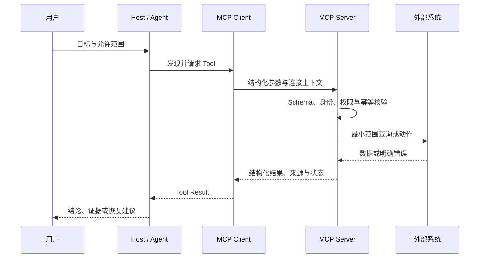

# MCP 设计方法：从重复工作中发现值得开发的连接器

排查一个页面转化下降时，开发者先从分析平台复制事件数据，再到企业文档找需求，打开设计稿核对组件，最后用浏览器复现。Agent 得到四段粘贴文本，却不知道它们的查询时间、权限范围和来源版本。只要其中一段过期，结论就可能错误。

MCP 值得解决的正是这类“外部能力反复进入 Agent”的摩擦。完成后的可观察结果不是多了一个 Server，而是 Agent 能发现一个窄而稳定的 Tool，用受控参数查询当前数据，返回带来源与时间的结构，并在无权限、超时或部分结果时作出正确处理。

## MCP 在 Agent 系统中的准确位置

MCP 是 Host、Client 与 Server 之间交换能力的开放协议。Host 承载用户、模型与安全策略；Client 管理到某个 Server 的连接；Server 发布 Tool、Resource 或 Prompt 等能力，并在后端落实认证、授权和业务逻辑。

输入不是一段任意自然语言，而是协议消息和通过 Schema 约束的参数。处理链包括发现能力、选择调用、校验、授权、执行和返回结果。输出可以是结构化内容、文本或资源，但这些结果进入模型后仍属于不可信外部数据。



正常路径由 Host 提出候选调用，Server 用可信身份约束后端访问，再把可核对结果交回 Agent。若授权失败，Server 返回稳定错误，Agent 不得换一个参数绕过；若外部内容要求泄露密钥，Host 只把它当数据，不执行其中指令。

这条时序也说明 MCP 不负责模型推理质量。Tool 设计、业务授权和结果验证仍属于应用工程，协议连接成功只能证明消息可达。

## MCP、Skill、API、CLI 与 RAG 怎样分工

| 能力 | 主要解决的问题 | 输入与输出 | 适合场景 | 不承担什么 |
| --- | --- | --- | --- | --- |
| 普通 API | 系统间业务通信 | HTTP 请求与响应 | 已有应用集成 | 不为 Agent 提供统一发现语义 |
| CLI | 人或进程执行本地命令 | 参数、stdout、退出码 | 本地确定操作 | 不天然提供跨 Host Tool 目录 |
| RAG | 从知识中取回证据 | 查询、片段、引用 | 大量文档问答 | 不执行受控业务动作 |
| Skill | 复用任务方法 | 任务、步骤、模板 | 发布、审查、报告 | 不提供实时连接或后台授权 |
| MCP | 标准化外部能力连接 | Tool/Resource 协议消息 | 实时数据、跨系统操作 | 不替代工作流、权限和领域模型 |

已有 API 不一定要重写。MCP Server 常是位于 API 前的适配层：把面向页面或服务的接口收敛为面向用户目标的 Tool，隐藏租户、Token 和内部拓扑，统一错误与审计。一次性的本地转换脚本直接用 CLI 更轻；稳定的静态规范放文档或 Skill；需要按权限检索大量资料时用 RAG。

同一需求可以组合：Skill 规定“发布前先检查依赖与文档”，其中查询当前版本的一步调用 MCP；MCP Server 再请求公开 API。职责清晰比把所有东西都叫 Tool 更重要。

## 本机能力只应发布脱敏场景地图

本机可见能力可以归纳为下表，但公开文章不披露 Server 名称、URL、启动命令、环境变量、Token、内网地址或真实数据。能力地图用于观察设计模式，不是个人配置清单。

| 场景类别 | Agent 需要什么 | 合适的能力形态 | 关键边界 |
| --- | --- | --- | --- |
| 事件与行为分析 | 当前指标、分群和查询口径 | 只读 Tool | 时间范围、项目范围、最小聚合 |
| 官方开发文档 | 带版本的接口说明 | Search/Fetch Tool 或 Resource | 官方域名、版本、引用 |
| 企业知识与协作文档 | 用户可见的私有资料 | 受身份约束的检索 Tool | 继承文档权限、不越界回退 |
| 设计协作 | 节点结构、截图和资源 | Resource 加只读 Tool | 文件权限、节点版本、资源来源 |
| 浏览器自动化 | 页面状态与交互结果 | 有状态 Tool | 域名、会话、下载和外部写操作 |
| 运行时调试 | 隔离环境内执行代码 | 受限 Tool | CPU、内存、时间和网络预算 |
| 计算机操作 | 桌面可见状态与动作 | 高风险 Tool | 前台确认、隐私区域、不可逆操作 |

地图的输入是工作中实际使用的能力类别，处理是按数据新鲜度、身份和副作用分组，输出是候选信任域。它不能证明任何具体 Server 已安全实现，也不应用于推断个人安装细节。

## 从重复摩擦中发现 MCP 机会

### 先记录人工循环

连续一周记录“从哪里复制什么、为什么切换系统、怎样确认结果”。高价值信号包括：同一数据反复粘贴；需要跨多个系统关联；数据很快过期；每次都执行相同查询；不同成员使用不同口径；Agent 无法保留来源和权限。

不要从“我们有一个 API”开始。API 存在只证明系统可调用，不证明 Agent 有清晰用户目标、最小参数和安全结果。先描述用户要完成的结果，再寻找最短的受控能力。

### 用四个问题淘汰伪需求

1. 数据或动作是否在仓库外，且会持续变化？
2. 能力是否会被多个 Host、团队或流程重复使用？
3. 能否定义稳定输入、输出、身份和失败语义？
4. MCP 的维护与认证成本是否低于被消除的人工循环？

前两项都是否定时，优先用文件、函数、CLI 或 Skill。第三项答不清时，先治理业务契约；第四项不成立时，接受人工步骤可能是更经济的方案。

### 填写机会卡再决定开发

| 字段 | 要回答的问题 |
| --- | --- |
| 用户目标 | 谁在什么场景下要完成什么可观察结果？ |
| 当前摩擦 | 复制、等待、登录、口径或权限问题在哪里？ |
| 新鲜度 | 数据多久变化，结果必须标记哪个时间点？ |
| 能力形态 | Tool、Resource、RAG、Skill 或现有 CLI 哪个最小？ |
| 输入所有权 | 哪些由用户给，哪些由可信服务端注入？ |
| 输出证据 | 来源、版本、时间和稳定标识怎样保留？ |
| 副作用 | 是否发消息、写数据、扣费、发布或删除？ |
| 失败成本 | 超时、重复执行和部分成功分别造成什么？ |
| 价值验证 | 减少多少人工循环，维护成本怎样统计？ |

机会卡的输出可以是“不开发”。这不是失败，而是避免为了省一次复制，长期维护 OAuth、部署和审计。

## Server 边界跟随信任域

一个 Server 应围绕同一身份体系、数据所有者和风险等级。设计系统与财务系统即使都叫“查询”，也不应放进同一万能 Server；它们的授权、日志、部署和故障半径完全不同。

本地单用户工具适合 stdio：Host 启动子进程，通过标准输入输出交换协议，业务日志不能污染协议流。团队共享与远程能力适合 Streamable HTTP，并需要 TLS、认证、限流和可观测性。传输是连接选择，不会替业务做授权。

Server 的公开目录只放能完成明确用户目标的能力。内部微服务接口可以继续细分，MCP Tool 不应机械地一对一暴露全部端点，否则模型会面对巨大且危险的工具空间。

## Tool 与 Resource 从用户意图划分

Tool 表达需要参数的计算或动作，例如搜索记录、创建草稿、运行检查；Resource 表达可寻址内容，例如某个版本的规范、设计节点或报告。已知 URI 的稳定读取优先 Resource，需要查询、组合或副作用的行为优先 Tool。

假设 Agent 要搜索公开发布记录。模型只提供查询词和数量，身份与可见范围由 Server 从认证上下文获得。JSONC 用于解释设计，真实 Schema 和协议消息必须移除注释。

```jsonc
{
  // 名称表达一个用户动作，不做万能 execute。
  "name": "search_release_records",
  "inputSchema": {
    "type": "object",
    "additionalProperties": false,
    "properties": {
      "query": { "type": "string", "minLength": 2, "maxLength": 120 },
      "limit": { "type": "integer", "minimum": 1, "maximum": 20 }
    },
    "required": ["query"]
  },
  "outputSchema": {
    "type": "object",
    "additionalProperties": false,
    "properties": {
      "items": { "type": "array" },
      "asOf": { "type": "string", "format": "date-time" },
      "sourceVersion": { "type": "string" },
      "partial": { "type": "boolean" }
    },
    "required": ["items", "asOf", "sourceVersion", "partial"]
  }
}
```

Client 先按 Schema 检查形状，Server 再做业务约束并注入可信范围。`additionalProperties: false` 阻止模型附加 `tenantId` 或 `isAdmin`；输出保留数据时间和来源版本。空数组代表成功但没有匹配，不能与连接失败混为一谈。

Tool 的描述还要说明何时使用、何时不用和是否只读。元数据会影响模型选择，应使用直接、间接和负例 Prompt 评测召回与误触发，而不是上线后凭感觉改描述。

## 权限、幂等和错误构成安全契约

权限至少有三层：Host 是否启用某个 Server，Client 是否允许当前 Tool，后端是否允许当前主体访问目标记录。模型提供的身份、租户和角色都不可信，必须从会话或服务端令牌派生。

写操作要定义重试语义。创建动作接收幂等键并返回稳定操作 ID；超时后先查询状态，不能盲目重放。支付、公开发布、删除和生产变更应提供预览与确认阶段，即使 Tool 安全注解声明了风险，也不能替代真实授权。

| 错误类型 | 含义 | Agent 应采取的动作 |
| --- | --- | --- |
| `invalid_argument` | 参数或业务约束错误 | 修正一次或向用户追问 |
| `unauthenticated` | 缺少有效身份 | 请求登录，不猜凭证 |
| `permission_denied` | 身份存在但范围不足 | 停止，不换 ID 绕过 |
| `not_found` | 可见范围内没有目标 | 报告空结果或确认条件 |
| `timeout` | Deadline 内无确定结果 | 查状态或按策略重试 |
| `conflict` | 版本、状态或幂等冲突 | 重新读取当前状态 |
| `dependency_unavailable` | 下游不可用 | 降级或稍后重试 |
| `partial_result` | 部分来源成功 | 标明缺口，不包装成完整结果 |

自然语言错误方便人读，稳定错误码方便 Agent 决策，两者可以同时返回。所有失败都叫“调用失败”会诱导无意义重试，也无法形成可靠监控。

## 审计、测试与部署要覆盖完整生命周期

审计记录调用者稳定 ID、Tool、参数摘要、授权范围、开始与结束时间、状态、操作 ID 和数据版本。Token、Cookie、私钥、完整敏感正文和未脱敏结果不能进入日志。审计用于解释谁在什么范围做了什么，不是另一个数据仓库。

测试从内到外展开：Schema 覆盖合法、缺字段、额外权限字段和边界值；Handler 覆盖身份注入、范围过滤和下游错误；协议测试让真实 Client 发现并调用；安全测试验证越权、Prompt Injection 和日志脱敏；故障测试覆盖超时、取消、重试和部分结果。

部署前固定 Server 与 Tool 版本、健康检查、容量、认证配置和回滚方式。本地 stdio 要验证启动、关闭和日志通道；远程 HTTP 要验证 TLS、OAuth、限流和多实例幂等。先灰度只读 Tool，再逐项开放副作用能力，监控错误类型和误调用，而不是只看请求成功率。


**一个 Server 应暴露多少个 Tool？**

没有固定数字。Tool 应围绕同一信任域和清晰用户目标组织：太少会长出带大量 `mode` 的万能入口，太多会提高选择错误与维护成本。用直接、间接和负例 Prompt 测试能力选择；两个 Tool 的权限、输入和错误完全不同时就拆开，总是成对调用且无法独立完成目标时则重新评估边界。

**Tool 超时后能否自动重试？**

只读、幂等查询可以在总 Deadline 内有限重试；有副作用的动作先用幂等键或 operation ID 查询第一次调用的最终状态。**超时表示结果未知，不等于执行失败。** 无法确认时应停止并交给用户或补偿流程，不能为了拿到成功响应重复创建、扣费或发布。

**怎样衡量 MCP 是否创造了价值？**

比较接入前后的完整任务：人工切换与复制次数、完成时间、口径错误、证据完整度、权限事件和故障恢复时间，再扣除 Server 的开发、认证、运行与维护成本。Tool 调用成功率只是运行指标。用户仍需返回原系统核对全部字段时，说明输出契约没有解决最初的摩擦。
