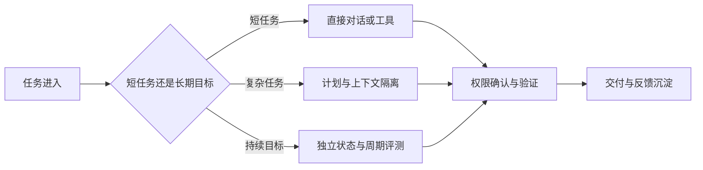

# 个人 AI 工作系统：任务模式、权限与长期反馈

按不确定性、权限和持续周期安排计划、执行、评测、发布、增长和复盘。**AI Work System**、**Goal**、**Feedback** 分别指向同一条执行链上的不同对象：任务清单、目标周期、不确定性、数据敏感度、可用工具、精力预算和交付责任进入系统，任务模式、会话、长期目标、授权、产物、验证、反馈、复盘和归档保存处理中间状态，最终得到可追踪任务、验证过的产物、明确权限记录、复盘结论和下一次可复用上下文。

个人 AI 工作系统位于个人长期使用多种 AI 能力时的任务、权限和反馈管理层，主要机制是短任务使用直接对话或工具，复杂任务先计划，持续目标单独保存状态；所有外部写入和发布按权限确认，完成后把可复用规则与证据沉淀。所有事情放一个长会话、长期目标没有停止条件、自动发布越权、复盘只记结论不记证据和记忆积累过期隐私会让链路在不同位置停止，错误记录必须保留发生阶段、当时的状态和终止原因。

::: info 贯穿示例

个人 AI 工作系统场景：一天内同时处理代码修复、内容审校、长期调研和发布准备，需要避免上下文串线与权限失控。个人 AI 工作系统需要的身份、权限、版本和业务事实由应用提供，模型与外部内容只产生候选。

:::

## 先区分一次性任务与长期工作

所有事情放一个长会话会破坏任务模式与可追踪任务之间的对应关系，排查时先保留原始输入摘要和发生阶段，再判断是否允许重试。

长期目标没有停止条件影响会话或下游解释，不能和所有事情放一个长会话共用“重新调用一次模型”的处理方式。

## 资料、记忆和工具各自解决什么

AI Work System 实践中，执行者负责计划和改动，工具提供证据，脚本负责可重复检查。因此任务模式与会话要有唯一写入方，其他组件只能通过版本化命令申请修改。

任务管理与个人 AI 工作系统解决的问题相邻，但控制权不同，比较时要看谁选择选择能力、谁保存任务模式、谁确认可追踪任务。

知识库可以参与同一请求，却不能替代个人 AI 工作系统；组合后仍要单独检查目标周期的可信来源和所有事情放一个长会话的终止规则。

个人 AI 工作系统使用的身份、范围和版本来自可信运行时，任务清单可以表达意图，但不能提升权限或改写活动 Release。

长期目标没有停止条件发生时，错误回到会话的所有者处理，上游缺输入、当前组件违反不变量和下游不可用分别形成不同终态。

个人 AI 工作系统的确定性边界位于任务模式写入之前。模型在 AI Work System 中只提交候选值，程序仍要从认证、版本和策略快照补入可信字段。

个人 AI 工作系统内部可以使用更细的临时对象，跨边界只暴露稳定协议。替换任务管理时，调用方不需要理解内部缓存和 SDK 响应。

## 个人资料的来源和权限

个人 AI 工作系统的输入合同至少列出任务清单、目标周期和不确定性，每项都注明来源、是否必需、允许的缺省值，以及缺失后是在入口拒绝还是进入降级路径。

个人工作系统至少要区分当前任务模式、会话材料和长期目标。任务模式决定今天允许做什么，会话保存本轮可复用的事实，长期目标只提供方向，不应直接变成当前执行命令。三者分开，切换任务时才不会把旧上下文带进新工作。

并发分支按稳定身份合并长期目标，完成顺序只反映耗时，不能决定结果属于哪个请求，更不能让迟到的旧状态覆盖新修订。

输出合同同时描述可追踪任务和验证过的产物，并为拒绝、取消、部分完成和未知状态提供固定形状，调用方据此分支，无需解析错误文案猜测结果。

会话参与乐观并发检查；处理开始后若版本变化，旧候选只保留作审计，不能继续写入任务模式。

任务清单里若包含模型填写的同名字段，应用会丢弃它，再从认证、配置或活动版本中补入可信值，因为结构校验通过不等于授权或业务校验通过。

需求假设、文件定位、差异、命令输出、失败说明和回滚入口组成个人 AI 工作系统的最小追踪材料，日志只保存稳定 ID、版本和错误类，完整 Prompt、文档正文与凭证不进入指标标签。

撤回或删除目标周期时，相关缓存、候选和未完成任务按版本失效；稳定 ID 可以保留审计关系，已撤回内容不能继续进入可追踪任务。

契约还需要描述新鲜度。会话对应的数据发生变化后，旧缓存、旧候选和未完成任务怎样失效，应由版本或时间规则直接判断，不能依赖模型注意到矛盾。

删除和撤回也属于数据生命周期。个人 AI 工作系统引用的原始对象被移除时，稳定 ID 可以保留审计关系，正文与派生结果则按策略失效，避免继续向用户展示过期内容。

::: warning 个人 AI 工作系统的可信边界

可追踪任务通过结构校验后仍是候选。个人 AI 工作系统使用的身份、权限、知识版本与业务事实由应用从可信服务读取，核对完成后才能执行或交付。

:::

## 任务输入、暂存区和交付区

个人 AI 工作系统的推演要从一个具体任务开始：记录它何时从直接对话升级为计划，哪些材料进入会话，哪一步需要外部确认，结束后留下什么可复用证据。切换到另一项任务时，旧会话不得偷偷改变新任务的权限和目标。

读取任务约束接收任务清单并建立任务模式，入口校验未通过就地结束，后续模型、检索器或工具调用次数保持为零。

选择能力读取会话并执行主题逻辑，参数由应用组装，外部返回先保存为验证过的产物，尚未获得修改领域状态的资格。

执行最小改动检查结构、范围、版本和主题不变量；可追踪任务缺少来源、落在旧版本或越过权限时，任务模式停在 rejected 或 failed。

验证并交付先保存可追踪任务与终止原因，再产生事件或通知，交付失败可以重放，核心状态写入失败则不能对外宣称完成。

选择能力出现部分结果时，由任务合同决定保留、补偿还是整体丢弃；可追踪任务若可重建就重新生成，外部副作用则查询回执或执行补偿。

实现可以使用函数、Graph、Middleware 或 Workflow，任务模式的所有权和所有事情放一个长会话的停止规则不会随框架改变。

部分成功需要在步骤边界处理。选择能力已经产生一部分可追踪任务时，程序按任务合同决定保留、补偿或整体丢弃，并记录未完成项，不能默认为全部成功。

选择能力和执行最小改动都要写明逆向动作或不可逆原因，可追踪任务若可重建就删除后重算，已发送的外部命令只能查询回执或补偿。

## 沿一次资料整理推演

沿“个人 AI 工作系统场景：一天内同时处理代码修复、内容审校、长期调研和发布准备，需要避免上下文串线与权限失控”推演个人 AI 工作系统：入口创建 request_id，读取可信身份，把任务清单和当前版本写入初始状态。

读取任务约束生成任务模式与输入摘要；若目标周期缺失，请求返回 rejected，并指出缺少哪项材料，不继续消耗模型或外部服务配额。

选择能力按“短任务使用直接对话或工具，复杂任务先计划，持续目标单独保存状态；所有外部写入和发布按权限确认，完成后把可复用规则与证据沉淀”推进，每次依赖调用保存 call_id、参数摘要、开始时间与状态版本，以便判断超时前是否已经产生结果。

候选结果对应可追踪任务、验证过的产物、明确权限记录、复盘结论和下一次可复用上下文，执行最小改动逐项检查权限、版本与领域约束，问题列表为空才允许形成下一状态。

验证并交付写入终态；客户端断开只影响交付通道，重新连接时读取已经保存的任务模式或事件游标，不重跑核心逻辑。

故障注入选择自动发布越权，程序保留原候选和错误位置，只重做失败边界，不能从入口复制整个任务并产生第二份状态。

推演结束后用 request_id 关联任务模式、可追踪任务与终止原因，测试据此排除并发请求串线，并确认失败路径没有遗留未关闭资源。

个人 AI 工作系统在输入拒绝时不调用依赖，正常路径按 5 个阶段推进，有限修复只重做失败边界。调用次数是控制流断言，不是性能宣传。

个人 AI 工作系统的最终记录用 request_id 关联任务模式、可追踪任务和失败问题，测试据此证明结果来自本次执行，没有混入并发请求。

## 怎样知道任务已经完成

个人 AI 工作系统正常完成时，任务模式、会话和可追踪任务指向同一次执行，重复读取返回同一终态，未完成分支已经取消或有明确所有者。

需求假设、文件定位、差异、命令输出、失败说明和回滚入口用于还原个人 AI 工作系统的处理过程，可以按阶段和版本聚合；敏感正文留在受控存储中，不复制到日志与指标。

验证过的产物可能是合法的空结果，但必须带范围、版本和原因；任务明确要求找到材料时，同一个空结果进入拒答而非成功。

依赖返回成功状态只证明传输完成。个人 AI 工作系统还要检查可追踪任务是否满足业务范围、质量阈值和当前版本，明确拒绝也可能是正确终态。

任务模式的状态迁移必须单调：完成不能退回运行中，取消不能被迟到结果覆盖，失败重试也不能绕过入口已经固定的权限。

个人 AI 工作系统的成功证据最终要同时回答输入是什么、执行了哪些步骤、交付了什么以及为什么停止；任一项缺失都应留在未确认状态。

个人 AI 工作系统把业务验收与服务健康分开。依赖返回 200 只说明传输成功，可追踪任务仍要满足当前范围和质量要求；明确拒答也可能是正确终态。

个人 AI 工作系统的观测指标按阶段和版本聚合。评估 AI Work System 时，把错误、空结果、拒绝、恢复和资源消耗分开统计，避免一个成功率掩盖不同故障。

## 记忆污染和误用怎样停止

个人工作流的失败通常有不同来源：任务定义不清需要重新确认，资料过期需要更新来源，工具执行失败需要查看回执，完成标准含糊则要补验收条件。把这些问题都交给同一个对话窗口重试，长期目标和短期操作会一起变得不可信。

遇到所有事情放一个长会话时，先记录发生阶段、错误类别和责任对象。个人 AI 工作系统保留输入摘要和状态版本，由对应组件决定重试、降级或终止。

遇到长期目标没有停止条件时，先记录发生阶段、错误类别和责任对象。个人 AI 工作系统保留输入摘要和状态版本，由对应组件决定重试、降级或终止。

自动发布越权触及个人 AI 工作系统的安全边界，重试不会使它自动合法；执行路径保存拒绝规则和输入来源，清除未授权候选，并以稳定错误结束当前动作。

遇到复盘只记结论不记证据时，先记录发生阶段、错误类别和责任对象。个人 AI 工作系统保留输入摘要和状态版本，由对应组件决定重试、降级或终止。

个人 AI 工作系统遇到记忆积累过期隐私时，要同时记录开始时间、剩余时限和最后一次进展，随后停止新增工作，只允许释放资源、保存可恢复状态或返回已经确认的局部结果。

个人 AI 工作系统将终态、可重试性和资源清理结果写入记录；后台扫描器根据任务模式判断任务是在运行、等待恢复还是已失败。

个人 AI 工作系统执行前固定 Deadline、动作上限、重复签名、无进展阈值、预算和取消信号；任一条件触发，选择能力停止创建新工作。

个人 AI 工作系统把重试时间和次数计入总预算。AI Work System 每次重试先扣减剩余额度，达到上限就保留原始错误。

个人 AI 工作系统的清理动作设计成幂等操作；仍被活动任务或 Lease 引用的资源拒绝删除。

## 用周期性回顾检查系统

选择一天的真实任务按模式分类，记录每次权限、产物和验证；一周后检查能否仅凭归档恢复上下文并删除过期资料；测试显式给出任务清单、初始任务模式、预期可追踪任务和终止原因，不能只断言返回值非空。

个人 AI 工作系统的单元测试用 Fake Adapter 固定可追踪任务与错误，断言参数、调用顺序、状态修订和清理动作，这些结果只证明本地控制逻辑。

契约测试围绕任务清单、任务模式和验证过的产物构造合法与非法样本，Schema 解析成功后继续检查权限、版本与领域不变量。

故障测试注入所有事情放一个长会话和长期目标没有停止条件，记录选择能力是否被调用、任务模式是否改变、资源是否释放，以及同一身份重试会不会重复执行。

个人 AI 工作系统的集成测试连接真实协议与隔离存储，检查序列化、约束、并发和超时；需要在线服务时另行记录服务版本、时间、配置与凭证条件。

个人 AI 工作系统的回归报告要保留失败类型分布。在 AI Work System 的回归中，拒绝、超时、权限错误和空结果必须保持各自类型，状态变化本身就是行为契约。

个人 AI 工作系统的性质测试随机改变任务模式顺序、重复提交、完成顺序或状态版本，断言权限不扩大、终态不倒退、同一身份不产生两次副作用。

AI Work System 的离线评测关注质量变化，运行时测试关注控制和恢复，两类证据都齐全才可交付。个人 AI 工作系统只有两类证据都存在，才能同时回答“结果是否合格”和“系统是否安全完成”。

## 维护成本和删除机制

个人工作系统要把任务状态、资料来源、记忆开关和工具版本写进可迁移的记录。规则变化后，旧任务仍能按当时的状态恢复，删除操作也能找到原始资料和派生缓存。

个人 AI 工作系统的容量主要受上下文大小、并行任务、外部工具、测试时长和审查成本影响，并发可能缩短单次等待，也会占用连接、配额、内存和下游吞吐，必须沿读取任务约束、收集仓库证据、选择能力、执行最小改动、验证并交付逐层核算。

个人 AI 工作系统的候选版本在固定样本上比较正确性、错误类型、延迟和资源消耗，所有事情放一个长会话等安全红线回归时直接停止发布，不能用平均质量抵消。

所有事情放一个长会话的降级路径在发布前写好，可以减少非关键增强、返回已经确认的可追踪任务，或明确暂时无法确认，缺失事实不能交给模型补写。

遇到资料命中错误时，先用 `request_id` 定位任务状态、检索范围、记忆开关、来源版本和删除回执，再决定修正索引、关闭记忆还是回滚规则。先找到证据，处理动作才不会扩大泄露范围。

个人 AI 工作系统的数据按证据用途分级保留，聚合字段可以留得更久，任务清单和大体积可追踪任务设置短期限、访问控制与删除通道。

个人 AI 工作系统先在单进程实现任务模式、超时、错误和测试，只有恢复与容量证据提出要求时，再增加队列、Lease、分布式缓存或工作流引擎。

个人 AI 工作系统的监控阈值要对应可执行动作。

回滚要覆盖代码之外的状态。个人 AI 工作系统若改变 Schema、缓存键或持久化记录，旧版本是否还能读取新写入数据必须提前验证；无法双向兼容时采用候选版本隔离。

## 什么时候不该保存长期记忆

采用个人 AI 工作系统前先画出任务清单到可追踪任务的最小控制图；固定函数已经能完成任务时，新增模型决策和跨进程任务模式只会扩大测试与运维范围。

任务管理器保存截止时间和状态，AI 系统可以根据上下文提出下一步，但用户或确定性规则保留确认权。可追踪性来自来源、状态和反馈，而不是多写一段自动总结。

知识库可以与个人 AI 工作系统组合，但外部知识仍需授权，工具调用仍需校验，模型产生的可追踪任务仍停留在候选状态。

个人 AI 工作系统适合价值足够、所有事情放一个长会话可观察且预算可接受的任务，高风险、不可逆的决定需要确定性规则或人工批准。

格式正确但事实错误的可追踪任务是必要反例；若它直接进入成功，说明执行最小改动缺少业务验证，应保留候选并给出证据问题。

执行期间修改会话可以检验并发设计，旧动作若仍能覆盖任务模式，说明版本或 Lease 有缺口，增加 Prompt 规则无法修复这类竞态。

个人工作系统会增加任务模式、权限和恢复责任。设计记录要写清新增的停止、降级与回滚路径。

先用一个任务模式、几类明确错误和确定性测试验证隔离，再考虑并发、缓存或队列。

如果任务可以独立完成，使用短会话和明确交付，不把所有事情塞进一个长期上下文。

## 个人工作系统的记忆自测

把“一个任务需要临时资料、长期记忆和人工确认”缩成一个本地可以完成的小实验。入口先写目标、输入、可修改范围和验收命令，任务状态、资料范围、记忆启停和反馈来源由文件或内存仓库保存，模型输出只作为候选。

实现顺序从确定性步骤开始，再接入工具或协议。正常结果同时满足形状和领域条件，敏感内容误存、旧资料命中或删除不生效用稳定错误表示。不要把“一个任务需要临时资料、长期记忆和人工确认”的 Fake Adapter、内存存储或本地测试成功写成远程服务已经可用。

“一个任务需要临时资料、长期记忆和人工确认”的故障样本至少包含缺少输入、权限拒绝、超时、重复提交和取消。“一个任务需要临时资料、长期记忆和人工确认”的每种样本都断言调用次数、状态修订、资源清理和最终报告，修复后重新执行同一命令。

评审“一个任务需要临时资料、长期记忆和人工确认”时比较直接实现与新增能力的成本、可替换性和故障面。未经确认的建议留在临时上下文。

把“一个任务需要临时资料、长期记忆和人工确认”的一次成功和一次失败都交给另一位开发者复现，观察他能否根据日志找到责任层。如果只能重新阅读“一个任务需要临时资料、长期记忆和人工确认”的完整 Prompt 才能理解，说明契约或事件还不够清楚。

示例的结论范围限于当前解释器、依赖和隔离资源。“一个任务需要临时资料、长期记忆和人工确认”使用的真实凭证、网络服务、生产数据和发布授权另行验证，不能从本地退出码推导出来。

## 一个任务需要临时资料、长期记忆和人工确认的边界案例

在“一个任务需要临时资料、长期记忆和人工确认”中，入口收到的资料可能不完整，程序先保存缺口和当前版本，不能让模型用常识填入 任务状态、资料范围、记忆启停和反馈来源。“一个任务需要临时资料、长期记忆和人工确认”的输入后来补齐时，新的执行沿同一个任务 ID 继续；已经结束的失败记录不被覆盖。

敏感内容误存要记录写入来源和命中的范围，旧资料命中要记录索引版本，删除不生效要记录对象、派生缓存和确认时间。没有读取、读取失败、读取成功但没有可用资料、删除结果尚未确认必须分开处理，不能把空结果当作删除成功。

“一个任务需要临时资料、长期记忆和人工确认”的正常输出先经过范围、版本和权限检查，再进入交付或下一个节点。未经确认的建议留在临时上下文。“一个任务需要临时资料、长期记忆和人工确认”的输出只满足结构而没有可验证来源时，状态保持为候选，前端应显示缺口而不是成功标记。

用重复提交、并发完成、取消和进程退出四个样本回归。回归“一个任务需要临时资料、长期记忆和人工确认”时，检查同一幂等键是否只产生一个有效终态，迟到事件是否被拒绝，临时资源是否释放，重新连接是否能读到同一份事件。

“一个任务需要临时资料、长期记忆和人工确认”这组检查的结果应带命令、解释器或服务版本、输入摘要和退出码。“一个任务需要临时资料、长期记忆和人工确认”没有运行证据时，只能写“待验证”；离线替身通过也不能推导真实模型、网络服务或生产权限已经通过。

personal-ai-work-system的修改要优先改变责任边界和可观察证据，不能靠增加一个关键词特判来让样本通过。
