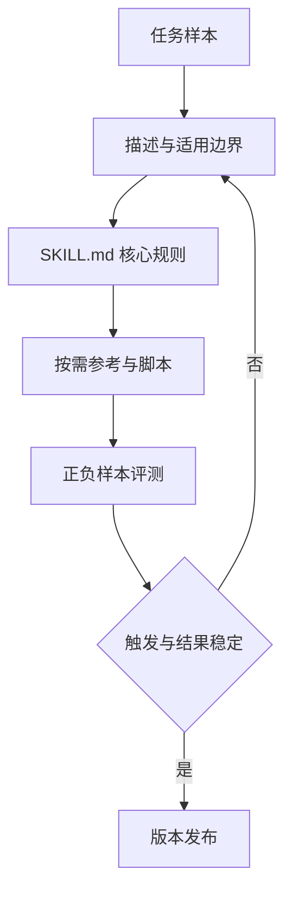

# Skill 设计：触发、渐进式披露与回归评测

把重复 Prompt 和检查步骤整理成可正确触发、按需加载并能测试的 Skill。**Skill**、**SKILL.md**、**Evaluation** 分别指向同一条执行链上的不同对象：重复任务、触发语句、用户目标、必要步骤、确定性脚本、参考资料和反例进入系统，名称、描述、触发判定、已加载说明、资源依赖、执行结果、评测用例和版本保存处理中间状态，最终得到可正确触发的 Skill、渐进式目录、可执行脚本、评测集和维护规则。

Skill 设计位于把稳定任务知识、脚本和参考资料封装为按需加载能力的设计层，主要机制是先写清描述中的适用与不适用边界，再把核心流程留在 SKILL.md，把长参考和脚本按需加载，并用正负样本评测触发。描述覆盖所有写作任务、正文过长常驻上下文、脚本依赖机器路径、反例仍触发、Skill 复制易过期事实和更新不跑评测会让链路在不同位置停止，错误记录必须保留发生阶段、当时的状态和终止原因。

::: info 贯穿示例

Skill 设计场景：团队反复执行文章审校，希望一句自然语言触发，同时只有处理长文时才加载完整写作规范和检查脚本。Skill 设计需要的身份、权限、版本和业务事实由应用提供，模型与外部内容只产生候选。

:::

## 先写触发条件和不适用条件

描述覆盖所有写作任务会破坏名称与可正确触发的 Skill 之间的对应关系，排查时先保留原始输入摘要和发生阶段，再判断是否允许重试。

正文过长常驻上下文影响描述或下游解释，不能和描述覆盖所有写作任务共用“重新调用一次模型”的处理方式。

## Skill 的入口、资源和脚本职责

Skill 实践中，执行者负责计划和改动，工具提供证据，脚本负责可重复检查。因此名称与描述要有唯一写入方，其他组件只能通过版本化命令申请修改。

Prompt 模板与 Skill 设计解决的问题相邻，但控制权不同，比较时要看谁选择选择能力、谁保存名称、谁确认可正确触发的 Skill。

命令别名可以参与同一请求，却不能替代 Skill 设计；组合后仍要单独检查触发语句的可信来源和描述覆盖所有写作任务的终止规则。

Skill 设计使用的身份、范围和版本来自可信运行时，重复任务可以表达意图，但不能提升权限或改写活动 Release。

正文过长常驻上下文发生时，错误回到描述的所有者处理，上游缺输入、当前组件违反不变量和下游不可用分别形成不同终态。

Skill 设计的确定性边界位于名称写入之前。模型在 Skill 中只提交候选值，程序仍要从认证、版本和策略快照补入可信字段。

Skill 设计内部可以使用更细的临时对象，跨边界只暴露稳定协议。替换 Prompt 模板时，调用方不需要理解内部缓存和 SDK 响应。

## 渐进式披露怎样降低上下文成本

Skill 设计的输入合同至少列出重复任务、触发语句和用户目标，每项都注明来源、是否必需、允许的缺省值，以及缺失后是在入口拒绝还是进入降级路径。

Skill 的状态应该让人看出它停在“未触发、已加载、执行中还是已完成”。名称和描述属于可审查的能力元数据，触发判定则要保存当时使用的输入与 Skill 版本；只有把这些字段分开，才能解释一次错误加载是匹配问题还是内容问题。

并发分支按稳定身份合并触发判定，完成顺序只反映耗时，不能决定结果属于哪个请求，更不能让迟到的旧状态覆盖新修订。

输出合同同时描述可正确触发的 Skill 和渐进式目录，并为拒绝、取消、部分完成和未知状态提供固定形状，调用方据此分支，无需解析错误文案猜测结果。

描述参与乐观并发检查；处理开始后若版本变化，旧候选只保留作审计，不能继续写入名称。

重复任务里若包含模型填写的同名字段，应用会丢弃它，再从认证、配置或活动版本中补入可信值，因为结构校验通过不等于授权或业务校验通过。

需求假设、文件定位、差异、命令输出、失败说明和回滚入口组成 Skill 设计的最小追踪材料，日志只保存稳定 ID、版本和错误类，完整 Prompt、文档正文与凭证不进入指标标签。

撤回或删除触发语句时，相关缓存、候选和未完成任务按版本失效；稳定 ID 可以保留审计关系，已撤回内容不能继续进入可正确触发的 Skill。

契约还需要描述新鲜度。描述对应的数据发生变化后，旧缓存、旧候选和未完成任务怎样失效，应由版本或时间规则直接判断，不能依赖模型注意到矛盾。

删除和撤回也属于数据生命周期。Skill 设计引用的原始对象被移除时，稳定 ID 可以保留审计关系，正文与派生结果则按策略失效，避免继续向用户展示过期内容。

::: warning Skill 设计的可信边界

可正确触发的 Skill 通过结构校验后仍是候选。Skill 设计使用的身份、权限、知识版本与业务事实由应用从可信服务读取，核对完成后才能执行或交付。

:::

## 从触发到执行的边界

Skill 设计的验证从正负触发样本开始：记录输入、匹配结果、加载的文件和最终停止原因，再比较修改名称或描述前后的误触发。只有触发边界和渐进加载都能从运行记录中复现，Skill 才算可交付。

读取任务约束接收重复任务并建立名称，入口校验未通过就地结束，后续模型、检索器或工具调用次数保持为零。

选择能力读取描述并执行主题逻辑，参数由应用组装，外部返回先保存为渐进式目录，尚未获得修改领域状态的资格。

执行最小改动检查结构、范围、版本和主题不变量；可正确触发的 Skill 缺少来源、落在旧版本或越过权限时，名称停在 rejected 或 failed。

验证并交付先保存可正确触发的 Skill 与终止原因，再产生事件或通知，交付失败可以重放，核心状态写入失败则不能对外宣称完成。

选择能力出现部分结果时，由任务合同决定保留、补偿还是整体丢弃；可正确触发的 Skill 若可重建就重新生成，外部副作用则查询回执或执行补偿。

实现可以使用函数、Graph、Middleware 或 Workflow，名称的所有权和描述覆盖所有写作任务的停止规则不会随框架改变。

部分成功需要在步骤边界处理。选择能力已经产生一部分可正确触发的 Skill 时，程序按任务合同决定保留、补偿或整体丢弃，并记录未完成项，不能默认为全部成功。

选择能力和执行最小改动都要写明逆向动作或不可逆原因，可正确触发的 Skill 若可重建就删除后重算，已发送的外部命令只能查询回执或补偿。

## 沿一次代码审查任务推演

沿“Skill 设计场景：团队反复执行文章审校，希望一句自然语言触发，同时只有处理长文时才加载完整写作规范和检查脚本”推演 Skill 设计：入口创建 request_id，读取可信身份，把重复任务和当前版本写入初始状态。

读取任务约束生成名称与输入摘要；若触发语句缺失，请求返回 rejected，并指出缺少哪项材料，不继续消耗模型或外部服务配额。

选择能力按“先写清描述中的适用与不适用边界，再把核心流程留在 SKILL.md，把长参考和脚本按需加载，并用正负样本评测触发”推进，每次依赖调用保存 call_id、参数摘要、开始时间与状态版本，以便判断超时前是否已经产生结果。

候选结果对应可正确触发的 Skill、渐进式目录、可执行脚本、评测集和维护规则，执行最小改动逐项检查权限、版本与领域约束，问题列表为空才允许形成下一状态。

验证并交付写入终态；客户端断开只影响交付通道，重新连接时读取已经保存的名称或事件游标，不重跑核心逻辑。

故障注入选择脚本依赖机器路径，程序保留原候选和错误位置，只重做失败边界，不能从入口复制整个任务并产生第二份状态。

推演结束后用 request_id 关联名称、可正确触发的 Skill 与终止原因，测试据此排除并发请求串线，并确认失败路径没有遗留未关闭资源。

Skill 设计在输入拒绝时不调用依赖，正常路径按 5 个阶段推进，有限修复只重做失败边界。调用次数是控制流断言，不是性能宣传。

Skill 设计的最终记录用 request_id 关联名称、可正确触发的 Skill 和失败问题，测试据此证明结果来自本次执行，没有混入并发请求。

## 触发、执行和结果怎样验收

Skill 设计正常完成时，名称、描述和可正确触发的 Skill 指向同一次执行，重复读取返回同一终态，未完成分支已经取消或有明确所有者。

需求假设、文件定位、差异、命令输出、失败说明和回滚入口用于还原 Skill 设计的处理过程，可以按阶段和版本聚合；敏感正文留在受控存储中，不复制到日志与指标。

渐进式目录可能是合法的空结果，但必须带范围、版本和原因；任务明确要求找到材料时，同一个空结果进入拒答而非成功。

依赖返回成功状态只证明传输完成。Skill 设计还要检查可正确触发的 Skill 是否满足业务范围、质量阈值和当前版本，明确拒绝也可能是正确终态。

名称的状态迁移必须单调：完成不能退回运行中，取消不能被迟到结果覆盖，失败重试也不能绕过入口已经固定的权限。

Skill 设计的成功证据最终要同时回答输入是什么、执行了哪些步骤、交付了什么以及为什么停止；任一项缺失都应留在未确认状态。

Skill 设计把业务验收与服务健康分开。依赖返回 200 只说明传输成功，可正确触发的 Skill 仍要满足当前范围和质量要求；明确拒答也可能是正确终态。

Skill 设计的观测指标按阶段和版本聚合。评估 Skill 时，把错误、空结果、拒绝、恢复和资源消耗分开统计，避免一个成功率掩盖不同故障。

## 误触发和资源缺失怎样处理

Skill 设计的失败路径要按责任拆开：触发条件不匹配时修正发现规则，资源缺失时补齐依赖，脚本返回错误时保留退出码，输出不符合任务契约时阻止交付。重新加载同一份 Skill 只会重复原错误，不会替代这些检查。

Skill 设计发现描述覆盖所有写作任务后重新读取权威状态，旧候选可以保留作审计，却不能覆盖新版本；前后状态无法兼容时，当前尝试以 conflict 结束。

遇到正文过长常驻上下文时，先记录发生阶段、错误类别和责任对象。Skill 设计保留输入摘要和状态版本，由对应组件决定重试、降级或终止。

遇到脚本依赖机器路径时，先记录发生阶段、错误类别和责任对象。Skill 设计保留输入摘要和状态版本，由对应组件决定重试、降级或终止。

遇到反例仍触发时，先记录发生阶段、错误类别和责任对象。Skill 设计保留输入摘要和状态版本，由对应组件决定重试、降级或终止。

Skill 设计遇到 Skill 复制易过期事实时，要同时记录开始时间、剩余时限和最后一次进展，随后停止新增工作，只允许释放资源、保存可恢复状态或返回已经确认的局部结果。

遇到更新不跑评测时，先记录发生阶段、错误类别和责任对象。Skill 设计保留输入摘要和状态版本，由对应组件决定重试、降级或终止。

Skill 设计将终态、可重试性和资源清理结果写入记录；后台扫描器根据名称判断任务是在运行、等待恢复还是已失败。

Skill 设计执行前固定 Deadline、动作上限、重复签名、无进展阈值、预算和取消信号；任一条件触发，选择能力停止创建新工作。

Skill 设计把重试时间和次数计入总预算。Skill 每次重试先扣减剩余额度，达到上限就保留原始错误。

Skill 设计的清理动作设计成幂等操作；仍被活动任务或 Lease 引用的资源拒绝删除。

## 正负样本与版本回归

准备应触发、不应触发和容易混淆的三组请求，记录触发率与误触发，再运行脚本和资源缺失用例；测试显式给出重复任务、初始名称、预期可正确触发的 Skill 和终止原因，不能只断言返回值非空。

Skill 设计的单元测试用 Fake Adapter 固定可正确触发的 Skill 与错误，断言参数、调用顺序、状态修订和清理动作，这些结果只证明本地控制逻辑。

契约测试围绕重复任务、名称和渐进式目录构造合法与非法样本，Schema 解析成功后继续检查权限、版本与领域不变量。

故障测试注入描述覆盖所有写作任务和正文过长常驻上下文，记录选择能力是否被调用、名称是否改变、资源是否释放，以及同一身份重试会不会重复执行。

Skill 设计的集成测试连接真实协议与隔离存储，检查序列化、约束、并发和超时；需要在线服务时另行记录服务版本、时间、配置与凭证条件。

Skill 设计的回归报告要保留失败类型分布。在 Skill 的回归中，拒绝、超时、权限错误和空结果必须保持各自类型，状态变化本身就是行为契约。

Skill 设计的性质测试随机改变名称顺序、重复提交、完成顺序或状态版本，断言权限不扩大、终态不倒退、同一身份不产生两次副作用。

Skill 的离线评测关注质量变化，运行时测试关注控制和恢复，两类证据都齐全才可交付。Skill 设计只有两类证据都存在，才能同时回答“结果是否合格”和“系统是否安全完成”。

## 资源更新和兼容维护

Skill 的描述、入口规则、参考资料和脚本都应带版本。升级名称或输入 Schema 后，旧任务按原规则恢复，新任务才使用新目录，历史触发结果不能被重新解释。

Skill 设计的容量主要受上下文大小、并行任务、外部工具、测试时长和审查成本影响，并发可能缩短单次等待，也会占用连接、配额、内存和下游吞吐，必须沿读取任务约束、收集仓库证据、选择能力、执行最小改动、验证并交付逐层核算。

Skill 设计的候选版本在固定样本上比较正确性、错误类型、延迟和资源消耗，描述覆盖所有写作任务等安全红线回归时直接停止发布，不能用平均质量抵消。

描述覆盖所有写作任务的降级路径在发布前写好，可以减少非关键增强、返回已经确认的可正确触发的 Skill，或明确暂时无法确认，缺失事实不能交给模型补写。

遇到误触发时，用 `request_id` 定位触发输入、匹配到的描述、实际加载的资源、脚本退出码和交付报告，再决定改描述、改评测集还是补资源。这个顺序能把发现规则和执行规则分开。

Skill 设计的数据按证据用途分级保留，聚合字段可以留得更久，重复任务和大体积可正确触发的 Skill 设置短期限、访问控制与删除通道。

Skill 设计先在单进程实现名称、超时、错误和测试，只有恢复与容量证据提出要求时，再增加队列、Lease、分布式缓存或工作流引擎。

Skill 设计的监控阈值要对应可执行动作。

回滚要覆盖代码之外的状态。Skill 设计若改变 Schema、缓存键或持久化记录，旧版本是否还能读取新写入数据必须提前验证；无法双向兼容时采用候选版本隔离。

## 什么时候用脚本或文档更简单

采用 Skill 设计前先画出重复任务到可正确触发的 Skill 的最小控制图；固定函数已经能完成任务时，新增模型决策和跨进程名称只会扩大测试与运维范围。

Prompt 模板只提供一次调用的文本，Skill 还要声明触发条件、资源边界、脚本和验收。模型可以提出候选 Skill，应用负责保存版本、判断是否允许加载并确认结果可信。

命令别名可以与 Skill 设计组合，但外部知识仍需授权，工具调用仍需校验，模型产生的可正确触发的 Skill 仍停留在候选状态。

Skill 设计适合价值足够、描述覆盖所有写作任务可观察且预算可接受的任务，高风险、不可逆的决定需要确定性规则或人工批准。

格式正确但事实错误的可正确触发的 Skill 是必要反例；若它直接进入成功，说明执行最小改动缺少业务验证，应保留候选并给出证据问题。

执行期间修改描述可以检验并发设计，旧动作若仍能覆盖名称，说明版本或 Lease 有缺口，增加 Prompt 规则无法修复这类竞态。

Skill 会增加触发、版本和脚本依赖。设计记录要写清新增的停止、降级与回滚路径。

先用一个稳定名称、几类明确错误和确定性测试验证触发，再考虑更多资源和自动化。

如果一段 Prompt 已能稳定完成单一任务，就先保留它；只有步骤、脚本和资源需要复用时再建立 Skill。

## Skill 设计从触发到验收

一个 Skill 的描述只回答何时使用、解决什么问题和不适用什么场景。触发后先读取完整规则，再按渐进披露加载参考资料、脚本和模板。输入应说明目标文件、事实来源、输出格式和禁止动作；规则应区分硬约束与建议；脚本返回的检查结果进入验收记录，不由模型自行改写成通过。

以文章审校为例，Skill 先保存原文结构和链接，再做事实、标题、代码和语言检查。长文重写需要先列材料和知识依赖，缺乏来源时缩小范围或请求补充，不用虚构案例填充篇幅。Humanizer 只能改变语气和句式，不能删除技术边界、失败路径或测试证据。完成后运行标点门禁，并回读 diff 确认没有破坏 frontmatter。

Skill 版本升级要考虑旧任务恢复。规则文件、脚本和参考资料都带版本，运行记录保存实际版本和输入摘要。删除一个规则前先检查是否有下游依赖，新增硬约束要配套失败示例和测试。这样 Skill 才是一套可重复的工作流程，而不是一段越来越长的 Prompt。

## Skill 设计的触发回归

把“一个代码审查任务在多个 Skill 之间选择入口”缩成一个本地可以完成的小实验。入口先写目标、输入、可修改范围和验收命令，触发条件、加载层级、来源、工具范围和批准事件由文件或内存仓库保存，模型输出只作为候选。

实现顺序从确定性步骤开始，再接入工具或协议。正常结果同时满足形状和领域条件，误加载、来源不可信或脚本要求写入用稳定错误表示。不要把“Skill 设计”的 Fake Adapter、内存存储或本地测试成功写成远程服务已经可用。

“Skill 设计”的故障样本至少包含缺少输入、权限拒绝、超时、重复提交和取消。“Skill 设计”的每种样本都断言调用次数、状态修订、资源清理和最终报告，修复后重新执行同一命令。

评审“Skill 设计”时比较直接实现与新增能力的成本、可替换性和故障面。只加载完成任务所需的最小资料。

把“Skill 设计”的一次成功和一次失败都交给另一位开发者复现，观察他能否根据日志找到责任层。如果只能重新阅读“Skill 设计”的完整 Prompt 才能理解，说明契约或事件还不够清楚。

示例的结论范围限于当前解释器、依赖和隔离资源。“Skill 设计”使用的真实凭证、网络服务、生产数据和发布授权另行验证，不能从本地退出码推导出来。

## Skill 设计的边界案例

在“Skill 设计”中，入口收到的资料可能不完整，程序先保存缺口和当前版本，不能让模型用常识填入 触发条件、加载层级、来源、工具范围和批准事件。“Skill 设计”的输入后来补齐时，新的执行沿同一个任务 ID 继续；已经结束的失败记录不被覆盖。

误加载要记录触发输入和命中的描述，来源不可信要记录来源类型与拒绝原因，脚本要求写入则保存审批缺口。没有触发、加载失败、加载后没有适用资源、执行结果尚未确认分别进入不同状态，不能用一条“Skill 失败”掩盖责任层。

“Skill 设计”的正常输出先经过范围、版本和权限检查，再进入交付或下一个节点。只加载完成任务所需的最小资料。“Skill 设计”的输出只满足结构而没有可验证来源时，状态保持为候选，前端应显示缺口而不是成功标记。

用重复提交、并发完成、取消和进程退出四个样本回归。回归“Skill 设计”时，检查同一幂等键是否只产生一个有效终态，迟到事件是否被拒绝，临时资源是否释放，重新连接是否能读到同一份事件。

这组检查的结果应带命令、解释器或服务版本、输入摘要和退出码。“Skill 设计”没有运行证据时，只能写“待验证”；离线替身通过也不能推导真实模型、网络服务或生产权限已经通过。
