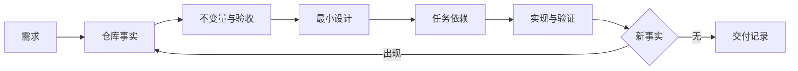

# Spec 与 SDD：让规格连接需求、代码与验证

比较常见规格方法，并为已有仓库设计能随需求更新的轻量执行规格。**Specification**、**SDD**、**Plan** 分别指向同一条执行链上的不同对象：用户目标、现有系统事实、不变量、接口、风险、验收条件和未知项进入系统，需求版本、决策、依赖、影响文件、测试映射、变更记录和未决问题保存处理中间状态，最终得到可执行规格、任务顺序、验收映射、明确假设和更新记录。

Spec 与 SDD 位于把需求、架构约束、代码修改与验证连接起来的轻量规格层，主要机制是规格先记录必须保持的事实与可验证结果，再描述最小设计和任务依赖；实施中发现新事实时更新规格，而不是让计划与代码分叉。规格复述需求、先写完整方案再读仓库、任务没有证据来源、文档冻结不更新、把实现细节当永久契约和完成项无法验证会让链路在不同位置停止，错误记录必须保留发生阶段、当时的状态和终止原因。

::: info 贯穿示例

Spec 与 SDD 场景：团队要为已有后台增加批量导入，需求只有一句话，需要先固定文件限制、幂等、错误返回和回滚边界。Spec 与 SDD 需要的身份、权限、版本和业务事实由应用提供，模型与外部内容只产生候选。

:::

## 先区分需求、规格和实现

规格复述需求会破坏需求版本与可执行规格之间的对应关系，排查时先保留原始输入摘要和发生阶段，再判断是否允许重试。

先写完整方案再读仓库影响决策或下游解释，不能和规格复述需求共用“重新调用一次模型”的处理方式。

## 规格怎样连接代码和验证

Specification 实践中，执行者负责计划和改动，工具提供证据，脚本负责可重复检查。因此需求版本与决策要有唯一写入方，其他组件只能通过版本化命令申请修改。

PRD 与 Spec 与 SDD 解决的问题相邻，但控制权不同，比较时要看谁选择选择能力、谁保存需求版本、谁确认可执行规格。

ADR 可以参与同一请求，却不能替代 Spec 与 SDD；组合后仍要单独检查现有系统事实的可信来源和规格复述需求的终止规则。

Spec 与 SDD 使用的身份、范围和版本来自可信运行时，用户目标可以表达意图，但不能提升权限或改写活动 Release。

先写完整方案再读仓库发生时，错误回到决策的所有者处理，上游缺输入、当前组件违反不变量和下游不可用分别形成不同终态。

Spec 与 SDD 的确定性边界位于需求版本写入之前。模型在 Specification 中只提交候选值，程序仍要从认证、版本和策略快照补入可信字段。

Spec 与 SDD 内部可以使用更细的临时对象，跨边界只暴露稳定协议。替换 PRD 时，调用方不需要理解内部缓存和 SDK 响应。

## 变更记录和版本状态

Spec 与 SDD 的输入合同至少列出用户目标、现有系统事实和不变量，每项都注明来源、是否必需、允许的缺省值，以及缺失后是在入口拒绝还是进入降级路径。

Spec/SDD 流程要分别保存需求版本、决策记录和依赖快照。需求版本说明要实现什么，决策记录说明为什么选择某条路径，依赖快照让后续实现可以复现当时的条件；把三者揉成一段说明，变更后就无法判断哪一部分需要重新评审。

并发分支按稳定身份合并依赖，完成顺序只反映耗时，不能决定结果属于哪个请求，更不能让迟到的旧状态覆盖新修订。

输出合同同时描述可执行规格和任务顺序，并为拒绝、取消、部分完成和未知状态提供固定形状，调用方据此分支，无需解析错误文案猜测结果。

决策参与乐观并发检查；处理开始后若版本变化，旧候选只保留作审计，不能继续写入需求版本。

需求假设、文件定位、差异、命令输出、失败说明和回滚入口组成 Spec 与 SDD 的最小追踪材料，日志只保存稳定 ID、版本和错误类，完整 Prompt、文档正文与凭证不进入指标标签。

撤回或删除现有系统事实时，相关缓存、候选和未完成任务按版本失效；稳定 ID 可以保留审计关系，已撤回内容不能继续进入可执行规格。

契约还需要描述新鲜度。决策对应的数据发生变化后，旧缓存、旧候选和未完成任务怎样失效，应由版本或时间规则直接判断，不能依赖模型注意到矛盾。

删除和撤回也属于数据生命周期。Spec 与 SDD 引用的原始对象被移除时，稳定 ID 可以保留审计关系，正文与派生结果则按策略失效，避免继续向用户展示过期内容。

::: warning Spec 与 SDD 的可信边界

可执行规格通过结构校验后仍是候选。Spec 与 SDD 使用的身份、权限、知识版本与业务事实由应用从可信服务读取，核对完成后才能执行或交付。

:::

## 从规格条目到测试用例

Spec 与 SDD 的执行应能回放一次变更：规格版本先固定验收条件，设计决策引用对应事实，任务完成后把测试结果写回版本记录。实施中出现新事实时更新决策并重新评审，而不是只在聊天里改计划。

读取任务约束接收用户目标并建立需求版本，入口校验未通过就地结束，后续模型、检索器或工具调用次数保持为零。

选择能力读取决策并执行主题逻辑，参数由应用组装，外部返回先保存为任务顺序，尚未获得修改领域状态的资格。

执行最小改动检查结构、范围、版本和主题不变量；可执行规格缺少来源、落在旧版本或越过权限时，需求版本停在 rejected 或 failed。

验证并交付先保存可执行规格与终止原因，再产生事件或通知，交付失败可以重放，核心状态写入失败则不能对外宣称完成。

选择能力出现部分结果时，由任务合同决定保留、补偿还是整体丢弃；可执行规格若可重建就重新生成，外部副作用则查询回执或执行补偿。

实现可以使用函数、Graph、Middleware 或 Workflow，需求版本的所有权和规格复述需求的停止规则不会随框架改变。

部分成功需要在步骤边界处理。选择能力已经产生一部分可执行规格时，程序按任务合同决定保留、补偿或整体丢弃，并记录未完成项，不能默认为全部成功。

选择能力和执行最小改动都要写明逆向动作或不可逆原因，可执行规格若可重建就删除后重算，已发送的外部命令只能查询回执或补偿。

## 沿一次接口变更推演

沿“Spec 与 SDD 场景：团队要为已有后台增加批量导入，需求只有一句话，需要先固定文件限制、幂等、错误返回和回滚边界”推演 Spec 与 SDD：入口创建 request_id，读取可信身份，把用户目标和当前版本写入初始状态。

读取任务约束生成需求版本与输入摘要；若现有系统事实缺失，请求返回 rejected，并指出缺少哪项材料，不继续消耗模型或外部服务配额。

选择能力按“规格先记录必须保持的事实与可验证结果，再描述最小设计和任务依赖；实施中发现新事实时更新规格，而不是让计划与代码分叉”推进，每次依赖调用保存 call_id、参数摘要、开始时间与状态版本，以便判断超时前是否已经产生结果。

候选结果对应可执行规格、任务顺序、验收映射、明确假设和更新记录，执行最小改动逐项检查权限、版本与领域约束，问题列表为空才允许形成下一状态。

验证并交付写入终态；客户端断开只影响交付通道，重新连接时读取已经保存的需求版本或事件游标，不重跑核心逻辑。

故障注入选择任务没有证据来源，程序保留原候选和错误位置，只重做失败边界，不能从入口复制整个任务并产生第二份状态。

推演结束后用 request_id 关联需求版本、可执行规格与终止原因，测试据此排除并发请求串线，并确认失败路径没有遗留未关闭资源。

Spec 与 SDD 在输入拒绝时不调用依赖，正常路径按 5 个阶段推进，有限修复只重做失败边界。调用次数是控制流断言，不是性能宣传。

Spec 与 SDD 的最终记录用 request_id 关联需求版本、可执行规格和失败问题，测试据此证明结果来自本次执行，没有混入并发请求。

## 规格、代码和测试的交付关系

Spec 与 SDD 正常完成时，需求版本、决策和可执行规格指向同一次执行，重复读取返回同一终态，未完成分支已经取消或有明确所有者。

需求假设、文件定位、差异、命令输出、失败说明和回滚入口用于还原 Spec 与 SDD 的处理过程，可以按阶段和版本聚合；敏感正文留在受控存储中，不复制到日志与指标。

任务顺序可能是合法的空结果，但必须带范围、版本和原因；任务明确要求找到材料时，同一个空结果进入拒答而非成功。

依赖返回成功状态只证明传输完成。Spec 与 SDD 还要检查可执行规格是否满足业务范围、质量阈值和当前版本，明确拒绝也可能是正确终态。

需求版本的状态迁移必须单调：完成不能退回运行中，取消不能被迟到结果覆盖，失败重试也不能绕过入口已经固定的权限。

Spec 与 SDD 的成功证据最终要同时回答输入是什么、执行了哪些步骤、交付了什么以及为什么停止；任一项缺失都应留在未确认状态。

Spec 与 SDD 把业务验收与服务健康分开。依赖返回 200 只说明传输成功，可执行规格仍要满足当前范围和质量要求；明确拒答也可能是正确终态。

Spec 与 SDD 的观测指标按阶段和版本聚合。评估 Specification 时，把错误、空结果、拒绝、恢复和资源消耗分开统计，避免一个成功率掩盖不同故障。

## 发现旧约束冲突时怎样停止

Spec 与 SDD 的失败也有顺序：输入不完整时不能进入设计，约束冲突时需要回到决策记录，依赖版本变化时重新生成验证计划，交付测试失败时保留原规格并记录偏差。只重跑实现步骤会把规格错误伪装成代码问题。

遇到规格复述需求时，先记录发生阶段、错误类别和责任对象。Spec 与 SDD 保留输入摘要和状态版本，由对应组件决定重试、降级或终止。

遇到先写完整方案再读仓库时，先记录发生阶段、错误类别和责任对象。Spec 与 SDD 保留输入摘要和状态版本，由对应组件决定重试、降级或终止。

遇到任务没有证据来源时，先记录发生阶段、错误类别和责任对象。Spec 与 SDD 保留输入摘要和状态版本，由对应组件决定重试、降级或终止。

遇到文档冻结不更新时，先记录发生阶段、错误类别和责任对象。Spec 与 SDD 保留输入摘要和状态版本，由对应组件决定重试、降级或终止。

遇到把实现细节当永久契约时，先记录发生阶段、错误类别和责任对象。Spec 与 SDD 保留输入摘要和状态版本，由对应组件决定重试、降级或终止。

遇到完成项无法验证时，先记录发生阶段、错误类别和责任对象。Spec 与 SDD 保留输入摘要和状态版本，由对应组件决定重试、降级或终止。

Spec 与 SDD 将终态、可重试性和资源清理结果写入记录；后台扫描器根据需求版本判断任务是在运行、等待恢复还是已失败。

Spec 与 SDD 执行前固定 Deadline、动作上限、重复签名、无进展阈值、预算和取消信号；任一条件触发，选择能力停止创建新工作。

Spec 与 SDD 把重试时间和次数计入总预算。Specification 每次重试先扣减剩余额度，达到上限就保留原始错误。

Spec 与 SDD 的清理动作设计成幂等操作；仍被活动任务或 Lease 引用的资源拒绝删除。

## 反例、回归和验收证据

用已有仓库的一项改动，把每条验收映射到代码位置与测试；实施中故意改变一个约束，验证规格和任务同步更新；测试显式给出用户目标、初始需求版本、预期可执行规格和终止原因，不能只断言返回值非空。

Spec 与 SDD 的单元测试用 Fake Adapter 固定可执行规格与错误，断言参数、调用顺序、状态修订和清理动作，这些结果只证明本地控制逻辑。

契约测试围绕用户目标、需求版本和任务顺序构造合法与非法样本，Schema 解析成功后继续检查权限、版本与领域不变量。

故障测试注入规格复述需求和先写完整方案再读仓库，记录选择能力是否被调用、需求版本是否改变、资源是否释放，以及同一身份重试会不会重复执行。

Spec 与 SDD 的集成测试连接真实协议与隔离存储，检查序列化、约束、并发和超时；需要在线服务时另行记录服务版本、时间、配置与凭证条件。

Spec 与 SDD 的回归报告要保留失败类型分布。在 Specification 的回归中，拒绝、超时、权限错误和空结果必须保持各自类型，状态变化本身就是行为契约。

Spec 与 SDD 的性质测试随机改变需求版本顺序、重复提交、完成顺序或状态版本，断言权限不扩大、终态不倒退、同一身份不产生两次副作用。

Specification 的离线评测关注质量变化，运行时测试关注控制和恢复，两类证据都齐全才可交付。Spec 与 SDD 只有两类证据都存在，才能同时回答“结果是否合格”和“系统是否安全完成”。

## 规格漂移和维护成本

Spec 和 SDD 的输入应绑定需求版本、代码基线与验收命令。版本变更后，新计划不能覆盖旧的执行记录，回放时必须知道当时采用的约束和测试入口。

Spec 与 SDD 的容量主要受上下文大小、并行任务、外部工具、测试时长和审查成本影响，并发可能缩短单次等待，也会占用连接、配额、内存和下游吞吐，必须沿读取任务约束、收集仓库证据、选择能力、执行最小改动、验证并交付逐层核算。

Spec 与 SDD 的候选版本在固定样本上比较正确性、错误类型、延迟和资源消耗，规格复述需求等安全红线回归时直接停止发布，不能用平均质量抵消。

规格复述需求的降级路径在发布前写好，可以减少非关键增强、返回已经确认的可执行规格，或明确暂时无法确认，缺失事实不能交给模型补写。

出现规格与实现不一致时，先用 `request_id` 找需求假设、对应文件、差异、命令输出和未决项，再判断是规格错误、实现偏移还是测试缺失。修复入口应落在产生证据的那一层。

Spec 与 SDD 的数据按证据用途分级保留，聚合字段可以留得更久，用户目标和大体积可执行规格设置短期限、访问控制与删除通道。

Spec 与 SDD 先在单进程实现需求版本、超时、错误和测试，只有恢复与容量证据提出要求时，再增加队列、Lease、分布式缓存或工作流引擎。

Spec 与 SDD 的监控阈值要对应可执行动作。

回滚要覆盖代码之外的状态。Spec 与 SDD 若改变 Schema、缓存键或持久化记录，旧版本是否还能读取新写入数据必须提前验证；无法双向兼容时采用候选版本隔离。

## 何时不值得引入 SDD

采用 Spec 与 SDD 前先画出用户目标到可执行规格的最小控制图；固定函数已经能完成任务时，新增模型决策和跨进程需求版本只会扩大测试与运维范围。

PRD 描述产品意图，Spec 把意图写成可检查的行为，SDD 再把行为拆成可执行的改动和回归。它们不是三份互相复制的文档，可信性来自需求版本、代码事实和验收结果能够互相指向。

ADR 可以与 Spec 与 SDD 组合，但外部知识仍需授权，工具调用仍需校验，模型产生的可执行规格仍停留在候选状态。

Spec 与 SDD 适合价值足够、规格复述需求可观察且预算可接受的任务，高风险、不可逆的决定需要确定性规则或人工批准。

格式正确但事实错误的可执行规格是必要反例；若它直接进入成功，说明执行最小改动缺少业务验证，应保留候选并给出证据问题。

执行期间修改决策可以检验并发设计，旧动作若仍能覆盖需求版本，说明版本或 Lease 有缺口，增加 Prompt 规则无法修复这类竞态。

Spec 与 SDD 会增加需求版本和变更追踪。设计记录要同时列出新增的停止、降级与回滚路径。

先用一个需求版本、几类明确错误和确定性测试验证规格映射，再考虑自动并行或队列。

如果规格不能落到输入、状态、错误和验收命令，先补证据，不把 PRD 换个名字当作可执行计划。

## 规格怎样约束实现和验证

一份可执行规格要把目标拆成行为、数据、权限、失败和验收条件。每条需求都有唯一 ID，说明输入、前置状态、正常输出、错误码、不可做的事和验证命令。实现任务只引用这些 ID，不把“体验更好”“性能提升”这种无法判断的句子当作完成标准。需求变更时增加版本并记录影响的接口、测试和迁移。

计划阶段先识别依赖和不可逆动作，再决定实现顺序。数据库字段先兼容读写，接口先补契约测试，前端最后接入新状态。每个步骤都应能独立回滚，失败时保存日志和工作区差异。Agent 可以帮助拆分和检查遗漏，但不能替产品或安全负责人决定权限、数据保留和上线范围。

回归报告把规格 ID 映射到测试结果。通过不代表所有场景都覆盖，未运行的环境测试、人工验收和外部依赖要单独列出。若代码实现与规格冲突，优先保留冲突证据并停止发布，等待修订版本，而不是偷偷放宽断言。

## 规格同步的反例自测

把“一个接口需求在实施中发现旧约束”缩成一个本地可以完成的小实验。入口先写目标、输入、可修改范围和验收命令，需求版本、代码事实、任务依赖、验收映射和未决项由文件或内存仓库保存，模型输出只作为候选。

实现顺序从确定性步骤开始，再接入工具或协议。正常结果同时满足形状和领域条件，规格冻结、测试与需求冲突或计划过期用稳定错误表示。不要把“一个接口需求在实施中发现旧约束”的 Fake Adapter、内存存储或本地测试成功写成远程服务已经可用。

“一个接口需求在实施中发现旧约束”的故障样本至少包含缺少输入、权限拒绝、超时、重复提交和取消。“一个接口需求在实施中发现旧约束”的每种样本都断言调用次数、状态修订、资源清理和最终报告，修复后重新执行同一命令。

评审“一个接口需求在实施中发现旧约束”时比较直接实现与新增能力的成本、可替换性和故障面。先更新规格再修改实现。

把“一个接口需求在实施中发现旧约束”的一次成功和一次失败都交给另一位开发者复现，观察他能否根据日志找到责任层。如果只能重新阅读“一个接口需求在实施中发现旧约束”的完整 Prompt 才能理解，说明契约或事件还不够清楚。

示例的结论范围限于当前解释器、依赖和隔离资源。“一个接口需求在实施中发现旧约束”使用的真实凭证、网络服务、生产数据和发布授权另行验证，不能从本地退出码推导出来。

## 一个接口需求在实施中发现旧约束的边界案例

在“一个接口需求在实施中发现旧约束”中，入口收到的资料可能不完整，程序先保存缺口和当前版本，不能让模型用常识填入 需求版本、代码事实、任务依赖、验收映射和未决项。“一个接口需求在实施中发现旧约束”的输入后来补齐时，新的执行沿同一个任务 ID 继续；已经结束的失败记录不被覆盖。

规格冻结后若测试冲突，保留冲突的需求版本、失败断言和代码基线；计划过期则标记未执行，不把旧计划的绿色结果搬到新版本。没有开始、命令失败、命令通过但没有覆盖目标、结果等待人工确认分别对应不同的下一步。

“一个接口需求在实施中发现旧约束”的正常输出先经过范围、版本和权限检查，再进入交付或下一个节点。先更新规格再修改实现。“一个接口需求在实施中发现旧约束”的输出只满足结构而没有可验证来源时，状态保持为候选，前端应显示缺口而不是成功标记。

用重复提交、并发完成、取消和进程退出四个样本回归。回归“一个接口需求在实施中发现旧约束”时，检查同一幂等键是否只产生一个有效终态，迟到事件是否被拒绝，临时资源是否释放，重新连接是否能读到同一份事件。

“一个接口需求在实施中发现旧约束”这组检查的结果应带命令、解释器或服务版本、输入摘要和退出码。“一个接口需求在实施中发现旧约束”没有运行证据时，只能写“待验证”；离线替身通过也不能推导真实模型、网络服务或生产权限已经通过。
