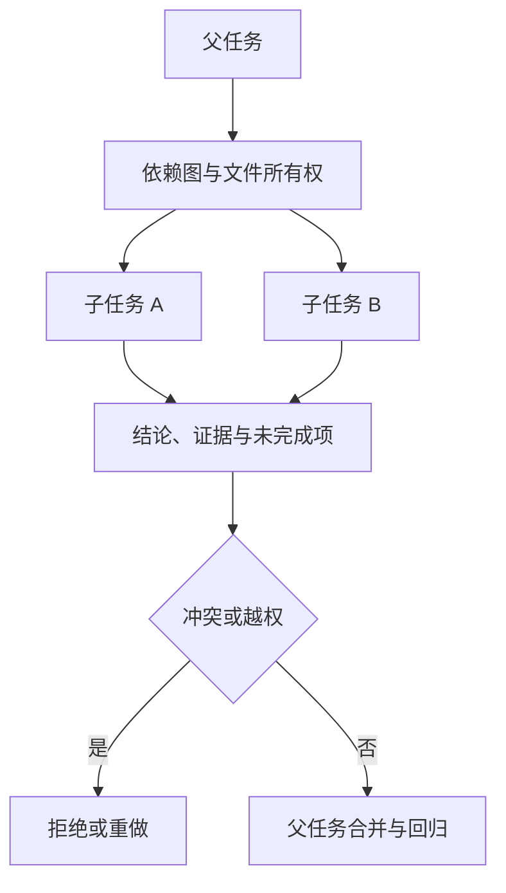

# SubAgent 协作：拆分任务、并行取证与结果合并

用跨前后端改动练习依赖分析、上下文隔离、文件所有权和可验证结果契约。**SubAgent**、**Parallelism**、**Context Isolation** 分别指向同一条执行链上的不同对象：父任务、依赖关系、仓库约束、文件边界、只需的上下文、Deadline 和结果合同进入系统，子任务 ID、所有者、读取范围、可修改文件、发现、差异、测试证据、冲突和合并状态保存处理中间状态，最终得到互不覆盖的差异、来源明确的调查结论、合并决定和整体验证结果。

SubAgent 协作位于复杂研发任务中的并行取证与文件所有权层，主要机制是父任务先画依赖图，只并行无前置依赖且不会争用同一文件的工作；SubAgent 返回结论、证据和未完成项，父任务统一合并与验证。两个 Agent 修改同一文件、子任务上下文过宽、父任务在依赖未完成时并行、结果没有行号证据和局部测试通过冒充整体完成会让链路在不同位置停止，错误记录必须保留发生阶段、当时的状态和终止原因。

::: info 贯穿示例

SubAgent 协作场景：一个功能同时涉及 API 契约、前端页面和回归测试，其中前端依赖 API 字段，测试可在契约确定后并行。SubAgent 协作需要的身份、权限、版本和业务事实由应用提供，模型与外部内容只产生候选。

:::

## 先定义可并行的任务边界

两个 Agent 修改同一文件会破坏子任务 ID 与互不覆盖的差异之间的对应关系，排查时先保留原始输入摘要和发生阶段，再判断是否允许重试。

子任务上下文过宽影响所有者或下游解释，不能和两个 Agent 修改同一文件共用“重新调用一次模型”的处理方式。

## 拆分、并行和合并各自解决什么

SubAgent 实践中，执行者负责计划和改动，工具提供证据，脚本负责可重复检查。因此子任务 ID 与所有者要有唯一写入方，其他组件只能通过版本化命令申请修改。

并发任务与 SubAgent 协作解决的问题相邻，但控制权不同，比较时要看谁选择选择能力、谁保存子任务 ID、谁确认互不覆盖的差异。

DAG 可以参与同一请求，却不能替代 SubAgent 协作；组合后仍要单独检查依赖关系的可信来源和两个 Agent 修改同一文件的终止规则。

SubAgent 协作使用的身份、范围和版本来自可信运行时，父任务可以表达意图，但不能提升权限或改写活动 Release。

子任务上下文过宽发生时，错误回到所有者的所有者处理，上游缺输入、当前组件违反不变量和下游不可用分别形成不同终态。

SubAgent 协作的确定性边界位于子任务 ID 写入之前。模型在 SubAgent 中只提交候选值，程序仍要从认证、版本和策略快照补入可信字段。

SubAgent 协作内部可以使用更细的临时对象，跨边界只暴露稳定协议。替换并发任务时，调用方不需要理解内部缓存和 SDK 响应。

## 子任务契约怎样保存上下文

SubAgent 协作的输入合同至少列出父任务、依赖关系和仓库约束，每项都注明来源、是否必需、允许的缺省值，以及缺失后是在入口拒绝还是进入降级路径。

SubAgent 协作需要同时保留子任务身份、负责人、读取范围和创建时的版本快照。子任务 ID 只解决“是哪一个”，所有者决定“谁能写”，范围决定“能看什么”；把它们写成一段自然语言后，取消和合并都失去可执行依据。

并发分支按稳定身份合并读取范围，完成顺序只反映耗时，不能决定结果属于哪个请求，更不能让迟到的旧状态覆盖新修订。

输出合同同时描述互不覆盖的差异和来源明确的调查结论，并为拒绝、取消、部分完成和未知状态提供固定形状，调用方据此分支，无需解析错误文案猜测结果。

所有者参与乐观并发检查；处理开始后若版本变化，旧候选只保留作审计，不能继续写入子任务 ID。

父任务里若包含模型填写的同名字段，应用会丢弃它，再从认证、配置或活动版本中补入可信值，因为结构校验通过不等于授权或业务校验通过。

需求假设、文件定位、差异、命令输出、失败说明和回滚入口组成 SubAgent 协作的最小追踪材料，日志只保存稳定 ID、版本和错误类，完整 Prompt、文档正文与凭证不进入指标标签。

撤回或删除依赖关系时，相关缓存、候选和未完成任务按版本失效；稳定 ID 可以保留审计关系，已撤回内容不能继续进入互不覆盖的差异。

契约还需要描述新鲜度。所有者对应的数据发生变化后，旧缓存、旧候选和未完成任务怎样失效，应由版本或时间规则直接判断，不能依赖模型注意到矛盾。

删除和撤回也属于数据生命周期。SubAgent 协作引用的原始对象被移除时，稳定 ID 可以保留审计关系，正文与派生结果则按策略失效，避免继续向用户展示过期内容。

::: warning SubAgent 协作的可信边界

互不覆盖的差异通过结构校验后仍是候选。SubAgent 协作使用的身份、权限、知识版本与业务事实由应用从可信服务读取，核对完成后才能执行或交付。

:::

## 只读取证与可写任务如何隔离

SubAgent 协作的演示应能回放一条任务树：父任务创建两个不争用文件的子任务，子任务分别写回证据和未完成项，父任务按依赖顺序合并。改变完成顺序后，结果仍要按子任务 ID 和工作区版本正确归属。

读取任务约束接收父任务并建立子任务 ID，入口校验未通过就地结束，后续模型、检索器或工具调用次数保持为零。

选择能力读取所有者并执行主题逻辑，参数由应用组装，外部返回先保存为来源明确的调查结论，尚未获得修改领域状态的资格。

执行最小改动检查结构、范围、版本和主题不变量；互不覆盖的差异缺少来源、落在旧版本或越过权限时，子任务 ID 停在 rejected 或 failed。

验证并交付先保存互不覆盖的差异与终止原因，再产生事件或通知，交付失败可以重放，核心状态写入失败则不能对外宣称完成。

选择能力出现部分结果时，由任务合同决定保留、补偿还是整体丢弃；互不覆盖的差异若可重建就重新生成，外部副作用则查询回执或执行补偿。

实现可以使用函数、Graph、Middleware 或 Workflow，子任务 ID 的所有权和两个 Agent 修改同一文件的停止规则不会随框架改变。

部分成功需要在步骤边界处理。选择能力已经产生一部分互不覆盖的差异时，程序按任务合同决定保留、补偿或整体丢弃，并记录未完成项，不能默认为全部成功。

选择能力和执行最小改动都要写明逆向动作或不可逆原因，互不覆盖的差异若可重建就删除后重算，已发送的外部命令只能查询回执或补偿。

## 沿三个并行调查任务推演

沿“SubAgent 协作场景：一个功能同时涉及 API 契约、前端页面和回归测试，其中前端依赖 API 字段，测试可在契约确定后并行”推演 SubAgent 协作：入口创建 request_id，读取可信身份，把父任务和当前版本写入初始状态。

读取任务约束生成子任务 ID 与输入摘要；若依赖关系缺失，请求返回 rejected，并指出缺少哪项材料，不继续消耗模型或外部服务配额。

选择能力按“父任务先画依赖图，只并行无前置依赖且不会争用同一文件的工作；SubAgent 返回结论、证据和未完成项，父任务统一合并与验证”推进，每次依赖调用保存 call_id、参数摘要、开始时间与状态版本，以便判断超时前是否已经产生结果。

候选结果对应互不覆盖的差异、来源明确的调查结论、合并决定和整体验证结果，执行最小改动逐项检查权限、版本与领域约束，问题列表为空才允许形成下一状态。

验证并交付写入终态；客户端断开只影响交付通道，重新连接时读取已经保存的子任务 ID 或事件游标，不重跑核心逻辑。

故障注入选择父任务在依赖未完成时并行，程序保留原候选和错误位置，只重做失败边界，不能从入口复制整个任务并产生第二份状态。

推演结束后用 request_id 关联子任务 ID、互不覆盖的差异与终止原因，测试据此排除并发请求串线，并确认失败路径没有遗留未关闭资源。

SubAgent 协作在输入拒绝时不调用依赖，正常路径按 5 个阶段推进，有限修复只重做失败边界。调用次数是控制流断言，不是性能宣传。

SubAgent 协作的最终记录用 request_id 关联子任务 ID、互不覆盖的差异和失败问题，测试据此证明结果来自本次执行，没有混入并发请求。

## 合并结果需要哪些证据

SubAgent 协作正常完成时，子任务 ID、所有者和互不覆盖的差异指向同一次执行，重复读取返回同一终态，未完成分支已经取消或有明确所有者。

需求假设、文件定位、差异、命令输出、失败说明和回滚入口用于还原 SubAgent 协作的处理过程，可以按阶段和版本聚合；敏感正文留在受控存储中，不复制到日志与指标。

来源明确的调查结论可能是合法的空结果，但必须带范围、版本和原因；任务明确要求找到材料时，同一个空结果进入拒答而非成功。

依赖返回成功状态只证明传输完成。SubAgent 协作还要检查互不覆盖的差异是否满足业务范围、质量阈值和当前版本，明确拒绝也可能是正确终态。

子任务 ID 的状态迁移必须单调：完成不能退回运行中，取消不能被迟到结果覆盖，失败重试也不能绕过入口已经固定的权限。

SubAgent 协作的成功证据最终要同时回答输入是什么、执行了哪些步骤、交付了什么以及为什么停止；任一项缺失都应留在未确认状态。

SubAgent 协作把业务验收与服务健康分开。依赖返回 200 只说明传输成功，互不覆盖的差异仍要满足当前范围和质量要求；明确拒答也可能是正确终态。

SubAgent 协作的观测指标按阶段和版本聚合。评估 SubAgent 时，把错误、空结果、拒绝、恢复和资源消耗分开统计，避免一个成功率掩盖不同故障。

## 子任务超时、冲突和取消

SubAgent 的失败要按协作阶段处理：任务契约不完整时由父任务补充，资料范围冲突时拒绝启动，子任务超时由调度器回收，结果格式错误则停在合并前。父 Agent 不应把所有异常重新包装成“子任务失败”后再盲目重试。

遇到两个 Agent 修改同一文件时，先记录发生阶段、错误类别和责任对象。SubAgent 协作保留输入摘要和状态版本，由对应组件决定重试、降级或终止。

遇到子任务上下文过宽时，先记录发生阶段、错误类别和责任对象。SubAgent 协作保留输入摘要和状态版本，由对应组件决定重试、降级或终止。

遇到父任务在依赖未完成时并行时，先记录发生阶段、错误类别和责任对象。SubAgent 协作保留输入摘要和状态版本，由对应组件决定重试、降级或终止。

遇到结果没有行号证据时，先记录发生阶段、错误类别和责任对象。SubAgent 协作保留输入摘要和状态版本，由对应组件决定重试、降级或终止。

遇到局部测试通过冒充整体完成时，先记录发生阶段、错误类别和责任对象。SubAgent 协作保留输入摘要和状态版本，由对应组件决定重试、降级或终止。

SubAgent 协作将终态、可重试性和资源清理结果写入记录；后台扫描器根据子任务 ID 判断任务是在运行、等待恢复还是已失败。

SubAgent 协作执行前固定 Deadline、动作上限、重复签名、无进展阈值、预算和取消信号；任一条件触发，选择能力停止创建新工作。

SubAgent 协作把重试时间和次数计入总预算。SubAgent 每次重试先扣减剩余额度，达到上限就保留原始错误。

SubAgent 协作的清理动作设计成幂等操作；仍被活动任务或 Lease 引用的资源拒绝删除。

## 用合并自测检查串线

用一项跨前后端改动记录任务图，故意制造一次文件冲突和一次子任务超时，验证父任务能停止合并并保留已有结果；测试显式给出父任务、初始子任务 ID、预期互不覆盖的差异和终止原因，不能只断言返回值非空。

SubAgent 协作的单元测试用 Fake Adapter 固定互不覆盖的差异与错误，断言参数、调用顺序、状态修订和清理动作，这些结果只证明本地控制逻辑。

契约测试围绕父任务、子任务 ID 和来源明确的调查结论构造合法与非法样本，Schema 解析成功后继续检查权限、版本与领域不变量。

故障测试注入两个 Agent 修改同一文件和子任务上下文过宽，记录选择能力是否被调用、子任务 ID 是否改变、资源是否释放，以及同一身份重试会不会重复执行。

SubAgent 协作的集成测试连接真实协议与隔离存储，检查序列化、约束、并发和超时；需要在线服务时另行记录服务版本、时间、配置与凭证条件。

SubAgent 协作的回归报告要保留失败类型分布。在 SubAgent 的回归中，拒绝、超时、权限错误和空结果必须保持各自类型，状态变化本身就是行为契约。

SubAgent 协作的性质测试随机改变子任务 ID 顺序、重复提交、完成顺序或状态版本，断言权限不扩大、终态不倒退、同一身份不产生两次副作用。

SubAgent 的离线评测关注质量变化，运行时测试关注控制和恢复，两类证据都齐全才可交付。SubAgent 协作只有两类证据都存在，才能同时回答“结果是否合格”和“系统是否安全完成”。

## 并行成本和长期维护

子任务合同会跟着父任务一起冻结：父快照、子任务输入、可写路径和返回 Schema 都写入同一份版本记录。修改合同后，旧子任务仍按原版本解析，不能让新字段悄悄改变既有合并结果。

SubAgent 协作的容量主要受上下文大小、并行任务、外部工具、测试时长和审查成本影响，并发可能缩短单次等待，也会占用连接、配额、内存和下游吞吐，必须沿读取任务约束、收集仓库证据、选择能力、执行最小改动、验证并交付逐层核算。

SubAgent 协作的候选版本在固定样本上比较正确性、错误类型、延迟和资源消耗，两个 Agent 修改同一文件等安全红线回归时直接停止发布，不能用平均质量抵消。

两个 Agent 修改同一文件的降级路径在发布前写好，可以减少非关键增强、返回已经确认的互不覆盖的差异，或明确暂时无法确认，缺失事实不能交给模型补写。

排查一次交接时，先用 `request_id` 找到父快照和子任务事件，再核对子任务读写范围、命令回执、差异摘要与合并裁决。这样可以判断问题发生在派发、执行还是合并，不需要重新打开整份父任务。

SubAgent 协作的数据按证据用途分级保留，聚合字段可以留得更久，父任务和大体积互不覆盖的差异设置短期限、访问控制与删除通道。

SubAgent 协作先在单进程实现子任务 ID、超时、错误和测试，只有恢复与容量证据提出要求时，再增加队列、Lease、分布式缓存或工作流引擎。

SubAgent 协作的监控阈值要对应可执行动作。

回滚要覆盖代码之外的状态。SubAgent 协作若改变 Schema、缓存键或持久化记录，旧版本是否还能读取新写入数据必须提前验证；无法双向兼容时采用候选版本隔离。

## 什么时候回到单 Agent

采用 SubAgent 协作前先画出父任务到互不覆盖的差异的最小控制图；固定函数已经能完成任务时，新增模型决策和跨进程子任务 ID 只会扩大测试与运维范围。

SubAgent 协作的边界在于父任务仍掌握合并权。子任务可以提出修改和证据，父任务决定是否接纳、重做或撤销；普通并发任务若没有这层裁决，完成顺序就可能覆盖较新的差异。

DAG 可以与 SubAgent 协作组合，但外部知识仍需授权，工具调用仍需校验，模型产生的互不覆盖的差异仍停留在候选状态。

SubAgent 协作适合价值足够、两个 Agent 修改同一文件可观察且预算可接受的任务，高风险、不可逆的决定需要确定性规则或人工批准。

格式正确但事实错误的互不覆盖的差异是必要反例；若它直接进入成功，说明执行最小改动缺少业务验证，应保留候选并给出证据问题。

执行期间修改所有者可以检验并发设计，旧动作若仍能覆盖子任务 ID，说明版本或 Lease 有缺口，增加 Prompt 规则无法修复这类竞态。

引入 SubAgent 后，主任务多了子任务 ID、依赖调用和合并责任。设计记录要同时写清获得的并行能力，以及新增的取消、降级与回滚路径。

先用一个子任务 ID、几类明确错误和确定性测试验证合并规则，再考虑并发、缓存或队列。

如果两个 Agent 可能修改同一文件，先改为只读分析或顺序合并，避免把冲突交给最后一步处理。

## 用任务契约隔离并行工作

拆分 SubAgent 前先冻结目标、输入文件、只读或可写范围、输出 Schema、截止时间和验收命令。主 Agent 只把必要上下文发给子任务，返回结果必须包含证据位置、未解决问题和是否完成，不能把一段没有来源的总结当作完成标记。两个子任务若可能修改同一文件，改为只读分析或由主 Agent 顺序合并。

并行执行需要共享的不是自然语言，而是稳定任务 ID 和版本快照。子任务读取到的代码、规则和依赖版本固定在创建时，主任务合并前检查工作区是否发生变化。一个子任务超时或失败，其他子任务可以继续，但主 Agent 不能因为部分结果到齐就跳过关键验证。取消信号沿任务树传播，已经产生的文件差异保留并标记归属，便于清理或人工取舍。

合并阶段按证据而不是按返回顺序决策。先验证文件范围和契约，再运行最小测试，最后做类型、构建和差异检查。子任务声称“已测试”时必须附命令和输出；没有执行证据就标记为待复核。这样并行带来的速度不会牺牲上下文边界、权限控制和可回滚性。

## 子任务协作的合并自测

把“三个只读调查任务并行检查接口、测试和部署规则”缩成一个本地可以完成的小实验。入口先写目标、输入、可修改范围和验收命令，父快照、任务依赖、文件所有权和合并证据由文件或内存仓库保存，模型输出只作为候选。

实现顺序从确定性步骤开始，再接入工具或协议。正常结果同时满足形状和领域条件，同文件冲突、迟到结果或子任务误写用稳定错误表示。不要把“三个只读调查任务并行检查接口、测试和部署规则”的 Fake Adapter、内存存储或本地测试成功写成远程服务已经可用。

“三个只读调查任务并行检查接口、测试和部署规则”的故障样本至少包含缺少输入、权限拒绝、超时、重复提交和取消。“三个只读调查任务并行检查接口、测试和部署规则”的每种样本都断言调用次数、状态修订、资源清理和最终报告，修复后重新执行同一命令。

评审“三个只读调查任务并行检查接口、测试和部署规则”时比较直接实现与新增能力的成本、可替换性和故障面。父任务负责最终修改和全量验证。

把“三个只读调查任务并行检查接口、测试和部署规则”的一次成功和一次失败都交给另一位开发者复现，观察他能否根据日志找到责任层。如果只能重新阅读“三个只读调查任务并行检查接口、测试和部署规则”的完整 Prompt 才能理解，说明契约或事件还不够清楚。

示例的结论范围限于当前解释器、依赖和隔离资源。“三个只读调查任务并行检查接口、测试和部署规则”使用的真实凭证、网络服务、生产数据和发布授权另行验证，不能从本地退出码推导出来。

## 三个只读调查任务并行检查接口、测试和部署规则的边界案例

在“三个只读调查任务并行检查接口、测试和部署规则”中，入口收到的资料可能不完整，程序先保存缺口和当前版本，不能让模型用常识填入 父快照、任务依赖、文件所有权和合并证据。“三个只读调查任务并行检查接口、测试和部署规则”的输入后来补齐时，新的执行沿同一个任务 ID 继续；已经结束的失败记录不被覆盖。

同文件冲突要记录父快照与子快照的共同祖先，迟到结果要记录它对应的版本，越界写入则保存被拒绝的路径和策略命中项。没有派发、派发失败、执行成功但无差异、结果尚未确认分别走不同的处置路径，合并器只接受带来源和版本的差异。

“三个只读调查任务并行检查接口、测试和部署规则”的正常输出先经过范围、版本和权限检查，再进入交付或下一个节点。父任务负责最终修改和全量验证。“三个只读调查任务并行检查接口、测试和部署规则”的输出只满足结构而没有可验证来源时，状态保持为候选，前端应显示缺口而不是成功标记。

用重复提交、并发完成、取消和进程退出四个样本回归。回归“三个只读调查任务并行检查接口、测试和部署规则”时，检查同一幂等键是否只产生一个有效终态，迟到事件是否被拒绝，临时资源是否释放，重新连接是否能读到同一份事件。

“三个只读调查任务并行检查接口、测试和部署规则”这组检查的结果应带命令、解释器或服务版本、输入摘要和退出码。“三个只读调查任务并行检查接口、测试和部署规则”没有运行证据时，只能写“待验证”；离线替身通过也不能推导真实模型、网络服务或生产权限已经通过。

subagent-collaboration-practice的修改要优先改变责任边界和可观察证据，不能靠增加一个关键词特判来让样本通过。
