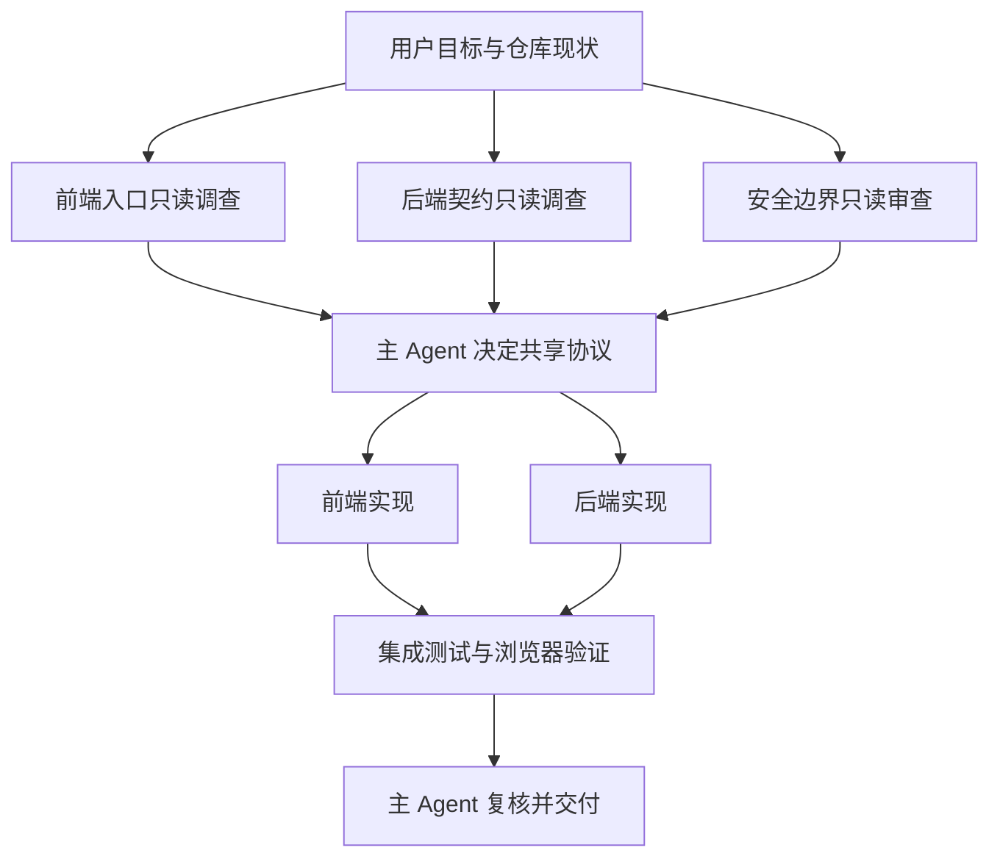

# SubAgent 开发协作：拆任务、并行取证与主 Agent 收口

一个“给登录接口增加设备确认，并在页面展示错误状态”的需求同时涉及前端、API、权限和测试。主 Agent 若顺序阅读所有文件，可能在大量上下文中丢失重点；若直接启动四个子 Agent 同时改代码，又可能让两个人修改同一类型定义，最后花更多时间解决冲突。

正确结果不是“有四个 AI 在工作”，而是依赖图上独立的调查同时完成，串行的协议决策只发生一次，每个可写任务都有唯一文件所有者，主 Agent 最终用真实测试和 diff 收口。

## SubAgent 解决的是上下文隔离和任务并发

SubAgent 接收有边界的目标与上下文，在独立会话中使用允许的工具，最后返回结构化证据。它解决三个问题：让检索和审查并行；让某项调查不受主 Agent 既有判断污染；让大任务按职责压缩上下文。

它不是普通函数并发。函数拥有确定输入和代码路径，SubAgent 仍会基于模型推理选择动作；它也不是角色扮演，单纯说“你是安全专家”并没有定义可访问范围、输出格式和失败条件。

输入包括目标、已知事实、范围、工具权限和 Deadline；处理中保留自己的调用历史；输出只应携带主任务需要的事实、位置、命令结果与缺口。主 Agent不能依赖看不到的内部推理，必须能从返回证据复核结论。

## 用依赖图判断并行还是串行



`F`、`B`、`S` 只读取不同证据，没有数据依赖，可以同时执行。`D` 依赖三方结果，必须由主 Agent 串行决定错误码、字段和权限边界。若前后端实现修改的文件集合互不相交，可在协议固定后并行；集成测试必须等待两端完成。

正常路径由调查进入协议、实现和验证。若安全调查发现需求越权，主 Agent 在 `D` 停止并请求产品决策；若某个调查超时，其他结果仍可保留，但不得把缺失证据自动推断为“没有风险”。

## 五类适合委派的开发任务

| 子任务 | 为什么适合隔离 | 典型输出 | 不应做什么 |
| --- | --- | --- | --- |
| 代码检索 | 范围清晰、只读、易核对 | 文件、符号、调用链 | 顺便重构 |
| 前后端并行分析 | 目录所有权不同 | 协议现状与冲突 | 提前各自发明协议 |
| 测试验证 | 命令和预期明确 | 退出码、失败摘要 | 为通过测试改生产代码 |
| 安全审查 | 需要独立视角 | 风险、攻击路径、证据 | 在未授权时执行攻击 |
| 独立取证 | 来源可分开查询 | 版本、时间、来源位置 | 用结论替代原始证据 |

这些任务的共同点是结果能被主 Agent 独立验证。相反，五分钟能完成的顺序操作、需要共享大量隐式状态的调试、两个任务修改同一文件、后一项输入由前一项生成，都不适合并行。

委派前先估算合并成本。若主 Agent需要重新阅读子 Agent看过的全部内容才能理解输出，契约没有压缩上下文；若结论只剩一句“没问题”，又失去了可验证性。

## 任务契约需要八个字段

一个可执行契约至少包含目标、输入、范围、工具权限、完成条件、Deadline、输出格式和失败语义。下面以只读调查后端认证契约为例，YAML 只是任务数据表示，不赋予任何额外权限。

```yaml
# 目标必须是可验证子结果，不复制整个用户需求。
goal: 找出设备确认涉及的后端入口、响应字段和权限检查
inputs:
  requirement: 登录失败时返回可区分的设备确认状态
  known_files:
    - server/api/auth.py
scope:
  include:
    - server/api/
    - server/services/
    - server/tests/
  exclude:
    - deploy/
permissions:
  filesystem: read-only
  network: denied
done_when:
  - 返回入口、服务、测试的文件与符号位置
  - 标记现有响应契约和权限来源
deadline_seconds: 300
output:
  format: evidence-table
  fields: [claim, path, symbol, verification, gap]
failure:
  no_evidence: 返回 not_found，不推断不存在实现
  timeout: 返回已检查范围和剩余缺口
```

子 Agent 先在 `include` 范围定位入口，再沿调用链寻找服务和测试；它不能访问网络或修改文件。完成条件要求每条 Claim 绑定路径、符号和复核方法。若找不到证据，返回 `not_found` 与已检查范围；超时则保留部分进度，不用一句“任务失败”抹掉已有信息。

主 Agent 收到契约输出后仍要检查路径是否存在、证据是否来自当前工作树。任务数据里的 `read-only` 只有调度器或沙箱真正落实才有效，不能依赖模型自觉。

## 上下文隔离要从四个边界落实

### 输入边界

只发送完成子任务需要的需求片段、已知文件和约束，避免把整个对话、密钥或无关业务资料复制过去。同时保留会影响判断的用户改动与版本信息，否则子 Agent 可能基于旧基线给出正确但无用的结论。

### 工具边界

按任务最小授权：代码调查只读文件，测试任务允许执行明确命令，资料检索只访问批准来源。生产、外部写操作和 Git 提交不因委派而获得授权。权限应由沙箱、Tool 注册表或调度器强制，而不是只写在角色提示中。

### 数据边界

输出要脱敏并限制大小。日志可以返回错误码、时间和关联 ID，不应复制 Token、Cookie 或完整用户内容。外部文档可能含 Prompt Injection，子 Agent 只能把它作为带来源的数据，不能把网页指令传播成主 Agent 规则。

### 时间与成本边界

每个任务设置 Deadline、最大工具调用和停止条件。主任务取消时向子任务传播取消；超时任务返回当前证据后结束。没有上限的“继续深挖”会让并行变成不可预测成本，也阻塞主 Agent 判断何时可以收口。

## 文件所有权是共享工作区的硬约束

多个 Agent 即使上下文隔离，也可能操作同一个物理工作区。开始写入前建立所有权表：每个文件只能有一个写入者；共享类型、锁文件、迁移和配置由主 Agent 或指定唯一 Agent 维护；其他 Agent 只返回建议补丁或证据。

| 文件集合 | 所有者 | 其他 Agent 权限 | 合并顺序 |
| --- | --- | --- | --- |
| 前端页面与前端测试 | 前端实现 Agent | 只读 | 协议确定后 |
| API、服务与后端测试 | 后端实现 Agent | 只读 | 协议确定后 |
| 共享 Schema | 主 Agent | 只读 | 两端实现之前 |
| 锁文件与公共配置 | 主 Agent | 禁止修改 | 所有实现之后按需处理 |

所有 Agent 开始前读取 Git 状态，不得还原来源不明差异。若用户已修改目标文件，所有者必须在当前内容上增量工作；无法区分时停止写入。仅按目录分工仍可能同时触碰生成类型和锁文件，因此所有权应列到真实文件集合。

## 主 Agent 的收口不是多数投票

子 Agent A 从官方文档得到默认有效期，B 从当前源码读到覆盖值，C 的测试仍断言旧值。三条结论可能都忠实于各自来源，票数无法判断当前运行行为。主 Agent要比较来源类型、版本、工作树状态和测试环境，再设计能区分结论的实验。

合并步骤可以固定为：校验证据位置；去重同源 Claim；标记冲突与缺口；决定需要的补充验证；统一修改边界；运行集成检查；复核最终 diff。子 Agent 的“已通过”不能代替主 Agent 在合并后的工作树重跑测试。

最终交付包括用户目标是否达成、哪些文件改变、执行过的命令、失败或未验证项以及没有执行的外部动作。主 Agent 对这些结论负责，不能把冲突归因给某个子 Agent 后直接交付。

## 用对照实验验证并行收益

选一个代表任务，分别用单 Agent 顺序执行和契约化 SubAgent 执行，记录总耗时、模型与工具成本、找到的独立证据、冲突次数、返工次数和最终门禁结果。只比较首个回答速度会掩盖后续合并成本。

收益通常来自互不依赖的慢查询和独立审查。若子任务大量等待共享决策，减少 Agent 数量或重画依赖图；若重复读取相同大文件，先由主 Agent提取稳定上下文；若冲突集中在公共文件，收回主 Agent唯一编辑。

## 常见问题

### 前端和后端可以同时修改吗？

可以，但前提是共享协议已经确定、文件所有权互不重叠，并且两端完成后还会运行集成验证。响应字段、错误码或鉴权逻辑仍在讨论时，双方并行写代码只会各自补全假设。先让只读调查并行，由主 Agent 固定契约，再拆开写入；公共 Schema 和锁文件交给唯一所有者。

### 子 Agent 结论冲突时应该投票吗？

票数不能消除代码版本、环境、来源或查询范围的差异。应把每个 Claim 绑定文件、符号、时间和验证方法，再设计能区分两种结论的检查。**主 Agent 收口的是证据，不是意见数量。**

### 怎样保护用户未提交的工作区改动？

所有执行者开始前读取状态和相关 Diff，把来源不明的变化视为用户资产；写入者只在当前内容上做小补丁，不运行 reset、checkout、清理或全仓格式化。同一文件只指定一个所有者。发现外部变化时暂停合并、重新读取并报告冲突，最终交付按本次基线核对。
