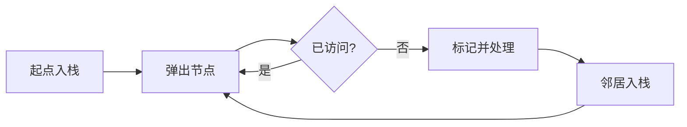

# 深度优先搜索

地图中从 A 出发寻找所有可达节点。若遇到一个邻居就继续沿它深入，走到底后再回到最近未探索分支，这就是深度优先搜索。图可能有环，因此还要记录 visited，否则 A -> B -> A 会无限重复。

本篇先遍历邻接表，再说明路径、网格、拓扑与组合搜索中 visited 的作用范围。

## 显式栈表示待探索工作



何时标记 visited 会影响重复入栈数量。通常在发现或入栈时标记，可以避免多个前驱重复推入同一节点；若要模拟精确递归顺序，需注意邻居压栈顺序相反。

## 最小图遍历

输入是邻接表与起点，输出访问顺序。函数假定邻接表列出的目标节点可以没有自己的列表，此时按无邻居处理。

```ts
function depthFirst(
  graph: ReadonlyMap<string, readonly string[]>,
  start: string
): string[] {
  const visited = new Set<string>([start])
  const stack = [start]
  const output: string[] = []

  while (stack.length > 0) {
    const node = stack.pop()!
    output.push(node)
    const neighbors = graph.get(node) ?? []
    for (let index = neighbors.length - 1; index >= 0; index -= 1) {
      const next = neighbors[index]!
      if (!visited.has(next)) {
        visited.add(next)
        stack.push(next)
      }
    }
  }
  return output
}
```

每个可达节点处理一次，每条可达边检查一次，时间 O(V+E)，空间 O(V)。DFS 找到的路径不保证无权图最短，最少边数使用 BFS。

## 路径和网格怎样扩展

需要实际路径时保存 `parent[next] = node`，找到目标后反向恢复。不要在每个栈项复制整条路径，可能把空间放大到 O(V²)。网格 DFS 将坐标视为节点，四方向视为边；在入栈时标记，避免同一格被多个邻居重复加入。

有向图检测环需要三色状态：未访问、当前递归路径、已经完成。普通 boolean visited 无法区分“回到当前路径形成环”和“到达另一个已完成分支”。拓扑排序在节点完成时输出，发现灰色回边则不存在 DAG 拓扑序。

## 搜索树中的 visited 不同

排列和组合的同一个值可能在不同路径合法，不能用全局 visited。排列使用当前路径 used，回溯后撤销；组合使用 startIndex。剪枝只有在能证明被删分支不含答案时才安全。

## 验证与资源上限

覆盖环、自环、不连通、重复边、深链和宽图。输出集合应等于从起点可达集合。处理不可信图时设置最大节点、边、深度和 Deadline；visited 防环，却不能阻止百万节点耗尽内存。

## 参考资料

- [Open Data Structures: Graphs](https://opendatastructures.org/ods-javascript/12_Graphs.html)
- [VisuAlgo Graph Traversal](https://visualgo.net/en/dfsbfs)
