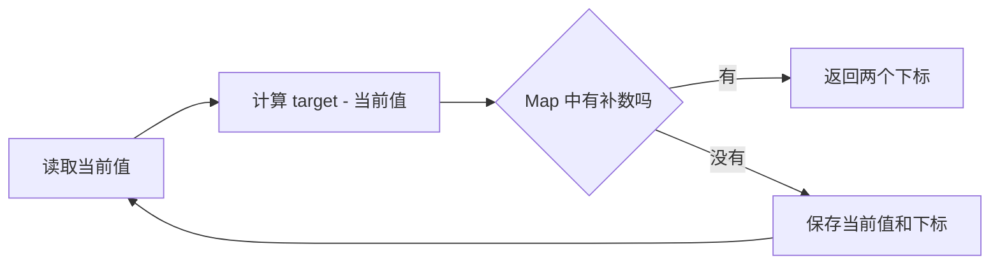

# 数组、哈希与双指针

给定数组 `[2, 7, 11, 15]` 和目标值 `9`，怎样找到相加等于 9 的两个下标？初学者很容易记住“这题用 Map”，却不知道 Map 为什么有效，也不知道什么时候应该换成双指针。

本篇先写出最直观的检查方法，再逐步减少重复工作。你会学到一个比模板更重要的方法：每移动一次指针，都说清楚已经确定了什么，以及为什么不会漏解。

## 先理解数组和问题输入

数组把一组元素按顺序保存，可以通过下标在常数时间内读取某个位置。这里要求返回两个**不同下标**，因此 `[3, 3]` 和目标值 `6` 是合法输入，答案是 `[0, 1]`。

```text
输入：values = [2, 7, 11, 15]，target = 9
输出：[0, 1]

输入：values = [1, 2, 3]，target = 10
输出：null
```

先约定无解返回 `null`。明确失败结果能避免调用方把空数组误认为一个合法答案。

## 第一步：用双层循环检查所有数对

最直接的思路是固定第一个位置，再检查它后面的每个位置。对 4 个元素，检查顺序是 `(0,1)`、`(0,2)`、`(0,3)`、`(1,2)`……

```ts
function twoSumSlow(
  values: readonly number[],
  target: number,
): readonly [number, number] | null {
  for (let left = 0; left < values.length; left += 1) {
    for (let right = left + 1; right < values.length; right += 1) {
      if (values[left]! + values[right]! === target) {
        return [left, right]
      }
    }
  }
  return null
}
```

输入是数组和目标值，输出是第一组命中的下标。`right` 从 `left + 1` 开始，因此同一位置不会被使用两次。最坏情况下会检查约 `n²/2` 个数对，时间复杂度记为 `O(n²)`，额外空间是 `O(1)`。

这个版本并不“差”。它简单、容易验证，是理解优化前必须保留的基线。

## 第二步：用 Map 保存已经看过的值

扫描到数字 `7` 时，我们真正想问的是：“前面有没有出现过 `9 - 7 = 2`？”Map 可以直接回答这个问题。



```ts
function twoSum(
  values: readonly number[],
  target: number,
): readonly [number, number] | null {
  const indexByValue = new Map<number, number>()

  for (let index = 0; index < values.length; index += 1) {
    const value = values[index]!
    const previous = indexByValue.get(target - value)
    if (previous !== undefined) return [previous, index]
    indexByValue.set(value, index)
  }
  return null
}
```

循环开始时，Map 只包含当前下标之前的元素。代码先查补数、后保存当前值，所以 `[3, 3]` 能在第二个 3 处命中，同时不会把一个位置使用两次。每个元素只处理一次，期望时间复杂度为 `O(n)`，空间复杂度为 `O(n)`。

## 手工推演一次

| 当前下标 | 当前值 | 需要的补数 | 扫描前的 Map | 结果 |
| --- | ---: | ---: | --- | --- |
| 0 | 2 | 7 | `{}` | 保存 `2 → 0` |
| 1 | 7 | 2 | `{2 → 0}` | 找到 2，返回 `[0, 1]` |

表格里的“扫描前 Map”就是这道题的不变量：它始终保存已经扫描过的值和下标。理解不变量后，即使题目改成返回数量或全部组合，也能判断 Map 里应该存什么。

## 第三步：有序数组为什么可以用双指针

若输入已经升序，并且题目只要求找到一对数值，可以把指针放在两端。当前和太小，就移动左指针增大它；当前和太大，就移动右指针减小它。

```ts
function twoSumSorted(
  values: readonly number[],
  target: number,
): readonly [number, number] | null {
  let left = 0
  let right = values.length - 1

  while (left < right) {
    const sum = values[left]! + values[right]!
    if (sum === target) return [left, right]
    if (sum < target) left += 1
    else right -= 1
  }
  return null
}
```

输入必须已经有序。若当前最小值与右端值之和仍然太小，固定这个左值再换任何更小的右值都不会成功，因此可以安全丢弃左端；右端移动同理。时间复杂度为 `O(n)`，额外空间为 `O(1)`。

如果原数组无序，先排序会丢失原始下标，除非同时保存值与下标；排序本身还需要 `O(n log n)`。这就是为什么原始“两数之和”通常使用 Map，而不是看到“双指针更省空间”就直接套用。

## 正常、失败和边界用例

| 输入 | 目标 | 预期 | 检查点 |
| --- | ---: | --- | --- |
| `[2, 7, 11, 15]` | 9 | `[0, 1]` | 普通命中 |
| `[3, 3]` | 6 | `[0, 1]` | 重复值不能复用同一下标 |
| `[]` | 1 | `null` | 空数组 |
| `[1]` | 2 | `null` | 只有一个元素 |
| `[1, 2, 3]` | 10 | `null` | 无解 |

## 从这道题带走什么

不要只记“求和用 Map”。先写出朴素解法，再寻找重复问题：双层循环不断重复询问“某个补数是否出现”。Map 把这个询问从线性扫描变成直接查找；有序性又让双指针能一次排除一批不可能候选。

同样思路会继续出现在三数之和、滑动窗口和原地合并中，但每道题都要重新证明指针移动不会漏解。下一篇字符串算法会把“已扫描区域”和“当前窗口”用于字符问题。

## 参考资料

- [ECMAScript：Map Objects](https://tc39.es/ecma262/multipage/keyed-collections.html#sec-map-objects)
- [MDN：Map](https://developer.mozilla.org/docs/Web/JavaScript/Reference/Global_Objects/Map)
