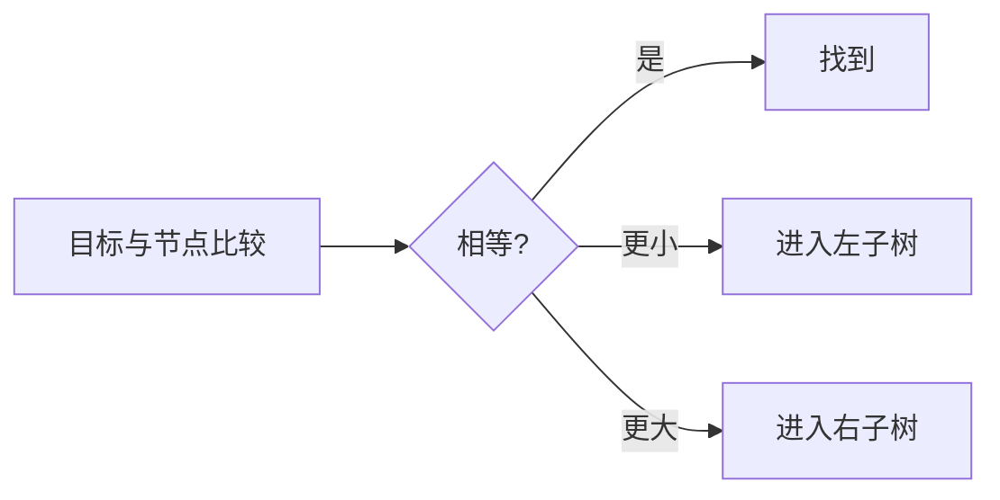

# 二叉搜索树

普通二叉树查找一个值可能访问所有节点。二叉搜索树（BST）增加有序不变量：按比较器，左子树所有值小于节点，右子树所有值大于节点。每次比较可以排除一侧，平均路径更短。

本篇完成查找和删除，并说明重复值与树高怎样影响复杂度。BST 不会自动平衡，顺序插入会退化成链。

## 先确定重复值策略

可以禁止重复、把重复统一放一侧，或在节点保存 count。策略必须贯穿插入、验证和删除。本文使用严格小于/大于，因此重复值不插入。



## 步骤一：查找沿一条路径

每次比较只进入左或右，时间 O(h)，h 为树高。平衡时约 O(log n)，退化时 O(n)。比较器要满足稳定全序，不能对同一对象随机返回不同结果。

## 步骤二：删除分三种情况

叶节点直接移除；只有一个孩子时用孩子替代；两个孩子时找到右子树最小节点（中序后继），用它的值替换当前节点，再从右子树删除这个后继。后继不可能有左孩子，因此第二次删除更简单。

```ts
function remove(
  root: TreeNode<number> | null,
  target: number
): TreeNode<number> | null {
  if (!root) return null
  if (target < root.value) root.left = remove(root.left, target)
  else if (target > root.value) root.right = remove(root.right, target)
  else {
    if (!root.left) return root.right
    if (!root.right) return root.left

    let successor = root.right
    while (successor.left) successor = successor.left
    root.value = successor.value
    root.right = remove(root.right, successor.value)
  }
  return root
}
```

输入不存在目标时结构不变。函数原地修改部分节点并返回可能变化的新根，调用方必须接住返回值，尤其删除根节点时。

## 步骤三：验证不能只看父子

只检查 `left < node < right` 会漏掉更深违规。验证函数需要传递允许范围：进入左子树时上界变为当前值，进入右子树时下界变为当前值。若支持重复，边界的开闭也要对应策略。

中序遍历严格递增可以作为另一种验证，但仍要处理比较器与重复值。删除后检查节点多重集合、BST 不变量和目标数量。

## 边界与演进

空树查找失败，删除为空；删除叶、单子、双子和根都要测试。顺序插入 1..n 会让递归深度与查询都退化，工程中使用 AVL、红黑树、B-Tree 或运行时提供的有序结构，取决于更新、范围查询与存储位置。
