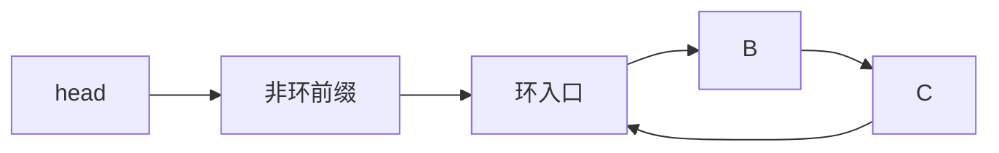

# 环形链表

链表尾节点若指向前面的节点，普通遍历永远不会遇到 null。可以用 Set 记录访问过的节点，空间 O(n)；Floyd 快慢指针只用常数空间：slow 每次一步，fast 每次两步，有环时二者最终在环内相遇。

本篇先判断环，再定位环入口。关键是节点引用身份，不是节点值；两个不同节点可以保存相同 value。

## 为什么一定会相遇

进入环后，fast 每轮相对 slow 多走一步。若环长为 L，相对距离每轮加 1 并对 L 取模，最多 L 轮就会变成 0。无环时 fast 或 fast.next 会先到 null。



## 步骤一：先找相遇点

找到相遇点后，把一个指针放回 head，另一个留在相遇点，两者都每次一步；下一次相遇就是环入口。代数推导基于：相遇时 fast 路程是 slow 的两倍，两者路程差是环长整数倍。

```ts
function findCycleEntry<T>(head: ListNode<T> | null): ListNode<T> | null {
  let slow = head
  let fast = head

  while (fast?.next) {
    slow = slow!.next
    fast = fast.next.next
    if (slow === fast) {
      let fromHead = head
      let fromMeeting = slow
      while (fromHead !== fromMeeting) {
        fromHead = fromHead!.next
        fromMeeting = fromMeeting!.next
      }
      return fromHead
    }
  }

  return null
}
```

输入无环链表时返回 null；自环节点会在第一轮相遇并返回自身。时间 O(n)，额外空间 O(1)。函数只读取 next，不修改链表。

## 如何得到环长并安全处理输入

相遇后让一个指针继续走，回到相遇点所需步数就是环长。入口到 head 的距离则在第二阶段移动次数中得到。调试输出链表时必须设置节点上限或 visited，否则日志工具本身也会无限循环。

工程接口需要说明是否允许环。普通列表若发现环通常返回数据损坏；调度轮可能有意构造环形结构。序列化与复制也要有循环引用策略。

## 验证

覆盖无环、头节点自环、环入口在头、中间入口、重复值节点和长前缀小环。使用 Set 版本作为小规模 oracle，比较返回的是同一节点引用。若把 `slow === fast` 错写成值相等，重复值用例应失败。

## 参考资料

- [Floyd's cycle-finding algorithm](https://en.wikipedia.org/wiki/Cycle_detection)
- [Open Data Structures: Linked Lists](https://opendatastructures.org/ods-javascript/3_Linked_Lists.html)
