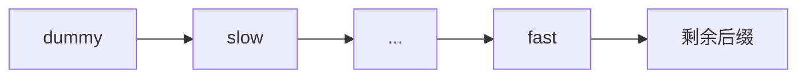

# 链表倒数节点与快慢指针

要删除链表倒数第 2 个节点，最容易先遍历得到长度，再定位正数位置，需要两次扫描。快慢指针让 fast 先走 n 步，随后 slow 与 fast 同速移动；两者间距始终为 n，fast 到尾部时 slow 正好在目标附近。

本篇使用 dummy 节点统一删除头节点的情况，并明确 n 非法时的行为。

## 固定间距是不变量



从 dummy 开始，让 fast 前进 n+1 次后，slow 与 fast 间隔 n 个真实节点。当 fast 到 null，slow 位于待删除节点的前驱，执行 `slow.next = slow.next.next` 即可。

为什么多走的是 `n+1` 而不是 n？因为删除操作需要目标节点的前驱。dummy 提供了一个位于真实头节点之前的位置，于是删除第一个真实节点也拥有统一前驱。循环之后 slow 不指向目标本身，而是准确停在目标前一格。

## 最小实现

输入 n 从 1 开始，链表为空、n 小于 1 或超过长度时抛出 RangeError。输出仍是原节点组成的链表，目标节点被断开。

```ts
function removeNthFromEnd<T>(
  head: ListNode<T> | null,
  n: number
): ListNode<T> | null {
  if (!Number.isInteger(n) || n < 1) throw new RangeError('INVALID_N')

  const dummy: ListNode<T | null> = { value: null, next: head }
  let fast: ListNode<T | null> | null = dummy
  let slow: ListNode<T | null> = dummy

  for (let step = 0; step <= n; step += 1) {
    fast = fast.next
    if (fast === null && step < n) throw new RangeError('N_TOO_LARGE')
  }

  while (fast) {
    fast = fast.next
    slow = slow.next!
  }

  slow.next = slow.next?.next ?? null
  return dummy.next
}
```

对 `1 -> 2 -> 3`、n=3，slow 最终仍在 dummy，删除的就是头节点 1。dummy 把“删除头”和“删除中间”统一成修改前驱 next。

输入 n 采用从 1 开始的倒数位置，返回值是可能变化的新头。算法只扫描一次并使用两个节点引用，时间 O(n)、额外空间 O(1)；越界在修改任何 next 之前被发现，因此失败不会留下半修改链表。

## 同类问题

找中点时 fast 每次两步、slow 一步；长度为偶数时返回前中点还是后中点，需要由循环条件决定。判断回文链表可以找中点、反转后半段并比较，若调用方仍需要原链表，应在结束前恢复结构。

快慢指针的正确性来自速度或间距关系，不是变量名。空链、单节点、删除头、删除尾和 n 越界都要覆盖。下一篇让 fast 每次两步，在环中分析相遇与入口。
