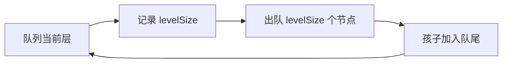

# 二叉树的递归与层序遍历

要找树的最大深度，递归很自然：当前深度等于左右子树最大深度加一。要按层展示组织结构，队列更自然：同一时刻队列中先保存当前层节点，再加入下一层孩子。

本篇比较 DFS 与 BFS，不把它们简化为“递归和循环”。差别是待处理状态放在调用栈、显式栈还是队列。

## DFS：先把一个分支走深

最大深度的定义是：空树为 0，非空树为 `1 + max(leftDepth, rightDepth)`。这个递归严格进入更小子树，基线清楚。

深度优先适合子树聚合、路径与结构验证，但树退化成很长链时会占用 O(h) 调用栈。输入不可信或可能极深时使用显式栈。

## BFS：同一层一起处理

层序遍历使用 Queue。每轮开始读取当前有效队列长度，这个长度就是本层节点数；处理这些节点时加入的孩子属于下一层，不应混入当前输出。



下面输入树根，输出按层分组的值。使用 head 索引避免 `shift()`。

```ts
function levelOrder<T>(root: TreeNode<T> | null): T[][] {
  if (!root) return []
  const queue: TreeNode<T>[] = [root]
  const output: T[][] = []
  let head = 0

  while (head < queue.length) {
    const levelSize = queue.length - head
    const level: T[] = []
    for (let index = 0; index < levelSize; index += 1) {
      const node = queue[head++]!
      level.push(node.value)
      if (node.left) queue.push(node.left)
      if (node.right) queue.push(node.right)
    }
    output.push(level)
  }
  return output
}
```

每个节点入队一次，时间 O(n)。队列最大占用等于最宽一层 w，空间 O(w)；DFS 则为 O(h)。宽树与深树的资源风险不同。

## 怎样选择遍历方式

找无权树中距离根最近的目标，BFS 第一次命中就是最小边数；判断所有根到叶路径或做子树聚合，DFS 更直接。需要节点进入和离开事件时，显式栈帧比简单 value 栈更合适。

## 验证

空树、单节点、左右不平衡和宽树都要覆盖。BFS 输出拍平后应包含每个节点一次；每一层孩子只出现在父层之后。若把 `levelSize` 放在 for 循环中动态读取，新增孩子会被错误并入当前层，测试应抓到。
