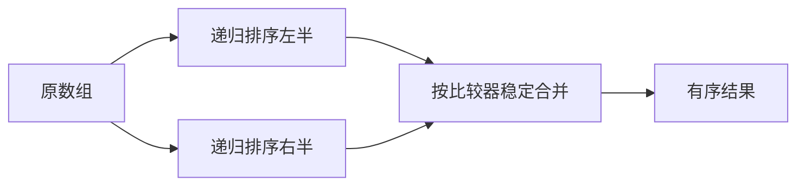

# 排序算法

用户列表先按部门排序，再按姓名排序。如果第二次排序会打乱同部门内的原顺序，多字段结果就不稳定。排序不仅要看 `O(n log n)`，还要看稳定性、是否原地、比较器语义和数据分布。

本篇用归并排序理解分治与稳定合并，再比较插入、快速和计数类排序的适用条件。现代 ECMAScript 规定 `Array.prototype.sort` 稳定，但比较器仍由调用者正确提供。

## 排序前先写比较器

比较器返回负数、0、正数表示先后关系，并应满足一致性、反对称和传递。数值升序使用 `(a, b) => a - b`；直接 `sort()` 会按字符串形式比较。比较器里不要执行网络、随机数或修改数组。



## 步骤一：归并时保持稳定

两半已经有序时，每次取较小的头。值相等时先取左半元素，保留它们在原数组中的相对顺序。

```ts
function mergeSort<T>(
  values: readonly T[],
  compare: (left: T, right: T) => number
): T[] {
  if (values.length < 2) return [...values]
  const middle = Math.floor(values.length / 2)
  const left = mergeSort(values.slice(0, middle), compare)
  const right = mergeSort(values.slice(middle), compare)
  const output: T[] = []
  let i = 0, j = 0

  while (i < left.length && j < right.length) {
    output.push(compare(left[i]!, right[j]!) <= 0 ? left[i++]! : right[j++]!)
  }
  return output.concat(left.slice(i), right.slice(j))
}
```

每层合并 O(n)，递归约 log n 层，总时间 O(n log n)。这个实现创建切片与输出，额外空间 O(n)，调用栈 O(log n)。

函数输入是只读数组和比较器，输出新数组，不修改原输入。合并阶段的 `<= 0` 是稳定性的关键：比较结果为 0 时先取左半，因而相等元素继续保持它们在输入中的先后关系。

## 其他排序何时合适

插入排序最坏 O(n²)，但小数组或接近有序时简单且常数低。快速排序平均 O(n log n)，分区选择不佳时退化；实际库会使用随机化、三数取中或混合算法。堆排序最坏 O(n log n)、额外空间小，但通常不稳定。

计数排序依赖有限整数范围，时间 O(n+k)，k 很大时空间不可接受。桶和基数排序同样需要明确 Key 模型，不是所有数字都自动线性排序。

## JavaScript sort 的工程边界

`sort()` 原地修改数组；状态管理中需要先复制。`toSorted()` 返回新数组，兼容性按目标环境确认。包含 `NaN`、`undefined`、Locale 字符串与日期时，比较规则需要显式设计；用户语言排序使用 `Intl.Collator`，不靠简单大小比较。

## 验证

除了有序性，还检查结果是输入的排列，没有丢失或新增元素。稳定性用带原始序号的相同 Key 记录验证。比较器属性可以用随机三元组检查传递性。基准覆盖随机、已排序、逆序、大量重复和小数组，不能只测一种输入。

## 参考资料

- [ECMAScript Array sort](https://tc39.es/ecma262/multipage/indexed-collections.html#sec-array.prototype.sort)
- [Open Data Structures: Sorting](https://opendatastructures.org/ods-javascript/11_Sorting_Algorithms.html)
- [Intl.Collator](https://developer.mozilla.org/docs/Web/JavaScript/Reference/Global_Objects/Intl/Collator)
