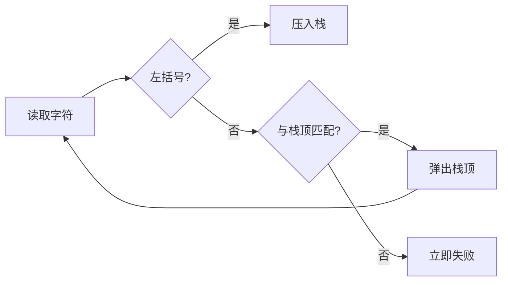

# 栈与括号匹配

检查字符串 `([{}])` 时，最后打开的 `{` 必须最先被 `}` 关闭。这个顺序正好是后进先出：遇到左括号压栈，遇到右括号只与栈顶比较。若与更早的括号匹配，嵌套关系就被破坏。

本篇用括号匹配理解栈的不变量，再扩展到表达式、撤销和显式 DFS。JavaScript 中使用数组尾部 `push/pop`，避免头部 `shift/unshift` 的移动成本。

## 不变量是什么

扫描到任意位置时，栈中从底到顶保存“已经打开但还没有关闭”的括号。栈顶是最近打开的那个，也是下一个右括号唯一合法的匹配对象。



## 步骤一：先处理失败条件

遇到右括号时，空栈表示没有对应左括号；栈顶类型不同表示嵌套顺序错误。扫描结束后栈仍不空，说明还有未关闭括号。三个条件覆盖所有失败路径。

下面的输入只允许六种括号和其他普通字符。普通字符被忽略；若协议要求只接收括号，可以在入口额外校验。

```ts
function hasValidBrackets(input: string): boolean {
  const expected = new Map([
    [')', '('],
    [']', '['],
    ['}', '{']
  ])
  const opening = new Set(expected.values())
  const stack: string[] = []

  for (const char of input) {
    if (opening.has(char)) {
      stack.push(char)
      continue
    }
    const match = expected.get(char)
    if (match !== undefined && stack.pop() !== match) return false
  }

  return stack.length === 0
}
```

每个括号最多入栈和出栈一次，时间 O(n)，最深嵌套时空间 O(n)。`stack.pop()` 在空栈返回 undefined，仍会与任何合法左括号不等，因此直接失败。

## 手工推演与边界

`([)]` 扫到 `)` 时栈为 `['(', '[']`，栈顶 `[` 与期望 `(` 不同，立即返回 false。`()[]` 每组在下一组开始前已经清空，返回 true。空串没有未匹配括号，按当前定义返回 true。

表达式求值使用两个栈或操作符栈，将优先级与结合性写成规则；浏览器前进后退和编辑撤销常使用两个栈，但实际命令还要定义幂等与内存上限。递归 DFS 可用显式栈改写，避免极深输入耗尽调用栈。

## 常见错误

只统计左右括号数量会把 `)(` 误判为合法；从栈底查找匹配会破坏嵌套；结束时不检查空栈会接受 `((`。属性测试可以生成合法括号，再随机删除、交换或替换一个字符，确认相应反例被拒绝。

## 参考资料

- [Open Data Structures: Stacks](https://opendatastructures.org/ods-javascript/2_Stacks_Queues_and_Deques.html)
- [ECMAScript Array](https://tc39.es/ecma262/multipage/indexed-collections.html)
