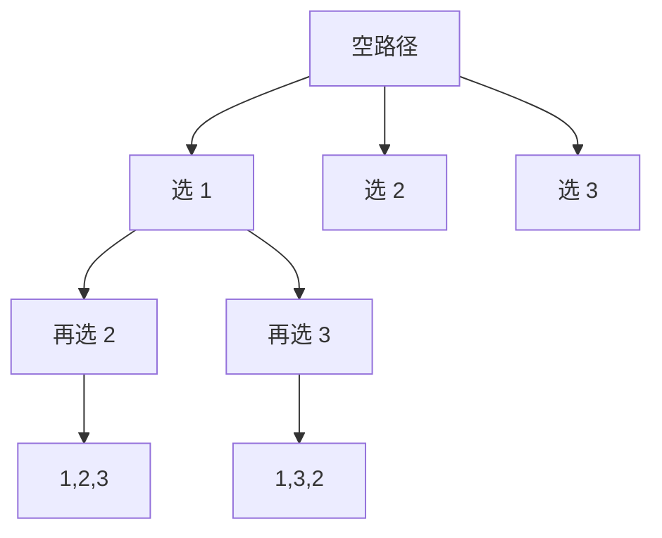

# 递归与回溯思维

从 `[1,2,3]` 生成所有排列：第一层选择第一个数字，第二层从剩余数字继续，得到完整长度后保存答案；返回上一层时撤销刚才的选择，才能探索另一个分支。

本篇用全排列建立“选择、递归、撤销”的主线，再解释组合、子集、括号和剪枝怎样改变状态。回溯的难点是定义状态与证明剪枝，不是记住 `push/dfs/pop`。

## 先画搜索树



状态包含当前 path 与哪些下标已经使用。叶子条件是 path 长度等于输入长度。used 属于当前路径，回到父节点时要恢复；它不是图遍历中“永远访问过”的全局 Set。

## 步骤一：写出选择与撤销

输入假定元素位置各不相同，输出所有排列。保存结果时复制 path，否则所有结果会引用同一个可变数组。

```ts
function permutations<T>(values: readonly T[]): T[][] {
  const output: T[][] = []
  const path: T[] = []
  const used = new Array(values.length).fill(false)

  function search() {
    if (path.length === values.length) {
      output.push([...path])
      return
    }
    for (let index = 0; index < values.length; index += 1) {
      if (used[index]) continue
      used[index] = true
      path.push(values[index]!)
      search()
      path.pop()
      used[index] = false
    }
  }

  search()
  return output
}
```

输出有 n! 项，每项复制 n 个元素，时间和输出空间至少 `Ω(n · n!)`。递归栈与当前 path 为 O(n)。完整枚举本身是指数级，不能靠一个技巧变成多项式。

## 步骤二：重复值需要同层去重

输入 `[1,1,2]` 时，按位置排列会得到重复值序列。先排序，同一层遇到与前一个值相同、且前一个相同位置尚未在当前路径使用时跳过。这个条件只删除同层等价选择；前一个相同值已经使用时，当前值位于下一层，仍合法。

## 步骤三：组合与子集改变候选范围

组合不关心顺序，下一层只从当前 index 之后选择，使用 startIndex 消除 `[1,2]` 与 `[2,1]` 重复。选 k 个时，剩余元素不足以补满 path 可以安全停止，因为这个分支已不可能达到叶子。

子集则在每个节点都记录当前 path，共有 2^n 个。生成有效括号用 `(open, close)` 作为状态，并保持每个前缀 `close <= open <= n`；禁止 close 超过 open 不会丢失合法答案，因为任何合法括号串的前缀都满足该不变量。

## 步骤四：剪枝要写出前提

组合总和中，候选全为正数时 remaining 小于 0 可以停止；出现负数后剩余值可能再次增加，这个剪枝不再成立。棋盘放置使用列与对角线 Set 排除冲突，状态范围比每次扫描整个棋盘更清楚。

Memo 只适合“相同状态的未来结果与到达路径无关”。若答案包含当前 path，缓存要返回可组合的后缀，不能缓存可变 path 引用。只求最优值或计数时，动态规划常比枚举所有路径更合适。

## 验证

检查每个排列长度、元素多重集合和唯一性；组合下标递增；括号每个前缀合法。故意忘记 pop、忘记复制 path 或错误去重，测试应出现缺失、重复或所有结果相同。每一处剪枝都要能解释“为什么不可能丢解”。

## 参考资料

- [Open Data Structures](https://opendatastructures.org/)
- [VisuAlgo Recursion](https://visualgo.net/en/recursion)
- [ECMAScript Array](https://tc39.es/ecma262/multipage/indexed-collections.html)
