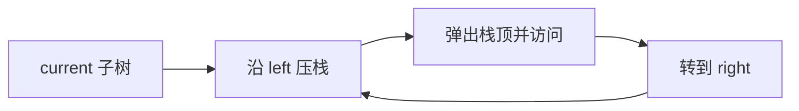

# 二叉树的迭代遍历

递归遍历把“稍后还要访问什么”保存在调用栈里。树很深时，JavaScript 调用栈可能溢出；迭代遍历把这份状态显式放进数组，因此能够控制深度和观察每一步。

本篇以中序遍历为主：先一路压入左链，无法再向左时弹出节点并访问，再转向右子树。前序和后序只改变访问时机或栈帧状态。

## 中序遍历的不变量

栈保存“左子树正在处理或已经处理，但节点自身尚未输出”的祖先。current 指向下一棵要展开的子树。current 为空时，栈顶就是下一节点。



## 最小实现

输入是普通二叉树根，输出中序值数组。二叉树不默认有序；只有 BST 的中序结果才按其比较规则有序。

```ts
interface TreeNode<T> {
  value: T
  left: TreeNode<T> | null
  right: TreeNode<T> | null
}

function inorder<T>(root: TreeNode<T> | null): T[] {
  const output: T[] = []
  const stack: TreeNode<T>[] = []
  let current = root

  while (current || stack.length > 0) {
    while (current) {
      stack.push(current)
      current = current.left
    }
    current = stack.pop()!
    output.push(current.value)
    current = current.right
  }

  return output
}
```

每个节点压栈和弹栈一次，时间 O(n)，空间 O(h)，h 为树高。退化链时 h=n，平衡树时约 log n。

函数输入空根时输出空数组，非空时按“左子树、节点、右子树”顺序生成值。内层 while 只负责保存左侧祖先，弹栈后才输出节点，随后把右子树交回同一流程；这三步与递归中序的调用顺序完全对应。

## 前序与后序怎样改变

前序在节点第一次入栈时访问，常见做法是弹出节点后先压右再压左，保证左先处理。后序要在左右子树完成后访问节点，可以给栈帧加入 visited 标记，或维护 lastVisited 判断右子树是否完成。

统一栈帧 `{node, phase}` 最容易解释三种顺序：phase 表示进入节点、左完成或右完成。代码会稍长，却能扩展表达式树求值和带进入/离开事件的遍历。

## 失败与边界

空树返回空数组，单节点返回一个值。外部输入可能实际是带共享节点或环的图，此时树遍历会重复或无限；协议要么先验证树结构，要么使用 Set 和节点上限保护。

测试用递归版本作为小规模 oracle，覆盖空树、只有左链、只有右链、完全树和深链。验证输出长度等于节点数，并确保输入节点引用没有被修改。

下一篇比较递归 DFS 与队列 BFS，学习层序遍历为何需要记录当前层大小。

## 参考资料

- [Open Data Structures: Binary Trees](https://opendatastructures.org/ods-javascript/6_Binary_Trees.html)
- [VisuAlgo Binary Tree](https://visualgo.net/en/bst)
