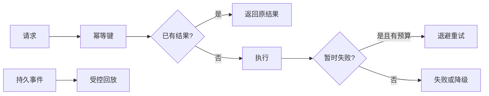

# 重试、去重、回放与降级

客户端调用“创建任务”超时了。可能是请求没有到达，也可能任务已经创建但响应丢失。直接再试一次可能重复创建；完全不试又可能丢失工作。这里同时出现传输不确定性和业务副作用。

本篇用同一个场景区分重试、去重、回放与降级。四个模式解决的问题不同，组合前要先说明失败发生在哪个边界。

## 四个模式各自回答什么

| 模式 | 解决的问题 |
| --- | --- |
| 重试 | 暂时性失败是否值得再次尝试 |
| 去重 | 同一意图重复到达是否只产生一次结果 |
| 回放 | 中断后如何从持久事实重新处理 |
| 降级 | 依赖不可用时保留哪部分能力 |

## 步骤一：先判断能否重试

连接失败、明确 429 或 503 可能是暂时性错误；权限拒绝、参数错误和业务冲突通常不会因等待消失。重试使用指数退避与抖动，并限制次数、绝对 Deadline 和累计成本。

多层同时重试会放大流量。客户端、网关、服务和数据库要确定责任层。写操作只有在具备幂等键或可查询状态时才适合自动重试。

## 步骤二：去重依据业务意图

随机 messageId 只能识别一次投递，不能识别用户重复提交。业务幂等键包含主体、动作和参数摘要，并由数据库唯一约束处理并发。相同键但参数不同返回冲突。

入口去重还不够。扣费、对象写入和外部 API 等每个副作用阶段都有稳定键，防止 Worker 中途重放时重复执行。

## 步骤三：回放只读取持久事实

回放用于事件投影、失败任务和断线事件流。输入包含 Schema、来源版本和事件序号；消费者保存检查点并幂等应用。旧版本无法解释时进行迁移或隔离，不忽略未知字段。

回放前重新检查权限、当前状态和外部副作用。复制一条生产消息到队列并不构成安全回放，因为环境、版本和幂等记录可能已经变化。

## 步骤四：降级保留明确结果

向量检索不可用时，可以退回全文检索；重排器超时时使用确定性融合；非关键推荐失败时隐藏推荐。认证、ACL 和数据完整性不能被“降级”绕过。无证据时安全拒答也属于明确结果。

降级路径需要提前测试和观测，等依赖故障后才发现代码无法运行已经太晚。恢复后还要考虑缓存预热与流量渐进，避免所有请求同时冲击刚恢复的下游。

## 故障矩阵

| 故障 | 合适处理 |
| --- | --- |
| 创建请求响应丢失 | 用幂等键查询或重试 |
| 权限拒绝 | 直接失败，不换范围重试 |
| 消息重复 | Task 与阶段副作用去重 |
| 投影中断 | 从已提交 sequence 回放 |
| Reranker 429 | 有界重试或确定性降级 |
| ACL 服务不可用 | 失败关闭，不返回全局结果 |
| 外部写结果未知 | 查询对方状态或进入对账 |

可靠性测试不仅检查响应，还检查数据库、制品、外部调用计数和事件序列。系统能够“最终成功”不代表没有重复收费或越权。

这五篇架构文章形成一条推导路线：边界决定所有权，任务模型处理跨进程状态，证据链约束 AI 输出，平台复用稳定能力，可靠性模式处理不确定性。下一栏目把这些方法用于日常调试和变更发布。

## 用“结果是否已发生”选择模式

调用支付或创建任务超时时，最关键的问题不是“要不要重试”，而是调用方是否知道结果已经发生。根据操作可重复性和结果可查询性选择重试、去重、回放或降级。

| 现象 | 首选思路 | 需要的前提 |
| --- | --- | --- |
| 明确未执行的暂时故障 | 有限重试 | 错误可分类、预算与退避 |
| 同一业务意图可能重复到达 | 去重/幂等 | 稳定业务键、结果可复用 |
| 客户端漏掉已提交事件 | 按序回放 | 持久事件与游标 |
| 非关键依赖不可用 | 明确降级 | 降级结果安全且对用户可解释 |
| 副作用结果未知 | 先查询/对账 | 外部操作有业务身份 |

重试不会自动幂等，去重也无法恢复丢失的响应。回放只读取已经提交的事实，不重新执行副作用。降级同样受权限、计费和数据完整性约束；这些控制失败时应关闭相应能力。

为一个外部调用填写故障矩阵：连接前失败、请求发送后超时、服务返回限流、服务成功但本地提交失败。每格写可观察证据、允许动作、最大次数和终态。再用故障注入验证没有重复副作用、预算不会刷新、客户端得到明确状态。这张矩阵比“统一重试三次”更能迁移到真实工作。
