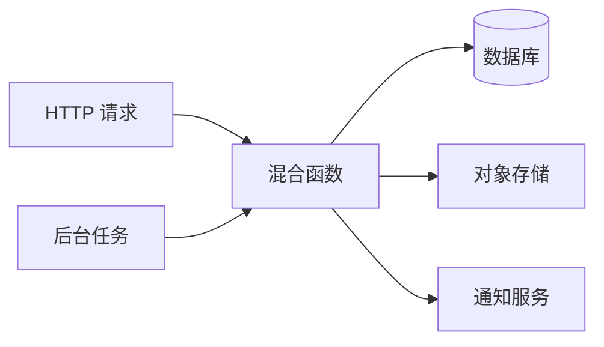
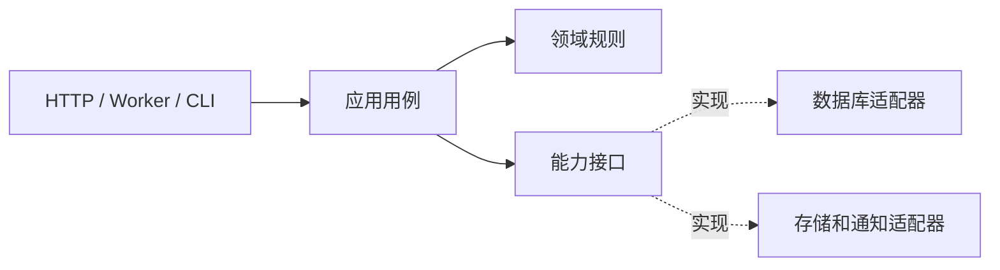

# 分层边界：代码为什么要按变化原因拆开

“分层架构”很容易被讲成目录模板：建一个 `controller`，再建一个 `service` 和 `repository`。目录确实会变化，但目录本身不能阻止业务代码直接读 HTTP、直接写 ORM，或者让定时任务复制一份接口逻辑。

本篇从一个更实际的问题开始：同一个“发布文档”动作，既可能由 HTTP 请求触发，也可能由后台任务触发；它还要检查权限、修改数据库、上传对象和发送通知。我们会观察简单写法什么时候开始疼，再推导哪些边界值得保留。

## 先看一个职责混在一起的动作

假设函数大致做这些事：读取请求体、检查登录用户、查询文档、判断状态、上传文件、提交数据库、调用通知服务、组装 HTTP 响应。它在正常路径上可能只有几十行，但每一种依赖都有自己的失败方式。



如果数据库提交成功而通知失败，文档到底算发布还是失败？如果后台任务没有 HTTP 请求，却需要相同权限规则，应该复制哪个部分？如果换数据库，为什么业务规则要跟着改？边界不是为了解决目录美观，而是为了让这些问题有清楚的拥有者。

## 分层先解决三种变化

- **入口变化**：HTTP、队列、CLI 和 MCP 的参数格式不同，但它们可以调用同一个用例。
- **业务变化**：状态、权限和不变量变化时，不应同时修改每个入口。
- **基础设施变化**：数据库、对象存储和通知 SDK 变化时，业务规则不应被厂商类型污染。

可以用四层心智模型理解：



箭头表示依赖方向。外层可以依赖内层的契约；领域规则不应导入 FastAPI、SQLAlchemy 或第三方 SDK。这里的“接口”不是为了让每个类都多一层，而是为了隔离真正会变化或需要替换的能力。

## 第一步：把入口参数转换成命令

HTTP 入口负责读取 URL、Body 和认证上下文，把它们转换成应用层能理解的命令。后台任务可以构造同一命令，但不需要知道 HTTP 状态码。

```ts
type PublishCommand = {
  documentId: string
  actorId: string
  tenantId: string
}

async function handleHttp(request: Request) {
  const body = await request.json()
  const result = await publish.execute({
    documentId: body.documentId,
    actorId: request.user.id,
    tenantId: request.user.tenantId,
  })
  return toHttpResponse(result)
}
```

这里 `handleHttp` 只做两件事：把外部输入转换成命令，把应用结果转换成协议响应。`PublishCommand` 不包含 `Request`、响应对象或 ORM Row，因此 Worker 可以直接调用 `publish.execute()`。输入校验仍应在入口完成，权限和状态规则则不能只相信客户端传来的字段。

## 第二步：应用用例拥有执行顺序

应用服务负责决定一次发布按什么顺序进行：查找可见文档、检查状态、执行状态转换、保存事实。领域对象可以把“草稿才能发布”这样的不变量封装起来。

```ts
class PublishDocument {
  constructor(
    private readonly documents: DocumentRepository,
    private readonly events: EventWriter,
  ) {}

  async execute(command: PublishCommand): Promise<PublishResult> {
    const document = await this.documents.findVisible(command.documentId, command.tenantId)
    if (!document) return { kind: 'missing' }

    if (document.ownerId !== command.actorId) return { kind: 'forbidden' }
    document.publish()
    await this.documents.save(document)
    await this.events.append({ type: 'document.published', documentId: document.id })
    return { kind: 'published', documentId: document.id }
  }
}
```

`findVisible` 把租户范围放进查询契约；`document.publish()` 只负责状态不变量；Repository 保存数据库事实；事件写入记录“发生了什么”。这段示例没有假设事件一定已经送到外部系统，事务一致性和派发方式要在具体系统中单独决定。

## 第三步：能力接口要足够小

如果应用服务直接接收一个完整 ORM 客户端，它会依赖查询构造器、事务方法和数据库字段，测试也必须启动真实数据库。更小的 Port 只描述用例需要的能力：

```ts
interface DocumentRepository {
  findVisible(id: string, tenantId: string): Promise<Document | null>
  save(document: Document): Promise<void>
}

interface EventWriter {
  append(event: DomainEvent): Promise<void>
}
```

接口不是“把所有方法都抽象一遍”。如果只有一个实现、没有测试隔离需求，也没有独立变化边界，增加接口只会制造转发代码。判断标准是：这个能力是否有不同适配器、是否要独立测试、是否包含不该扩散的安全条件。

## 第四步：明确事务和外部副作用

数据库更新和事件记录如果必须一起成立，应由同一个数据库事务保护。对象存储、邮件、模型调用等外部副作用通常不能和数据库共享原子提交，需要幂等键、补偿或明确的最终一致性说明。

这也是分层讨论里最容易被忽略的地方：把“通知发送”移到 `NotificationService` 并不会自动解决数据库成功、通知失败的时间窗口。架构文章必须说明事实状态、重试边界和用户最终看到什么，而不是只画调用箭头。

## 一个边界如何被验证

可以把架构规则变成可检查的行为：

| 检查 | 预期结果 |
| --- | --- |
| Controller 直接导入 ORM 查询对象 | 静态依赖门禁失败 |
| Worker 调用应用用例 | 不需要 HTTP Request |
| 不同租户查询同一 ID | 只能得到各自可见结果 |
| 文档已发布再次发布 | 返回稳定冲突结果，不重复写入 |
| 数据库保存抛错 | 状态和事件一起回滚或进入明确补偿状态 |
| 替换 Repository 实现 | 应用服务测试无需改业务规则 |

TypeScript 可以用 ESLint boundaries 或 dependency-cruiser 检查导入方向；Python 可以用 import-linter；但静态检查不能证明事务和权限正确，仍要用集成测试验证数据库行为。

## 什么时候不要继续拆层

一个只有单入口、单表和单一规则的小脚本，不需要为了形式创建领域、应用、端口、适配器四套目录。拆分的收益来自隔离变化、共享用例、保护数据所有权和提高测试信号；如果这些问题不存在，层数只会增加初学者的阅读负担。

可以带走一张决策表：

| 问题 | 如果答案是“是” | 可能需要的边界 |
| --- | --- | --- |
| 同一规则有多个入口？ | 避免复制规则 | 应用用例 |
| 存储实现可能替换？ | 隔离 SQL/SDK | Repository/Port |
| 状态有不可违反的条件？ | 集中维护不变量 | 领域对象 |
| 外部副作用不能回滚？ | 需要明确恢复 | 事件/补偿边界 |

下一篇将把其中最容易跨进程的部分单独拿出来：异步任务。我们会先定义任务、尝试、租约和事件，再解释为什么“把函数丢到队列”还不等于可靠任务。
