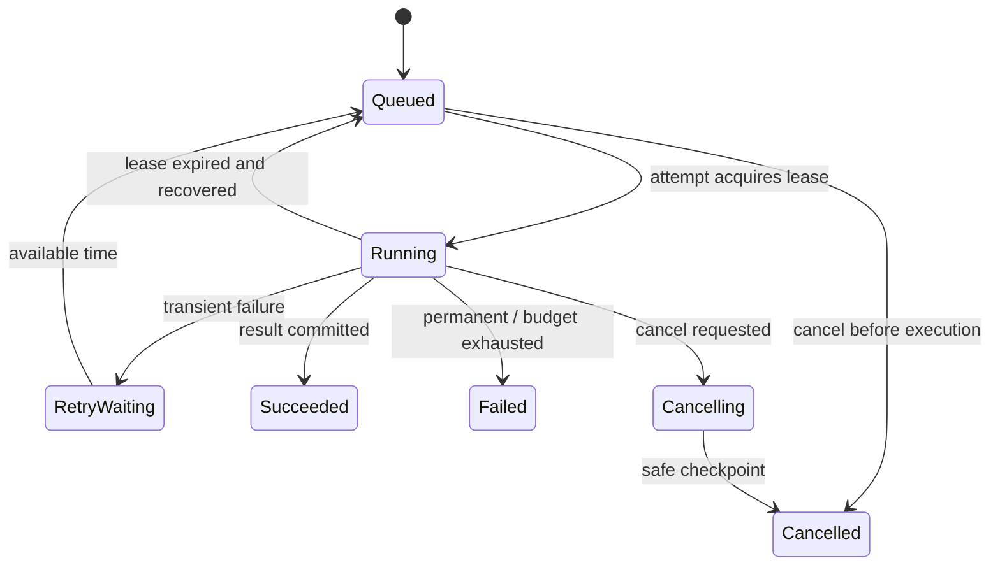
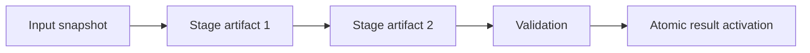
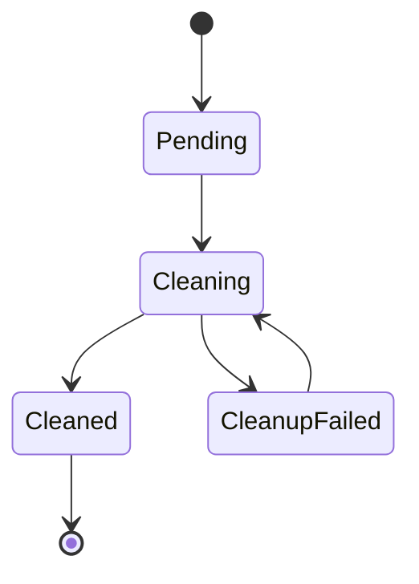

# 异步任务生命周期设计

文档处理、Agent 运行、报告生成、批量审计和索引发布业务不同，却共享同一问题：请求先返回，工作稍后完成，过程中会排队、重试、取消、断线、超时和恢复。若每个功能只保存一个 `status` 字符串，就会出现失败后仍显示 running、重复消息产生两份结果、取消覆盖成功、临时文件永不清理。

统一生命周期不是做一个万能任务框架，而是复用经过验证的身份、状态与事件语义，各业务仍拥有自己的阶段和结果。

## Task、Attempt、Lease、Event 四层身份

| 对象 | 表达 | 关键字段 |
| --- | --- | --- |
| Task | 用户的稳定业务意图 | taskId、tenant、input version、deadline |
| Attempt | 一次执行尝试 | attemptId、number、worker、error |
| Lease | 当前提交权 | owner、token、expiresAt |
| Event | 可重放状态变化 | eventId、sequence、type、payload version |

重试创建新 Attempt，不创建新业务 Task。Broker messageId 只是投递身份，也不等于 taskId。用户始终查询稳定 Task；运维可以解释每次 Attempt 为何失败。

```ts
type TaskRecord = Readonly<{
  taskId: string
  tenantId: string
  taskType: string
  state: TaskState
  stateVersion: number
  inputVersion: string
  idempotencyKey: string
  deadlineAt: string
  activeAttemptId: string | null
  terminalResultRef: string | null
}>
```

## 业务状态机与执行状态分离



Attempt 可以是 claimed、executing、retryable_failed、permanent_failed、abandoned、completed。Task 的 running 不说明某个旧 Attempt 仍有提交权；Lease token 决定。终态不可重新回 running，人工重放创建新 Task 或明确的新 Attempt，保留历史。

状态转换在领域层列出允许边和前置条件，API、Worker、恢复器调用同一逻辑。数据库使用 `state_version` CAS，取消与完成竞争只有一个成功。

## 创建任务先于发布消息

API 用业务幂等键在同一事务写 Task 与 Outbox，返回 202。Outbox 发布到队列，重复提交返回同一 Task。若只 `queue.add` 后返回，Broker/数据库任一侧失败都可能形成丢失或幽灵任务。

幂等键包括 tenant、taskType、输入稳定身份/版本和规范化参数摘要。相同 key 但参数摘要不同返回冲突，不能复用错误结果。保留期覆盖客户端重试与 Broker 重投窗口。

## 租约与 fencing token

Worker 原子领取任务，递增 lease token。周期续约；崩溃后租约过期，恢复器允许新 Attempt 接管。旧 Worker 暂停后恢复，即使还能运行，也不能用过期 token 写进度或终态。

```sql
UPDATE tasks
SET state = 'running',
    active_attempt_id = :attempt_id,
    lease_owner = :worker_id,
    lease_token = lease_token + 1,
    lease_expires_at = now() + :lease_interval,
    state_version = state_version + 1
WHERE task_id = :task_id
  AND state IN ('queued', 'retry_waiting')
RETURNING lease_token, deadline_at, input_version;
```

租约过期不能无条件从头执行。先看阶段检查点和外部副作用：远端调用超时可能已经成功，对象已写，数据库已提交。使用稳定副作用 key 查询/复用，或进入对账状态。

## 阶段、检查点与不可变候选

业务定义有限阶段，如 acquire、parse、transform、validate、publish。每个阶段输出不可变 Artifact，保存输入摘要与实现版本；重放验证并复用。不要在处理期间覆盖当前在线结果。



检查点是恢复所需的稳定位置，不是每行临时变量。批处理可记录最后稳定游标、已完成分片集合与摘要。检查点和阶段状态与 Task/Attempt 关联，旧 lease 无权覆盖。

## 进度不冒充确定性

固定总量任务报告 completed/total；动态工作报告阶段、已发现量和估计，明确 estimate。模型/Agent 流程用理解、检索、工具、验证等阶段，不伪造连续 37%。进度写入节流，单调规则由业务定义。

进度是用户视图，不是终态事实。客户端重新进入先获取 Task snapshot，再从 snapshot sequence 订阅事件。连接丢失不改变 Task。

## 持久事件与实时传输

状态转换追加带序号 Event，Web、SSE、通知和审计共享。先提交状态+事件，再推送。客户端带最后 sequence 重连，重复 Event 幂等应用；游标过期则重新获取快照。

```ts
type TaskEvent = Readonly<{
  taskId: string
  sequence: number
  eventId: string
  type: 'phase.changed' | 'progress.updated' | 'task.succeeded' | 'task.failed' | 'task.cancelled'
  schemaVersion: 1
  occurredAt: string
  payload: unknown
}>
```

高频 token/进度可合并，终态、安全和不可合并事件不能丢。Trace 可采样，Event log 是业务恢复数据。

## 取消是请求，不是瞬间事实

取消 API 原子写 `cancel_requested_at`。Queued 可直接 cancelled；Running 进入 cancelling，Worker 在安全边界检查，传播 Abort/Context 到可取消 I/O，完成当前不可分割步骤后停止。API 返回“取消已请求”，只有终态事件才能说“已取消”。

取消与成功并发：若成功已提交，取消返回终态结果；若取消 CAS 先成功，Worker 无权提交 success。外部副作用已经发生时记录并由补偿/清理处理，不能声称从未执行。

## Deadline 包含排队时间

入口创建绝对 deadline，消息传时间戳，Worker 领取时计算剩余预算。排队已经耗尽则不执行昂贵工作，进入 timeout/failed 终态。下游 timeout 小于剩余预算，并预留提交/清理时间。

重试受次数、总 deadline 和成本共同限制。每次退避后重新判断剩余预算；无限续租不能延长用户承诺。

## 重试分类和人工重放

暂时连接/限流可重试；输入、权限和不支持格式永久失败；并发冲突重新读取；未知代码错误失败并告警。自动重试不捕获所有 Exception。

人工重放需要权限、原因、范围和 dry-run/副作用模式。重放新 Attempt 保持同 taskId（用于恢复同一意图）或新 Task（用户显式重新执行），团队要固定语义。不能直接复制生产消息到队列后祈祷。

## 输入版本和晚到结果

Task 固定 inputVersion/knowledge Release。执行中源出现新版本时，根据业务：继续完成旧快照但不激活，或取消为 superseded。发布前 CAS 检查当前源仍匹配，防止慢旧任务覆盖新结果。

权限与安全撤权例外：即使固定历史范围，执行阶段访问数据仍检查当前撤权；安全优先于复现便利。产物权限继承版本化策略，不能发布成全局可见。

## 清理是独立生命周期

Task 终态不等于资源已清理。临时文件、未激活候选、上传分片、缓存、租约和测试数据有 Cleanup Record：pending/running/succeeded/failed、引用清单、重试和保留期限。



删除前检查当前/回滚 Release 和其他 Task 是否引用；只删任务命名空间内对象。清理失败不改变业务成功，但要可见和告警。审计/用户结果按不同保留策略删除。

## 多种执行器共享协议

Node Queue、Celery、Go Worker 或工作流引擎可以实现同一生命周期 Port。Broker-specific 状态不暴露给用户。执行器适配消息、ACK 和进程生命周期；Task Store 维护业务状态。

不是所有短工作都进入统一 Task 系统。毫秒级同步操作直接返回；只有需要跨请求、恢复、用户查询或资源隔离的工作才承担任务模型成本。

## 可观测性与 SLO

指标：创建率、queue delay、oldest age、attempt duration、重试原因、租约过期、终态分布、deadline miss、取消延迟、cleanup backlog。日志关联 taskId/attemptId/lease token，不记录完整负载。

用户 SLI 是“在期限内进入正确终态”，不是 Worker uptime 或队列长度。任务 succeeded 但结果指针未激活/事件没写，仍是坏事件。

## 验证：状态机和故障模型

| 场景 | 通过条件 |
| --- | --- |
| 重复 API 提交 | 同 Task、同参数结果复用 |
| 重复 Broker 投递 | 单一有效 lease，副作用一次 |
| Worker ACK 前退出 | 新 Attempt 复用已提交结果 |
| Worker 暂停后恢复 | 旧 fencing token 被拒绝 |
| 取消与成功竞争 | 唯一合法终态 |
| 排队超过 deadline | 不启动昂贵阶段 |
| 执行中源更新 | 旧结果不激活为当前 |
| SSE 断线 | snapshot + sequence 补齐 |
| 清理失败 | 业务终态保留，cleanup 可重试 |
| 消息版本未知 | 隔离而非错误解释 |

```ts
it('allows exactly one terminal transition', async () => {
  const [success, cancellation] = await Promise.allSettled([
    taskStore.commitSuccess(taskId, leaseToken, resultRef),
    taskStore.acceptCancellation(taskId, expectedStateVersion)
  ])
  expect([success, cancellation].filter(item => item.status === 'fulfilled')).toHaveLength(1)
  expect(['succeeded', 'cancelled']).toContain((await taskStore.get(taskId)).state)
})
```

状态模型可以 property-based 测试随机合法/非法序列，断言终态不可逆、版本单调、最多一个有效 lease、事件序号连续。集成测试主动杀 Worker、断 Broker、延迟 ACK 和乱序事件，不能只测函数顺序。

## 常见误区

- Task、消息和 Attempt 共用一个 ID。
- Broker completed 是唯一业务状态。
- 租约只有 expiresAt，没有 fencing token。
- 租约过期就从头执行，不查询副作用。
- 进度伪造成精确百分比并高频写库。
- 连接关闭被当作任务失败或取消。
- 取消请求立即标 cancelled，Worker 仍继续写。
- Deadline 从 Worker 开始算，忽略排队。
- 旧输入任务晚到覆盖新版本。
- Task 成功后临时产物无人负责清理。

## 参考资料

- [Temporal Durable Execution](https://docs.temporal.io/workflows)：持久工作流、事件历史和恢复概念的公开实现参考。
- [Transactional Outbox](https://microservices.io/patterns/data/transactional-outbox.html)：任务事实与消息投递的一致性。
- [Idempotent Consumer](https://microservices.io/patterns/communication-style/idempotent-consumer.html)：重投下的重复消费处理。
- [PostgreSQL Explicit Locking](https://www.postgresql.org/docs/current/explicit-locking.html)：租约、fencing 和状态领取所需的并发基础。
- [WHATWG Server-sent events](https://html.spec.whatwg.org/multipage/server-sent-events.html)：任务事件重连与事件 ID 的传输语义。
