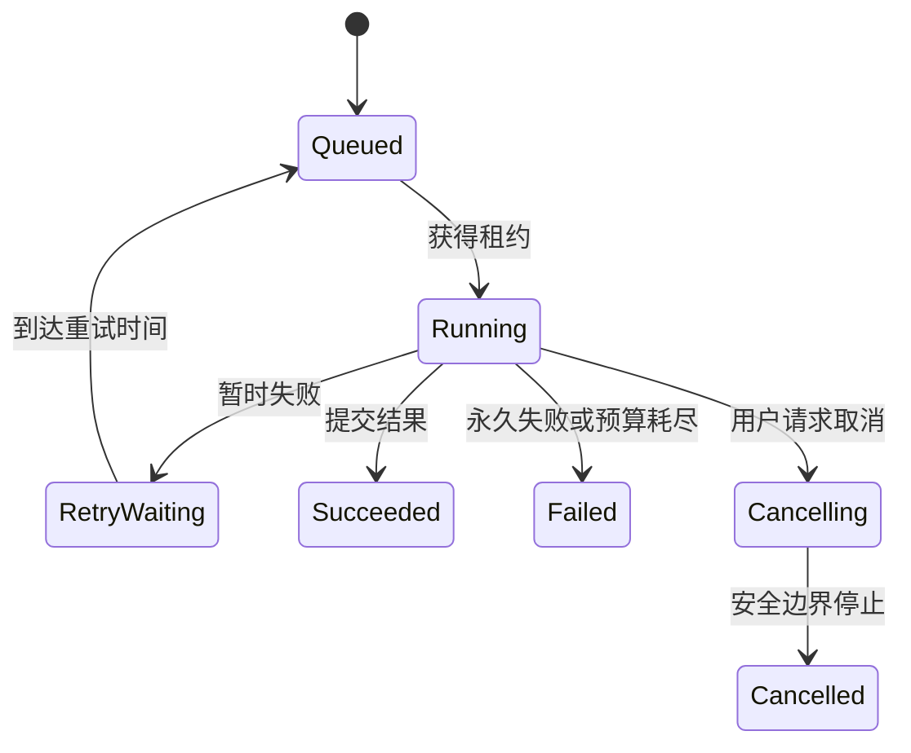

# 异步任务生命周期设计

用户创建报告后得到一个 ID，Worker 完成时写入结果。这条最小流程遇到四种情况就会变复杂：消息重复、Worker 中断、用户取消、旧 Worker 晚到并覆盖新结果。

本篇一次解决一个问题，最终得到稳定 Task、执行 Attempt、提交租约 Lease 和可重放 Event。这个模型表达生命周期语义，不要求所有业务共用一张万能任务表。

## 先分清四个身份

| 对象 | 表达什么 |
| --- | --- |
| Task | 用户的一次稳定业务意图 |
| Attempt | Worker 的一次执行尝试 |
| Lease | 当前哪个 Attempt 有提交权 |
| Event | 带序号、可重放的状态变化 |

重试创建新 Attempt，不创建新的业务 Task；Broker messageId 也不等于 Task ID。用户始终查询 Task，运维则能解释每次 Attempt 为什么结束。

## 步骤一：任务先持久化，再通知 Worker

API 用业务幂等键创建 Task，返回 202。可靠派发方案在同一事务写 Outbox，由发布器发送消息；若当前是提交后直接派发，就要保存派发失败状态并由扫描器补发。两种实现的故障窗口要如实说明。

幂等键由租户、任务类型、输入稳定版本和规范化参数组成。相同键但参数摘要不同返回冲突，避免误用旧结果。

## 步骤二：租约阻止旧 Worker 提交

Worker 原子领取任务，生成递增或不可重复的 fencing token，并周期续约。进程崩溃后租约到期，恢复器允许新 Attempt 接管。旧 Worker 恢复时仍可继续计算，却无法用旧 token 写进度或终态。

租约过期后不能无条件从头执行。先检查阶段产物和外部副作用：远端请求超时可能已经成功，对象也可能已经写入。每个副作用使用稳定键查询、复用或进入对账。

## 步骤三：检查点只保存稳定位置

任务拆成有限阶段，例如获取、解析、转换、验证和激活。每个阶段产出不可变 Artifact，记录输入摘要和实现版本。检查点保存最后完成的页批次或分片集合，不是把进程内每个临时变量都序列化。

发布前再次确认输入版本仍然有效。若新来源已经出现，旧任务可以完成诊断产物，但不能覆盖当前结果，而是进入 superseded。

## 步骤四：取消、Deadline 和终态竞争

取消 API 写入 `cancel_requested_at`。排队任务可直接取消；运行任务在安全阶段边界停止。API 只能说“取消请求已接收”，终态事件出现后才能说“已取消”。

取消与成功同时发生时，使用状态版本条件更新，只有一个终态提交成功。Deadline 从入口开始计算并包含排队时间；Worker 领取时若预算已耗尽，就不再启动昂贵工作。自动重试同时受次数、Deadline 与成本限制。

状态转换和 Event 在同一事务提交。客户端先读取快照，再从快照序号订阅增量；连接断开不会改变任务。高频进度可以合并，终态与安全事件保持可恢复。

## 失败演练

| 注入故障 | 要证明的结果 |
| --- | --- |
| 同一消息投递两次 | 一个有效租约，一份结果 |
| Worker 提交后、ACK 前退出 | 重投复用终态 |
| 旧 Worker 长暂停后恢复 | 旧 token 无法覆盖 |
| 取消与完成并发 | 只有一个终态 |
| 下游持续 503 | Deadline 后停止重试 |
| 源版本在处理中更新 | 旧候选不激活 |
| 客户端断线 | Task 继续并可重放事件 |

清理也有自己的生命周期：临时文件、未激活候选和分片按引用清单删除。清理失败不应反转业务成功，但要可见、可重试，也不能误删当前或回滚版本。

下一篇进入 AI 系统最重要的另一条链路：证据。我们会把“模型生成了一段话”拆成可验证 Claim 和可见 Evidence。

## 从一张状态表开始设计

以生成报告为例，先写业务任务状态，而不是先选队列。任务可以从 `pending` 进入 `running`，最终到 `completed`、`failed`、`cancelled` 或 `timed_out`。每条转换写明触发者、前置状态和需要原子提交的数据。

| 转换 | 触发者 | 需要同时写入 |
| --- | --- | --- |
| `pending -> running` | 获得租约的 Worker | owner、lease_until、started_at |
| `running -> completed` | 当前 owner | 结果身份、终态事件、finished_at |
| `running -> cancelled` | 用户请求/Worker 协作确认 | 取消原因、终态事件 |
| `running -> timed_out` | Worker 或停滞扫描 | Deadline、最后检查点、终态事件 |

Attempt 记录每次执行机会，Task 表示用户看到的一个业务意图；消息只是唤醒 Worker。Worker 在关键提交前比较 owner 和 lease，旧 Worker 即使迟到也不能覆盖新执行者。Checkpoint 只保存在稳定节点完成后的状态，不保存无法重复的半个副作用。

做三次演练：消息重复到达、Worker 在完成后 ACK 前退出、用户取消与完成同时发生。断言任务只有一个终态、外部副作用可查询或幂等、事件序号连续。设计完成的产物应是一张状态转换表、错误分类和停滞恢复规则，而不只是“使用了异步队列”。

## 参考资料

- [Transactional Outbox](https://microservices.io/patterns/data/transactional-outbox.html)
- [Idempotent Consumer](https://microservices.io/patterns/communication-style/idempotent-consumer.html)
- [PostgreSQL Explicit Locking](https://www.postgresql.org/docs/current/explicit-locking.html)
- [Celery Tasks](https://docs.celeryq.dev/en/stable/userguide/tasks.html)
