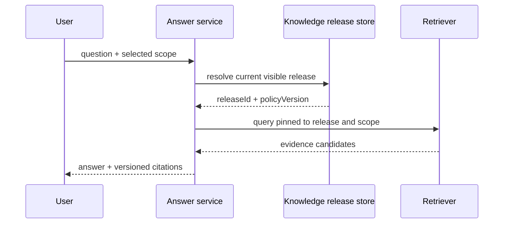
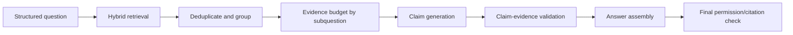
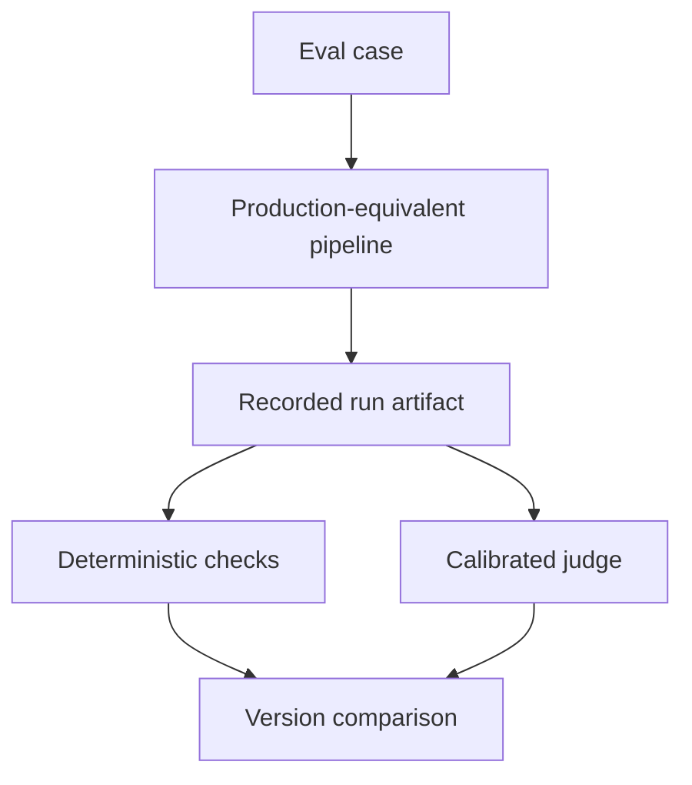

# 证据驱动的 AI 系统

当 AI 输出用于工作决策时，“回答听起来合理”不是质量标准。系统要能证明：每个关键事实来自当前用户可见的特定版本来源；引用真的支撑对应声明；来源冲突、新鲜度不足和证据缺失被显式处理；模型、检索和权限变化后仍能复现可观察路径。

证据驱动架构不要求保存模型隐藏思维过程。它把可验证对象建模为 Source、Revision、Evidence、Claim、Citation 和 Answer，并记录各阶段确定性输入输出。这样既能评测，也能在来源撤销、策略变化和故障复盘时定位影响。

## 六类对象与身份

| 对象 | 含义 | 稳定身份 |
| --- | --- | --- |
| Source | 文档/记录的业务来源 | sourceId |
| Revision | 某次不可变来源快照 | revisionId + digest |
| Evidence | 可引用的最小版本片段 | evidenceId/chunkId |
| Claim | 回答中可独立验真的声明 | claimId |
| Citation | Claim 到 Evidence 的支撑关系 | citationId |
| Answer | 面向用户的组织和表达 | answerId/runId |

Source 可持续更新，Revision 不可变；Evidence 属于某个 Revision/Release；Claim 不是一句自然语言随意切分，而是需要验证的原子事实。Answer 可以重排、归纳多个 Claim，不能凭表达流畅绕过支撑检查。

```ts
type Evidence = Readonly<{
  evidenceId: string
  sourceId: string
  revisionId: string
  releaseId: string
  tenantId: string
  scopeId: string
  sectionPath: readonly string[]
  locator: { page?: number; start?: number; end?: number }
  text: string
  contentDigest: string
  sourceAuthority: 'primary' | 'official' | 'secondary' | 'user-provided'
  publishedAt: string | null
}>

type Claim = Readonly<{
  claimId: string
  text: string
  kind: 'fact' | 'calculation' | 'recommendation' | 'uncertainty'
  importance: 'critical' | 'supporting'
}>

type Citation = Readonly<{
  claimId: string
  evidenceIds: readonly string[]
  relation: 'direct' | 'derived' | 'contradicts'
  validation: 'supported' | 'partial' | 'unsupported'
}>
```

不要让 Citation 只有一个 URL 字符串。它需要版本和定位，否则来源更新后链接仍能打开，却已不再包含当时证据。

## 请求开始固定快照

一次回答固定：知识 Release、索引版本、策略版本、检索配置、模型版本和时间上下文。生成过程中知识发布新版本，不应让前半段引用旧数据、后半段使用新数据。



固定快照不意味着忽略紧急撤权。Evidence 在进入上下文前按当前权限过滤，生成完成/引用打开时再次复核。安全撤权优先于历史复现；被撤权证据不可继续展示，审计只保留受控摘要和影响引用。

## 权限在每个召回通道之前

关键词、向量、图谱、SQL 和附件扩展都必须接受同一 tenant/release/scope 约束。全库 Top K 后再过滤会接触越权候选并降低合法 Recall。缓存键包含策略/范围版本，不能按 query 全局复用。

```ts
type EvidenceQuery = Readonly<{
  tenantId: string
  subjectId: string
  releaseId: string
  policyVersion: string
  allowedScopeIds: readonly string[]
  normalizedQuestion: string
  evidenceBudget: number
}>
```

指定文档/范围无结果时安全返回该范围没有足够证据，不回退到“全公司知识”“模型常识”或其他租户。后置 ACL 可以作为防御检查，不能替代检索下推。

## 从问题理解到证据预算

检索前结构化理解一次完成：用户目标、实体/时间、指定范围、必须回答的子问题、允许推断类型。不要为某句问法加关键词特判；理解结果可记录、可评测。

证据预算不是把 Top 50 全塞给模型。先按子问题覆盖、来源多样性、权威、新鲜度和 token 预算选择。重复段落聚类，相邻块按需扩展；表格带表头，代码带符号和必要调用上下文。



预算保留“为什么未选”摘要，例如权限过滤、重复、陈旧、低相关；但不记录越权正文。这样 Recall 问题与 Context 截断问题可区分。

## Claim-first 不等于让模型展示思维链

系统要求模型输出结构化 Claim 与 evidenceIds，是结果契约，不是隐藏推理。每个关键 Claim 必须直接/派生支撑；推荐类 Claim 区分来源事实与工程判断；模型常识若允许使用，明确标注非私有证据且不能回答受限内部事实。

```json
{
  "claims": [
    {
      "claimId": "c1",
      "text": "候选版本在切流前完成了健康与业务验证。",
      "kind": "fact",
      "importance": "critical",
      "evidenceIds": ["e12", "e18"]
    }
  ]
}
```

输出经 Schema 验证，evidenceId 必须属于本次预算。模型不能自己构造 URL/ID。结构失败可有限修复重试；仍失败则返回安全错误，不从自然语言正则猜引用。

## 支撑关系需要独立验证

“引用相关”不等于“引用支撑”。验证器检查：

- Entailment：证据是否蕴含 Claim，而非只同主题；
- Completeness：Claim 的数字、主体、条件和时间是否全部支撑；
- Attribution：Evidence 是否确实属于显示来源/版本；
- Scope：证据是否在用户可见范围；
- Freshness：该问题是否要求当前数据；
- Calculation：派生数字的输入和公式是否可复算。

关键 Claim unsupported 时删除/改为不确定或拒答；supporting Claim 可降级表达。不能让同一个生成模型无校准地为自己打满分，验证器需要 Golden 样本、规则和独立模型组合。

```ts
function validateCalculation(claim: CalculationClaim, evidence: readonly Evidence[]): Validation {
  const inputs = claim.inputRefs.map(ref => resolveTypedValue(ref, evidence))
  const computed = approvedFormulaRegistry.execute(claim.formulaId, inputs)
  return approximatelyEqual(computed, claim.value, claim.tolerance)
    ? { state: 'supported' }
    : { state: 'unsupported', reason: 'CALCULATION_MISMATCH' }
}
```

金额、比例和统计等尽可能走确定性计算工具，保存 formula/input/output，不让 LLM 在文本里心算。

## 冲突不是用最高相似度解决

两个 Evidence 对同一事实冲突时，相似度无法判断真伪。建立来源优先级、适用范围和时间规则：官方当前记录优先历史说明；一手源优先转述；指定政策版本优先通用教程。无法确定则向用户展示冲突与各自版本，不隐藏。

```ts
type ConflictSet = Readonly<{
  topic: string
  evidenceIds: readonly string[]
  resolution: 'authority' | 'freshness' | 'scope-specific' | 'unresolved'
  selectedEvidenceIds: readonly string[]
  policyVersion: string
}>
```

规则本身版本化并纳入 Eval。来源“官方”不是永久正确，也要核对版本/适用环境。旧内容可作为演进背景，但不能继续作为现行结论。

## 新鲜度与时间语义

Evidence 有来源发布时间、抓取/发布版本和有效期。问题区分“截至当前”“某历史时点”“某固定发布版本”。没有时间信息时不冒充最新。

数据管线监控 SourceRevision 到 current Release 的 lag。回答可以显示“基于某版本”，但公开展示避免暴露内部版本命名；使用中性更新时间和可验证引用。缓存包含 releaseId，新 Release 发布自然不命中旧结果。

## 表格、代码、图像与结构化证据

表格 Evidence 保存表头、行键、单位、合并单元格上下文，不能只给一个数值。代码 Evidence 保存语言、符号、版本、片段范围和调用上下文；公开文章从私有工程提炼时重写成中性代码，不复制源码、路径和字段。

图像/PDF Evidence 保存页码/区域和 OCR 置信；低置信文字不能支撑关键数字而不提示。结构化数据库 Evidence 记录查询模板 ID、参数摘要、结果版本和授权范围，不保存敏感 SQL 参数到普通 Trace。

Evidence normalization 不能改变原意。显示摘录保留原文，索引文本可增加标题路径；引用 UI 让读者看到足够上下文而不是一句截断片段。

## Answer 组装与引用体验

Answer 由已验证 Claim 组成，引用标记紧邻对应事实。多个 Claim 共用同一 Evidence 可以复用编号，但不能把文章末尾一串链接假装逐句支撑。点击引用定位到来源版本与区域；来源撤权后返回不可用说明，不泄露旧内容。

推断与建议使用措辞区分：

- “来源显示……”对应 direct fact；
- “由 A 与 B 计算得……”对应 derived；
- “在这些约束下建议……”明确工程判断；
- “现有证据不足以确定……”不是失败，而是正确边界。

回答长度不能超过证据质量。找不到证据时减少结论，不用通用语言填满。

## 审计记录可观察决策，不保存隐藏思维

一次运行记录：

| 阶段 | 保存 |
| --- | --- |
| admission | actor/scope 摘要、策略和预算 |
| understanding | 结构化问题、实体和范围 |
| retrieval | 通道配置、候选 ID/分数/过滤原因 |
| context | 选入 Evidence ID、token/截断 |
| generation | 模型/Prompt 模板版本、结构化 Claim |
| validation | Claim-Citation 结果与错误码 |
| delivery | Answer 版本、终态、降级路径 |

不保存模型隐藏 Chain-of-Thought。Prompt/正文可能含敏感数据，按最小化和访问控制保留，公共日志只存摘要。审计数据也受用户删除和保留策略约束。

## 权限撤销和影响分析

Citation 图让来源变化可以反向定位：Revision/Evidence -> Claims -> Answers/Eval cases。撤权先让检索和引用不可见，失效相关缓存；再决定已生成 Answer 是否隐藏、重新生成或标记过期。不能因为 Answer 已缓存就继续泄露。

内容普通更新不一定使历史 Answer 错误，但“当前答案”应重新基于新 Release。审计保留受控 ID/摘要用于事故调查，不保留用户已要求删除的正文副本。

## 质量评测分解

端到端“答案好不好”太模糊。分层指标：

| 层 | 指标 |
| --- | --- |
| 数据 | 解析覆盖、结构/引用定位、发布新鲜度 |
| 检索 | Recall@K、MRR/nDCG、无结果、ACL leakage=0 |
| Context | 子问题覆盖、重复率、token 利用 |
| Claim | 支撑率、完整性、冲突识别、计算正确 |
| Citation | precision、locator correctness、可见性 |
| Answer | 任务完成、拒答正确、可读性 |
| 系统 | 延迟、成本、恢复、版本可复现 |

测试集包含：明确有答案、无答案、冲突来源、陈旧来源、相似但不支撑、不同权限同名文档、表格跨行、计算、Prompt Injection 与来源撤销。按主题/语言/长度/权限分桶，避免平均分掩盖安全失败。

## Judge 校准与对抗

LLM-as-Judge 用明确 rubric，只看到必要 Evidence/Claim，不把参考答案当模型必然正确。用人工标注 Golden 校准一致性、偏差和阈值；关键安全/ID/数值使用确定性规则。

Mutation 测试主动：删除 ACL、替换引用 ID、改变数字、把否定改肯定、插入无关高相似片段，确认门禁失败。若 Eval 对明显坏变异仍绿色，它不是质量证据。

```ts
it('rejects a citation that is relevant but does not support the number', async () => {
  const result = await validator.validate({
    claim: { text: '恢复耗时为 20 分钟', kind: 'fact' },
    evidence: [{ text: '文档讨论了恢复流程，但没有给出耗时。' }]
  })
  expect(result.state).toBe('unsupported')
  expect(result.reason).toBe('MISSING_QUANTITATIVE_SUPPORT')
})
```

## 在线治理与降级

线上监控 unsupported/partial、引用打开失败、无答案率、冲突率、Evidence 新鲜度和用户反馈。真实失败匿名化为最小回归：移除账号、域名、正文和真实指标，保留根因结构。

Reranker/验证器故障时可降级到确定性 RRF 和更保守回答，但不能绕过 ACL、证据或关键安全验证。降级在 Answer/Trace 标记，频率告警；长期降级不是正常主路径。

## 用户反馈不是自动真值

点赞/点踩同时受措辞、延迟、预期和任务难度影响，不能直接作为“事实正确”标签训练或调参。反馈先结构化：问题未解决、证据不相关、引用打不开、事实错误、范围错误、表达问题；允许用户选择具体 Claim/Citation，但不要求他们暴露额外敏感内容。

```ts
type AnswerFeedback = Readonly<{
  answerId: string
  claimId?: string
  citationId?: string
  category: 'not_useful' | 'unsupported' | 'incorrect' | 'stale' | 'access_issue' | 'presentation'
  comment?: string
  createdAt: string
}>
```

自由文本在进入日志、标注平台和回归集前执行访问控制、敏感扫描和人工/自动匿名化。不能把用户提交的私密事实直接加入长期记忆或公共 Eval。高风险反馈由有权限的领域人员复核，保留标注者一致性和理由。

反馈采样有选择偏差：满意用户可能不反馈，失败用户更积极；按反馈率直接比较两个版本会误导。结合随机抽检、任务完成信号和配对离线评测。线上真实失败转为合成最小样本时保留检索/权限/引用结构，删除可识别业务内容。

## 离线 Eval 与线上协议保持同构

离线测试如果直接把 Golden Evidence 喂给模型，只测生成，不证明线上检索和 ACL；如果使用另一套预处理/Prompt，分数无法代表生产。建立同一个 Answer Pipeline Port：离线替换外部模型为固定版本，仍经过理解、检索、预算、Claim、验证和引用复核。



Eval Case 固定用户可见范围、知识 Release/Fixture、问题、关键期望 Claim、允许 Evidence 与禁止 Evidence。没有权限上下文的问答样本无法评估越权。线上 pipeline 增加新降级/缓存/重写路径时，离线运行器也必须能触发并记录，否则门禁覆盖漂移。

保存 Run Artifact：各阶段版本、候选 ID、过滤原因、Evidence 预算、Claim/Citation、确定性断言和 Judge 结果。对比两个版本时使用相同 Fixture 与随机种子，模型非确定性通过多次运行/置信区间处理，不把一次小分差当显著改进。

## Evidence Schema 的兼容演进

Evidence/Claim/Citation 是跨检索、生成、UI、审计和评测的协议。新增字段先让读取端兼容缺失，再写入；删除或改变含义要新 Schema 版本。旧事件/Run 在保留期内必须能解释，无法理解未来版本时明确拒绝而不是忽略 `scopeId`、`releaseId` 等安全字段。

序列化使用 JSON Schema/Pydantic/Zod/Protobuf 等结构化校验，禁止靠字符串拼接解析引用。契约测试运行新旧 producer/consumer 组合；UI 对未知 Claim kind 提供安全展示或阻断，不把它默认为普通事实。

## 发布门禁与版本对比

数据/检索/Prompt/模型/验证器任何版本变化都跑 Champion/Challenger。比较质量、权限、延迟和成本，输出配对差异而不是只看平均。候选先离线，再影子/小流量，但影子数据仍按权限和隐私最小化。

一次回答保存版本组合，线上问题可精确重放到同一 Release 和配置。模型供应商无法复现随机输出时，至少复现输入 Evidence/Schema/参数，并保存实际结构化输出摘要。

## 验证矩阵

| 场景 | 必须结果 |
| --- | --- |
| 指定范围无内容 | 安全无答案，不回退其他来源 |
| 全局相似越权内容 | 候选阶段即不可见 |
| 引用只相关不支撑 | Claim 被删/降为不确定 |
| 来源冲突 | 按策略解释或明确展示 |
| 表格数值 | 带表头、单位、行列定位 |
| 派生计算 | 输入/公式可复算 |
| 生成中发布新版本 | 本次仍固定 Release |
| 权限中途撤销 | 最终引用复核拒绝展示 |
| Reranker 超时 | 保守降级，不扩大范围 |
| 引用替换变异 | Eval 门禁失败 |

## 常见误区

- Citation 只有 URL，没有来源版本和定位。
- 全库召回后再做 ACL，缓存候选跨用户复用。
- 回答末尾堆链接，却没有 Claim 级支撑关系。
- 相似度高就认为 Evidence 蕴含 Claim。
- 冲突来源由最高向量分数自动决定。
- 模型自己生成 evidenceId/URL，未校验预算集合。
- 把模型隐藏思维链当审计证据并长期保存。
- Judge 未校准、没有 mutation，分数看似精确。
- 生成时固定旧权限，撤权后仍可打开引用。
- 降级时跳过权限或证据验证。

## 源码与规范

- [Reciprocal Rank Fusion](https://plg.uwaterloo.ca/~gvcormac/cormacksigir09-rrf.pdf)：异构检索结果融合的原始方法。
- [OWASP Authorization Cheat Sheet](https://cheatsheetseries.owasp.org/cheatsheets/Authorization_Cheat_Sheet.html)：证据召回前的数据范围和默认拒绝原则。
- [OpenTelemetry Trace Specification](https://opentelemetry.io/docs/specs/otel/trace/)：证据、生成、校验步骤的可复核执行轨迹。
- [NIST AI Risk Management Framework](https://www.nist.gov/itl/ai-risk-management-framework)：证据质量、测量与治理闭环。
- [一文入门 LangChain.js，从 0-1 实现智能客服系统](https://juejin.cn/post/7504926961628364819)：我的基础 RAG 实践；本文抽象其证据身份、权限和验证问题。
