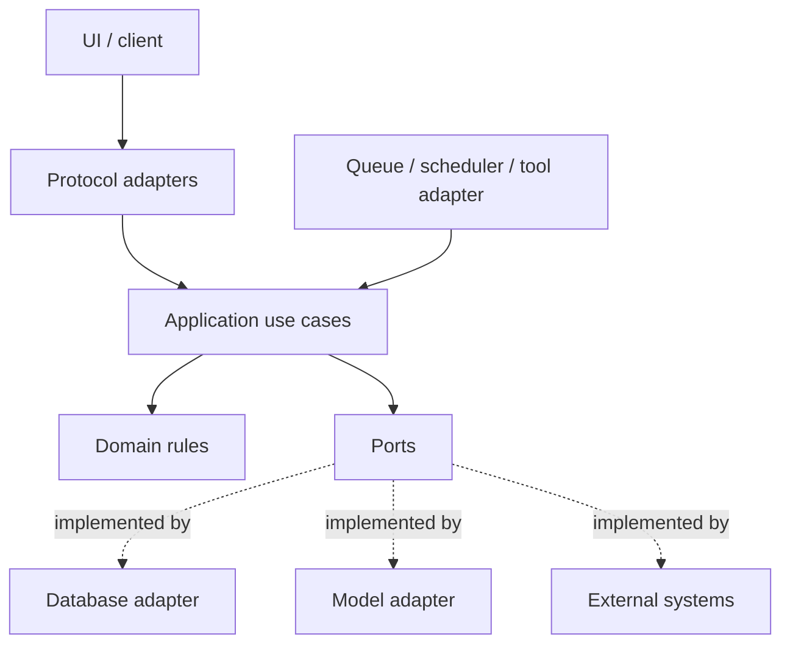
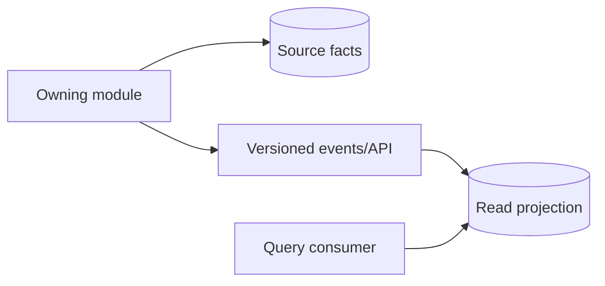

# 分层边界与依赖方向

AI 平台、知识系统、浏览器工具、后台服务和组件资产表面不同，结构退化却很相似：页面直接改存储，Controller 复制业务规则，Worker 绕过权限，适配器把第三方数据模型泄漏全局，发布脚本开始理解业务表。分层的目标不是统一目录，而是限制知识与变化的传播范围。

## 边界从变化原因和所有权产生

HTTP、领域状态、数据库、模型厂商和 UI 变化原因不同。把它们放在同一函数中，每次变化都要重新验证全部。一个常见依赖图：



内层定义需要什么，外层决定如何实现。领域不导入 Web 框架、ORM、模型 SDK；应用服务可被 HTTP、队列和工具入口复用；协议适配只转换请求、身份和错误。

| 边界 | 主要变化 | 稳定输出 |
| --- | --- | --- |
| 协议 | HTTP/gRPC/MCP/UI | 有类型命令和结果 |
| 应用 | 用例顺序、权限、事务 | 业务结果/事件 |
| 领域 | 状态和不变量 | 实体、值对象、错误 |
| Port | 外部能力需求 | 最小接口 |
| Adapter | 数据库/模型/第三方 | Port 实现与错误转换 |

## 目录不是依赖规则

项目有 `controllers/services/repositories` 目录，Controller 仍可导入 ORM；领域包放在 `domain/`，却引用框架装饰器。这只是分类，没有边界。真正规则可以描述和检查：

```text
domain imports: standard library + domain only
application imports: domain + declared ports
api imports: application + protocol schemas
infrastructure imports: ports + vendor SDKs
```

TypeScript 用 ESLint boundaries/dependency-cruiser，Python 用 import-linter，Go 用 internal package 与静态检查，前端用公开 barrel exports 和 package boundaries。门禁应提供可行动错误和少量明确例外；例外有 owner、原因、到期日。

## 数据所有权比服务数量重要

每类可变事实只有一个写入所有者。共享数据库不等于共享写权限。另一个模块若直接更新表，会绕过状态不变量、审计与 Outbox，使 owner 无法独立演进。



读场景可以建立跨域投影或 Query Service，优化列表、搜索和报表。投影可重建，源事实仍由 owner 管理。消费者发现投影缺字段时，通过契约扩展，不反向写 owner 数据。

所有权还包括删除和权限：谁能撤销可见性、谁负责清理派生产物、谁能解释字段语义。只画“服务调用箭头”而不画数据 owner，架构评审会漏掉最危险耦合。

## Port 围绕能力，不复制 SDK

```ts
interface EvidenceRetriever {
  search(input: {
    tenantId: string
    releaseId: string
    allowedScopeIds: readonly string[]
    query: string
    limit: number
  }): Promise<readonly EvidenceCandidate[]>
}
```

这个 Port 固定权限和版本约束。若直接暴露任意 SQL Builder、Vector Client 或厂商 `invoke(options: any)`，应用层会依赖具体实现并容易漏安全参数。

接口不应为了“未来可能替换”覆盖整个系统。出现清晰测试边界、两个真实适配器，或第三方变化需要隔离时再抽取。只有一个实现且接口与实现一一复制，可能只是无价值转发。

## 协议 DTO、领域对象和存储记录分开

三者生命周期不同：API 关心兼容和序列化，领域关心不变量，数据库关心查询和迁移。显式映射虽有代码量，却能防止内部字段意外公开、Patch mass assignment 和 ORM 懒加载泄漏。

```ts
type PublishRequestDto = { expectedVersion: number }
type PublishCommand = { documentId: string; expectedVersion: number; actor: SecurityContext }
type DocumentRow = { id: bigint; tenant_id: string; state: string; version: number }
type PublishResponseDto = { documentId: string; version: number; state: 'published' }
```

映射测试覆盖单位、时区、枚举未知值和可空语义。不要以“字段名字相同”假设语义永远一致。

## 同步还是异步由一致性与失败语义决定

同步适合调用方必须立即获得结果、延迟可控、失败需要直接返回。异步适合耗时不确定、资源隔离、削峰和可延后副作用。异步不是免费解耦，它引入任务状态、重复投递、幂等、顺序、事件 Schema、取消和监控。

决策表：

| 问题 | 同步倾向 | 异步倾向 |
| --- | --- | --- |
| 用户必须立刻知道结果？ | 是 | 否/只需已接受 |
| 工作能在请求 deadline 内稳定完成？ | 是 | 否 |
| 下游失败是否应回滚当前用例？ | 是 | 可最终一致/补偿 |
| 是否需要资源隔离和批量？ | 少 | 强 |
| 重复和乱序语义已设计？ | 不适用 | 必须 |

仅为“解耦”把函数调用换成消息，若仍要求即时强一致并无法补偿，只增加复杂度。

## 模块、单体与微服务

先建立模块化单体通常比过早微服务更稳：进程内调用、同库事务和本地调试简单，同时仍遵守模块 API 与数据 owner。拆服务的证据包括独立伸缩、故障隔离、合规边界、不同发布节奏或团队所有权，而不是“微服务更高级”。

服务拆分会引入网络分区、版本共存、可观测、部署和最终一致性。CAP 不是“随便选两个”：在发生网络分区时，系统要在一致响应与持续响应之间做具体业务选择；没有分区时仍有延迟、故障与一致性层级。架构讨论必须落到某个操作和不变量。

## 事务与副作用边界

单数据库事务覆盖一个业务不变量的本地写入；外部模型、对象存储、消息和邮件不在同一原子域。使用 Outbox 保存发布意图、幂等消费者处理重复、Saga/补偿管理跨系统状态。

事务不能由每个 Repository 自行提交；应用用例决定。外部网络调用不持有长事务。补偿不是简单反函数：邮件无法收回，泄露数据删除后也已产生影响，需风险与对账协议。

## 横切能力也要有边界

认证、权限、日志、Trace、配置、Feature Flag 常被放进“公共层”，最后谁都能调用。横切能力分两段：协议/基础设施中间件负责提取和传播，应用/领域负责业务决策。

例如认证中间件构造 SecurityContext；应用检查 action；Repository 下推 tenant/scope。日志中间件生成 requestId；业务服务记录状态事件。Feature Flag 由配置适配器解析，但领域收到明确策略，不直接读取全局 flag client。

## 依赖倒置不等于运行时动态

依赖注入可用构造函数/模块装配，不必处处 Service Locator 和反射。所有依赖在组合根可见，启动时校验配置和生命周期。动态插件/Tool 注册需要 Schema、权限和版本治理，不能以“可扩展”为由允许任意代码访问主进程。

前端同理：页面依赖 Feature API，Feature 依赖实体/共享 UI；共享层不能反向导入页面。浏览器扩展的 content script、background 和 UI 是不同安全/生命周期上下文，通过消息契约连接，不共享可变全局状态。

## 演进边界的方式

从最痛的路径开始：

1. 画出当前调用和数据写入，标出多个 owner；
2. 定义一个具体用例命令、结果和错误；
3. 把协议逻辑移到适配器，业务顺序收进应用服务；
4. 为数据库/第三方建立最小 Port；
5. 加单元、集成与契约测试；
6. 用静态门禁阻止旧依赖重新出现；
7. 再迁移下一个用例。

不要一次重命名全仓库、抽象所有接口并同时改行为。Strangler 方式让新旧路径短期共存，每步有可验证输出和回退。

## 架构决策记录（ADR）

重要边界记录 Context、Decision、Alternatives、Consequences、Status 和触发复审条件。ADR 不是宣传最终方案，必须写出代价：例如选择单库模块化单体，接受共享数据库故障域，但强制表 owner 与依赖门禁；当独立伸缩/合规条件出现再拆分。

关联到具体测试和指标。条件变化时 supersede 旧 ADR，不悄悄修改历史。公开博客只呈现通用决策模型，不记录内部项目、拓扑、真实规模和指标。

## 验证：边界能否被破坏

| 门禁 | 故意变异 | 预期 |
| --- | --- | --- |
| import rules | API 直接导入 ORM | CI 失败 |
| data owner | 非 owner 更新表 | 权限/审计测试失败 |
| tenant scope | 删除查询范围 | 隔离测试失败 |
| Outbox | 消息脱离事务 | 故障测试发现丢/裂状态 |
| DTO mapping | 新内部字段 | 不进入公共响应 |
| consumer contract | 新事件字段/版本 | old/new 组合有明确结果 |
| independent adapter | 换测试适配器 | 应用用例无需改动 |

```ts
it('application package has no infrastructure dependency', async () => {
  const violations = await dependencyGraph.violations({
    from: 'src/**/application/**',
    forbidden: ['src/**/infrastructure/**', '@vendor/**']
  })
  expect(violations).toEqual([])
})
```

静态检查只能证明 import，运行态还需证明事务、权限和消息。架构测试与行为测试互补。

## 常见误区

- 目录分层被当作依赖分层。
- 多个模块直接写同一表，没有数据 owner。
- Port 完整复制 SDK，安全/版本约束仍由调用者记忆。
- 每个类一个接口，只有转发没有变化隔离。
- 为了“解耦”全部消息化，却没有幂等和终态。
- 把 CAP 简化为任何时候任选两个，忽略具体分区决策。
- 微服务数量作为成熟度，忽略部署和一致性成本。
- 横切 Common 包无限增长，反向依赖所有模块。
- 一次性大重构，没有逐用例验证和依赖门禁。

## 参考资料

- [Hexagonal Architecture](https://alistair.cockburn.us/hexagonal-architecture/)：应用核心、Port 与 Adapter 的原始说明。
- [Martin Fowler: Data Mapper](https://martinfowler.com/eaaCatalog/dataMapper.html)：领域对象与持久化记录隔离。
- [Martin Fowler: CQRS](https://martinfowler.com/bliki/CQRS.html)：命令与查询模型分离的适用条件和成本。
- [Transactional Outbox](https://microservices.io/patterns/data/transactional-outbox.html)：事务边界跨到消息系统时的可靠投递。
- [Architecture Decision Records](https://adr.github.io/)：记录上下文、选择和后果的公开实践。
