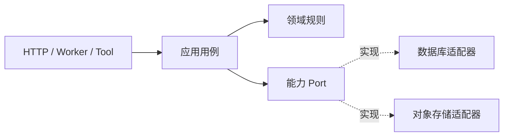

# 分层边界与依赖方向

一个 `publishDocument()` 函数同时读取 HTTP 参数、查数据库、上传文件、修改状态和发消息。正常路径只有几十行，看起来很省事；一旦对象存储失败、数据库需要回滚，或者同一用例要从队列调用，所有变化都会撞在这个函数上。

本篇不从架构名词开始。我们先观察这个简单实现在哪里失效，再依次抽出协议、应用、领域和基础设施边界。每抽一层，都要说明它隔离了哪一种变化。

## 边界来自变化原因

HTTP 状态码、业务状态、数据库 Schema 和第三方 SDK 的变化周期不同。分层让内层描述业务需要什么，外层决定怎样接入具体技术。

目录名称本身不会形成边界。若 `domain/` 仍导入 Web 框架，Controller 仍直接调用 ORM，代码只是被分类，没有形成依赖规则。

## 步骤一：先把协议留在入口

HTTP Adapter 读取路径、请求体和认证上下文，转换成有类型命令；完成后把应用结果映射为响应。它不决定事务，也不调用第三方 SDK。队列或 MCP Adapter 可以构造同一个命令，复用同一个应用用例。

请求 DTO、领域对象和数据库 Row 生命周期不同，需要显式映射。DTO 关心兼容与序列化，领域对象维护不变量，Row 关心查询和迁移。字段名字相同不代表语义永远相同。

## 步骤二：应用层拥有完整用例

应用服务决定顺序：检查权限、读取可见对象、执行领域行为、保存结果与事件。事务由完整用例控制，Repository 不各自提交。对象存储、模型和邮件不属于数据库原子域，通常在短事务外调用，并通过 Outbox、幂等或补偿管理失败。

领域层只表达状态和规则，例如“已归档对象不能发布”“预期版本要匹配”。它不认识 HTTP、ORM 和厂商错误。

## 步骤三：Port 描述所需能力

Port 是应用需要的最小接口，不是对厂商 SDK 的完整复制。例如检索 Port 把租户、Release 和可见范围设成必填，适配器再决定使用 PostgreSQL 还是搜索引擎。若接口仍暴露任意 SQL 或 `options: any`，调用者还是会依赖实现细节并漏掉安全条件。

只有当接口隔离了真实变化、形成测试边界或存在两个适配器时才抽取。每个类都配一个一模一样的接口，只会增加转发。

## 步骤四：确定数据所有者

每类可变事实只有一个写入所有者。共享数据库不代表所有模块都能直接更新同一张表。其他模块通过公开用例、事件或可重建读投影取得数据。

所有权还回答删除与权限：谁能撤销可见性，谁负责清理派生产物，谁解释字段语义。只画服务调用箭头而不标数据 owner，会遗漏最危险的耦合。

同步与异步也由语义决定。用户需要立即结果且工作在 Deadline 内完成时使用同步；耗时不确定、需要削峰和资源隔离时使用异步。异步额外引入任务状态、重复投递、顺序、取消与监控，不会自动“解耦”。

## 简单实现在哪些测试中失败

| 故意破坏 | 边界完整时的结果 |
| --- | --- |
| API 直接导入 ORM | 依赖门禁失败 |
| 非所有者模块更新数据 | 权限或架构测试失败 |
| 删除 Repository 的租户范围 | 隔离测试失败 |
| Outbox 脱离事务 | 故障测试发现状态与消息分裂 |
| ORM 新增内部字段 | 不进入公共响应 |
| 更换存储适配器 | 应用用例无需改动 |

TypeScript 可用 dependency-cruiser 或 ESLint boundaries，Python 可用 import-linter，Go 可用 `internal` 包与静态检查。静态门禁只能证明导入方向，事务、权限和消息行为仍需集成测试。

## 什么时候考虑微服务

模块化单体通常先提供清晰边界，同时保留进程内调用和本地事务。独立伸缩、故障隔离、合规要求、不同发布节奏或团队所有权成为可测量压力时，再拆服务。微服务数量不是成熟度；网络分区、版本共存和最终一致性都是新增成本。

下一篇会选择最常跨越进程的边界：异步任务。我们将从 Task、Attempt、Lease 和 Event 四个对象建立可恢复生命周期。

## 参考资料

- [Hexagonal Architecture](https://alistair.cockburn.us/hexagonal-architecture/)
- [Martin Fowler: Data Mapper](https://martinfowler.com/eaaCatalog/dataMapper.html)
- [Transactional Outbox](https://microservices.io/patterns/data/transactional-outbox.html)
- [Architecture Decision Records](https://adr.github.io/)
